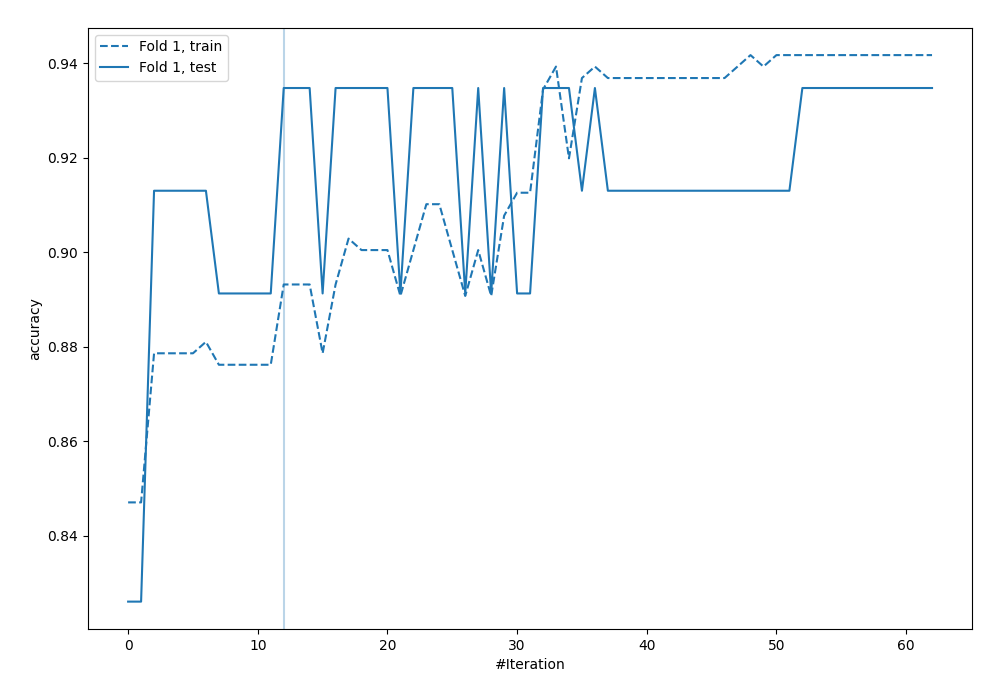
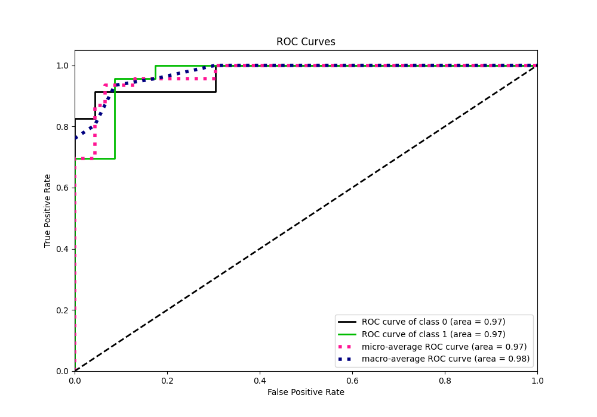
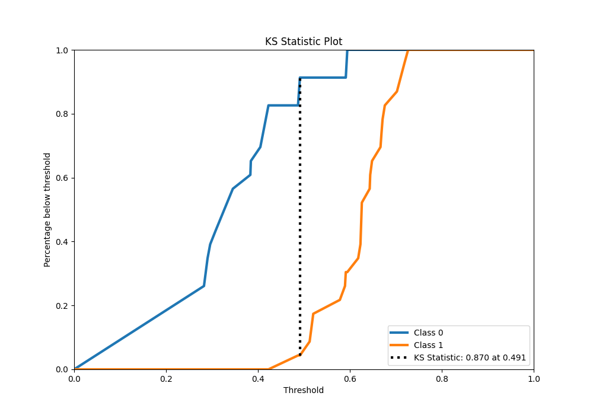
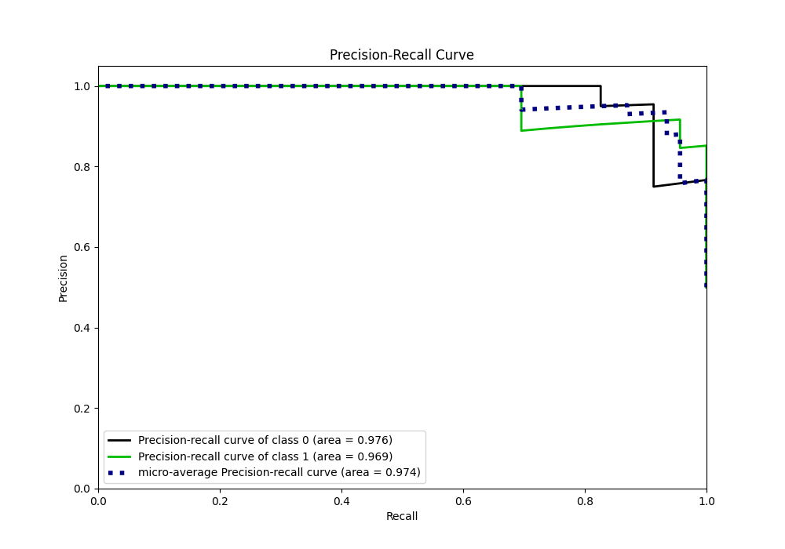
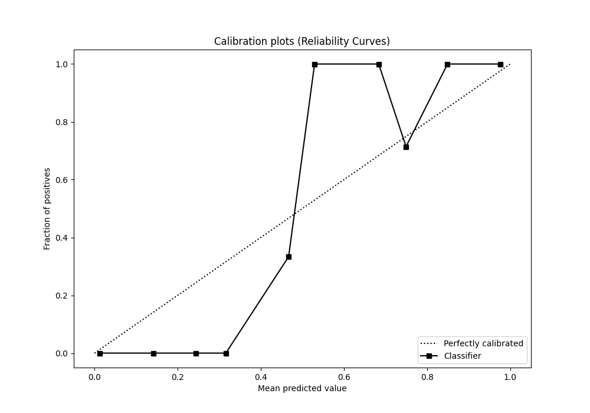
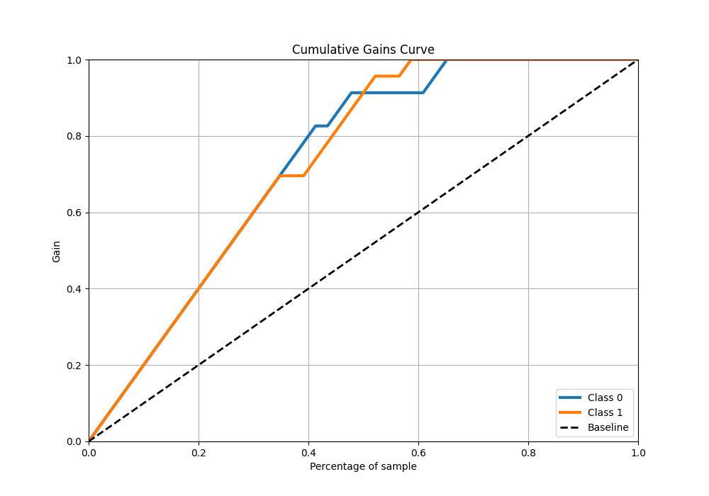
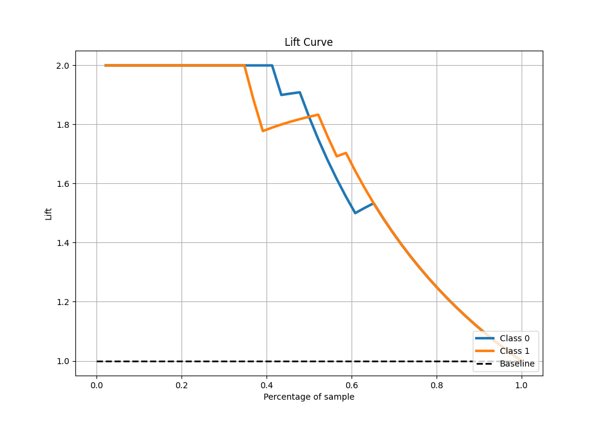

# Summary of 18_Xgboost

[<< Go back](../README.md)

## Extreme Gradient Boosting (Xgboost)
- **n_jobs**: -1
- **objective**: binary:logistic
- **eta**: 0.05
- **max_depth**: 8
- **min_child_weight**: 5
- **subsample**: 0.5
- **colsample_bytree**: 0.8
- **eval_metric**: accuracy
- **explain_level**: 0

## Validation
 - **validation_type**: split
 - **train_ratio**: 0.9
 - **shuffle**: True
 - **stratify**: True

## Optimized metric
accuracy

## Training time

4.3 seconds

## Metric details
|           |    score |   threshold |
|:----------|---------:|------------:|
| logloss   | 0.475329 |  nan        |
| auc       | 0.969754 |  nan        |
| f1        | 0.93617  |    0.491329 |
| accuracy  | 0.934783 |    0.491329 |
| precision | 1        |    0.594442 |
| recall    | 1        |    0.254297 |
| mcc       | 0.870388 |    0.491329 |

## Metric details with threshold from accuracy metric
|           |    score |   threshold |
|:----------|---------:|------------:|
| logloss   | 0.475329 |  nan        |
| auc       | 0.969754 |  nan        |
| f1        | 0.93617  |    0.491329 |
| accuracy  | 0.934783 |    0.491329 |
| precision | 0.916667 |    0.491329 |
| recall    | 0.956522 |    0.491329 |
| mcc       | 0.870388 |    0.491329 |

## Confusion matrix (at threshold=0.491329)
|              |   Predicted as 0 |   Predicted as 1 |
|:-------------|-----------------:|-----------------:|
| Labeled as 0 |               21 |                2 |
| Labeled as 1 |                1 |               22 |

## Learning curves

## Confusion Matrix

## Normalized Confusion Matrix

## ROC Curve

## Kolmogorov-Smirnov Statistic

## Precision-Recall Curve

## Calibration Curve

## Cumulative Gains Curve

## Lift Curve

[<< Go back](../README.md)
