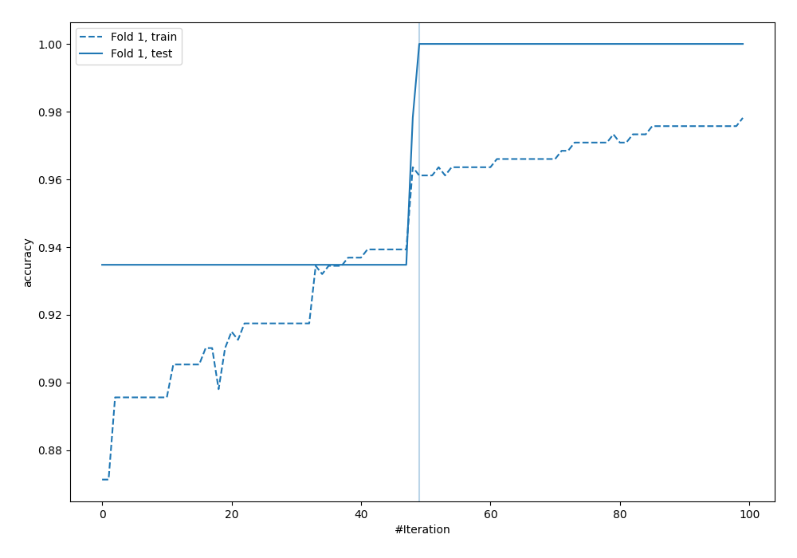
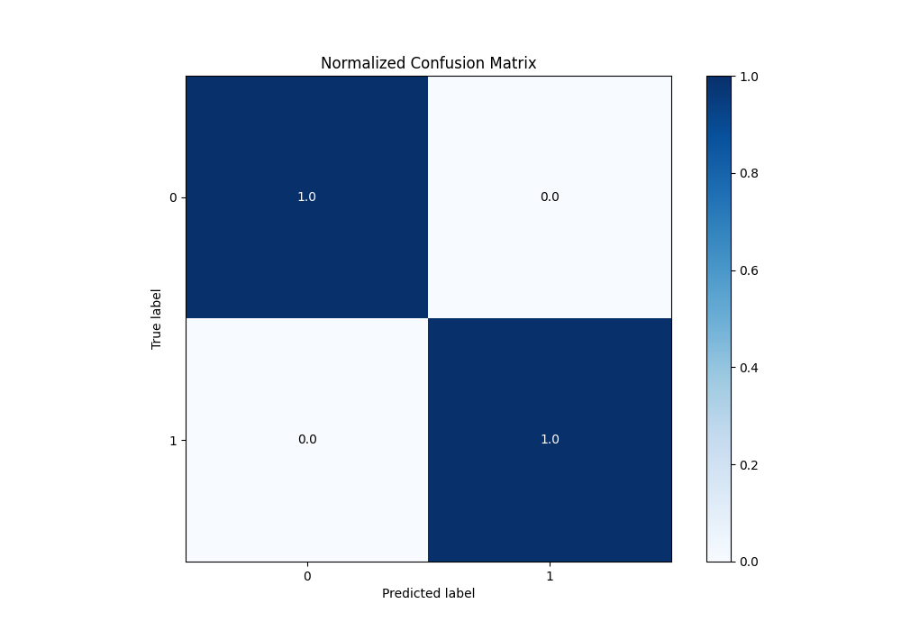
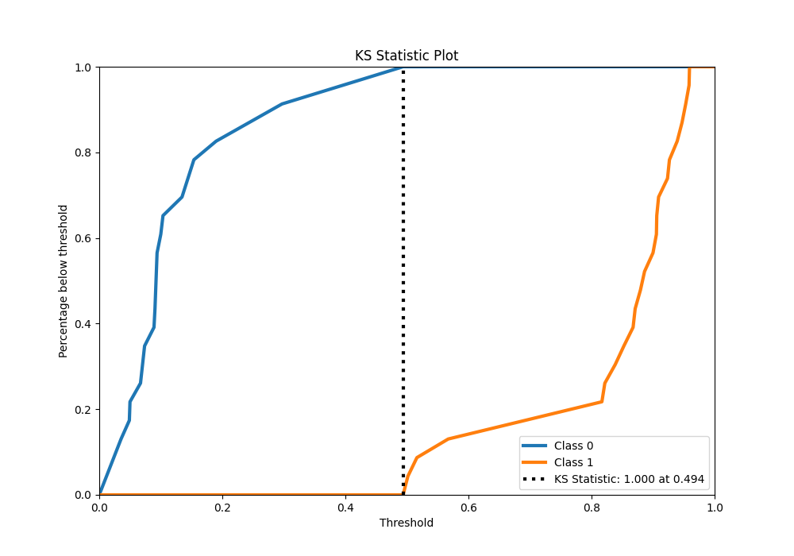
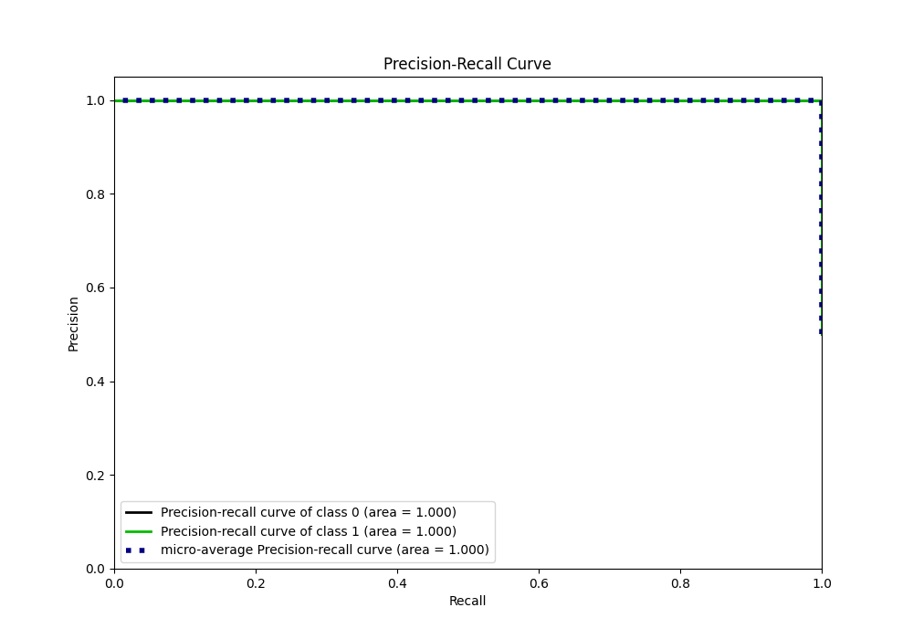
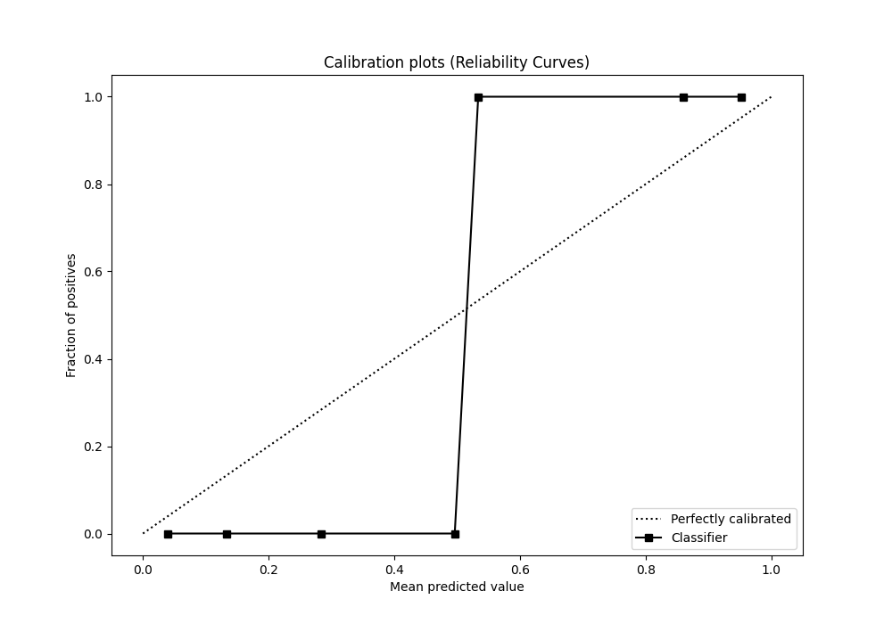

# Summary of 29_LightGBM

[<< Go back](../README.md)

## LightGBM
- **n_jobs**: -1
- **objective**: binary
- **num_leaves**: 15
- **learning_rate**: 0.05
- **feature_fraction**: 1.0
- **bagging_fraction**: 0.5
- **min_data_in_leaf**: 30
- **metric**: custom
- **custom_eval_metric_name**: accuracy
- **explain_level**: 0

## Validation
 - **validation_type**: split
 - **train_ratio**: 0.9
 - **shuffle**: True
 - **stratify**: True

## Optimized metric
accuracy

## Training time

4.7 seconds

## Metric details
|           |    score |   threshold |
|:----------|---------:|------------:|
| logloss   | 0.175546 | nan         |
| auc       | 1        | nan         |
| f1        | 1        |   0.493798  |
| accuracy  | 1        |   0.493798  |
| precision | 1        |   0.493798  |
| recall    | 1        |   0.0318774 |
| mcc       | 1        |   0.493798  |

## Metric details with threshold from accuracy metric
|           |    score |   threshold |
|:----------|---------:|------------:|
| logloss   | 0.175546 |  nan        |
| auc       | 1        |  nan        |
| f1        | 1        |    0.493798 |
| accuracy  | 1        |    0.493798 |
| precision | 1        |    0.493798 |
| recall    | 1        |    0.493798 |
| mcc       | 1        |    0.493798 |

## Confusion matrix (at threshold=0.493798)
|              |   Predicted as 0 |   Predicted as 1 |
|:-------------|-----------------:|-----------------:|
| Labeled as 0 |               23 |                0 |
| Labeled as 1 |                0 |               23 |

## Learning curves

## Confusion Matrix

## Normalized Confusion Matrix

## ROC Curve

## Kolmogorov-Smirnov Statistic

## Precision-Recall Curve

## Calibration Curve

## Cumulative Gains Curve

## Lift Curve

[<< Go back](../README.md)
