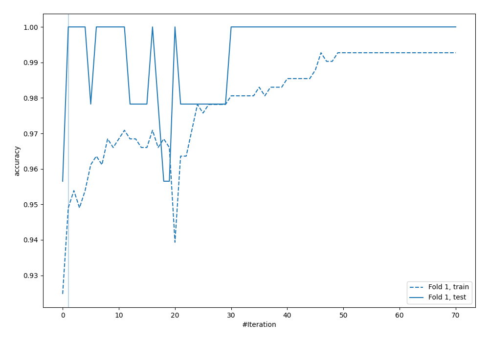
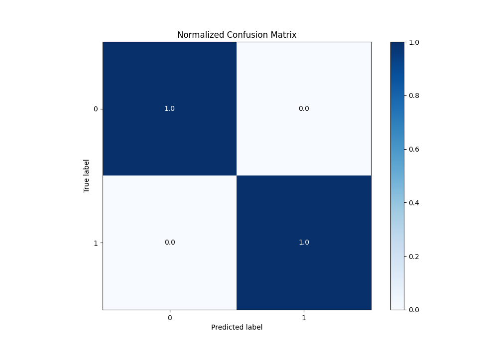
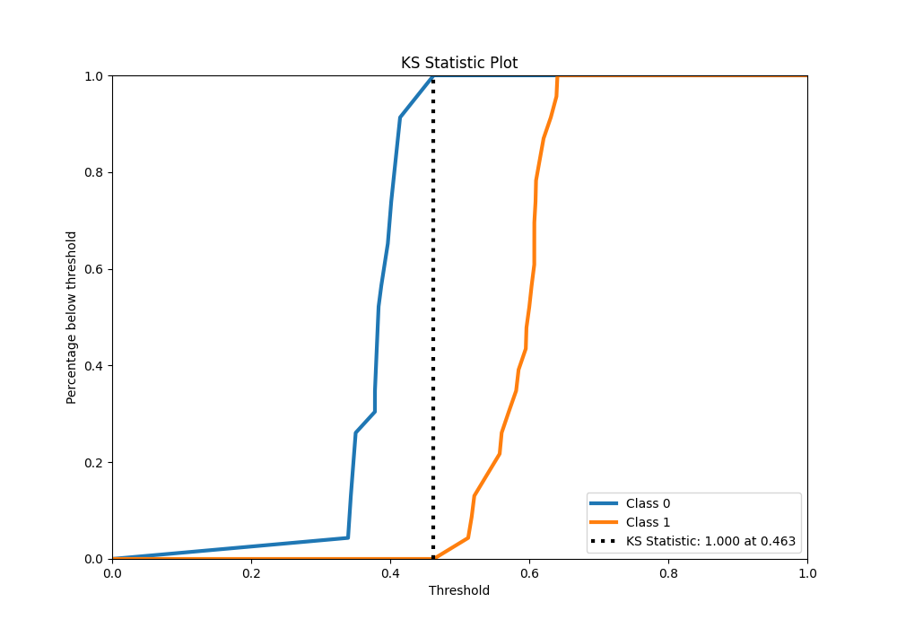
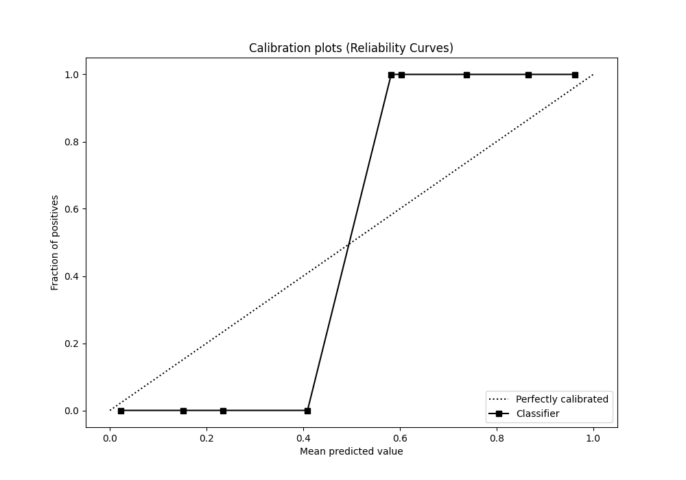
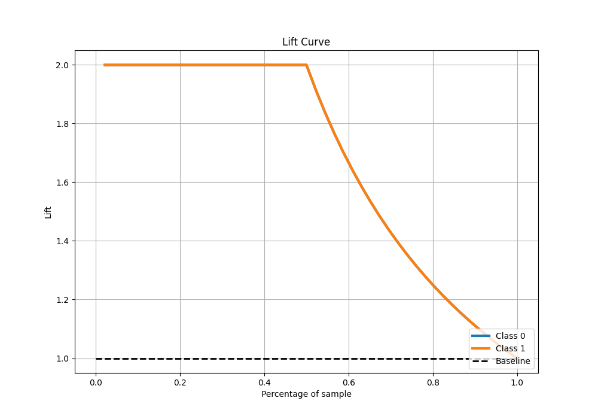

# Summary of 31_CatBoost_SelectedFeatures

[<< Go back](../README.md)

## CatBoost
- **n_jobs**: -1
- **learning_rate**: 0.1
- **depth**: 8
- **rsm**: 1.0
- **loss_function**: Logloss
- **eval_metric**: Accuracy
- **explain_level**: 0

## Validation
 - **validation_type**: split
 - **train_ratio**: 0.9
 - **shuffle**: True
 - **stratify**: True

## Optimized metric
accuracy

## Training time

3.9 seconds

## Metric details
|           |    score |   threshold |
|:----------|---------:|------------:|
| logloss   | 0.512144 |  nan        |
| auc       | 1        |  nan        |
| f1        | 1        |    0.462529 |
| accuracy  | 1        |    0.462529 |
| precision | 1        |    0.462529 |
| recall    | 1        |    0.305458 |
| mcc       | 1        |    0.462529 |

## Metric details with threshold from accuracy metric
|           |    score |   threshold |
|:----------|---------:|------------:|
| logloss   | 0.512144 |  nan        |
| auc       | 1        |  nan        |
| f1        | 1        |    0.462529 |
| accuracy  | 1        |    0.462529 |
| precision | 1        |    0.462529 |
| recall    | 1        |    0.462529 |
| mcc       | 1        |    0.462529 |

## Confusion matrix (at threshold=0.462529)
|              |   Predicted as 0 |   Predicted as 1 |
|:-------------|-----------------:|-----------------:|
| Labeled as 0 |               23 |                0 |
| Labeled as 1 |                0 |               23 |

## Learning curves

## Confusion Matrix

## Normalized Confusion Matrix

## ROC Curve

## Kolmogorov-Smirnov Statistic

## Precision-Recall Curve

## Calibration Curve

## Cumulative Gains Curve

## Lift Curve

[<< Go back](../README.md)
