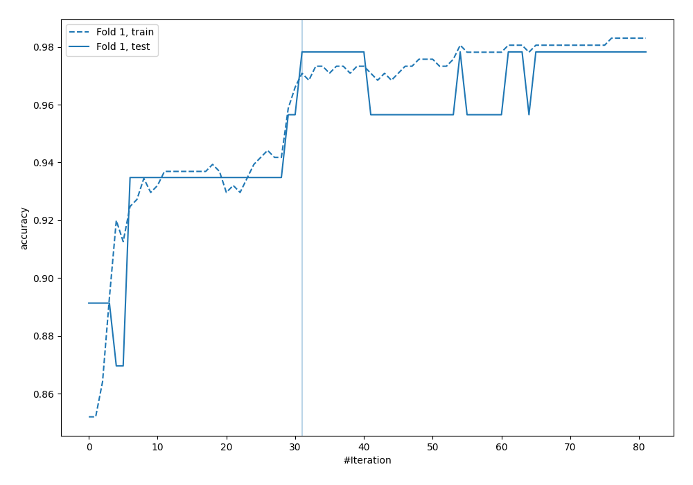
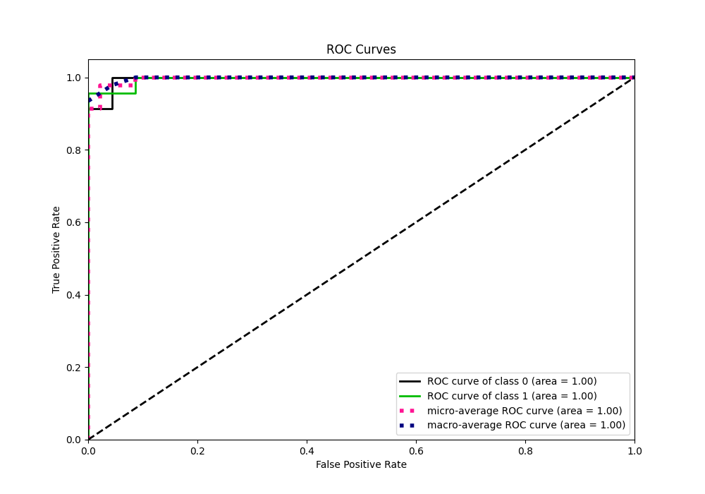
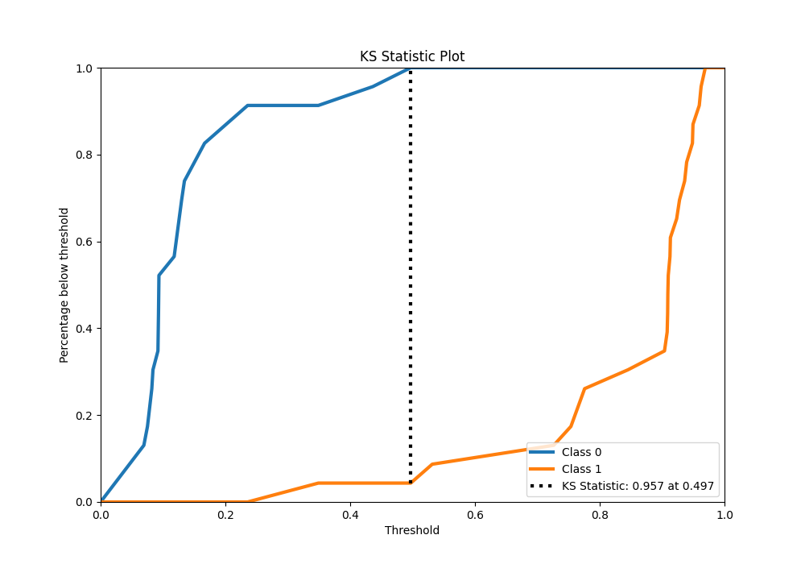
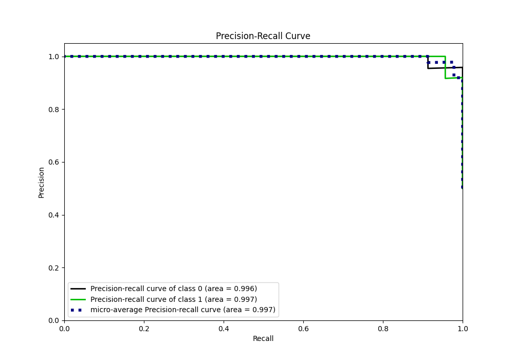
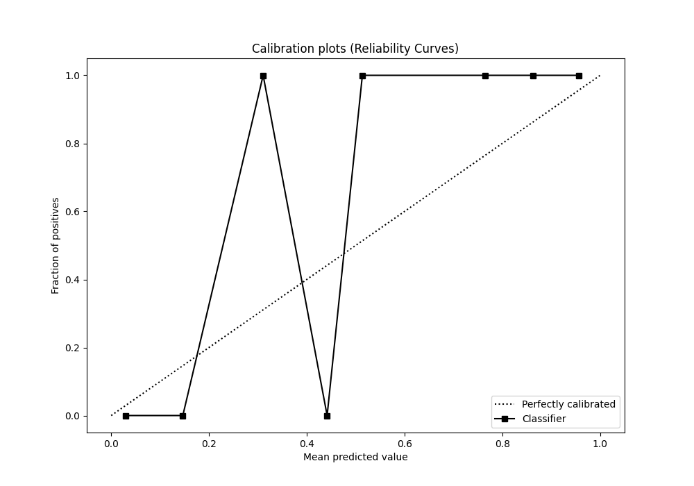
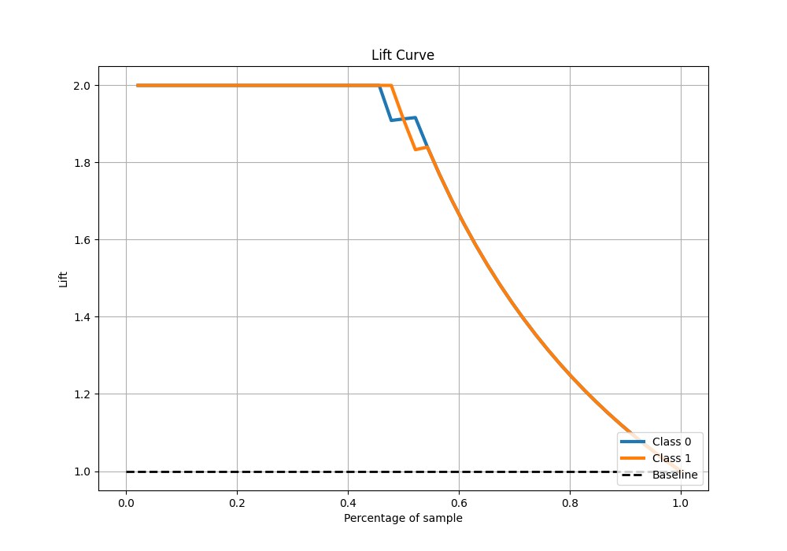

# Summary of 35_CatBoost

[<< Go back](../README.md)

## CatBoost
- **n_jobs**: -1
- **learning_rate**: 0.1
- **depth**: 4
- **rsm**: 0.7
- **loss_function**: Logloss
- **eval_metric**: Accuracy
- **explain_level**: 0

## Validation
 - **validation_type**: split
 - **train_ratio**: 0.9
 - **shuffle**: True
 - **stratify**: True

## Optimized metric
accuracy

## Training time

5.1 seconds

## Metric details
|           |    score |   threshold |
|:----------|---------:|------------:|
| logloss   | 0.174256 | nan         |
| auc       | 0.996219 | nan         |
| f1        | 0.977778 |   0.514328  |
| accuracy  | 0.978261 |   0.514328  |
| precision | 1        |   0.514328  |
| recall    | 1        |   0.0623717 |
| mcc       | 0.957427 |   0.514328  |

## Metric details with threshold from accuracy metric
|           |    score |   threshold |
|:----------|---------:|------------:|
| logloss   | 0.174256 |  nan        |
| auc       | 0.996219 |  nan        |
| f1        | 0.977778 |    0.514328 |
| accuracy  | 0.978261 |    0.514328 |
| precision | 1        |    0.514328 |
| recall    | 0.956522 |    0.514328 |
| mcc       | 0.957427 |    0.514328 |

## Confusion matrix (at threshold=0.514328)
|              |   Predicted as 0 |   Predicted as 1 |
|:-------------|-----------------:|-----------------:|
| Labeled as 0 |               23 |                0 |
| Labeled as 1 |                1 |               22 |

## Learning curves

## Confusion Matrix

## Normalized Confusion Matrix

## ROC Curve

## Kolmogorov-Smirnov Statistic

## Precision-Recall Curve

## Calibration Curve

## Cumulative Gains Curve

## Lift Curve

[<< Go back](../README.md)
