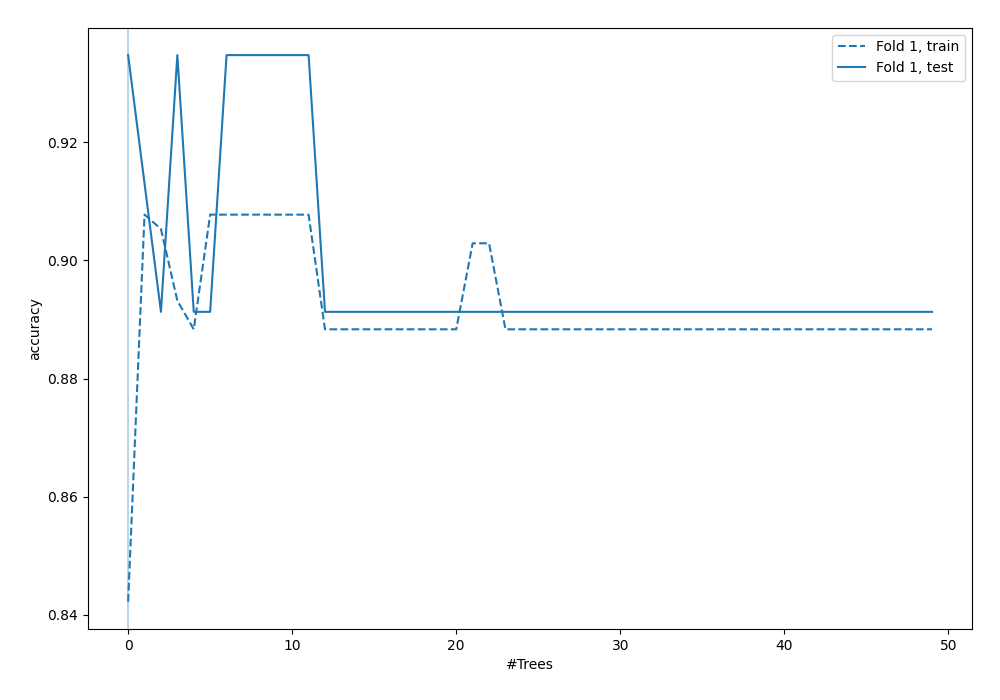
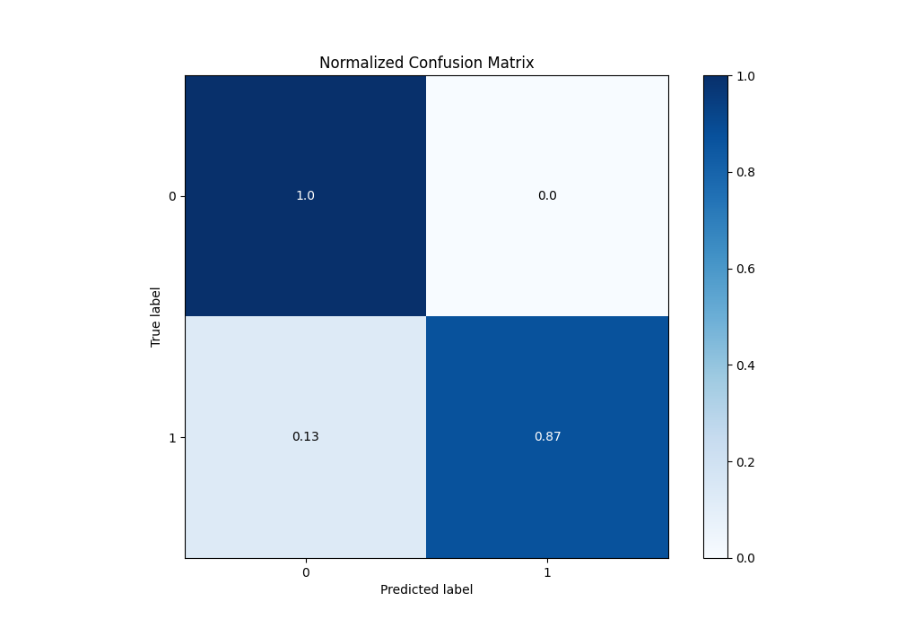
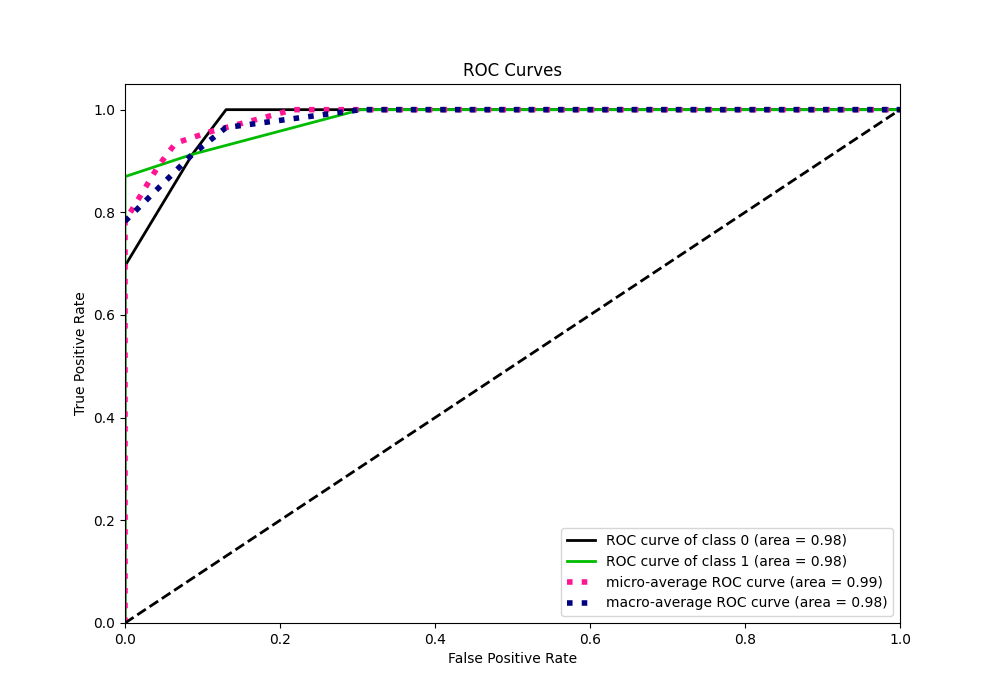
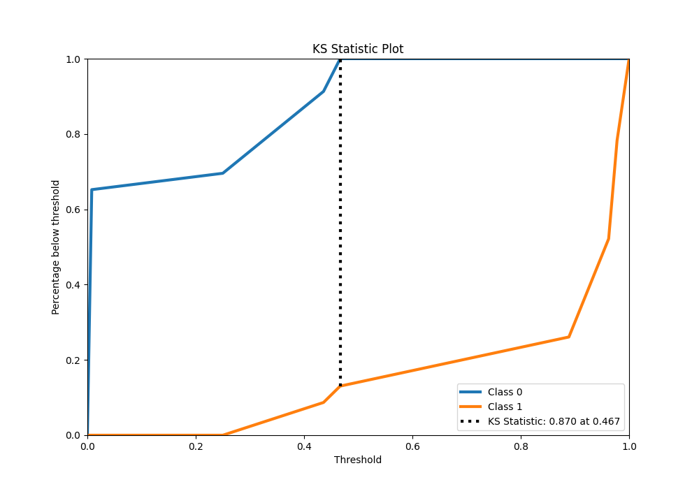
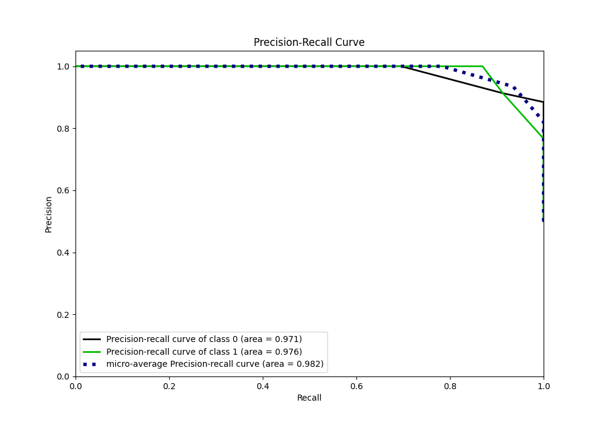
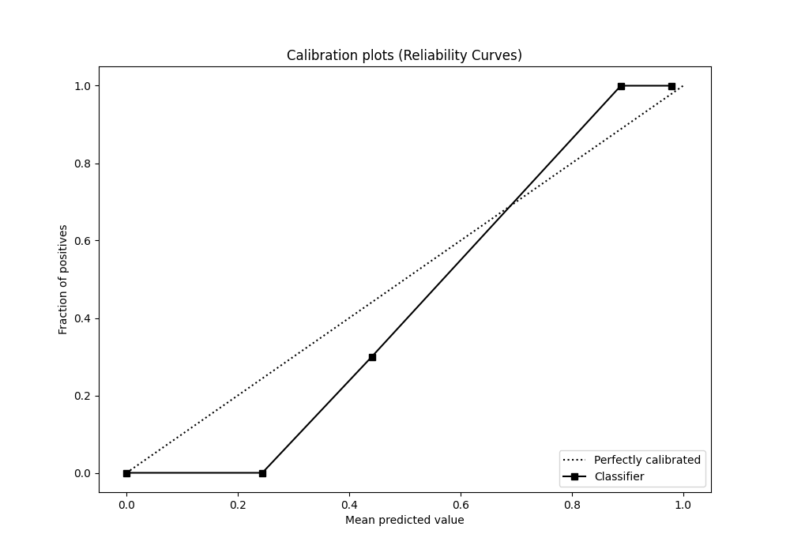
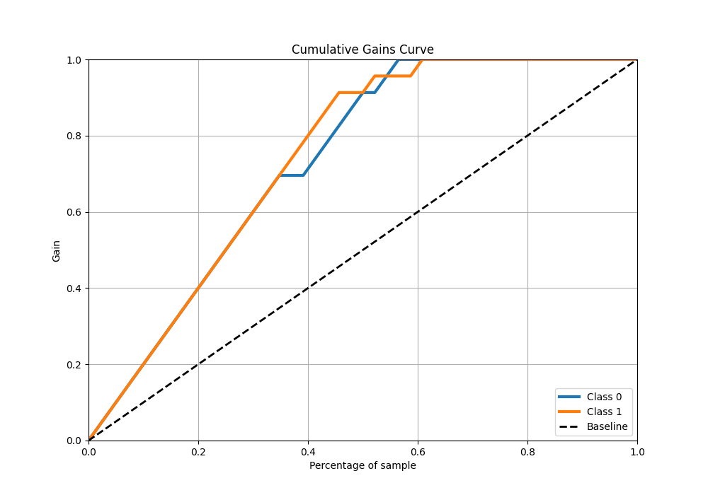
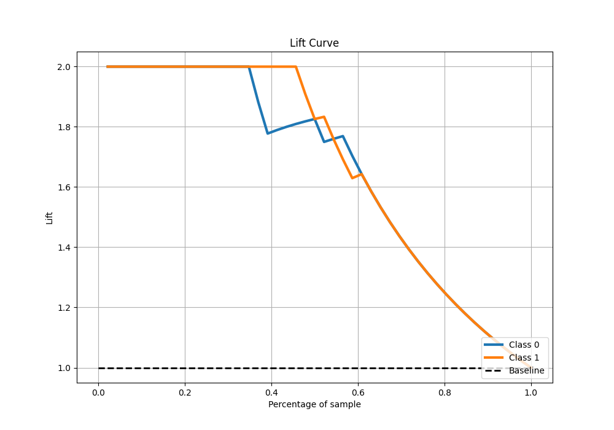

# Summary of 45_RandomForest

[<< Go back](../README.md)

## Random Forest
- **n_jobs**: -1
- **criterion**: gini
- **max_features**: 0.9
- **min_samples_split**: 40
- **max_depth**: 5
- **eval_metric_name**: accuracy
- **explain_level**: 0

## Validation
 - **validation_type**: split
 - **train_ratio**: 0.9
 - **shuffle**: True
 - **stratify**: True

## Optimized metric
accuracy

## Training time

5.1 seconds

## Metric details
|           |    score |    threshold |
|:----------|---------:|-------------:|
| logloss   | 0.166756 | nan          |
| auc       | 0.981096 | nan          |
| f1        | 0.930233 |   0.466667   |
| accuracy  | 0.934783 |   0.466667   |
| precision | 1        |   0.466667   |
| recall    | 1        |   0.00725806 |
| mcc       | 0.877058 |   0.466667   |

## Metric details with threshold from accuracy metric
|           |    score |   threshold |
|:----------|---------:|------------:|
| logloss   | 0.166756 |  nan        |
| auc       | 0.981096 |  nan        |
| f1        | 0.930233 |    0.466667 |
| accuracy  | 0.934783 |    0.466667 |
| precision | 1        |    0.466667 |
| recall    | 0.869565 |    0.466667 |
| mcc       | 0.877058 |    0.466667 |

## Confusion matrix (at threshold=0.466667)
|              |   Predicted as 0 |   Predicted as 1 |
|:-------------|-----------------:|-----------------:|
| Labeled as 0 |               23 |                0 |
| Labeled as 1 |                3 |               20 |

## Learning curves

## Confusion Matrix

## Normalized Confusion Matrix

## ROC Curve

## Kolmogorov-Smirnov Statistic

## Precision-Recall Curve

## Calibration Curve

## Cumulative Gains Curve

## Lift Curve

[<< Go back](../README.md)
