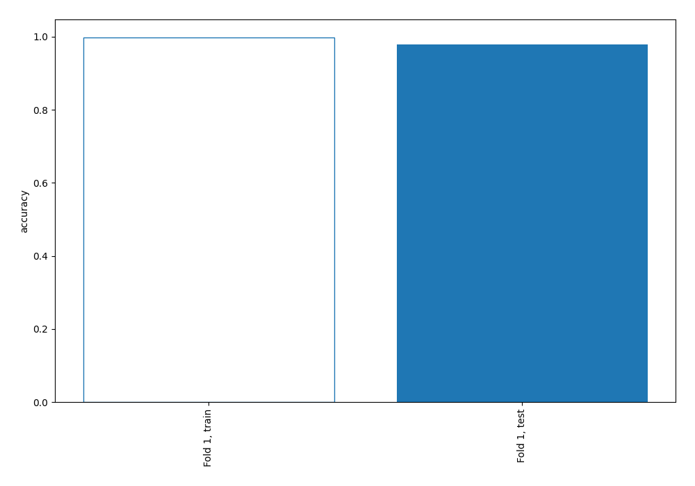
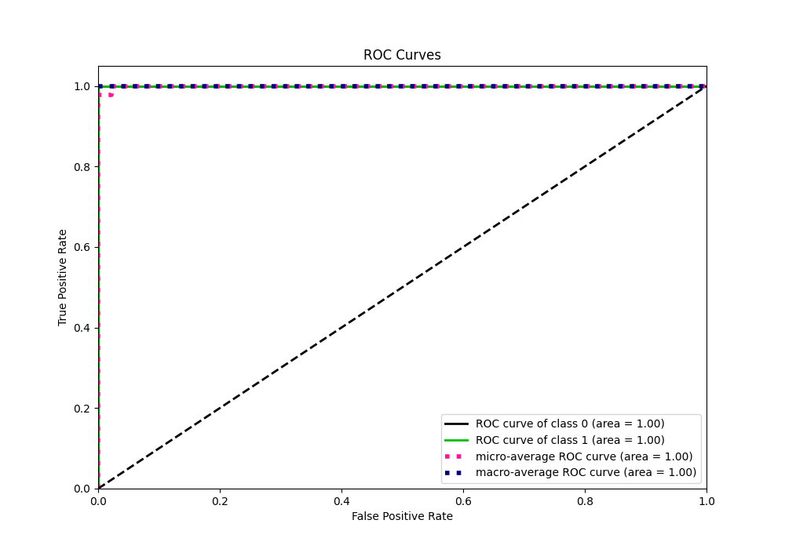
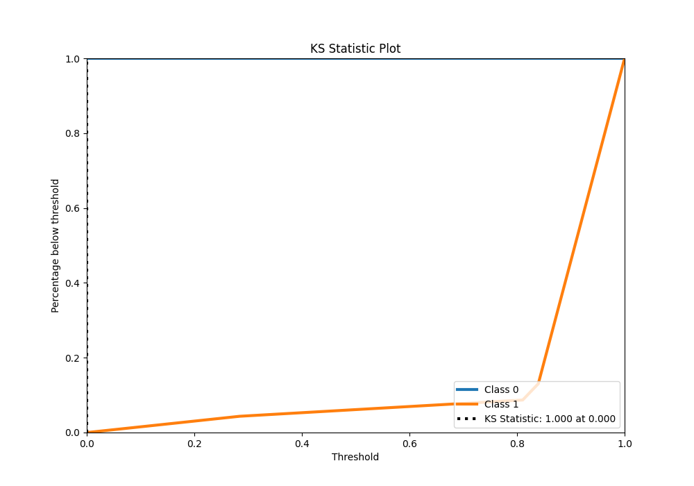
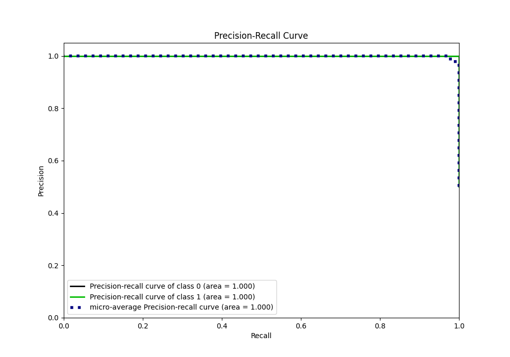
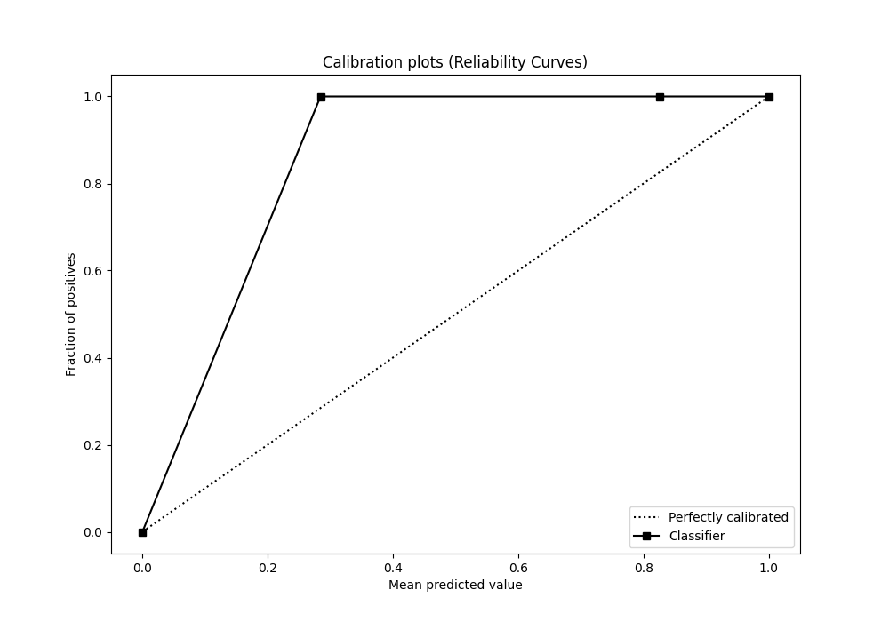
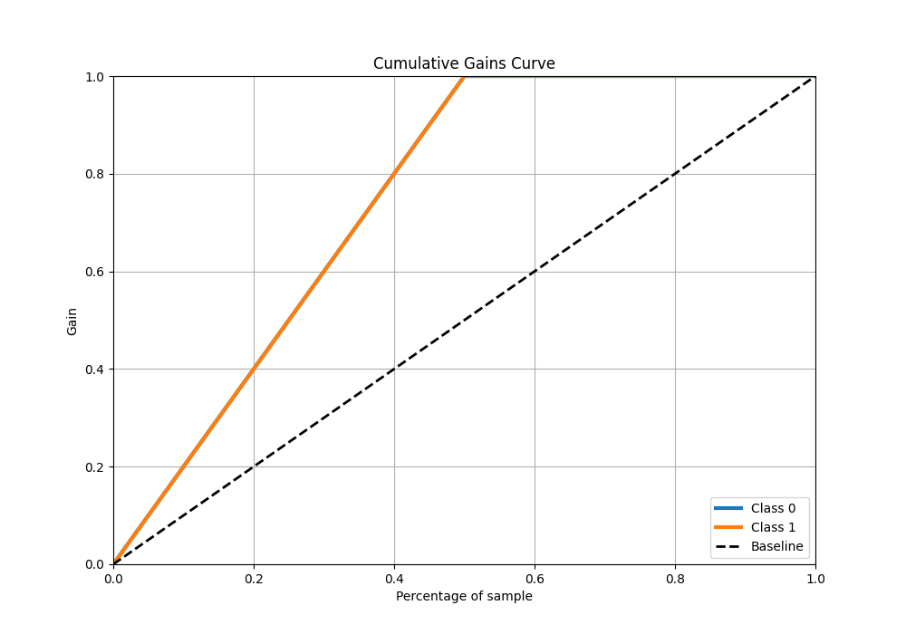

# Summary of 84_NearestNeighbors

[<< Go back](../README.md)

## k-Nearest Neighbors (Nearest Neighbors)
- **n_jobs**: -1
- **n_neighbors**: 5
- **weights**: distance
- **explain_level**: 0

## Validation
 - **validation_type**: split
 - **train_ratio**: 0.9
 - **shuffle**: True
 - **stratify**: True

## Optimized metric
accuracy

## Training time

3.3 seconds

## Metric details
|           |     score |   threshold |
|:----------|----------:|------------:|
| logloss   | 0.0357025 |         nan |
| auc       | 1         |         nan |
| f1        | 1         |           0 |
| accuracy  | 1         |           0 |
| precision | 1         |           0 |
| recall    | 1         |           0 |
| mcc       | 1         |           0 |

## Metric details with threshold from accuracy metric
|           |     score |   threshold |
|:----------|----------:|------------:|
| logloss   | 0.0357025 |         nan |
| auc       | 1         |         nan |
| f1        | 1         |           0 |
| accuracy  | 1         |           0 |
| precision | 1         |           0 |
| recall    | 1         |           0 |
| mcc       | 1         |           0 |

## Confusion matrix (at threshold=0.0)
|              |   Predicted as 0 |   Predicted as 1 |
|:-------------|-----------------:|-----------------:|
| Labeled as 0 |               23 |                0 |
| Labeled as 1 |                0 |               23 |

## Learning curves

## Confusion Matrix

## Normalized Confusion Matrix

## ROC Curve

## Kolmogorov-Smirnov Statistic

## Precision-Recall Curve

## Calibration Curve

## Cumulative Gains Curve

## Lift Curve

[<< Go back](../README.md)
