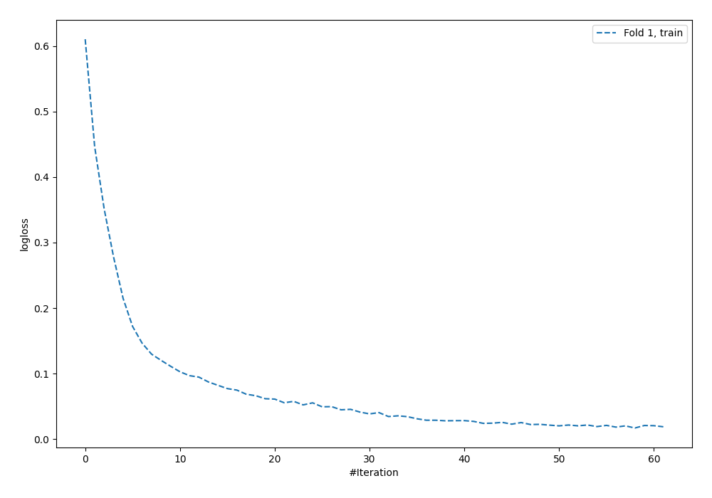
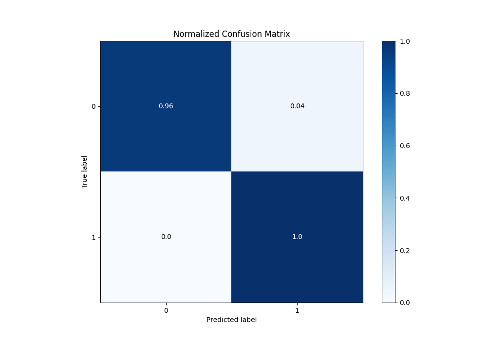
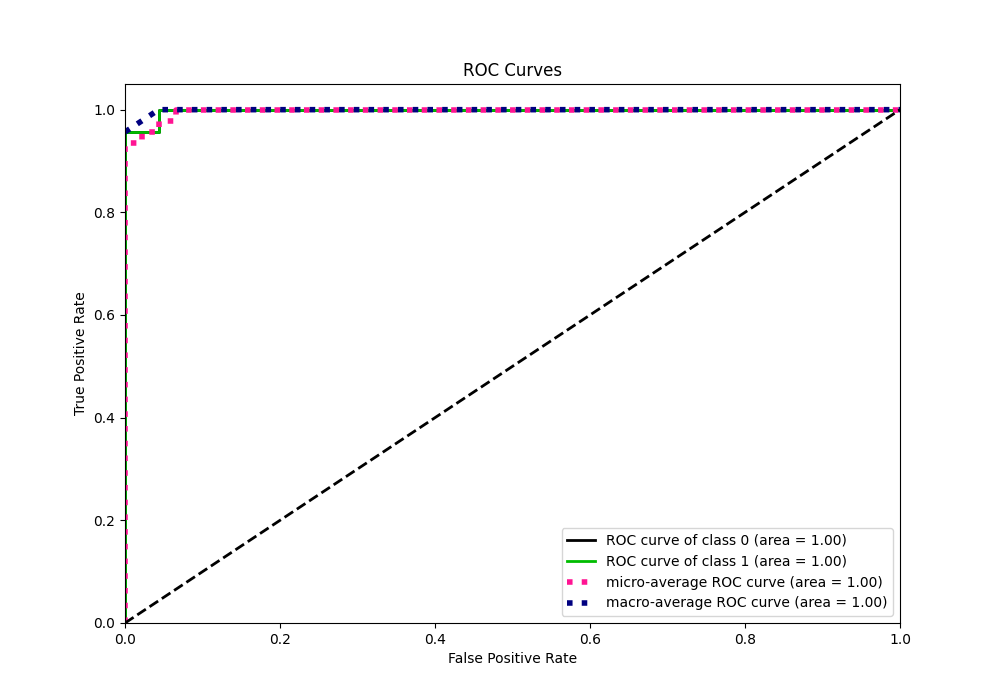
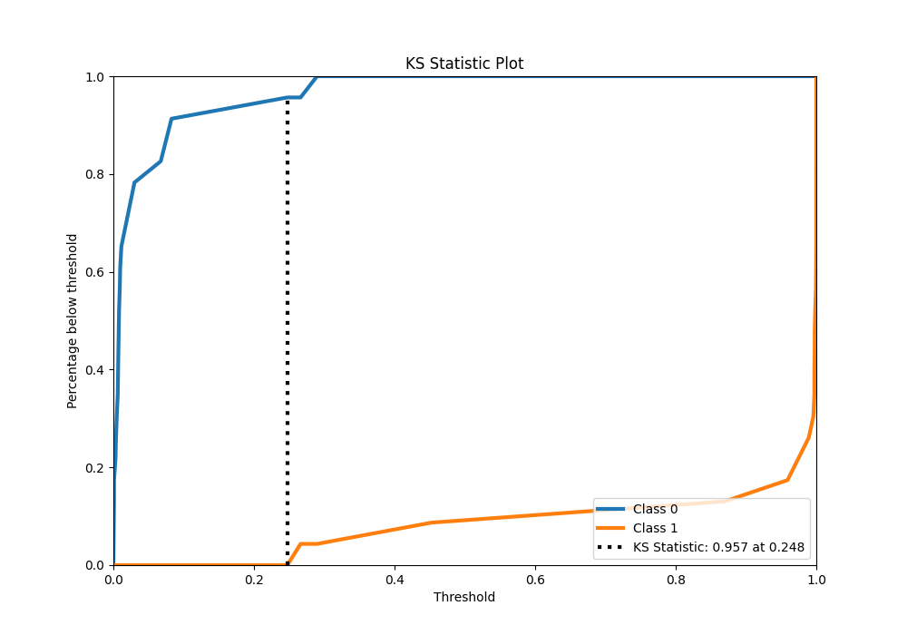
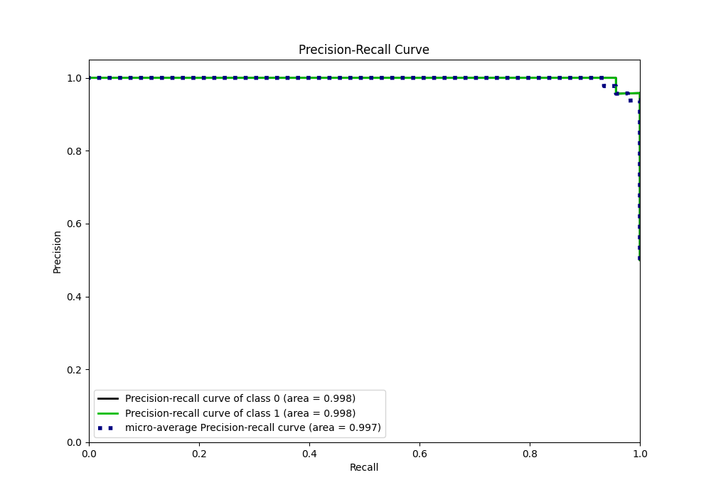
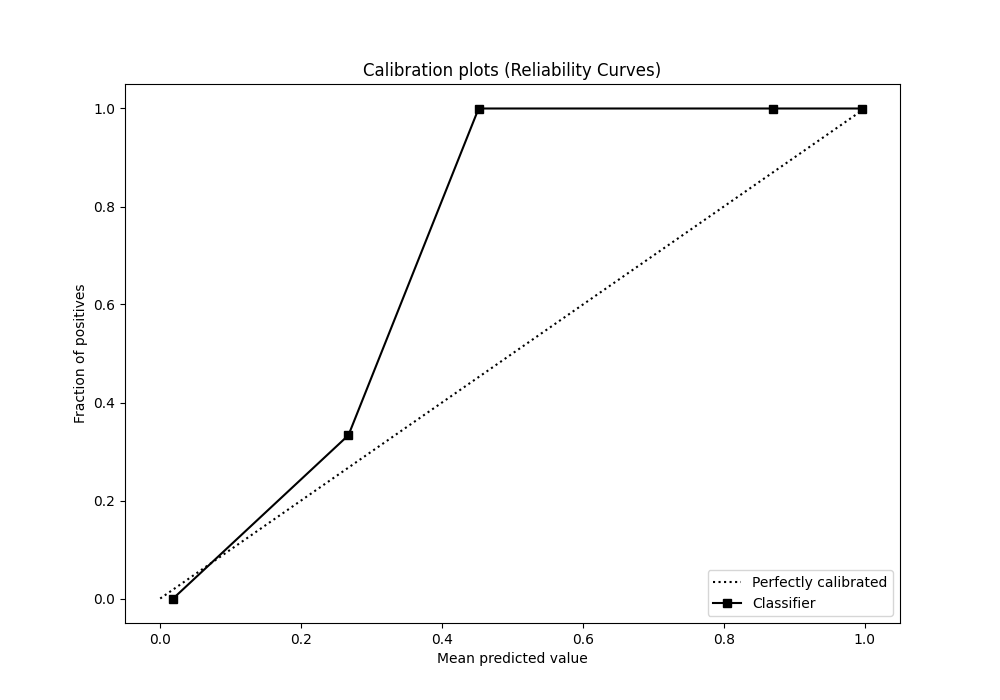
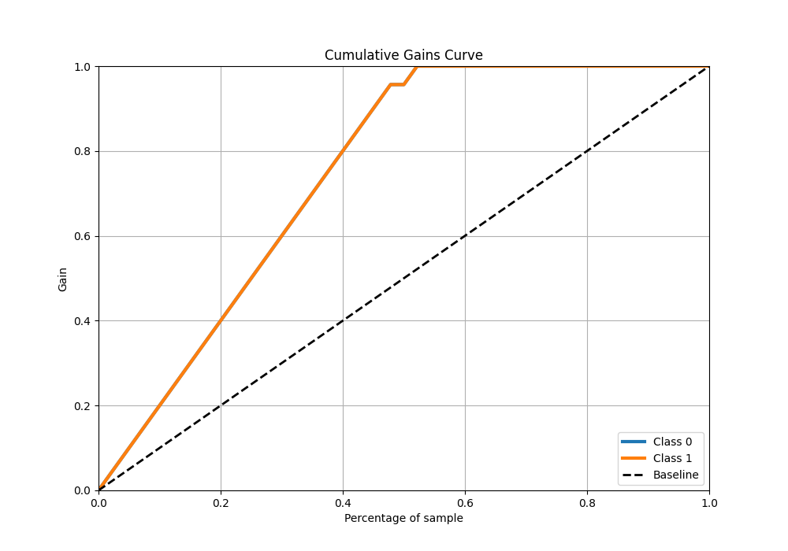
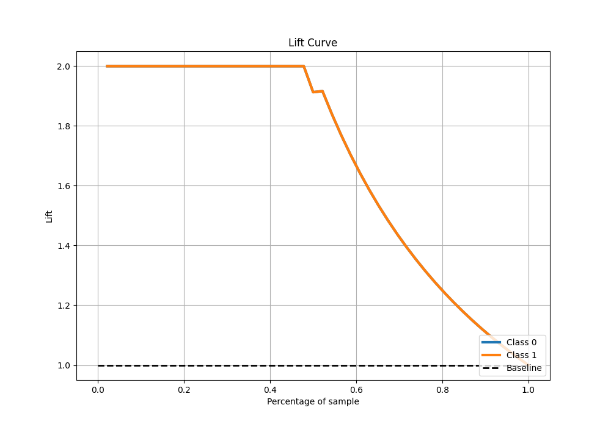

# Summary of 95_NeuralNetwork

[<< Go back](../README.md)

## Neural Network
- **n_jobs**: -1
- **dense_1_size**: 64
- **dense_2_size**: 32
- **learning_rate**: 0.01
- **explain_level**: 0

## Validation
 - **validation_type**: split
 - **train_ratio**: 0.9
 - **shuffle**: True
 - **stratify**: True

## Optimized metric
accuracy

## Training time

5.4 seconds

## Metric details
|           |     score |     threshold |
|:----------|----------:|--------------:|
| logloss   | 0.0734475 | nan           |
| auc       | 0.99811   | nan           |
| f1        | 0.978723  |   0.256912    |
| accuracy  | 0.978261  |   0.256912    |
| precision | 1         |   0.371105    |
| recall    | 1         |   0.000829147 |
| mcc       | 0.957427  |   0.256912    |

## Metric details with threshold from accuracy metric
|           |     score |   threshold |
|:----------|----------:|------------:|
| logloss   | 0.0734475 |  nan        |
| auc       | 0.99811   |  nan        |
| f1        | 0.978723  |    0.256912 |
| accuracy  | 0.978261  |    0.256912 |
| precision | 0.958333  |    0.256912 |
| recall    | 1         |    0.256912 |
| mcc       | 0.957427  |    0.256912 |

## Confusion matrix (at threshold=0.256912)
|              |   Predicted as 0 |   Predicted as 1 |
|:-------------|-----------------:|-----------------:|
| Labeled as 0 |               22 |                1 |
| Labeled as 1 |                0 |               23 |

## Learning curves

## Confusion Matrix

## Normalized Confusion Matrix

## ROC Curve

## Kolmogorov-Smirnov Statistic

## Precision-Recall Curve

## Calibration Curve

## Cumulative Gains Curve

## Lift Curve

[<< Go back](../README.md)
