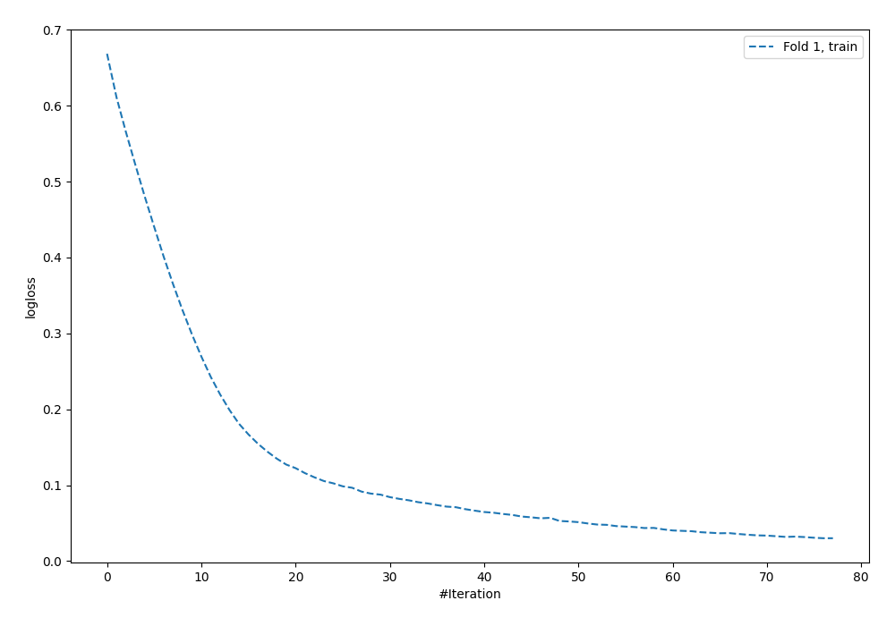
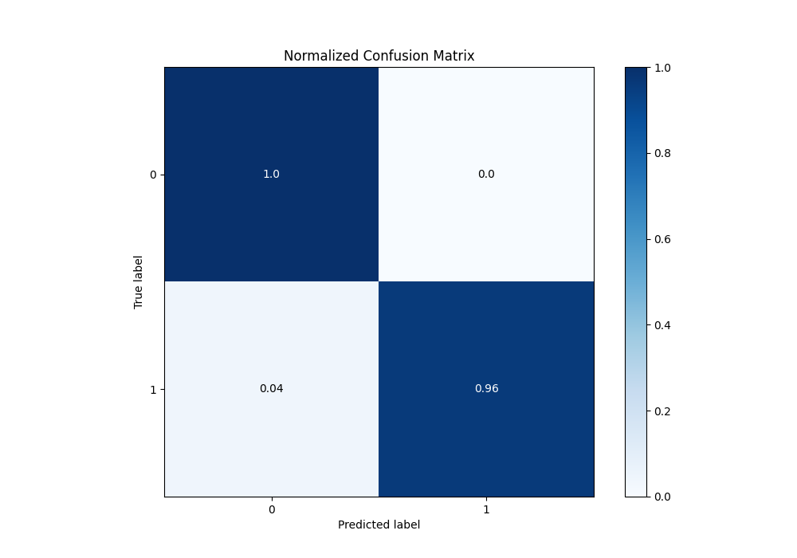
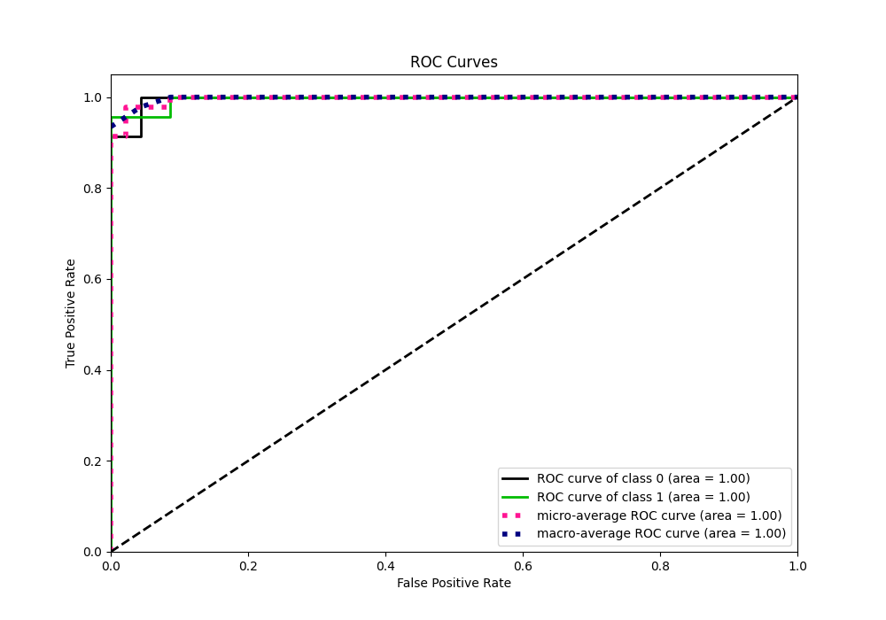
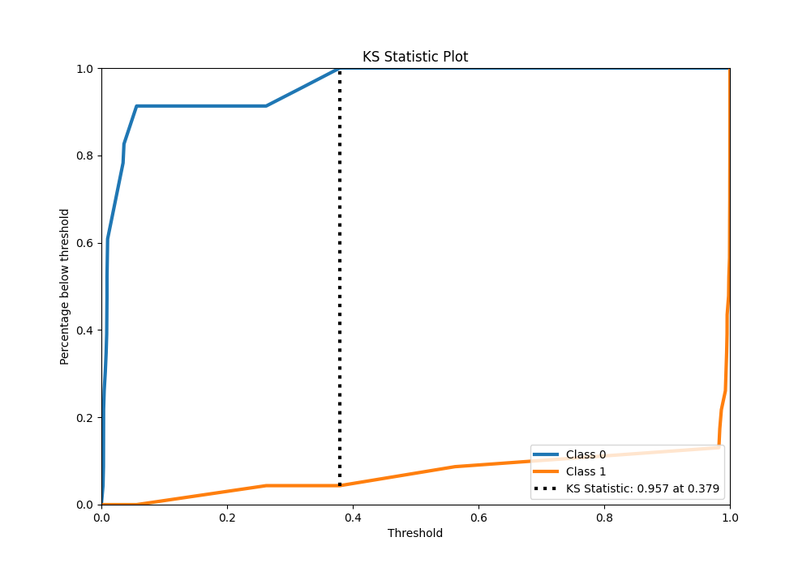
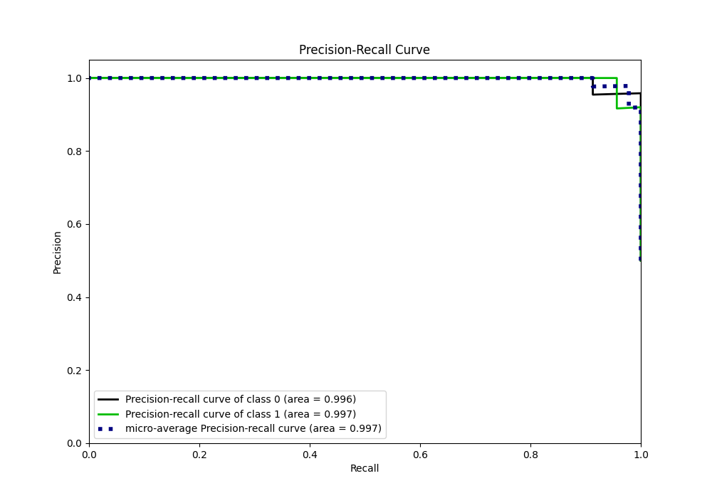
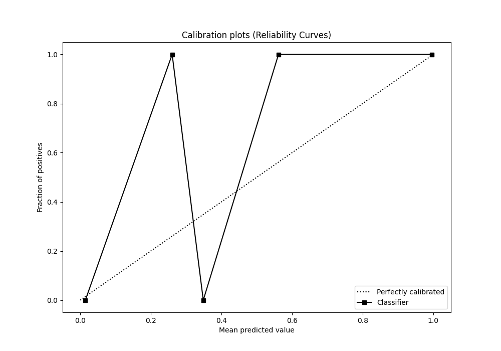
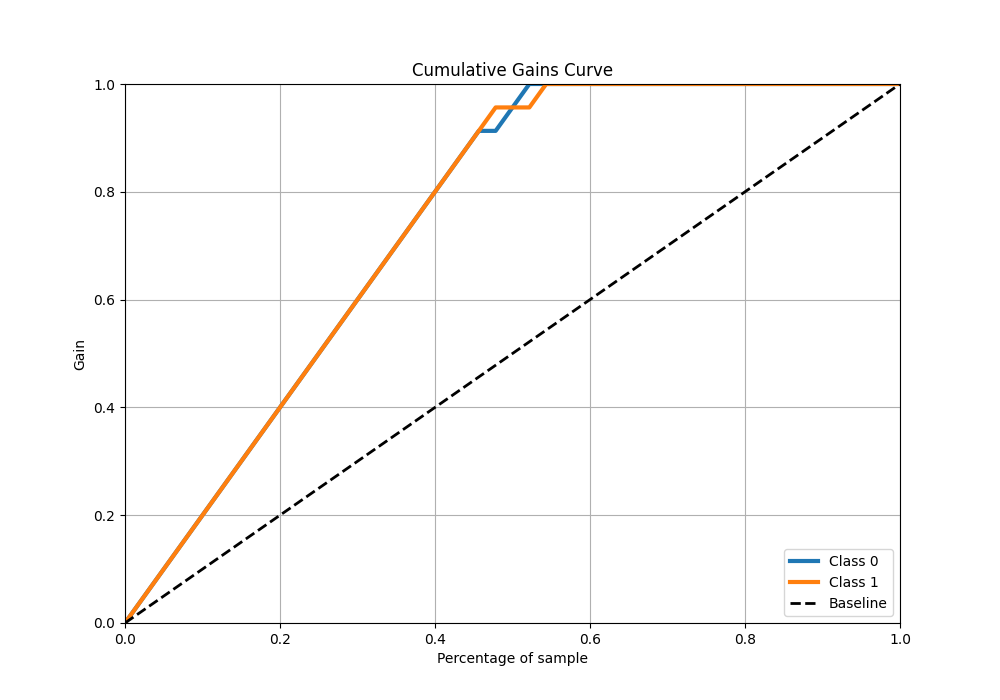

# Summary of 98_NeuralNetwork

[<< Go back](../README.md)

## Neural Network
- **n_jobs**: -1
- **dense_1_size**: 16
- **dense_2_size**: 8
- **learning_rate**: 0.01
- **explain_level**: 0

## Validation
 - **validation_type**: split
 - **train_ratio**: 0.9
 - **shuffle**: True
 - **stratify**: True

## Optimized metric
accuracy

## Training time

4.9 seconds

## Metric details
|           |     score |    threshold |
|:----------|----------:|-------------:|
| logloss   | 0.0700243 | nan          |
| auc       | 0.996219  | nan          |
| f1        | 0.977778  |   0.471001   |
| accuracy  | 0.978261  |   0.471001   |
| precision | 1         |   0.471001   |
| recall    | 1         |   0.00233562 |
| mcc       | 0.957427  |   0.471001   |

## Metric details with threshold from accuracy metric
|           |     score |   threshold |
|:----------|----------:|------------:|
| logloss   | 0.0700243 |  nan        |
| auc       | 0.996219  |  nan        |
| f1        | 0.977778  |    0.471001 |
| accuracy  | 0.978261  |    0.471001 |
| precision | 1         |    0.471001 |
| recall    | 0.956522  |    0.471001 |
| mcc       | 0.957427  |    0.471001 |

## Confusion matrix (at threshold=0.471001)
|              |   Predicted as 0 |   Predicted as 1 |
|:-------------|-----------------:|-----------------:|
| Labeled as 0 |               23 |                0 |
| Labeled as 1 |                1 |               22 |

## Learning curves

## Confusion Matrix

## Normalized Confusion Matrix

## ROC Curve

## Kolmogorov-Smirnov Statistic

## Precision-Recall Curve

## Calibration Curve

## Cumulative Gains Curve

## Lift Curve

[<< Go back](../README.md)
