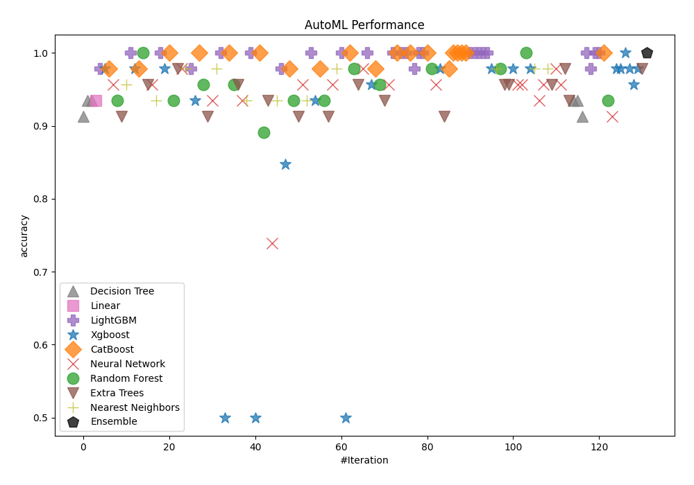
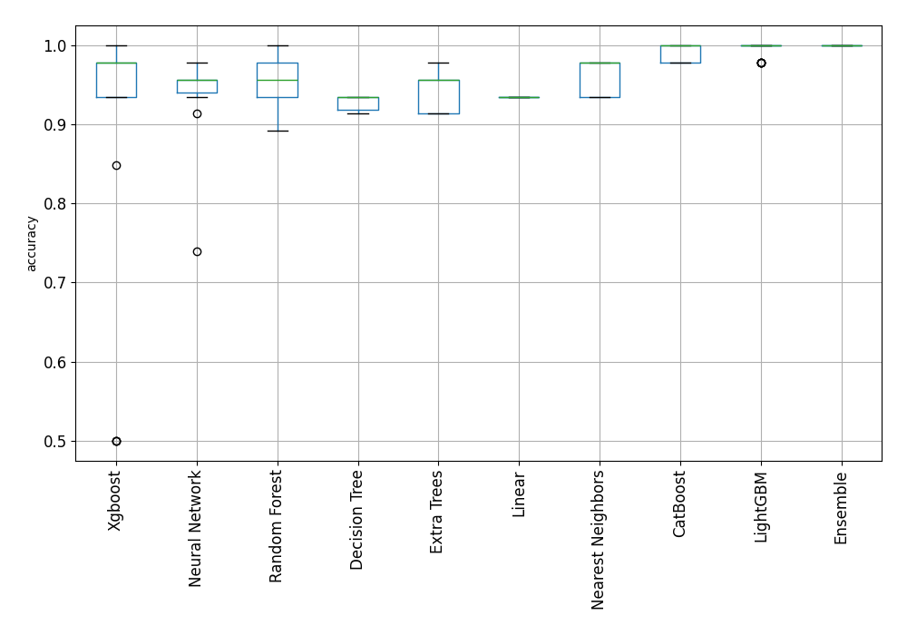
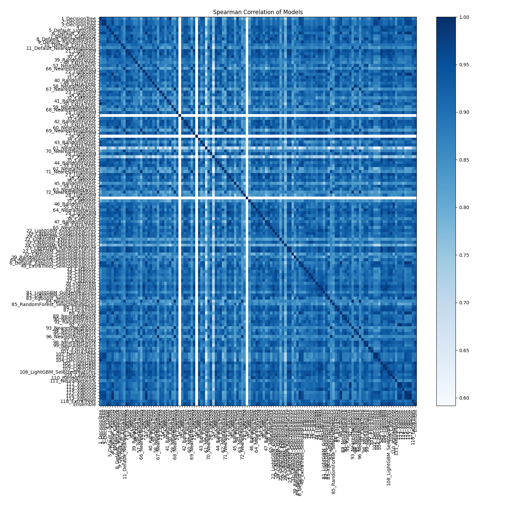

# AutoML Leaderboard

| Best model   | name                                                                               | model_type        | metric_type   |   metric_value |   train_time |
|:-------------|:-----------------------------------------------------------------------------------|:------------------|:--------------|---------------:|-------------:|
|              | [1_DecisionTree](1_DecisionTree/README.md)                                         | Decision Tree     | accuracy      |       0.913043 |        10.28 |
|              | [2_DecisionTree](2_DecisionTree/README.md)                                         | Decision Tree     | accuracy      |       0.934783 |         2.05 |
|              | [3_DecisionTree](3_DecisionTree/README.md)                                         | Decision Tree     | accuracy      |       0.934783 |         2.05 |
|              | [4_Linear](4_Linear/README.md)                                                     | Linear            | accuracy      |       0.934783 |         5.37 |
|              | [5_Default_LightGBM](5_Default_LightGBM/README.md)                                 | LightGBM          | accuracy      |       0.978261 |         3.05 |
|              | [6_Default_Xgboost](6_Default_Xgboost/README.md)                                   | Xgboost           | accuracy      |       0.978261 |         2.72 |
|              | [7_Default_CatBoost](7_Default_CatBoost/README.md)                                 | CatBoost          | accuracy      |       0.978261 |         3.23 |
|              | [8_Default_NeuralNetwork](8_Default_NeuralNetwork/README.md)                       | Neural Network    | accuracy      |       0.956522 |         2.79 |
|              | [9_Default_RandomForest](9_Default_RandomForest/README.md)                         | Random Forest     | accuracy      |       0.934783 |         2.83 |
|              | [10_Default_ExtraTrees](10_Default_ExtraTrees/README.md)                           | Extra Trees       | accuracy      |       0.913043 |         2.89 |
|              | [11_Default_NearestNeighbors](11_Default_NearestNeighbors/README.md)               | Nearest Neighbors | accuracy      |       0.956522 |         2.41 |
| **the best** | [21_LightGBM](21_LightGBM/README.md)                                               | LightGBM          | accuracy      |       1        |         2.98 |
|              | [12_Xgboost](12_Xgboost/README.md)                                                 | Xgboost           | accuracy      |       0.978261 |         2.93 |
|              | [30_CatBoost](30_CatBoost/README.md)                                               | CatBoost          | accuracy      |       0.978261 |         3.25 |
|              | [39_RandomForest](39_RandomForest/README.md)                                       | Random Forest     | accuracy      |       1        |         3.02 |
|              | [48_ExtraTrees](48_ExtraTrees/README.md)                                           | Extra Trees       | accuracy      |       0.956522 |         2.8  |
|              | [57_NeuralNetwork](57_NeuralNetwork/README.md)                                     | Neural Network    | accuracy      |       0.956522 |         2.95 |
|              | [66_NearestNeighbors](66_NearestNeighbors/README.md)                               | Nearest Neighbors | accuracy      |       0.934783 |         2.86 |
|              | [22_LightGBM](22_LightGBM/README.md)                                               | LightGBM          | accuracy      |       1        |         4.93 |
|              | [13_Xgboost](13_Xgboost/README.md)                                                 | Xgboost           | accuracy      |       0.978261 |         4.35 |
|              | [31_CatBoost](31_CatBoost/README.md)                                               | CatBoost          | accuracy      |       1        |         5.33 |
|              | [40_RandomForest](40_RandomForest/README.md)                                       | Random Forest     | accuracy      |       0.934783 |         4.99 |
|              | [49_ExtraTrees](49_ExtraTrees/README.md)                                           | Extra Trees       | accuracy      |       0.978261 |         4.71 |
|              | [58_NeuralNetwork](58_NeuralNetwork/README.md)                                     | Neural Network    | accuracy      |       0.978261 |         5.2  |
|              | [67_NearestNeighbors](67_NearestNeighbors/README.md)                               | Nearest Neighbors | accuracy      |       0.978261 |         4.03 |
|              | [23_LightGBM](23_LightGBM/README.md)                                               | LightGBM          | accuracy      |       0.978261 |         4.65 |
|              | [14_Xgboost](14_Xgboost/README.md)                                                 | Xgboost           | accuracy      |       0.934783 |         4.97 |
|              | [32_CatBoost](32_CatBoost/README.md)                                               | CatBoost          | accuracy      |       1        |         5.97 |
|              | [41_RandomForest](41_RandomForest/README.md)                                       | Random Forest     | accuracy      |       0.956522 |         5.4  |
|              | [50_ExtraTrees](50_ExtraTrees/README.md)                                           | Extra Trees       | accuracy      |       0.913043 |         5    |
|              | [59_NeuralNetwork](59_NeuralNetwork/README.md)                                     | Neural Network    | accuracy      |       0.934783 |         5.19 |
|              | [68_NearestNeighbors](68_NearestNeighbors/README.md)                               | Nearest Neighbors | accuracy      |       0.978261 |         4.4  |
|              | [24_LightGBM](24_LightGBM/README.md)                                               | LightGBM          | accuracy      |       1        |         5.83 |
|              | [15_Xgboost](15_Xgboost/README.md)                                                 | Xgboost           | accuracy      |       0.5      |         3.55 |
|              | [33_CatBoost](33_CatBoost/README.md)                                               | CatBoost          | accuracy      |       1        |         5.83 |
|              | [42_RandomForest](42_RandomForest/README.md)                                       | Random Forest     | accuracy      |       0.956522 |         5.28 |
|              | [51_ExtraTrees](51_ExtraTrees/README.md)                                           | Extra Trees       | accuracy      |       0.956522 |         3.86 |
|              | [60_NeuralNetwork](60_NeuralNetwork/README.md)                                     | Neural Network    | accuracy      |       0.934783 |         3.35 |
|              | [69_NearestNeighbors](69_NearestNeighbors/README.md)                               | Nearest Neighbors | accuracy      |       0.934783 |         3.08 |
|              | [25_LightGBM](25_LightGBM/README.md)                                               | LightGBM          | accuracy      |       1        |         3.79 |
|              | [16_Xgboost](16_Xgboost/README.md)                                                 | Xgboost           | accuracy      |       0.5      |         3.75 |
|              | [34_CatBoost](34_CatBoost/README.md)                                               | CatBoost          | accuracy      |       1        |         5.91 |
|              | [43_RandomForest](43_RandomForest/README.md)                                       | Random Forest     | accuracy      |       0.891304 |         5.29 |
|              | [52_ExtraTrees](52_ExtraTrees/README.md)                                           | Extra Trees       | accuracy      |       0.934783 |         5.39 |
|              | [61_NeuralNetwork](61_NeuralNetwork/README.md)                                     | Neural Network    | accuracy      |       0.73913  |         5.13 |
|              | [70_NearestNeighbors](70_NearestNeighbors/README.md)                               | Nearest Neighbors | accuracy      |       0.934783 |         4.42 |
|              | [26_LightGBM](26_LightGBM/README.md)                                               | LightGBM          | accuracy      |       0.978261 |         6.32 |
|              | [17_Xgboost](17_Xgboost/README.md)                                                 | Xgboost           | accuracy      |       0.847826 |         5.35 |
|              | [35_CatBoost](35_CatBoost/README.md)                                               | CatBoost          | accuracy      |       0.978261 |         6.48 |
|              | [44_RandomForest](44_RandomForest/README.md)                                       | Random Forest     | accuracy      |       0.934783 |         6.34 |
|              | [53_ExtraTrees](53_ExtraTrees/README.md)                                           | Extra Trees       | accuracy      |       0.913043 |         5.35 |
|              | [62_NeuralNetwork](62_NeuralNetwork/README.md)                                     | Neural Network    | accuracy      |       0.956522 |         6.13 |
|              | [71_NearestNeighbors](71_NearestNeighbors/README.md)                               | Nearest Neighbors | accuracy      |       0.934783 |         4.94 |
|              | [27_LightGBM](27_LightGBM/README.md)                                               | LightGBM          | accuracy      |       1        |         6.66 |
|              | [18_Xgboost](18_Xgboost/README.md)                                                 | Xgboost           | accuracy      |       0.934783 |         5.92 |
|              | [36_CatBoost](36_CatBoost/README.md)                                               | CatBoost          | accuracy      |       0.978261 |         6.3  |
|              | [45_RandomForest](45_RandomForest/README.md)                                       | Random Forest     | accuracy      |       0.934783 |         6.59 |
|              | [54_ExtraTrees](54_ExtraTrees/README.md)                                           | Extra Trees       | accuracy      |       0.913043 |         5.29 |
|              | [63_NeuralNetwork](63_NeuralNetwork/README.md)                                     | Neural Network    | accuracy      |       0.956522 |         6.76 |
|              | [72_NearestNeighbors](72_NearestNeighbors/README.md)                               | Nearest Neighbors | accuracy      |       0.978261 |         5.2  |
|              | [28_LightGBM](28_LightGBM/README.md)                                               | LightGBM          | accuracy      |       1        |         7.15 |
|              | [19_Xgboost](19_Xgboost/README.md)                                                 | Xgboost           | accuracy      |       0.5      |         4.48 |
|              | [37_CatBoost](37_CatBoost/README.md)                                               | CatBoost          | accuracy      |       1        |         6.55 |
|              | [46_RandomForest](46_RandomForest/README.md)                                       | Random Forest     | accuracy      |       0.978261 |         7.24 |
|              | [55_ExtraTrees](55_ExtraTrees/README.md)                                           | Extra Trees       | accuracy      |       0.956522 |         5.78 |
|              | [64_NeuralNetwork](64_NeuralNetwork/README.md)                                     | Neural Network    | accuracy      |       0.978261 |         5.69 |
|              | [29_LightGBM](29_LightGBM/README.md)                                               | LightGBM          | accuracy      |       1        |         6.06 |
|              | [20_Xgboost](20_Xgboost/README.md)                                                 | Xgboost           | accuracy      |       0.956522 |         6.1  |
|              | [38_CatBoost](38_CatBoost/README.md)                                               | CatBoost          | accuracy      |       0.978261 |         5.96 |
|              | [47_RandomForest](47_RandomForest/README.md)                                       | Random Forest     | accuracy      |       0.956522 |         6.34 |
|              | [56_ExtraTrees](56_ExtraTrees/README.md)                                           | Extra Trees       | accuracy      |       0.934783 |         6.2  |
|              | [65_NeuralNetwork](65_NeuralNetwork/README.md)                                     | Neural Network    | accuracy      |       0.956522 |         6.12 |
|              | [22_LightGBM_GoldenFeatures](22_LightGBM_GoldenFeatures/README.md)                 | LightGBM          | accuracy      |       1        |        15.71 |
|              | [33_CatBoost_GoldenFeatures](33_CatBoost_GoldenFeatures/README.md)                 | CatBoost          | accuracy      |       1        |         6.96 |
|              | [24_LightGBM_GoldenFeatures](24_LightGBM_GoldenFeatures/README.md)                 | LightGBM          | accuracy      |       1        |         6.45 |
|              | [22_LightGBM_KMeansFeatures](22_LightGBM_KMeansFeatures/README.md)                 | LightGBM          | accuracy      |       1        |         7.24 |
|              | [33_CatBoost_KMeansFeatures](33_CatBoost_KMeansFeatures/README.md)                 | CatBoost          | accuracy      |       1        |         6.35 |
|              | [24_LightGBM_KMeansFeatures](24_LightGBM_KMeansFeatures/README.md)                 | LightGBM          | accuracy      |       0.978261 |         4.87 |
|              | [27_LightGBM_RandomFeature](27_LightGBM_RandomFeature/README.md)                   | LightGBM          | accuracy      |       1        |         5.06 |
|              | [27_LightGBM_SelectedFeatures](27_LightGBM_SelectedFeatures/README.md)             | LightGBM          | accuracy      |       1        |         4.7  |
|              | [31_CatBoost_SelectedFeatures](31_CatBoost_SelectedFeatures/README.md)             | CatBoost          | accuracy      |       1        |         4.84 |
|              | [39_RandomForest_SelectedFeatures](39_RandomForest_SelectedFeatures/README.md)     | Random Forest     | accuracy      |       0.978261 |         4.63 |
|              | [64_NeuralNetwork_SelectedFeatures](64_NeuralNetwork_SelectedFeatures/README.md)   | Neural Network    | accuracy      |       0.956522 |         4.49 |
|              | [6_Default_Xgboost_SelectedFeatures](6_Default_Xgboost_SelectedFeatures/README.md) | Xgboost           | accuracy      |       0.978261 |         4.45 |
|              | [49_ExtraTrees_SelectedFeatures](49_ExtraTrees_SelectedFeatures/README.md)         | Extra Trees       | accuracy      |       0.913043 |         4.28 |
|              | [73_CatBoost](73_CatBoost/README.md)                                               | CatBoost          | accuracy      |       0.978261 |         4.76 |
|              | [74_CatBoost](74_CatBoost/README.md)                                               | CatBoost          | accuracy      |       1        |         5.02 |
|              | [75_CatBoost](75_CatBoost/README.md)                                               | CatBoost          | accuracy      |       1        |         5.72 |
|              | [76_CatBoost](76_CatBoost/README.md)                                               | CatBoost          | accuracy      |       1        |         6.34 |
|              | [77_CatBoost](77_CatBoost/README.md)                                               | CatBoost          | accuracy      |       1        |         5.31 |
|              | [78_LightGBM](78_LightGBM/README.md)                                               | LightGBM          | accuracy      |       1        |         5.25 |
|              | [79_LightGBM](79_LightGBM/README.md)                                               | LightGBM          | accuracy      |       1        |         5    |
|              | [80_LightGBM](80_LightGBM/README.md)                                               | LightGBM          | accuracy      |       1        |         4.92 |
|              | [81_LightGBM_GoldenFeatures](81_LightGBM_GoldenFeatures/README.md)                 | LightGBM          | accuracy      |       1        |         4.94 |
|              | [82_LightGBM_GoldenFeatures](82_LightGBM_GoldenFeatures/README.md)                 | LightGBM          | accuracy      |       1        |         5    |
|              | [83_Xgboost_SelectedFeatures](83_Xgboost_SelectedFeatures/README.md)               | Xgboost           | accuracy      |       0.978261 |         4.67 |
|              | [84_NearestNeighbors](84_NearestNeighbors/README.md)                               | Nearest Neighbors | accuracy      |       0.978261 |         4.07 |
|              | [85_RandomForest_SelectedFeatures](85_RandomForest_SelectedFeatures/README.md)     | Random Forest     | accuracy      |       0.978261 |         5.15 |
|              | [86_ExtraTrees](86_ExtraTrees/README.md)                                           | Extra Trees       | accuracy      |       0.956522 |         5    |
|              | [87_ExtraTrees](87_ExtraTrees/README.md)                                           | Extra Trees       | accuracy      |       0.956522 |         5.01 |
|              | [88_Xgboost](88_Xgboost/README.md)                                                 | Xgboost           | accuracy      |       0.978261 |         4.82 |
|              | [89_NeuralNetwork](89_NeuralNetwork/README.md)                                     | Neural Network    | accuracy      |       0.956522 |         4.8  |
|              | [90_NeuralNetwork](90_NeuralNetwork/README.md)                                     | Neural Network    | accuracy      |       0.956522 |         5.14 |
|              | [91_RandomForest](91_RandomForest/README.md)                                       | Random Forest     | accuracy      |       1        |         5.24 |
|              | [92_Xgboost](92_Xgboost/README.md)                                                 | Xgboost           | accuracy      |       0.978261 |         4.92 |
|              | [93_NearestNeighbors](93_NearestNeighbors/README.md)                               | Nearest Neighbors | accuracy      |       0.978261 |         4.45 |
|              | [94_NeuralNetwork](94_NeuralNetwork/README.md)                                     | Neural Network    | accuracy      |       0.934783 |         4.98 |
|              | [95_NeuralNetwork](95_NeuralNetwork/README.md)                                     | Neural Network    | accuracy      |       0.956522 |         6.79 |
|              | [96_NearestNeighbors](96_NearestNeighbors/README.md)                               | Nearest Neighbors | accuracy      |       0.978261 |         5.12 |
|              | [97_ExtraTrees](97_ExtraTrees/README.md)                                           | Extra Trees       | accuracy      |       0.956522 |         4.96 |
|              | [98_NeuralNetwork](98_NeuralNetwork/README.md)                                     | Neural Network    | accuracy      |       0.978261 |         6.22 |
|              | [99_NeuralNetwork](99_NeuralNetwork/README.md)                                     | Neural Network    | accuracy      |       0.956522 |         5.15 |
|              | [100_ExtraTrees](100_ExtraTrees/README.md)                                         | Extra Trees       | accuracy      |       0.978261 |         4.97 |
|              | [101_ExtraTrees](101_ExtraTrees/README.md)                                         | Extra Trees       | accuracy      |       0.934783 |         5.3  |
|              | [102_DecisionTree](102_DecisionTree/README.md)                                     | Decision Tree     | accuracy      |       0.934783 |         4.4  |
|              | [103_DecisionTree](103_DecisionTree/README.md)                                     | Decision Tree     | accuracy      |       0.934783 |         4.31 |
|              | [104_DecisionTree](104_DecisionTree/README.md)                                     | Decision Tree     | accuracy      |       0.913043 |         4.53 |
|              | [105_LightGBM](105_LightGBM/README.md)                                             | LightGBM          | accuracy      |       1        |         5.32 |
|              | [106_LightGBM](106_LightGBM/README.md)                                             | LightGBM          | accuracy      |       0.978261 |         5.33 |
|              | [107_LightGBM](107_LightGBM/README.md)                                             | LightGBM          | accuracy      |       1        |         5.61 |
|              | [108_LightGBM_SelectedFeatures](108_LightGBM_SelectedFeatures/README.md)           | LightGBM          | accuracy      |       1        |         5.37 |
|              | [109_CatBoost](109_CatBoost/README.md)                                             | CatBoost          | accuracy      |       1        |         5.65 |
|              | [110_RandomForest](110_RandomForest/README.md)                                     | Random Forest     | accuracy      |       0.934783 |         5.79 |
|              | [111_NeuralNetwork](111_NeuralNetwork/README.md)                                   | Neural Network    | accuracy      |       0.913043 |         4.83 |
|              | [112_Xgboost](112_Xgboost/README.md)                                               | Xgboost           | accuracy      |       0.978261 |         5.13 |
|              | [113_Xgboost](113_Xgboost/README.md)                                               | Xgboost           | accuracy      |       0.978261 |         5.28 |
|              | [114_Xgboost](114_Xgboost/README.md)                                               | Xgboost           | accuracy      |       1        |         7.84 |
|              | [115_Xgboost](115_Xgboost/README.md)                                               | Xgboost           | accuracy      |       0.978261 |         7.7  |
|              | [116_Xgboost](116_Xgboost/README.md)                                               | Xgboost           | accuracy      |       0.956522 |         7.58 |
|              | [117_Xgboost](117_Xgboost/README.md)                                               | Xgboost           | accuracy      |       0.978261 |         5.59 |
|              | [118_ExtraTrees](118_ExtraTrees/README.md)                                         | Extra Trees       | accuracy      |       0.978261 |         5.3  |
|              | [Ensemble](Ensemble/README.md)                                                     | Ensemble          | accuracy      |       1        |        16.94 |

### AutoML Performance

### AutoML Performance Boxplot

### Spearman Correlation of Models

