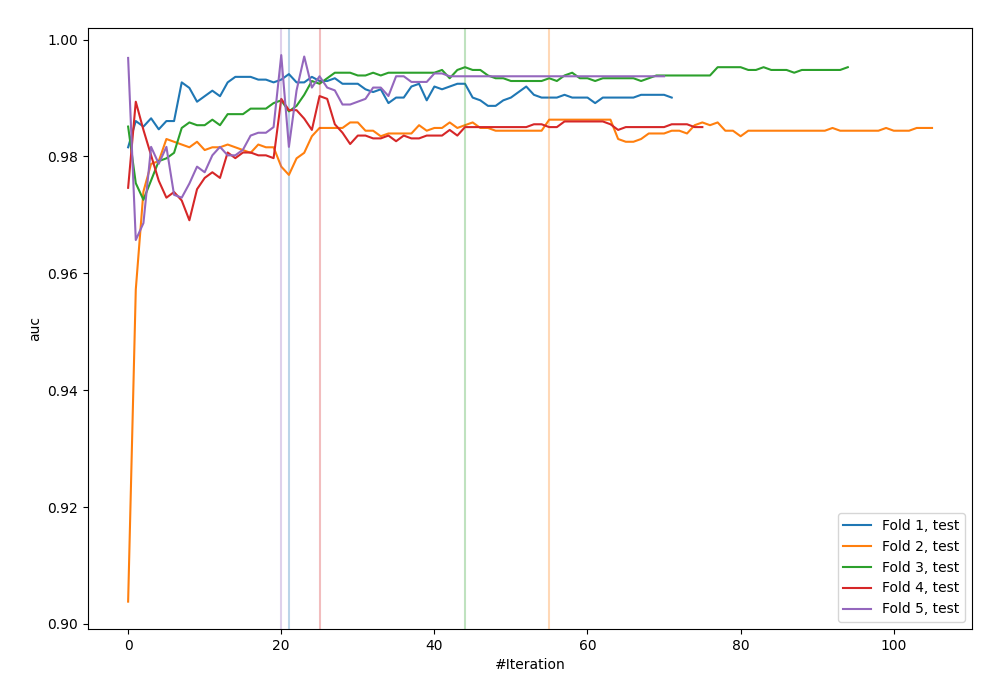
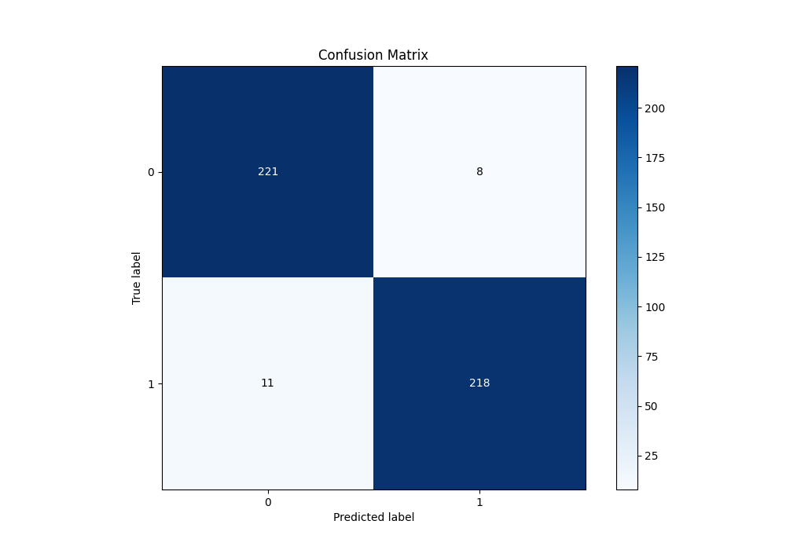
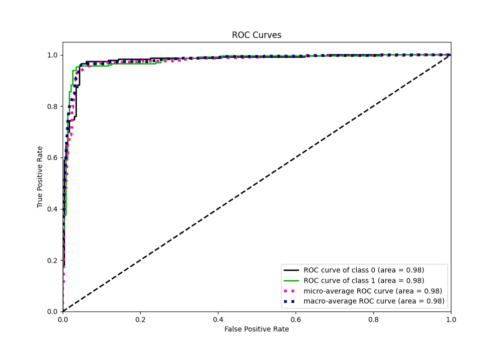
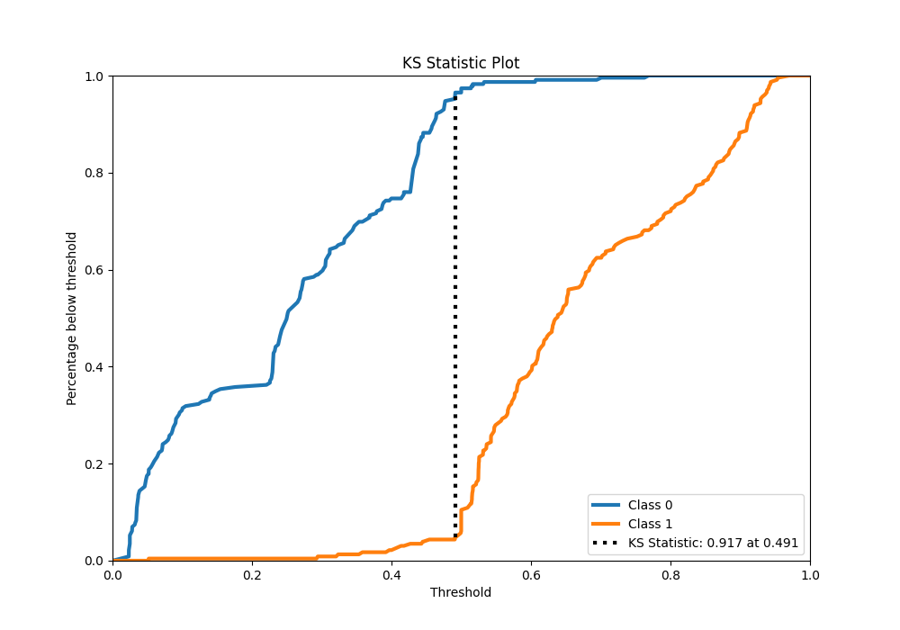
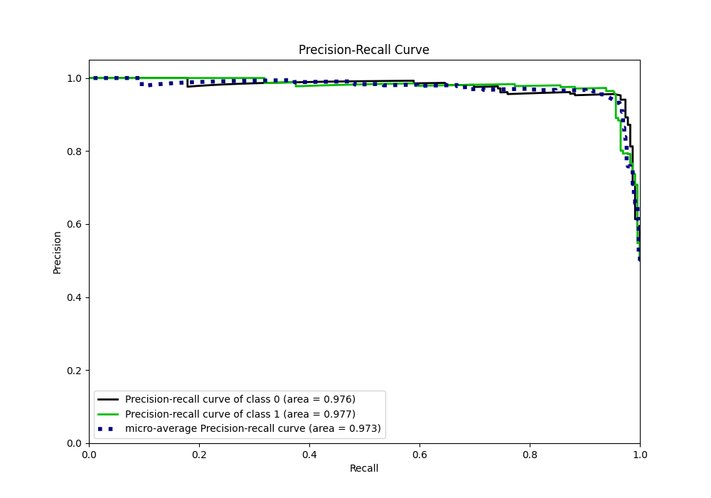
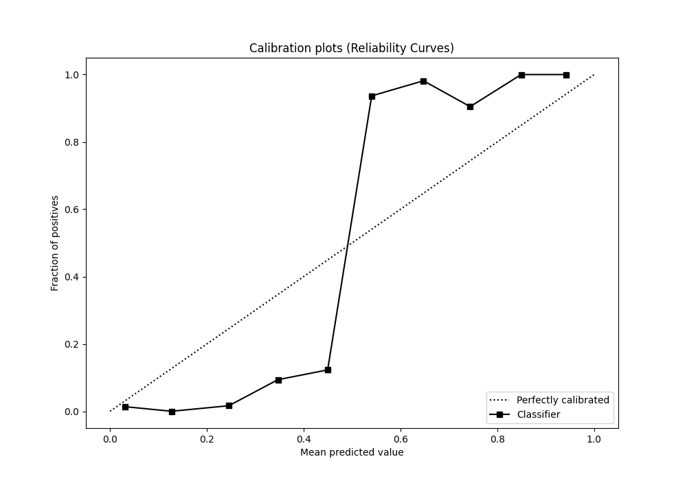
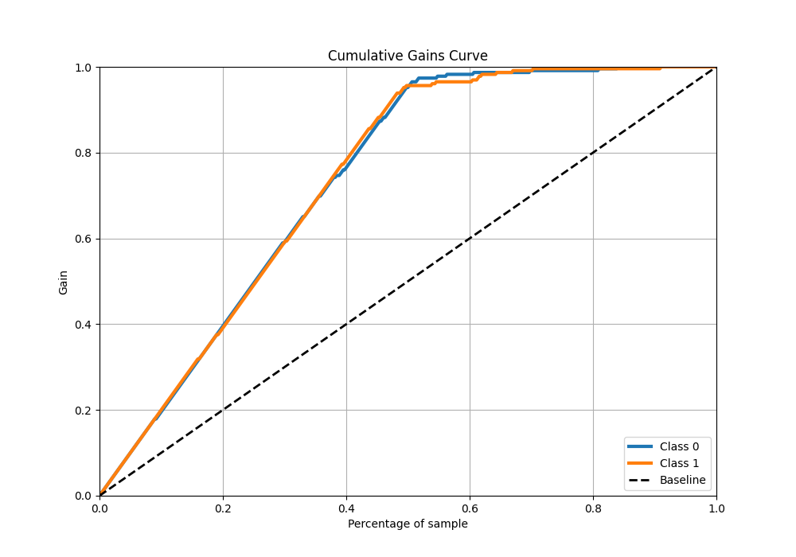
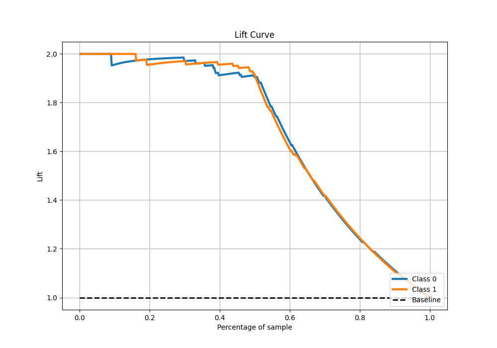

# Summary of 101_CatBoost_BoostOnErrors

[<< Go back](../README.md)

## CatBoost
- **n_jobs**: -1
- **learning_rate**: 0.05
- **depth**: 8
- **rsm**: 0.9
- **loss_function**: Logloss
- **eval_metric**: AUC
- **explain_level**: 0

## Validation
 - **validation_type**: kfold
 - **shuffle**: True
 - **stratify**: True
 - **k_folds**: 5

## Optimized metric
auc

## Training time

21.5 seconds

## Metric details
|           |    score |   threshold |
|:----------|---------:|------------:|
| logloss   | 0.373699 | nan         |
| auc       | 0.97767  | nan         |
| f1        | 0.958242 |   0.491475  |
| accuracy  | 0.958515 |   0.491475  |
| precision | 1        |   0.770679  |
| recall    | 1        |   0.0210472 |
| mcc       | 0.917109 |   0.491475  |

## Metric details with threshold from accuracy metric
|           |    score |   threshold |
|:----------|---------:|------------:|
| logloss   | 0.373699 |  nan        |
| auc       | 0.97767  |  nan        |
| f1        | 0.958242 |    0.491475 |
| accuracy  | 0.958515 |    0.491475 |
| precision | 0.964602 |    0.491475 |
| recall    | 0.951965 |    0.491475 |
| mcc       | 0.917109 |    0.491475 |

## Confusion matrix (at threshold=0.491475)
|              |   Predicted as 0 |   Predicted as 1 |
|:-------------|-----------------:|-----------------:|
| Labeled as 0 |              221 |                8 |
| Labeled as 1 |               11 |              218 |

## Learning curves

## Confusion Matrix

## Normalized Confusion Matrix

## ROC Curve

## Kolmogorov-Smirnov Statistic

## Precision-Recall Curve

## Calibration Curve

## Cumulative Gains Curve

## Lift Curve

[<< Go back](../README.md)
