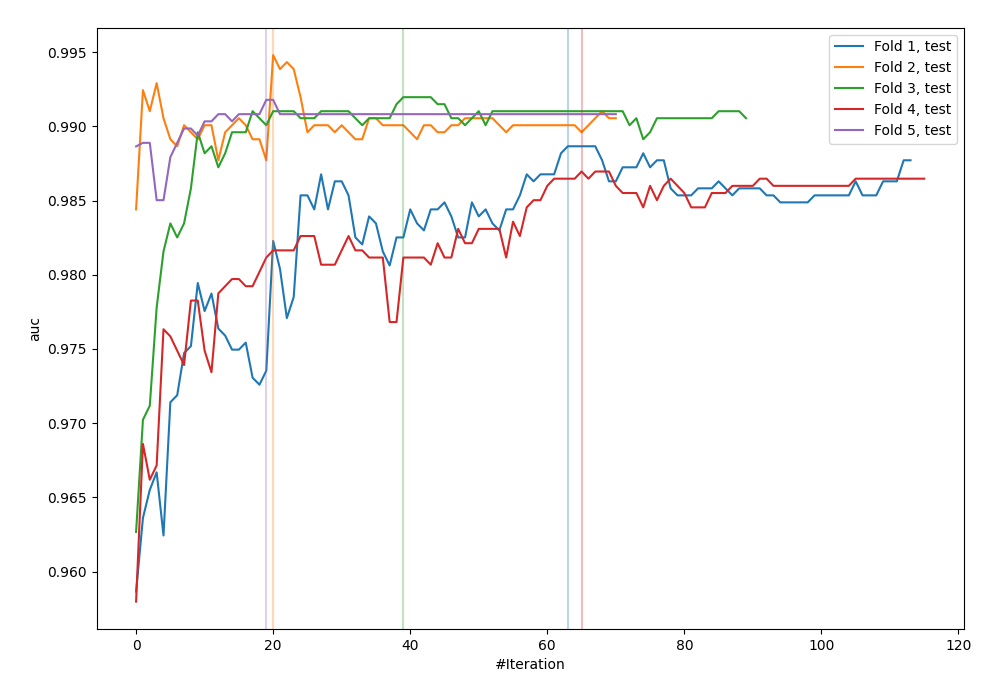
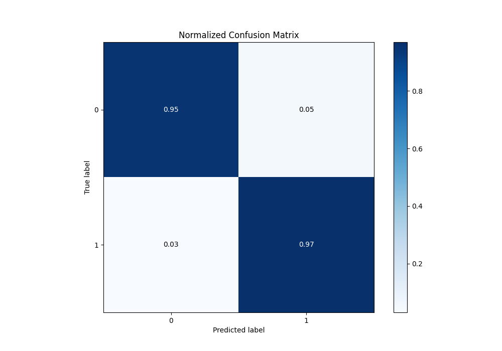
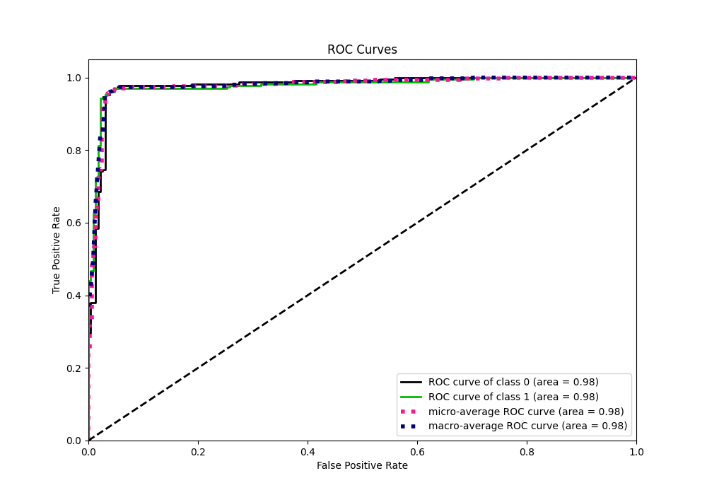
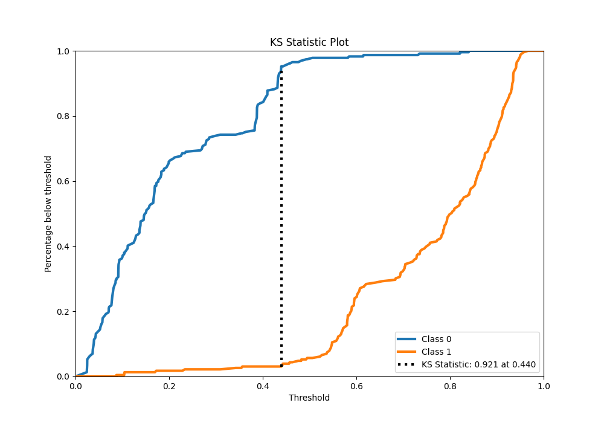
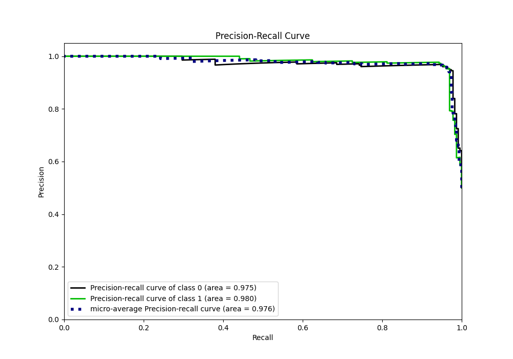
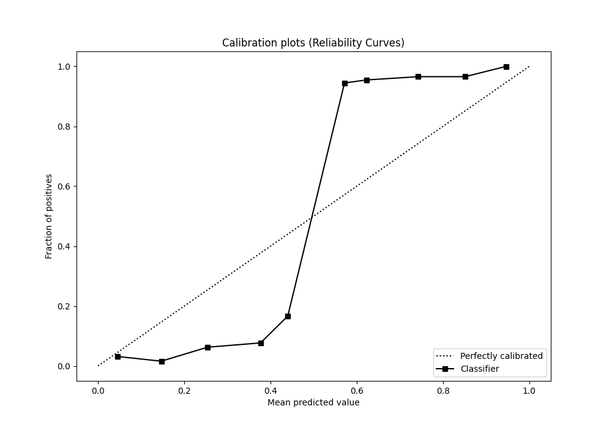
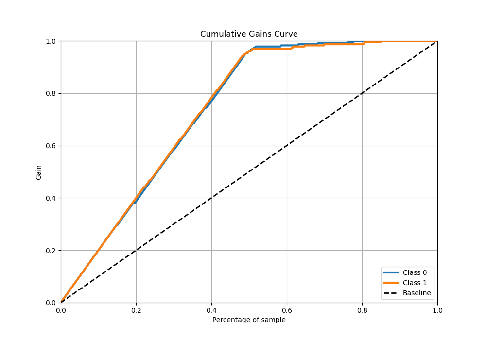
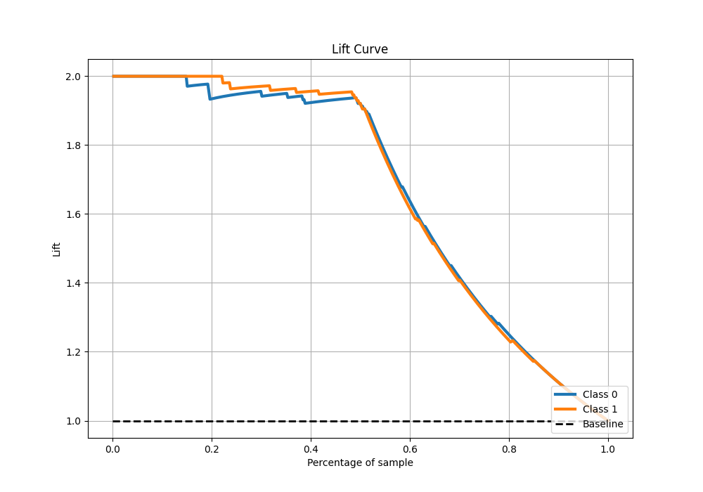

# Summary of 103_CatBoost

[<< Go back](../README.md)

## CatBoost
- **n_jobs**: -1
- **learning_rate**: 0.025
- **depth**: 8
- **rsm**: 0.9
- **loss_function**: Logloss
- **eval_metric**: AUC
- **explain_level**: 0

## Validation
 - **validation_type**: kfold
 - **shuffle**: True
 - **stratify**: True
 - **k_folds**: 5

## Optimized metric
auc

## Training time

32.0 seconds

## Metric details
|           |    score |   threshold |
|:----------|---------:|------------:|
| logloss   | 0.286458 | nan         |
| auc       | 0.977918 | nan         |
| f1        | 0.961039 |   0.440868  |
| accuracy  | 0.960699 |   0.440868  |
| precision | 1        |   0.84134   |
| recall    | 1        |   0.0217065 |
| mcc       | 0.92196  |   0.514212  |

## Metric details with threshold from accuracy metric
|           |    score |   threshold |
|:----------|---------:|------------:|
| logloss   | 0.286458 |  nan        |
| auc       | 0.977918 |  nan        |
| f1        | 0.961039 |    0.440868 |
| accuracy  | 0.960699 |    0.440868 |
| precision | 0.95279  |    0.440868 |
| recall    | 0.969432 |    0.440868 |
| mcc       | 0.921538 |    0.440868 |

## Confusion matrix (at threshold=0.440868)
|              |   Predicted as 0 |   Predicted as 1 |
|:-------------|-----------------:|-----------------:|
| Labeled as 0 |              218 |               11 |
| Labeled as 1 |                7 |              222 |

## Learning curves

## Confusion Matrix

## Normalized Confusion Matrix

## ROC Curve

## Kolmogorov-Smirnov Statistic

## Precision-Recall Curve

## Calibration Curve

## Cumulative Gains Curve

## Lift Curve

[<< Go back](../README.md)
