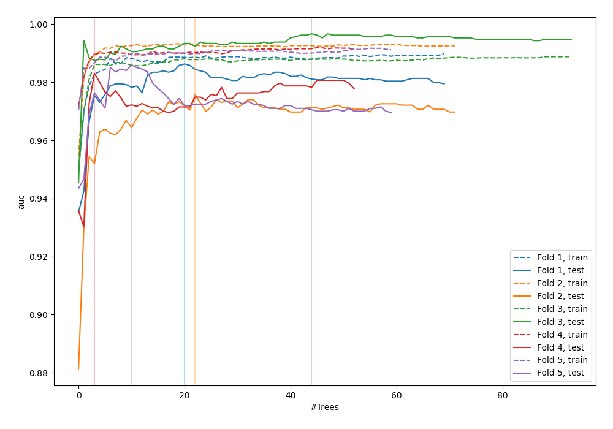
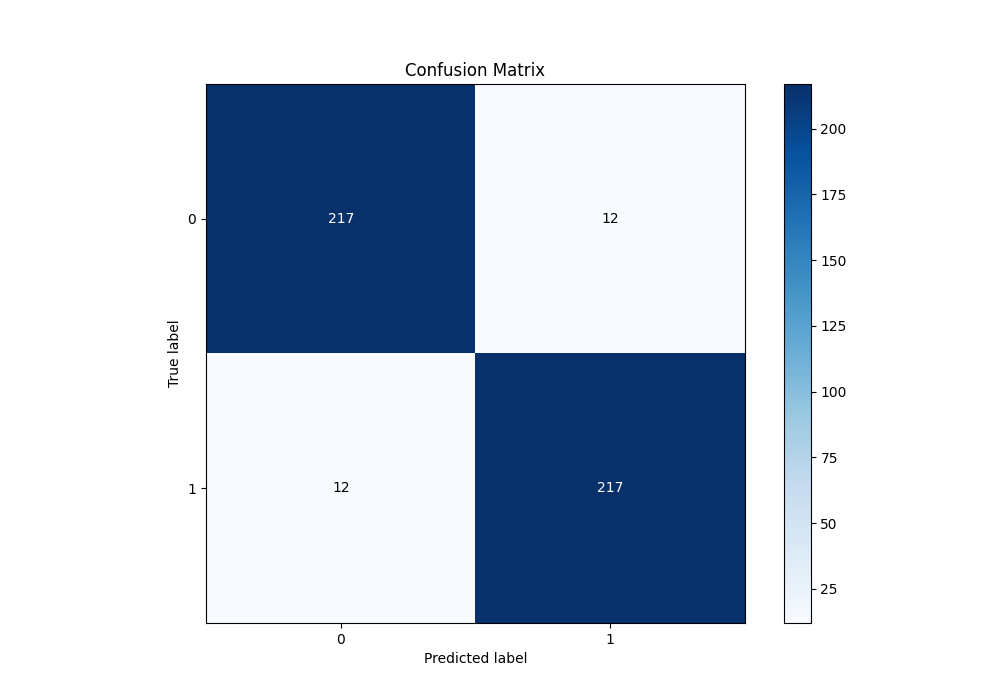
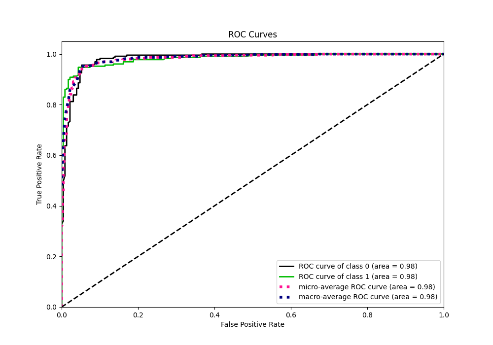
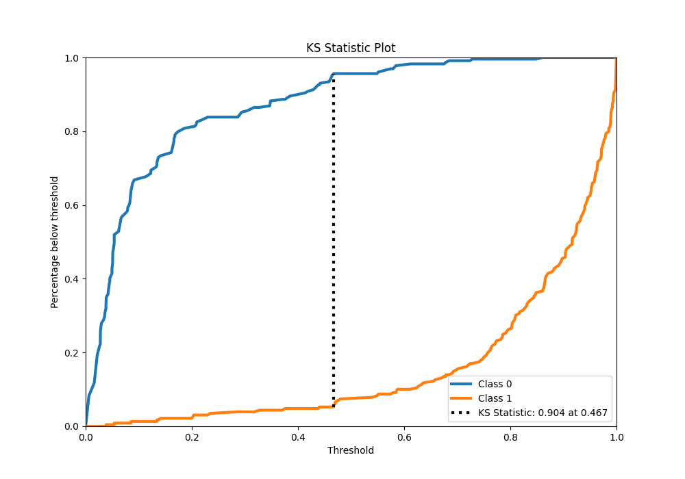
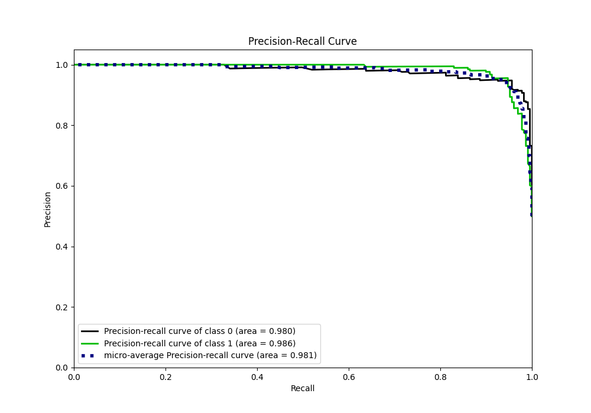
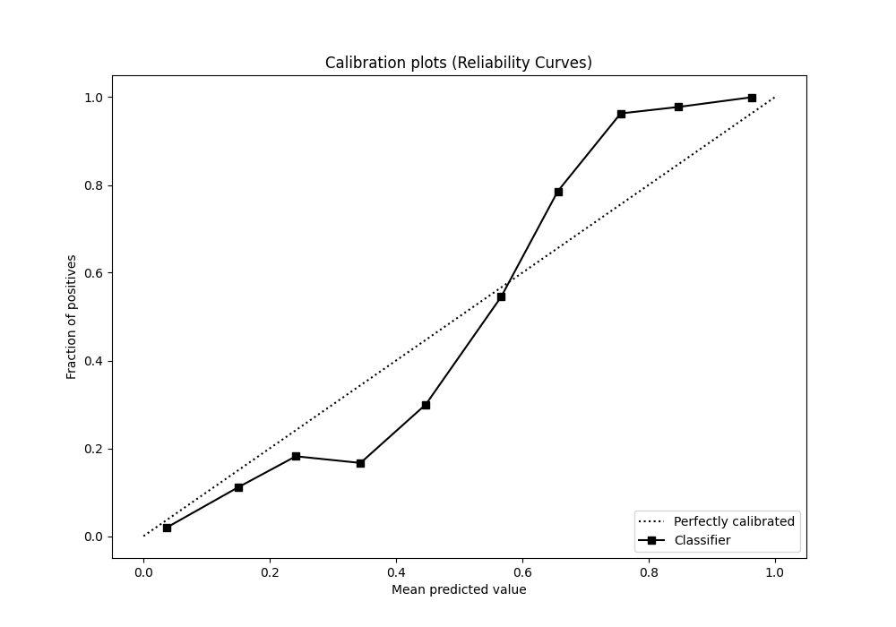
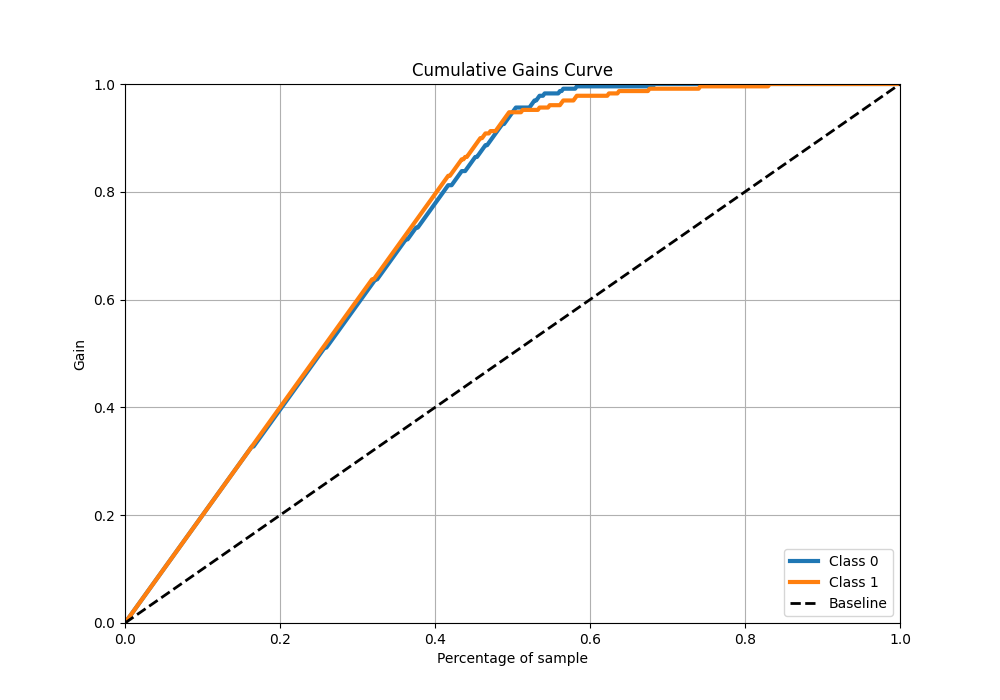
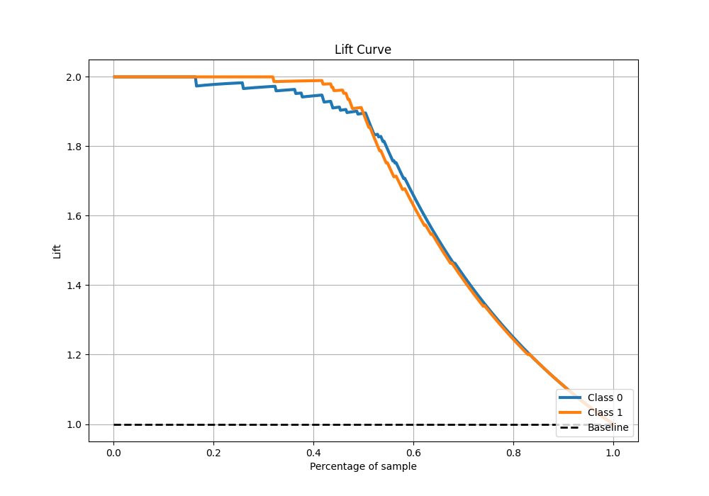

# Summary of 114_RandomForest

[<< Go back](../README.md)

## Random Forest
- **n_jobs**: -1
- **criterion**: entropy
- **max_features**: 0.5
- **min_samples_split**: 10
- **max_depth**: 4
- **eval_metric_name**: auc
- **explain_level**: 0

## Validation
 - **validation_type**: kfold
 - **shuffle**: True
 - **stratify**: True
 - **k_folds**: 5

## Optimized metric
auc

## Training time

29.5 seconds

## Metric details
|           |    score |    threshold |
|:----------|---------:|-------------:|
| logloss   | 0.196562 | nan          |
| auc       | 0.982847 | nan          |
| f1        | 0.947598 |   0.463779   |
| accuracy  | 0.947598 |   0.463779   |
| precision | 1        |   0.861307   |
| recall    | 1        |   0.00563796 |
| mcc       | 0.895333 |   0.470071   |

## Metric details with threshold from accuracy metric
|           |    score |   threshold |
|:----------|---------:|------------:|
| logloss   | 0.196562 |  nan        |
| auc       | 0.982847 |  nan        |
| f1        | 0.947598 |    0.463779 |
| accuracy  | 0.947598 |    0.463779 |
| precision | 0.947598 |    0.463779 |
| recall    | 0.947598 |    0.463779 |
| mcc       | 0.895197 |    0.463779 |

## Confusion matrix (at threshold=0.463779)
|              |   Predicted as 0 |   Predicted as 1 |
|:-------------|-----------------:|-----------------:|
| Labeled as 0 |              217 |               12 |
| Labeled as 1 |               12 |              217 |

## Learning curves

## Confusion Matrix

## Normalized Confusion Matrix

## ROC Curve

## Kolmogorov-Smirnov Statistic

## Precision-Recall Curve

## Calibration Curve

## Cumulative Gains Curve

## Lift Curve

[<< Go back](../README.md)
