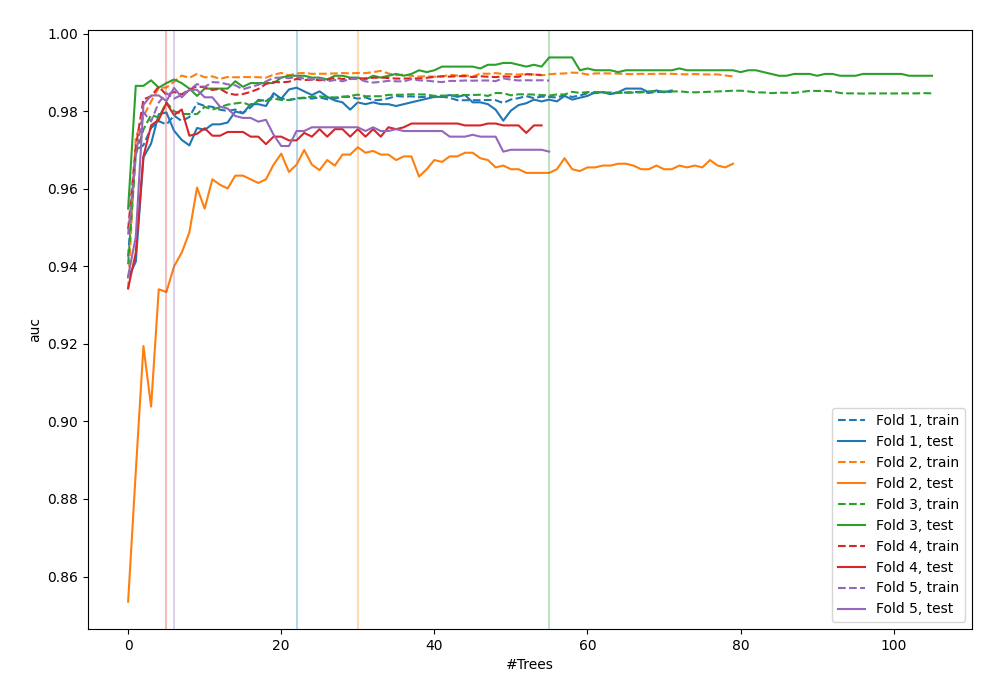
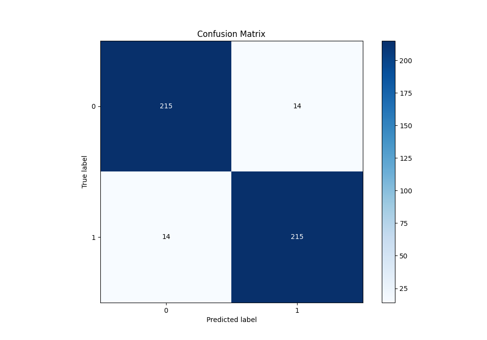
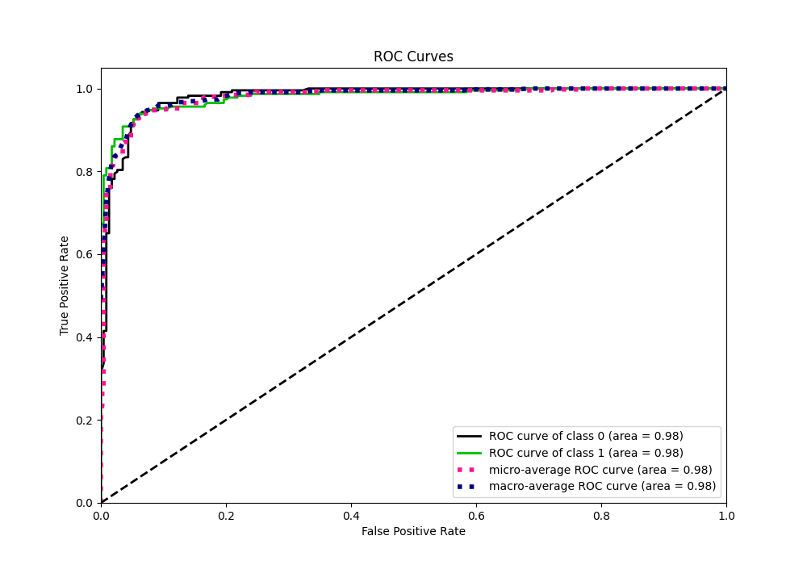
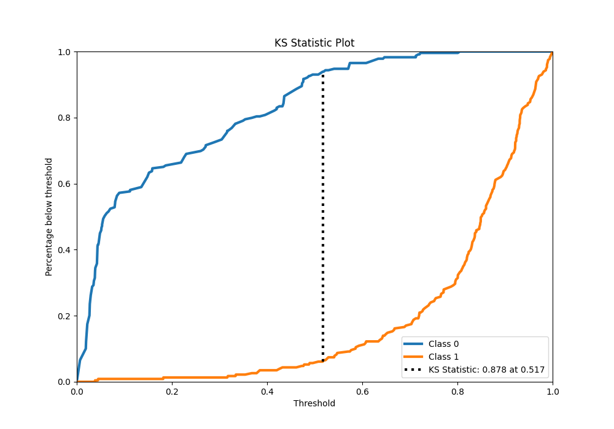
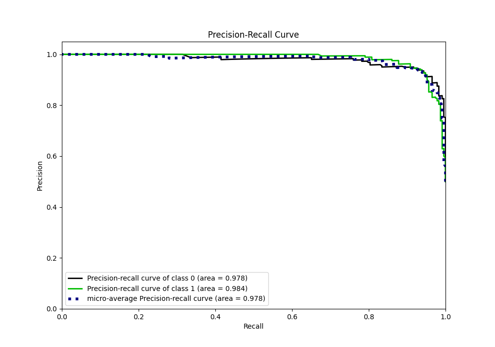
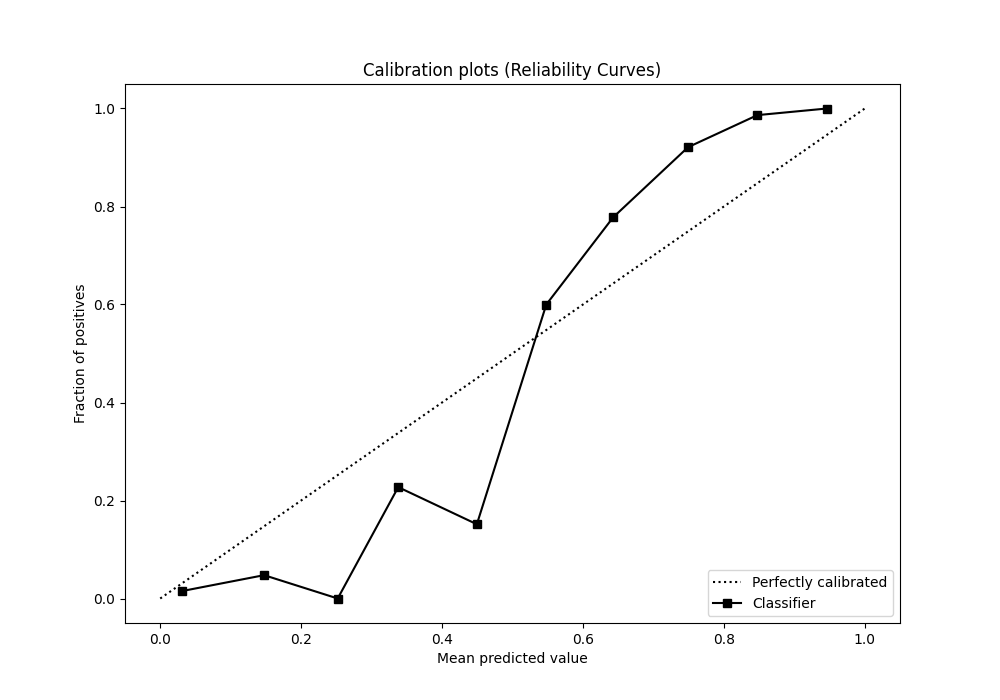
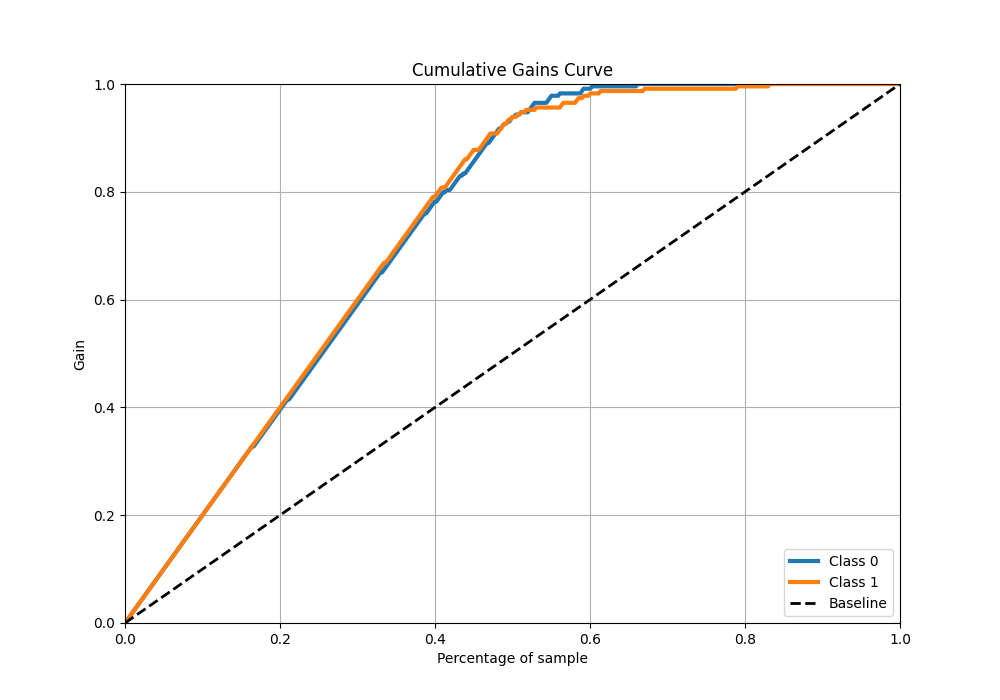
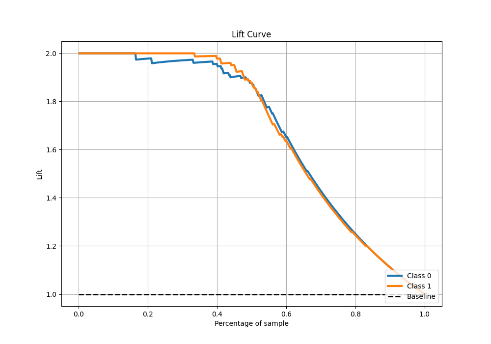

# Summary of 115_RandomForest

[<< Go back](../README.md)

## Random Forest
- **n_jobs**: -1
- **criterion**: entropy
- **max_features**: 0.5
- **min_samples_split**: 30
- **max_depth**: 4
- **eval_metric_name**: auc
- **explain_level**: 0

## Validation
 - **validation_type**: kfold
 - **shuffle**: True
 - **stratify**: True
 - **k_folds**: 5

## Optimized metric
auc

## Training time

31.3 seconds

## Metric details
|           |    score |    threshold |
|:----------|---------:|-------------:|
| logloss   | 0.239818 | nan          |
| auc       | 0.980731 | nan          |
| f1        | 0.938865 |   0.517823   |
| accuracy  | 0.938865 |   0.517823   |
| precision | 1        |   0.806538   |
| recall    | 1        |   0.00613646 |
| mcc       | 0.877729 |   0.517823   |

## Metric details with threshold from accuracy metric
|           |    score |   threshold |
|:----------|---------:|------------:|
| logloss   | 0.239818 |  nan        |
| auc       | 0.980731 |  nan        |
| f1        | 0.938865 |    0.517823 |
| accuracy  | 0.938865 |    0.517823 |
| precision | 0.938865 |    0.517823 |
| recall    | 0.938865 |    0.517823 |
| mcc       | 0.877729 |    0.517823 |

## Confusion matrix (at threshold=0.517823)
|              |   Predicted as 0 |   Predicted as 1 |
|:-------------|-----------------:|-----------------:|
| Labeled as 0 |              215 |               14 |
| Labeled as 1 |               14 |              215 |

## Learning curves

## Confusion Matrix

## Normalized Confusion Matrix

## ROC Curve

## Kolmogorov-Smirnov Statistic

## Precision-Recall Curve

## Calibration Curve

## Cumulative Gains Curve

## Lift Curve

[<< Go back](../README.md)
