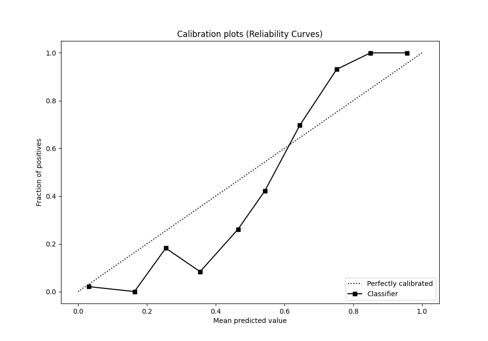

# Summary of 119_RandomForest

[<< Go back](../README.md)

## Random Forest
- **n_jobs**: -1
- **criterion**: entropy
- **max_features**: 0.6
- **min_samples_split**: 30
- **max_depth**: 4
- **eval_metric_name**: auc
- **explain_level**: 0

## Validation
 - **validation_type**: kfold
 - **shuffle**: True
 - **stratify**: True
 - **k_folds**: 5

## Optimized metric
auc

## Training time

23.2 seconds

## Metric details
|           |    score |    threshold |
|:----------|---------:|-------------:|
| logloss   | 0.234132 | nan          |
| auc       | 0.980016 | nan          |
| f1        | 0.934498 |   0.530505   |
| accuracy  | 0.934498 |   0.530505   |
| precision | 1        |   0.762186   |
| recall    | 1        |   0.00886332 |
| mcc       | 0.873808 |   0.634636   |

## Metric details with threshold from accuracy metric
|           |    score |   threshold |
|:----------|---------:|------------:|
| logloss   | 0.234132 |  nan        |
| auc       | 0.980016 |  nan        |
| f1        | 0.934498 |    0.530505 |
| accuracy  | 0.934498 |    0.530505 |
| precision | 0.934498 |    0.530505 |
| recall    | 0.934498 |    0.530505 |
| mcc       | 0.868996 |    0.530505 |

## Confusion matrix (at threshold=0.530505)
|              |   Predicted as 0 |   Predicted as 1 |
|:-------------|-----------------:|-----------------:|
| Labeled as 0 |              214 |               15 |
| Labeled as 1 |               15 |              214 |

## Learning curves

## Confusion Matrix

## Normalized Confusion Matrix

## ROC Curve

## Kolmogorov-Smirnov Statistic

## Precision-Recall Curve

## Calibration Curve

## Cumulative Gains Curve

## Lift Curve

[<< Go back](../README.md)
