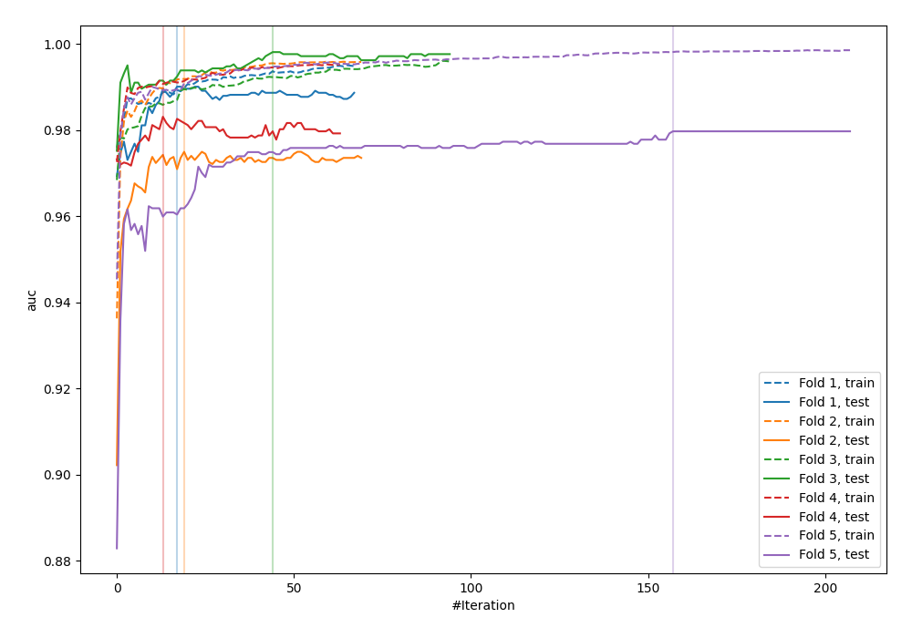
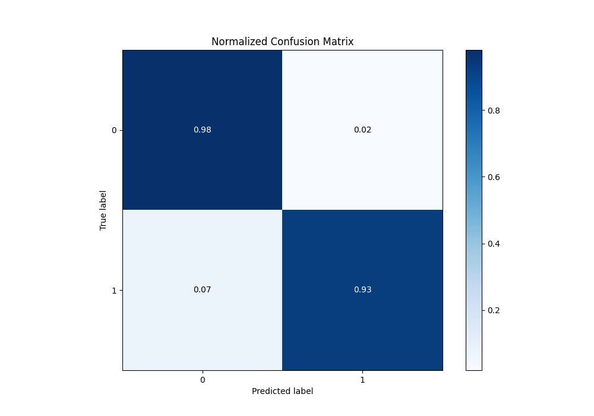
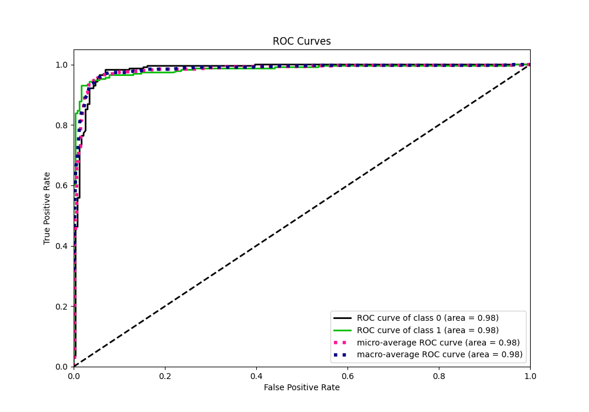
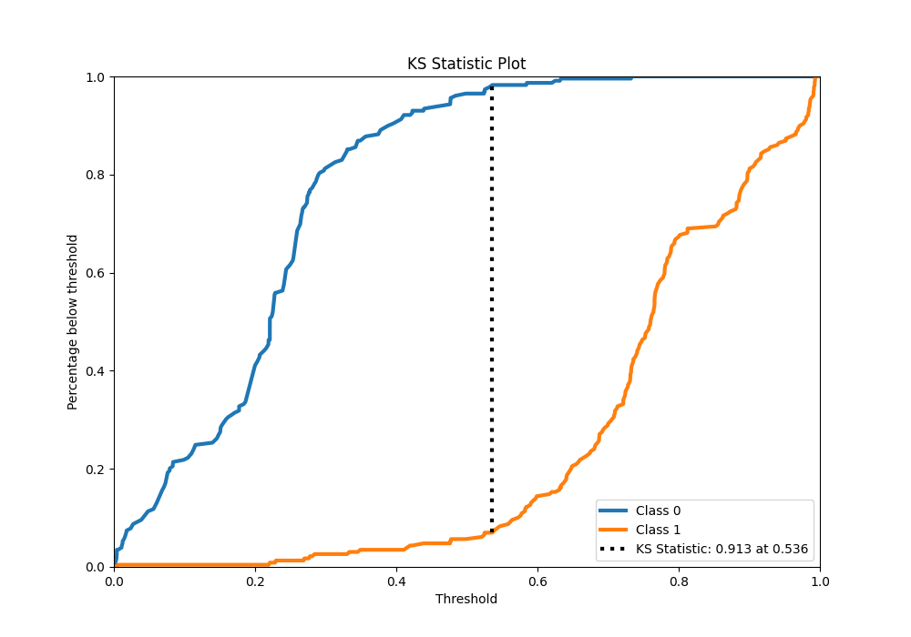
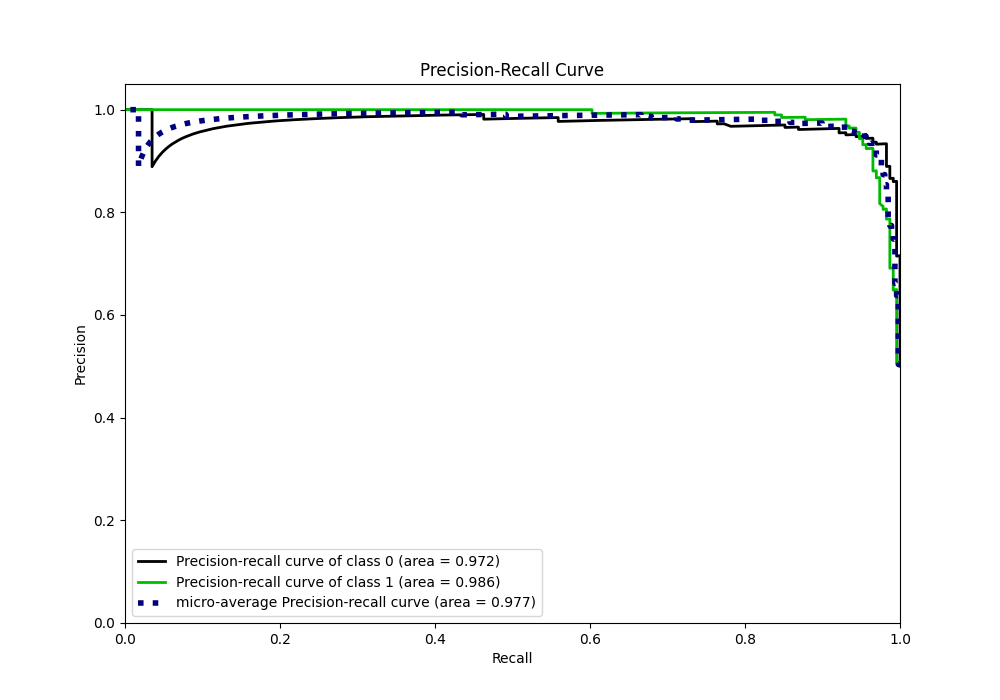
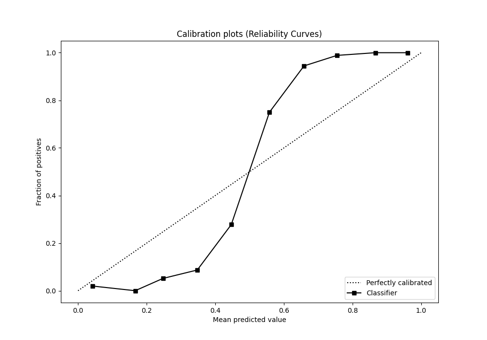
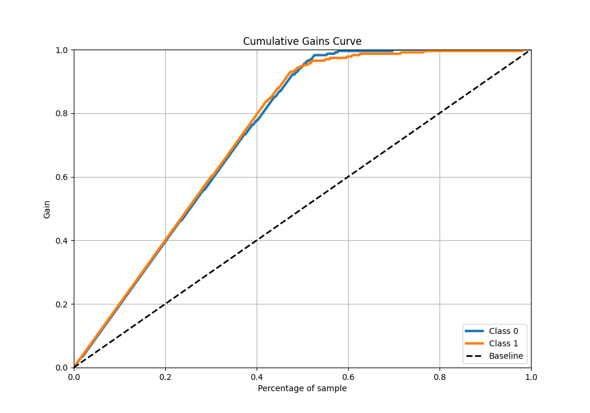
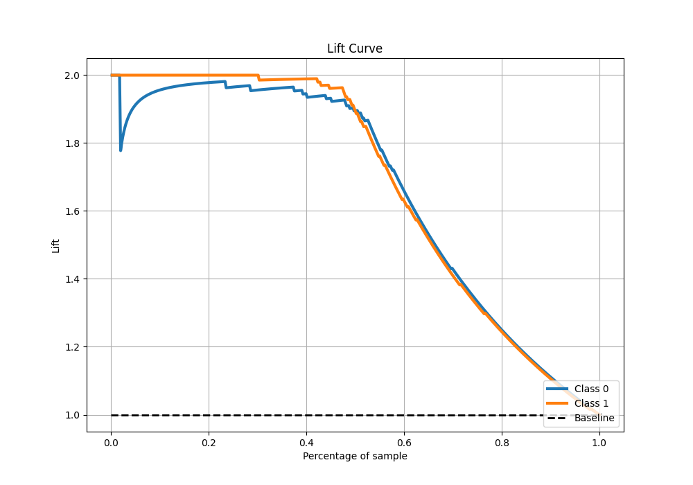

# Summary of 122_Xgboost

[<< Go back](../README.md)

## Extreme Gradient Boosting (Xgboost)
- **n_jobs**: -1
- **objective**: binary:logistic
- **eta**: 0.05
- **max_depth**: 8
- **min_child_weight**: 1
- **subsample**: 0.6
- **colsample_bytree**: 0.8
- **eval_metric**: auc
- **explain_level**: 0

## Validation
 - **validation_type**: kfold
 - **shuffle**: True
 - **stratify**: True
 - **k_folds**: 5

## Optimized metric
auc

## Training time

20.4 seconds

## Metric details
|           |    score |    threshold |
|:----------|---------:|-------------:|
| logloss   | 0.29593  | nan          |
| auc       | 0.982838 | nan          |
| f1        | 0.955157 |   0.537255   |
| accuracy  | 0.956332 |   0.537255   |
| precision | 1        |   0.733026   |
| recall    | 1        |   0.00270423 |
| mcc       | 0.913919 |   0.537255   |

## Metric details with threshold from accuracy metric
|           |    score |   threshold |
|:----------|---------:|------------:|
| logloss   | 0.29593  |  nan        |
| auc       | 0.982838 |  nan        |
| f1        | 0.955157 |    0.537255 |
| accuracy  | 0.956332 |    0.537255 |
| precision | 0.981567 |    0.537255 |
| recall    | 0.930131 |    0.537255 |
| mcc       | 0.913919 |    0.537255 |

## Confusion matrix (at threshold=0.537255)
|              |   Predicted as 0 |   Predicted as 1 |
|:-------------|-----------------:|-----------------:|
| Labeled as 0 |              225 |                4 |
| Labeled as 1 |               16 |              213 |

## Learning curves

## Confusion Matrix

## Normalized Confusion Matrix

## ROC Curve

## Kolmogorov-Smirnov Statistic

## Precision-Recall Curve

## Calibration Curve

## Cumulative Gains Curve

## Lift Curve

[<< Go back](../README.md)
