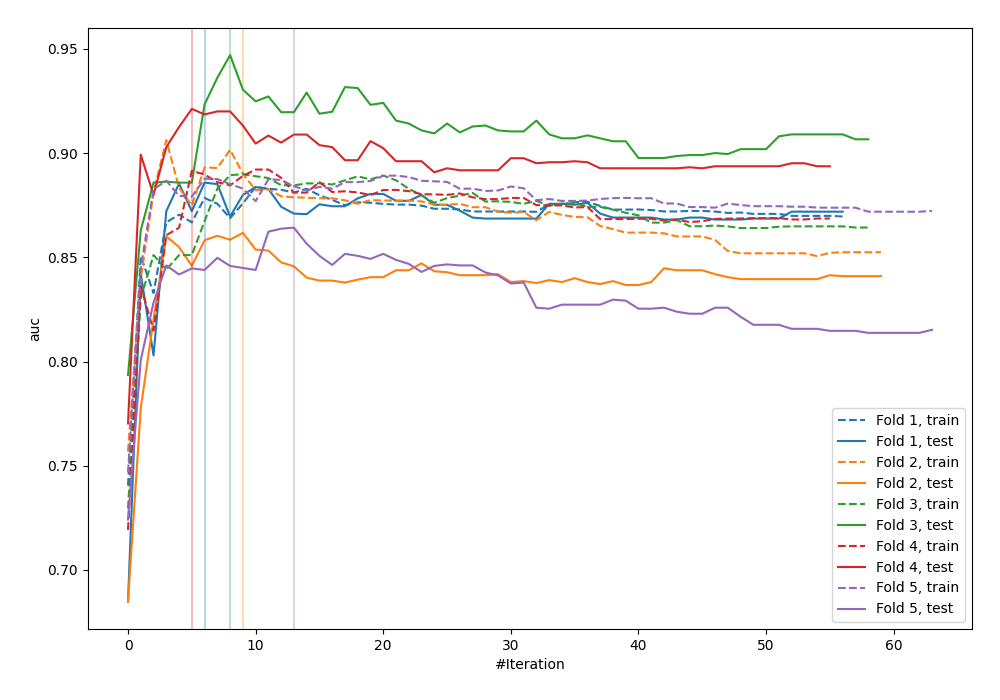
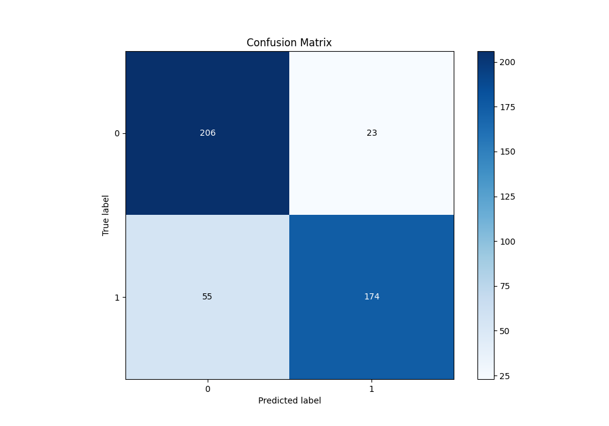
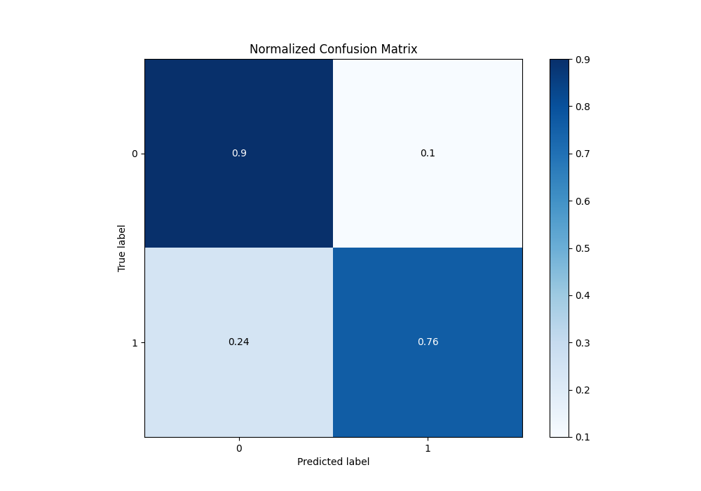
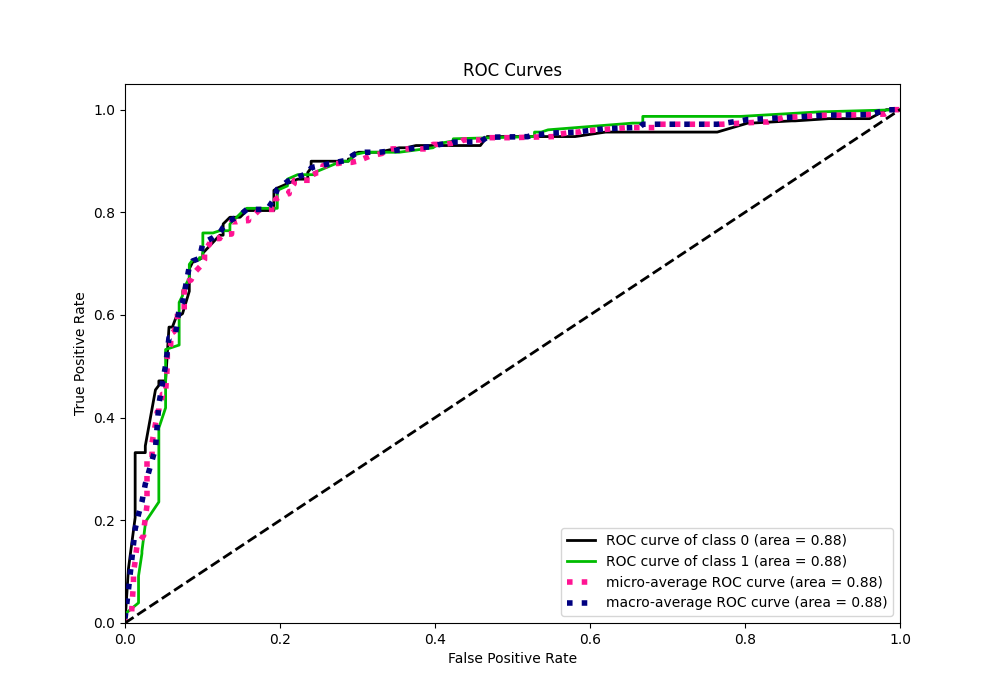
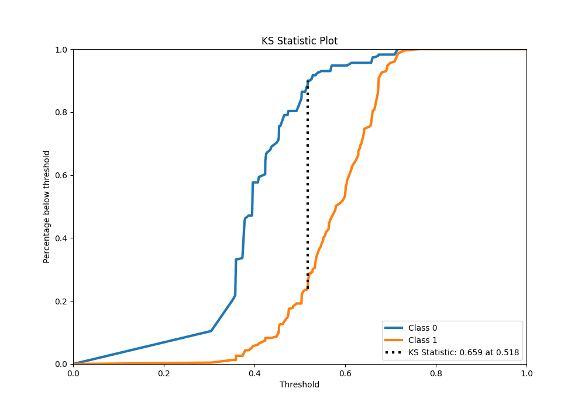
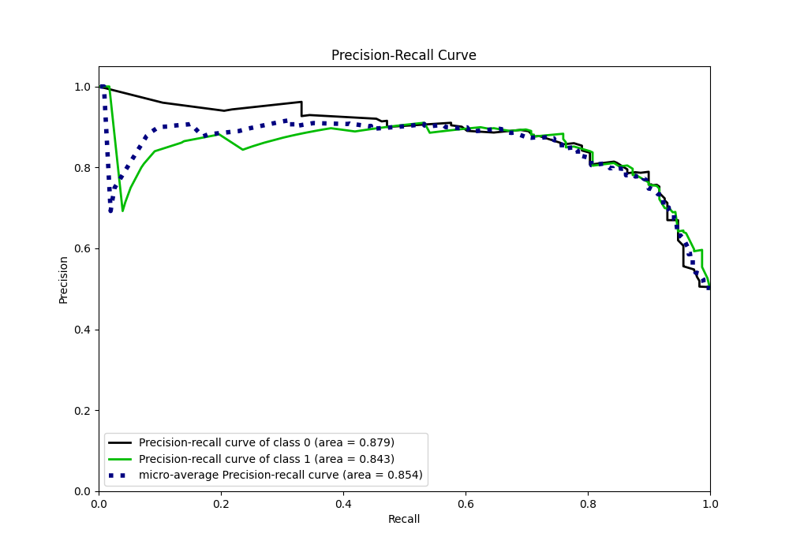
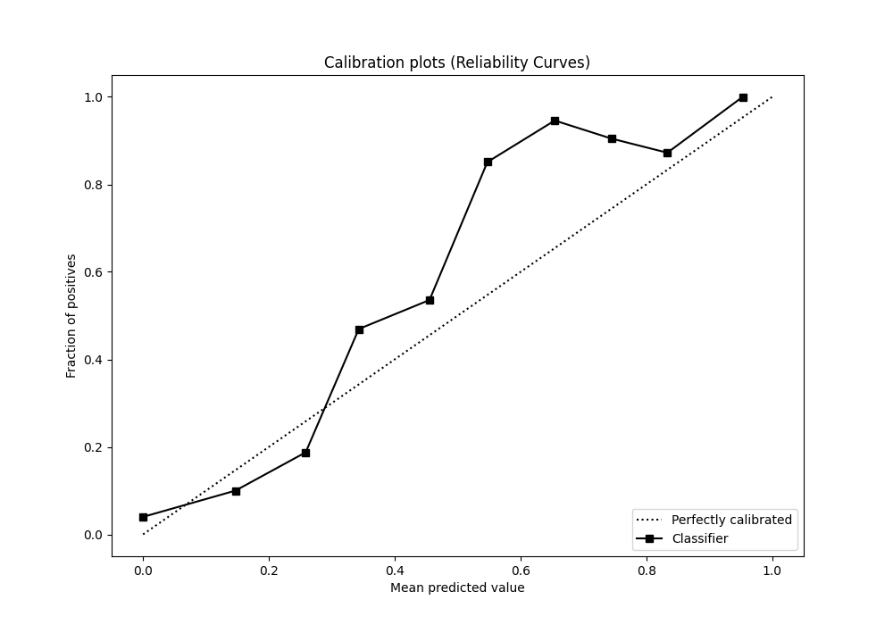
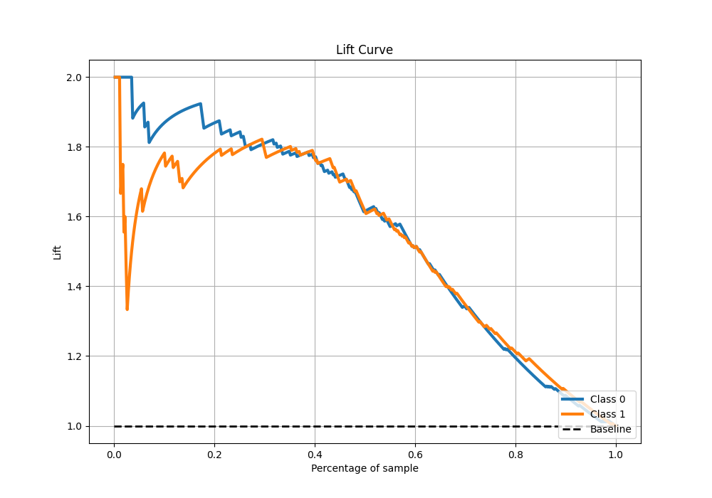

# Summary of 17_Xgboost

[<< Go back](../README.md)

## Extreme Gradient Boosting (Xgboost)
- **n_jobs**: -1
- **objective**: binary:logistic
- **eta**: 0.1
- **max_depth**: 4
- **min_child_weight**: 25
- **subsample**: 0.7
- **colsample_bytree**: 0.7
- **eval_metric**: auc
- **explain_level**: 0

## Validation
 - **validation_type**: kfold
 - **shuffle**: True
 - **stratify**: True
 - **k_folds**: 5

## Optimized metric
auc

## Training time

8.0 seconds

## Metric details
|           |    score |   threshold |
|:----------|---------:|------------:|
| logloss   | 0.561523 |  nan        |
| auc       | 0.883316 |  nan        |
| f1        | 0.833684 |    0.465664 |
| accuracy  | 0.829694 |    0.51792  |
| precision | 0.910448 |    0.570292 |
| recall    | 1        |    0.274072 |
| mcc       | 0.665922 |    0.51792  |

## Metric details with threshold from accuracy metric
|           |    score |   threshold |
|:----------|---------:|------------:|
| logloss   | 0.561523 |   nan       |
| auc       | 0.883316 |   nan       |
| f1        | 0.816901 |     0.51792 |
| accuracy  | 0.829694 |     0.51792 |
| precision | 0.883249 |     0.51792 |
| recall    | 0.759825 |     0.51792 |
| mcc       | 0.665922 |     0.51792 |

## Confusion matrix (at threshold=0.51792)
|              |   Predicted as 0 |   Predicted as 1 |
|:-------------|-----------------:|-----------------:|
| Labeled as 0 |              206 |               23 |
| Labeled as 1 |               55 |              174 |

## Learning curves

## Confusion Matrix

## Normalized Confusion Matrix

## ROC Curve

## Kolmogorov-Smirnov Statistic

## Precision-Recall Curve

## Calibration Curve

## Cumulative Gains Curve

## Lift Curve

[<< Go back](../README.md)
