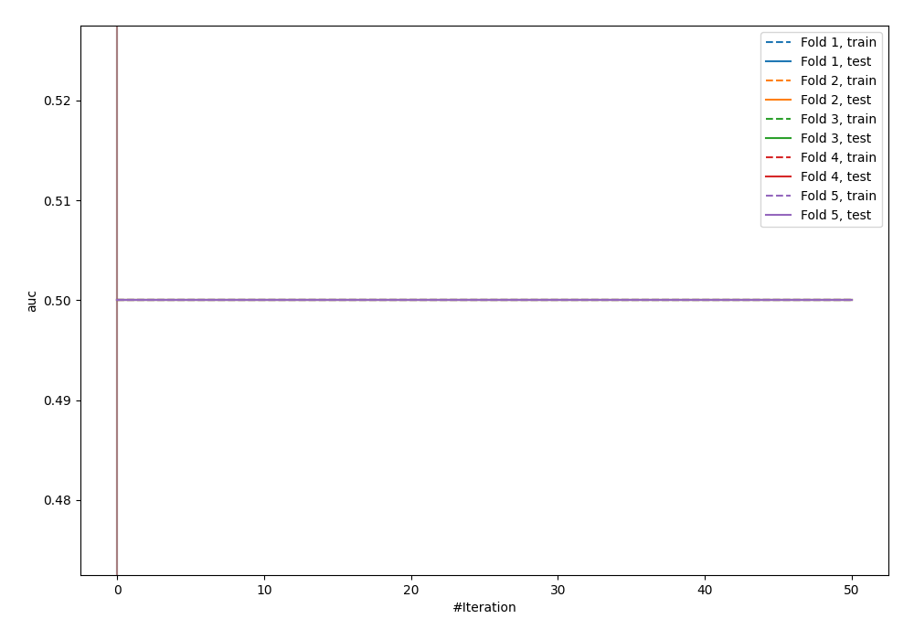
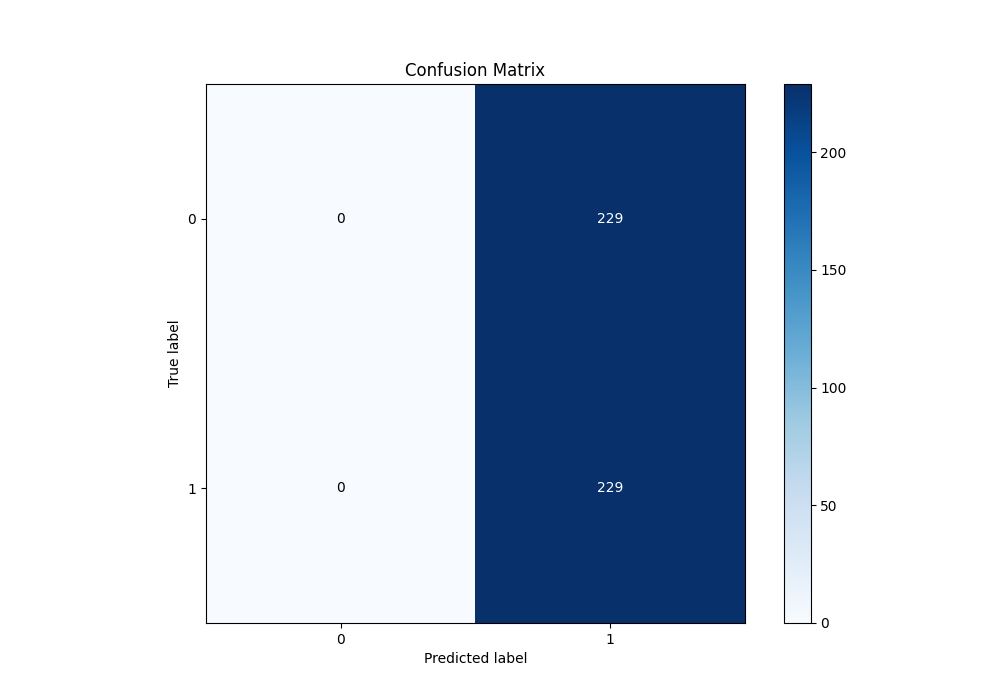
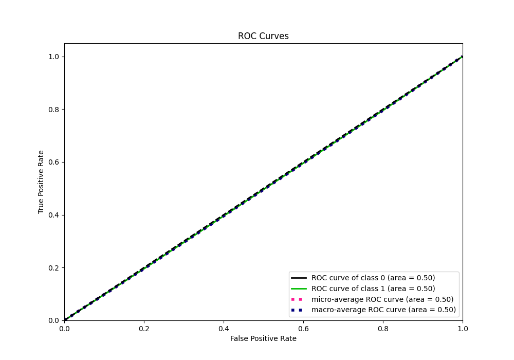
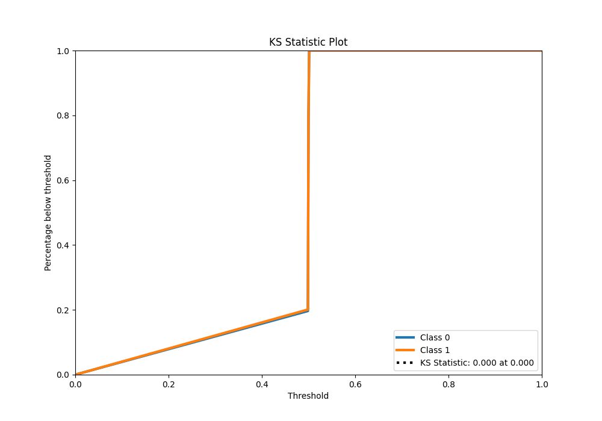
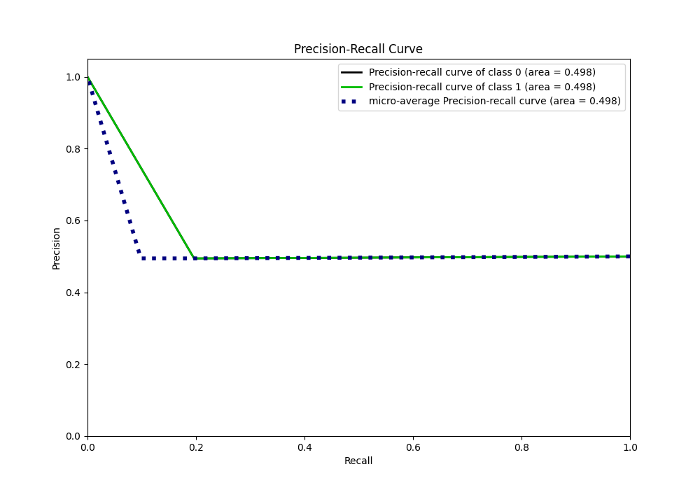
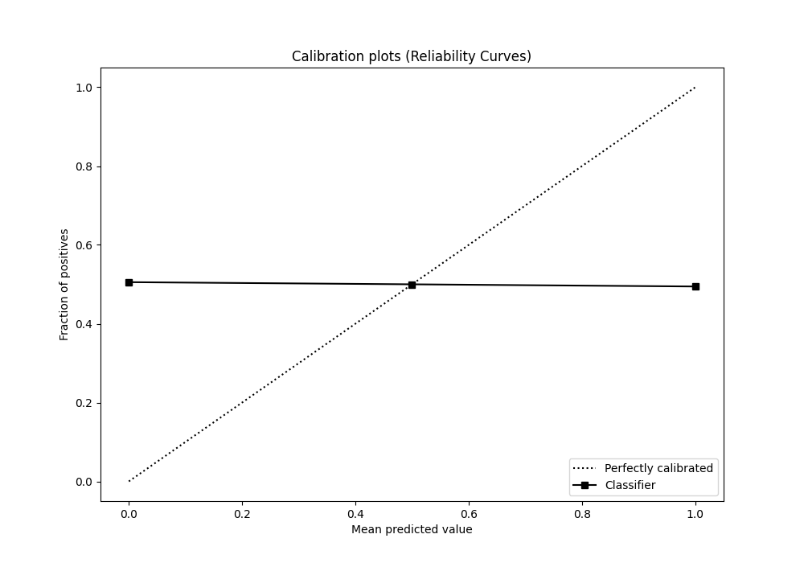
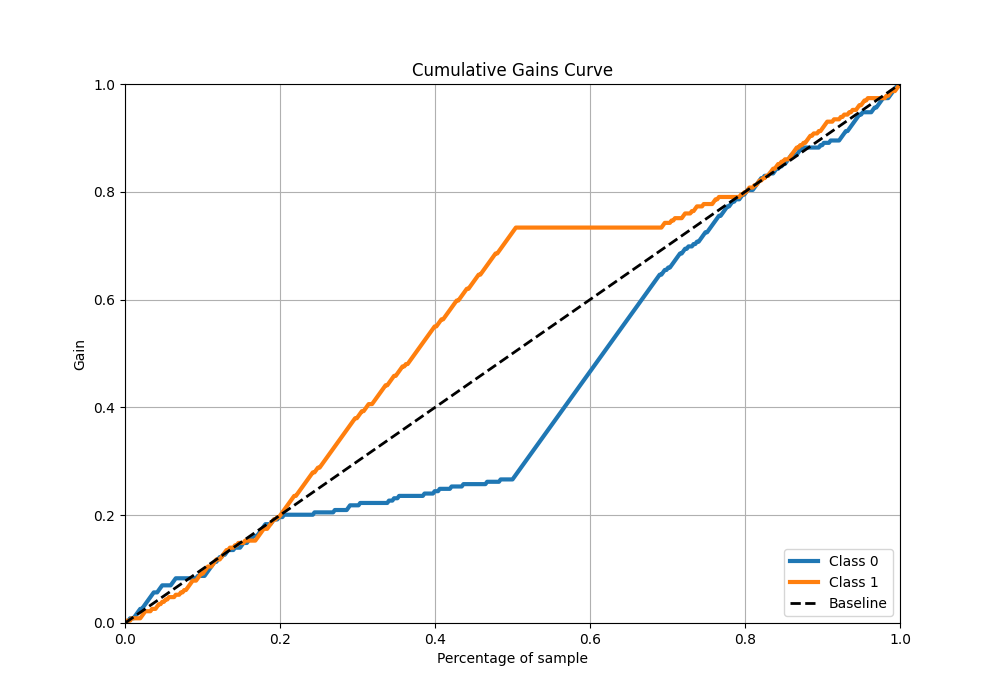
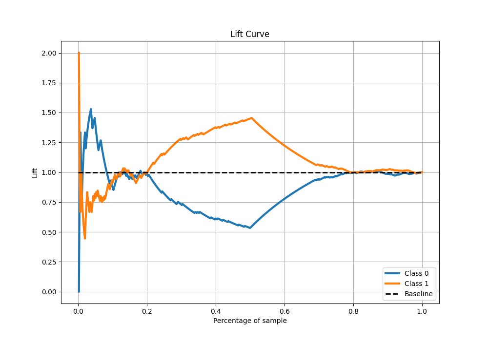

# Summary of 19_Xgboost

[<< Go back](../README.md)

## Extreme Gradient Boosting (Xgboost)
- **n_jobs**: -1
- **objective**: binary:logistic
- **eta**: 0.1
- **max_depth**: 7
- **min_child_weight**: 50
- **subsample**: 1.0
- **colsample_bytree**: 1.0
- **eval_metric**: auc
- **explain_level**: 0

## Validation
 - **validation_type**: kfold
 - **shuffle**: True
 - **stratify**: True
 - **k_folds**: 5

## Optimized metric
auc

## Training time

9.5 seconds

## Metric details
|           |    score |   threshold |
|:----------|---------:|------------:|
| logloss   | 0.693161 |  nan        |
| auc       | 0.496501 |  nan        |
| f1        | 0.666667 |    0.448774 |
| accuracy  | 0.5      |    0.448774 |
| precision | 0.5      |    0.448774 |
| recall    | 1        |    0.448774 |
| mcc       | 0        |    0.448774 |

## Metric details with threshold from accuracy metric
|           |    score |   threshold |
|:----------|---------:|------------:|
| logloss   | 0.693161 |  nan        |
| auc       | 0.496501 |  nan        |
| f1        | 0.666667 |    0.448774 |
| accuracy  | 0.5      |    0.448774 |
| precision | 0.5      |    0.448774 |
| recall    | 1        |    0.448774 |
| mcc       | 0        |    0.448774 |

## Confusion matrix (at threshold=0.448774)
|              |   Predicted as 0 |   Predicted as 1 |
|:-------------|-----------------:|-----------------:|
| Labeled as 0 |                0 |              229 |
| Labeled as 1 |                0 |              229 |

## Learning curves

## Confusion Matrix

## Normalized Confusion Matrix

## ROC Curve

## Kolmogorov-Smirnov Statistic

## Precision-Recall Curve

## Calibration Curve

## Cumulative Gains Curve

## Lift Curve

[<< Go back](../README.md)
