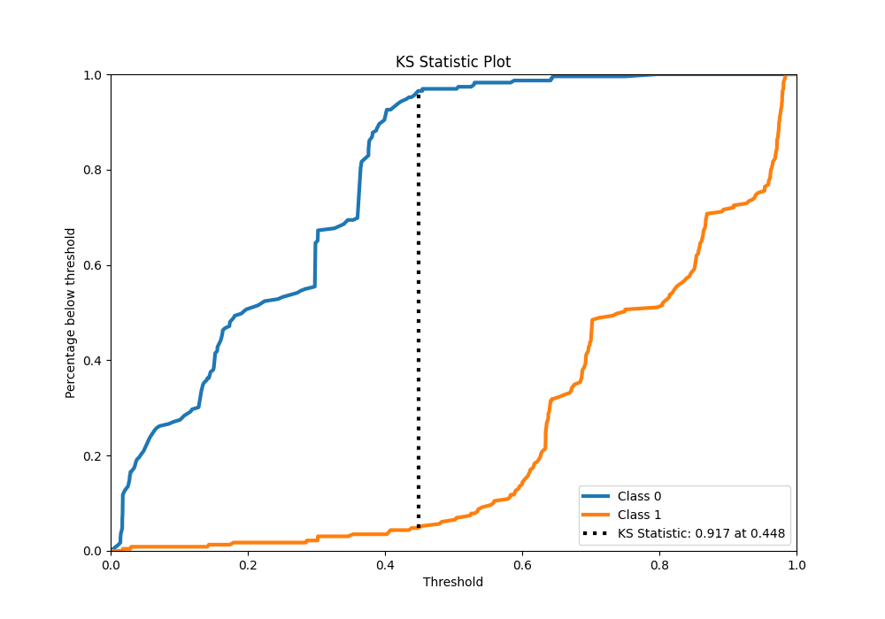

# Summary of 20_Xgboost

[<< Go back](../README.md)

## Extreme Gradient Boosting (Xgboost)
- **n_jobs**: -1
- **objective**: binary:logistic
- **eta**: 0.05
- **max_depth**: 7
- **min_child_weight**: 1
- **subsample**: 0.9
- **colsample_bytree**: 0.9
- **eval_metric**: auc
- **explain_level**: 0

## Validation
 - **validation_type**: kfold
 - **shuffle**: True
 - **stratify**: True
 - **k_folds**: 5

## Optimized metric
auc

## Training time

11.0 seconds

## Metric details
|           |    score |   threshold |
|:----------|---------:|------------:|
| logloss   | 0.303614 | nan         |
| auc       | 0.975277 | nan         |
| f1        | 0.955947 |   0.454543  |
| accuracy  | 0.956332 |   0.454543  |
| precision | 1        |   0.796223  |
| recall    | 1        |   0.0102689 |
| mcc       | 0.912803 |   0.454543  |

## Metric details with threshold from accuracy metric
|           |    score |   threshold |
|:----------|---------:|------------:|
| logloss   | 0.303614 |  nan        |
| auc       | 0.975277 |  nan        |
| f1        | 0.955947 |    0.454543 |
| accuracy  | 0.956332 |    0.454543 |
| precision | 0.964444 |    0.454543 |
| recall    | 0.947598 |    0.454543 |
| mcc       | 0.912803 |    0.454543 |

## Confusion matrix (at threshold=0.454543)
|              |   Predicted as 0 |   Predicted as 1 |
|:-------------|-----------------:|-----------------:|
| Labeled as 0 |              221 |                8 |
| Labeled as 1 |               12 |              217 |

## Learning curves

## Confusion Matrix

## Normalized Confusion Matrix

## ROC Curve

## Kolmogorov-Smirnov Statistic

## Precision-Recall Curve

## Calibration Curve

## Cumulative Gains Curve

## Lift Curve

[<< Go back](../README.md)
