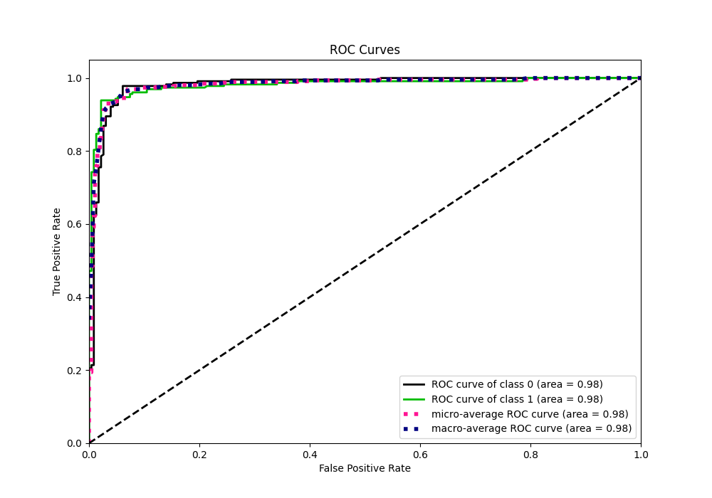

# Summary of 21_LightGBM

[<< Go back](../README.md)

## LightGBM
- **n_jobs**: -1
- **objective**: binary
- **num_leaves**: 15
- **learning_rate**: 0.05
- **feature_fraction**: 0.8
- **bagging_fraction**: 0.5
- **min_data_in_leaf**: 50
- **metric**: auc
- **custom_eval_metric_name**: None
- **explain_level**: 0

## Validation
 - **validation_type**: kfold
 - **shuffle**: True
 - **stratify**: True
 - **k_folds**: 5

## Optimized metric
auc

## Training time

4.5 seconds

## Metric details
|           |    score |    threshold |
|:----------|---------:|-------------:|
| logloss   | 0.200862 | nan          |
| auc       | 0.980817 | nan          |
| f1        | 0.955556 |   0.556621   |
| accuracy  | 0.956332 |   0.556621   |
| precision | 1        |   0.928601   |
| recall    | 1        |   0.00397278 |
| mcc       | 0.913221 |   0.556621   |

## Metric details with threshold from accuracy metric
|           |    score |   threshold |
|:----------|---------:|------------:|
| logloss   | 0.200862 |  nan        |
| auc       | 0.980817 |  nan        |
| f1        | 0.955556 |    0.556621 |
| accuracy  | 0.956332 |    0.556621 |
| precision | 0.972851 |    0.556621 |
| recall    | 0.938865 |    0.556621 |
| mcc       | 0.913221 |    0.556621 |

## Confusion matrix (at threshold=0.556621)
|              |   Predicted as 0 |   Predicted as 1 |
|:-------------|-----------------:|-----------------:|
| Labeled as 0 |              223 |                6 |
| Labeled as 1 |               14 |              215 |

## Learning curves

## Confusion Matrix

## Normalized Confusion Matrix

## ROC Curve

## Kolmogorov-Smirnov Statistic

## Precision-Recall Curve

## Calibration Curve

## Cumulative Gains Curve

## Lift Curve

[<< Go back](../README.md)
