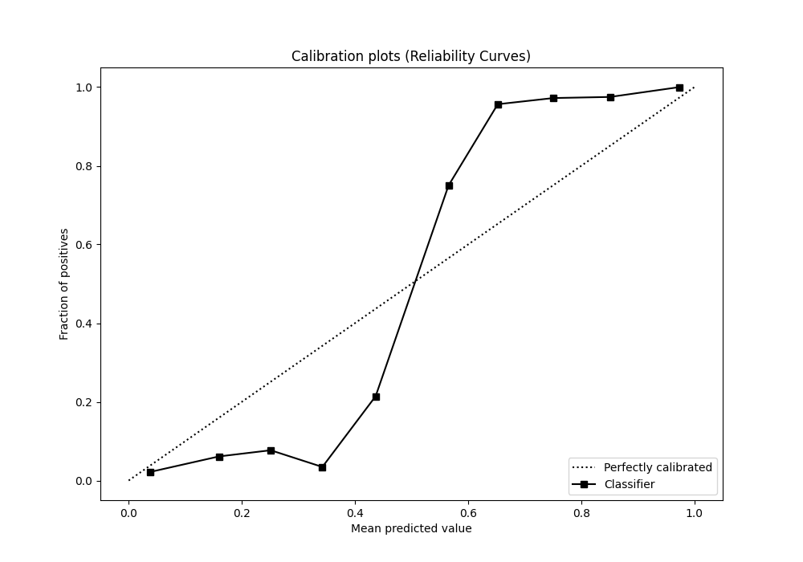

# Summary of 26_LightGBM

[<< Go back](../README.md)

## LightGBM
- **n_jobs**: -1
- **objective**: binary
- **num_leaves**: 127
- **learning_rate**: 0.05
- **feature_fraction**: 0.5
- **bagging_fraction**: 0.5
- **min_data_in_leaf**: 20
- **metric**: auc
- **custom_eval_metric_name**: None
- **explain_level**: 0

## Validation
 - **validation_type**: kfold
 - **shuffle**: True
 - **stratify**: True
 - **k_folds**: 5

## Optimized metric
auc

## Training time

8.6 seconds

## Metric details
|           |    score |     threshold |
|:----------|---------:|--------------:|
| logloss   | 0.267757 | nan           |
| auc       | 0.974714 | nan           |
| f1        | 0.951542 |   0.473667    |
| accuracy  | 0.951965 |   0.473667    |
| precision | 1        |   0.871529    |
| recall    | 1        |   0.000724296 |
| mcc       | 0.904482 |   0.49705     |

## Metric details with threshold from accuracy metric
|           |    score |   threshold |
|:----------|---------:|------------:|
| logloss   | 0.267757 |  nan        |
| auc       | 0.974714 |  nan        |
| f1        | 0.951542 |    0.473667 |
| accuracy  | 0.951965 |    0.473667 |
| precision | 0.96     |    0.473667 |
| recall    | 0.943231 |    0.473667 |
| mcc       | 0.904068 |    0.473667 |

## Confusion matrix (at threshold=0.473667)
|              |   Predicted as 0 |   Predicted as 1 |
|:-------------|-----------------:|-----------------:|
| Labeled as 0 |              220 |                9 |
| Labeled as 1 |               13 |              216 |

## Learning curves

## Confusion Matrix

## Normalized Confusion Matrix

## ROC Curve

## Kolmogorov-Smirnov Statistic

## Precision-Recall Curve

## Calibration Curve

## Cumulative Gains Curve

## Lift Curve

[<< Go back](../README.md)
