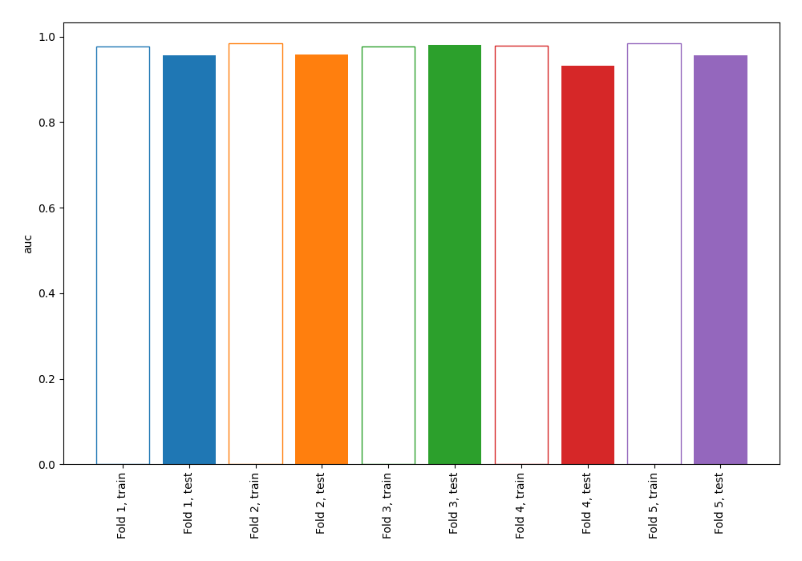
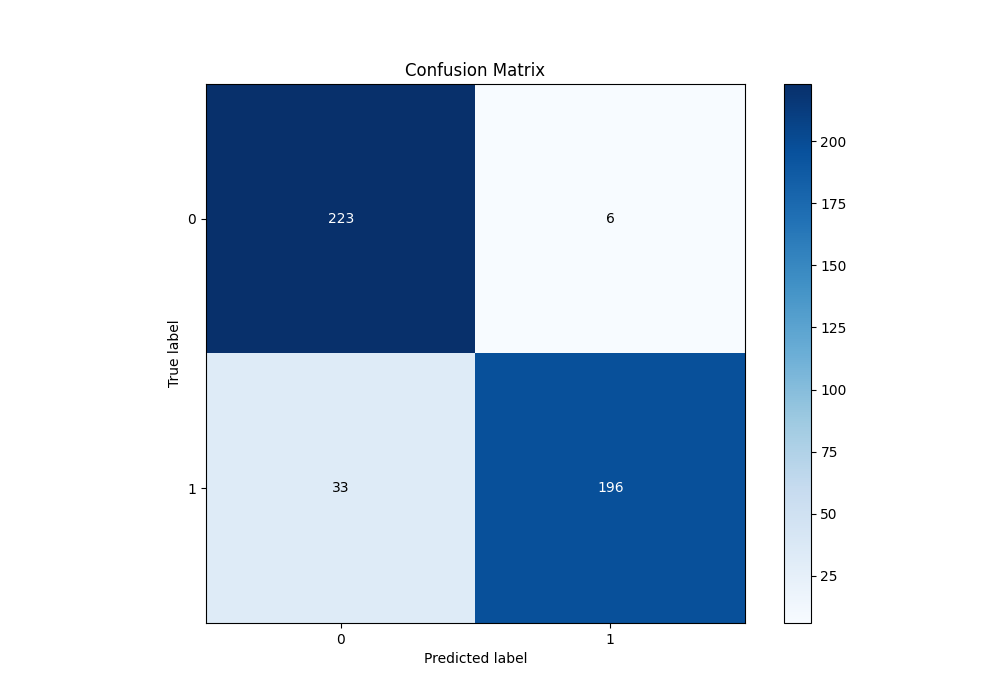
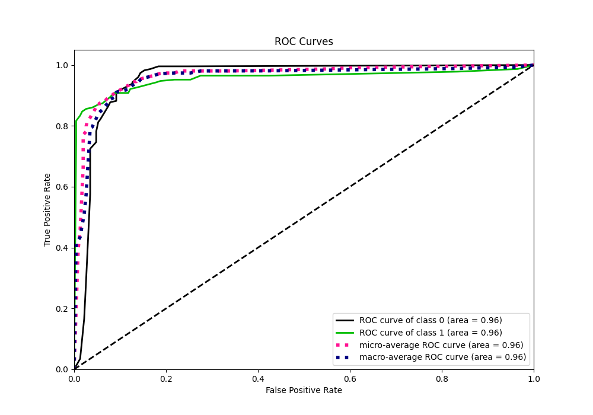
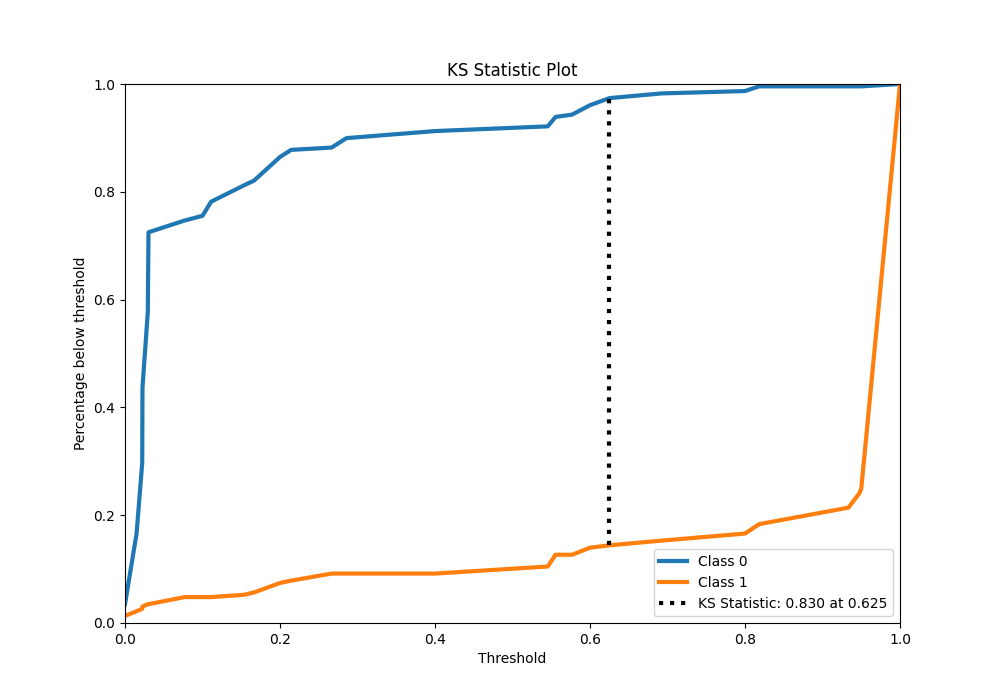
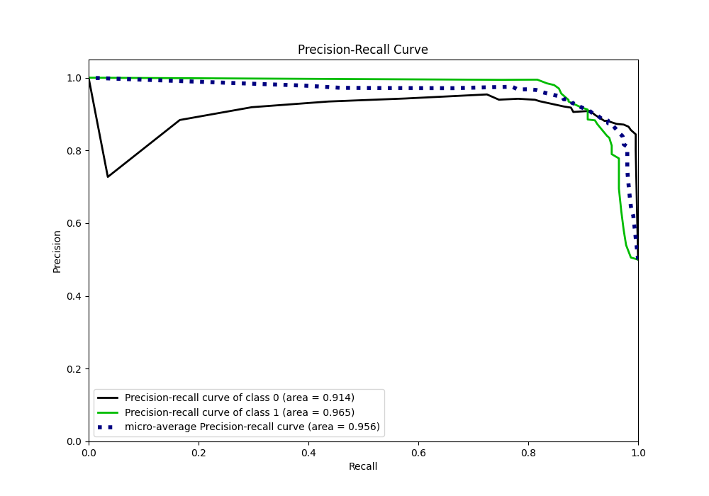
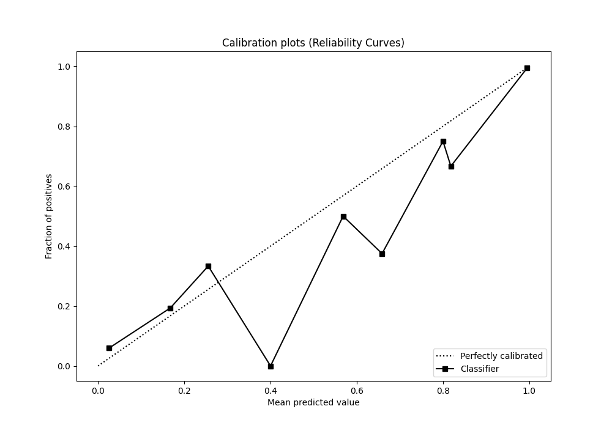
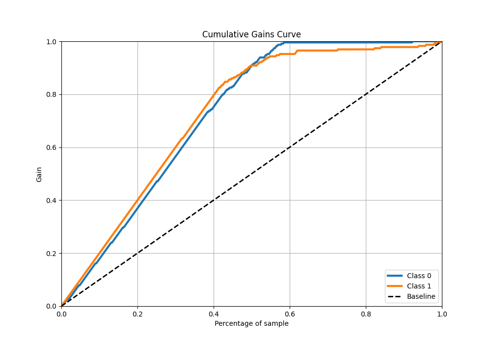
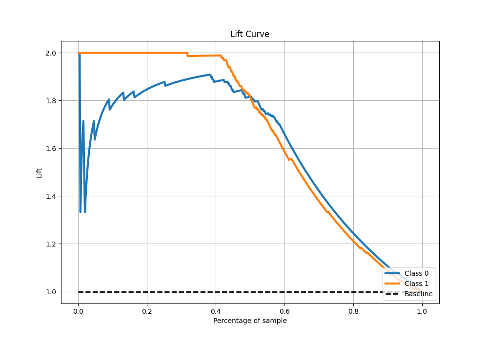

# Summary of 2_DecisionTree

[<< Go back](../README.md)

## Decision Tree
- **n_jobs**: -1
- **criterion**: gini
- **max_depth**: 4
- **explain_level**: 0

## Validation
 - **validation_type**: kfold
 - **shuffle**: True
 - **stratify**: True
 - **k_folds**: 5

## Optimized metric
auc

## Training time

2.9 seconds

## Metric details
|           |    score |   threshold |
|:----------|---------:|------------:|
| logloss   | 0.325327 |  nan        |
| auc       | 0.955111 |  nan        |
| f1        | 0.910284 |    0.4      |
| accuracy  | 0.914847 |    0.625    |
| precision | 0.994681 |    0.818182 |
| recall    | 0.9869   |    0        |
| mcc       | 0.837403 |    0.692308 |

## Metric details with threshold from accuracy metric
|           |    score |   threshold |
|:----------|---------:|------------:|
| logloss   | 0.325327 |     nan     |
| auc       | 0.955111 |     nan     |
| f1        | 0.909513 |       0.625 |
| accuracy  | 0.914847 |       0.625 |
| precision | 0.970297 |       0.625 |
| recall    | 0.855895 |       0.625 |
| mcc       | 0.835522 |       0.625 |

## Confusion matrix (at threshold=0.625)
|              |   Predicted as 0 |   Predicted as 1 |
|:-------------|-----------------:|-----------------:|
| Labeled as 0 |              223 |                6 |
| Labeled as 1 |               33 |              196 |

## Learning curves

## Confusion Matrix

## Normalized Confusion Matrix

## ROC Curve

## Kolmogorov-Smirnov Statistic

## Precision-Recall Curve

## Calibration Curve

## Cumulative Gains Curve

## Lift Curve

[<< Go back](../README.md)
