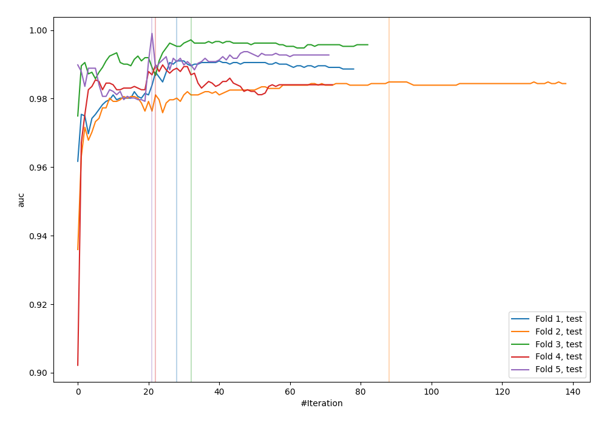
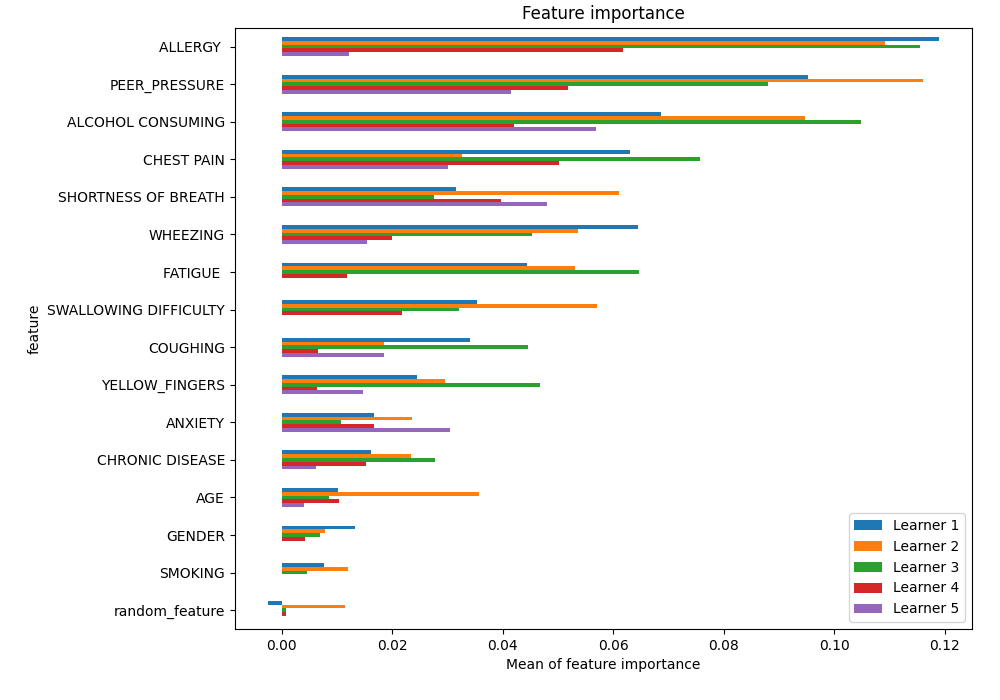
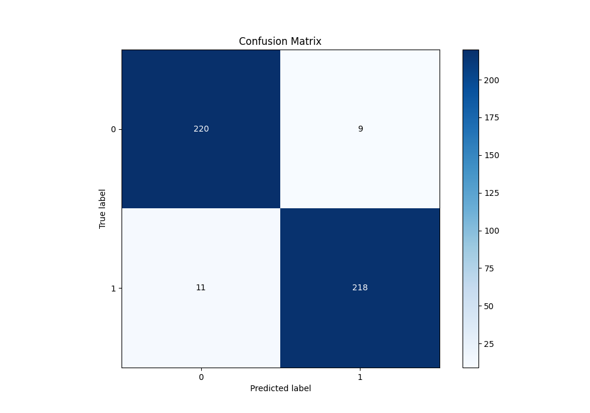
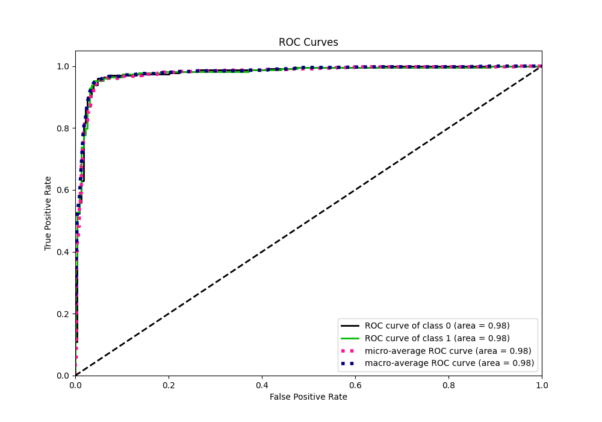
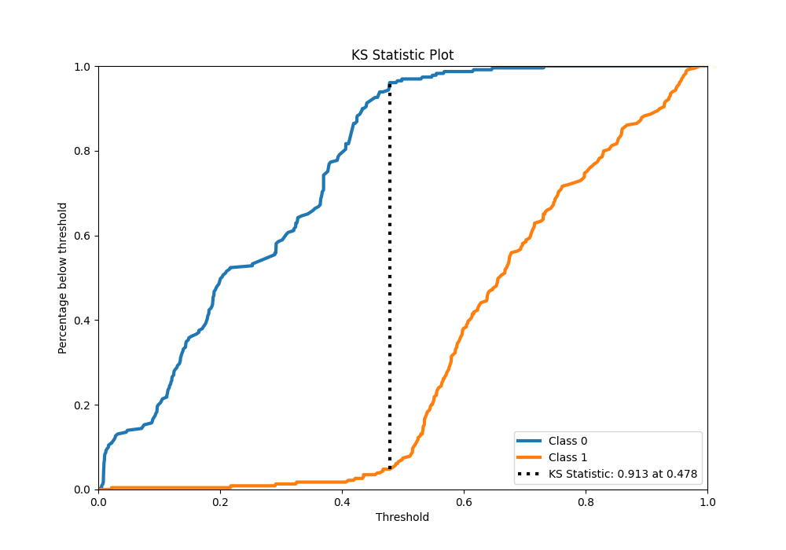
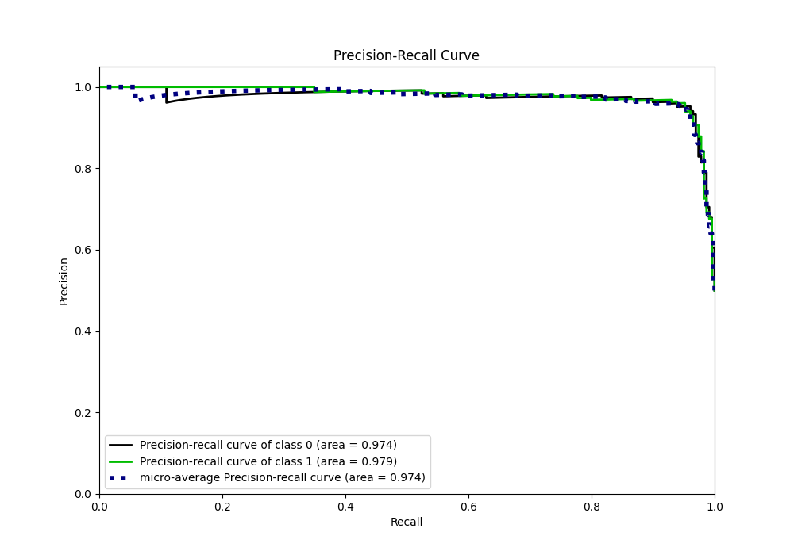
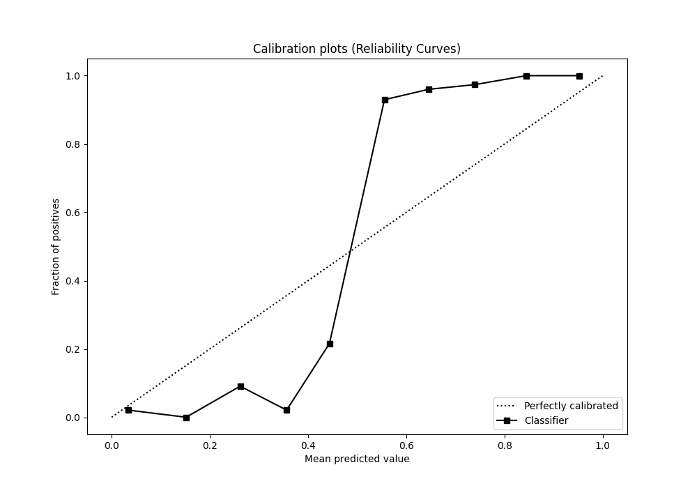
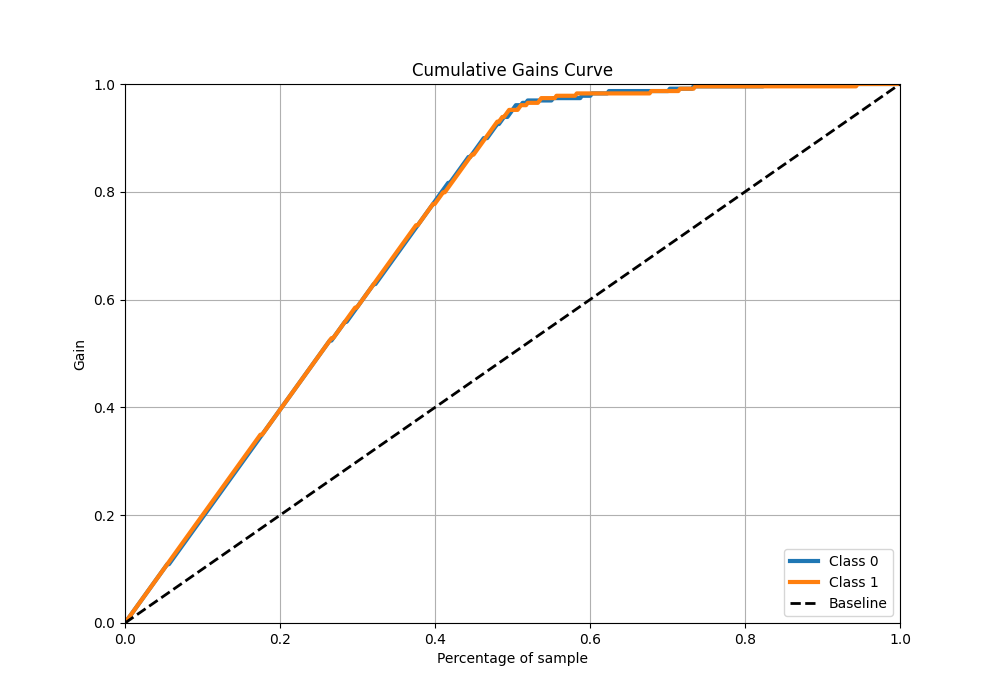
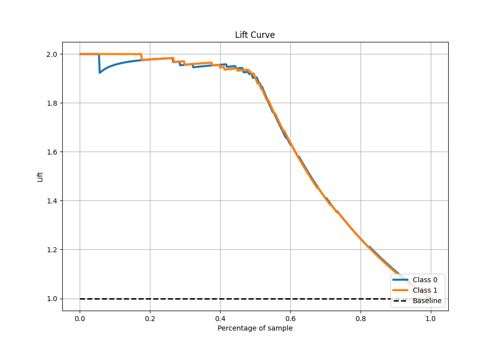

# Summary of 30_CatBoost_RandomFeature

[<< Go back](../README.md)

## CatBoost
- **n_jobs**: -1
- **learning_rate**: 0.05
- **depth**: 8
- **rsm**: 0.8
- **loss_function**: Logloss
- **eval_metric**: AUC
- **explain_level**: 1

## Validation
 - **validation_type**: kfold
 - **shuffle**: True
 - **stratify**: True
 - **k_folds**: 5

## Optimized metric
auc

## Training time

13.7 seconds

## Metric details
|           |    score |    threshold |
|:----------|---------:|-------------:|
| logloss   | 0.36415  | nan          |
| auc       | 0.978395 | nan          |
| f1        | 0.95614  |   0.478363   |
| accuracy  | 0.956332 |   0.478363   |
| precision | 1        |   0.743851   |
| recall    | 1        |   0.00491784 |
| mcc       | 0.912699 |   0.478363   |

## Metric details with threshold from accuracy metric
|           |    score |   threshold |
|:----------|---------:|------------:|
| logloss   | 0.36415  |  nan        |
| auc       | 0.978395 |  nan        |
| f1        | 0.95614  |    0.478363 |
| accuracy  | 0.956332 |    0.478363 |
| precision | 0.960352 |    0.478363 |
| recall    | 0.951965 |    0.478363 |
| mcc       | 0.912699 |    0.478363 |

## Confusion matrix (at threshold=0.478363)
|              |   Predicted as 0 |   Predicted as 1 |
|:-------------|-----------------:|-----------------:|
| Labeled as 0 |              220 |                9 |
| Labeled as 1 |               11 |              218 |

## Learning curves

## Permutation-based Importance

## Confusion Matrix

## Normalized Confusion Matrix

## ROC Curve

## Kolmogorov-Smirnov Statistic

## Precision-Recall Curve

## Calibration Curve

## Cumulative Gains Curve

## Lift Curve

[<< Go back](../README.md)
