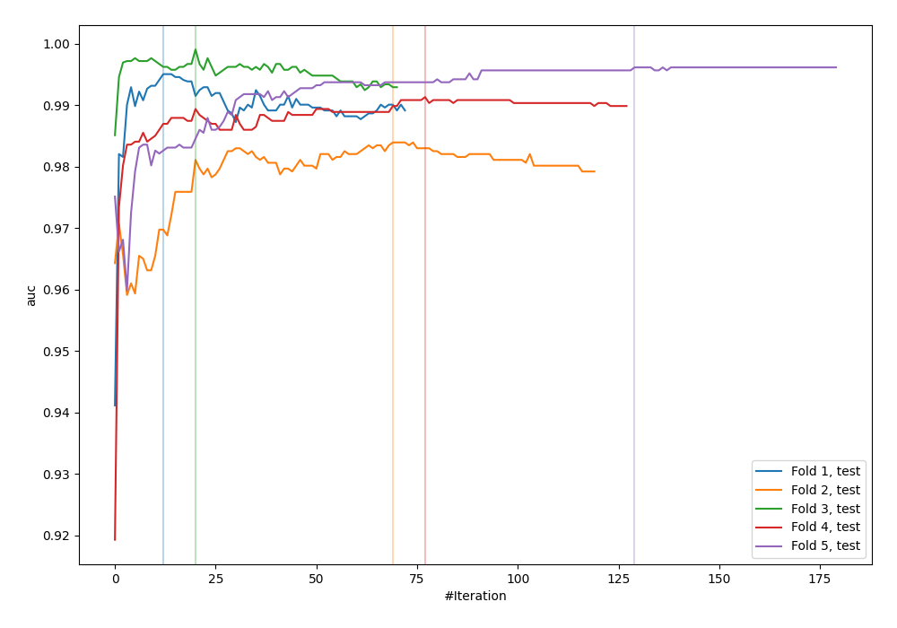
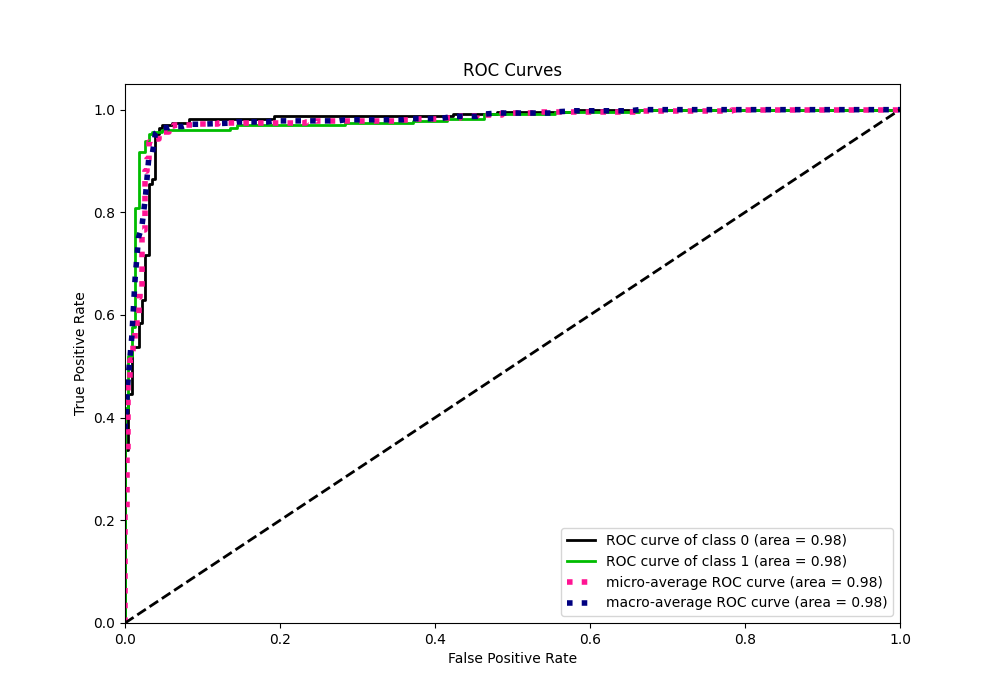
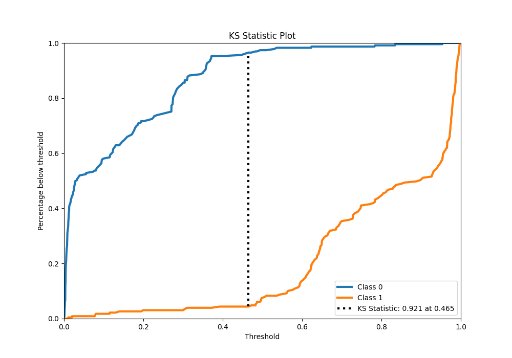
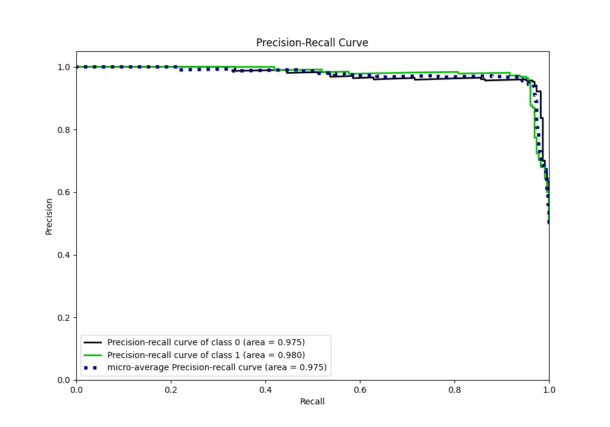
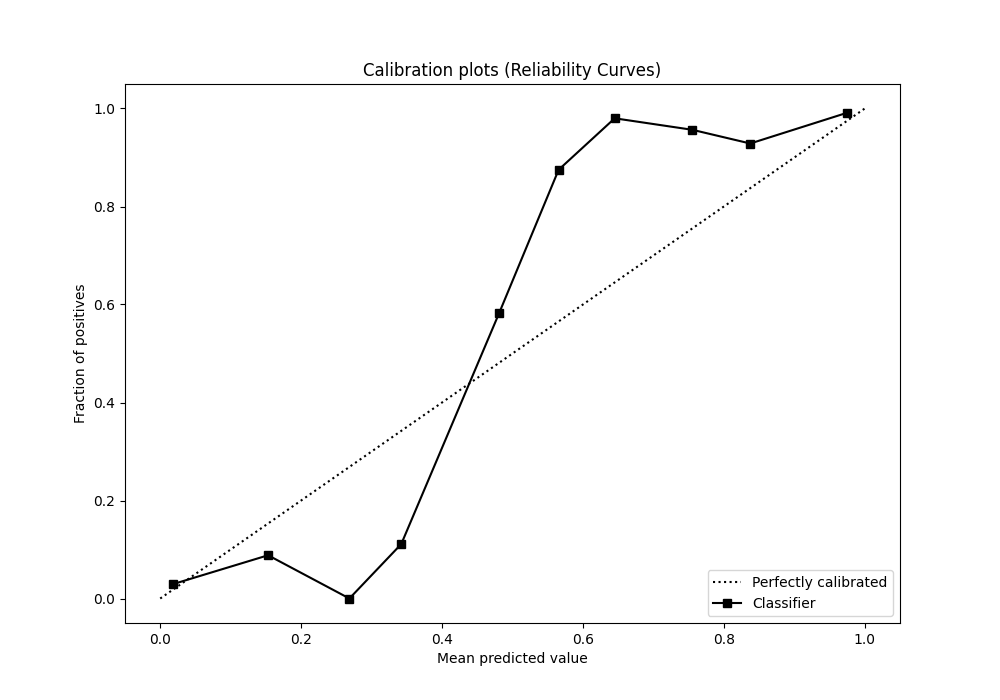
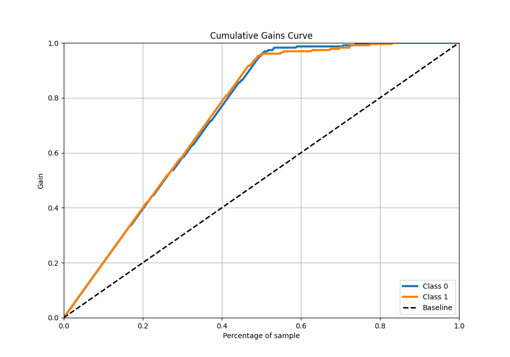
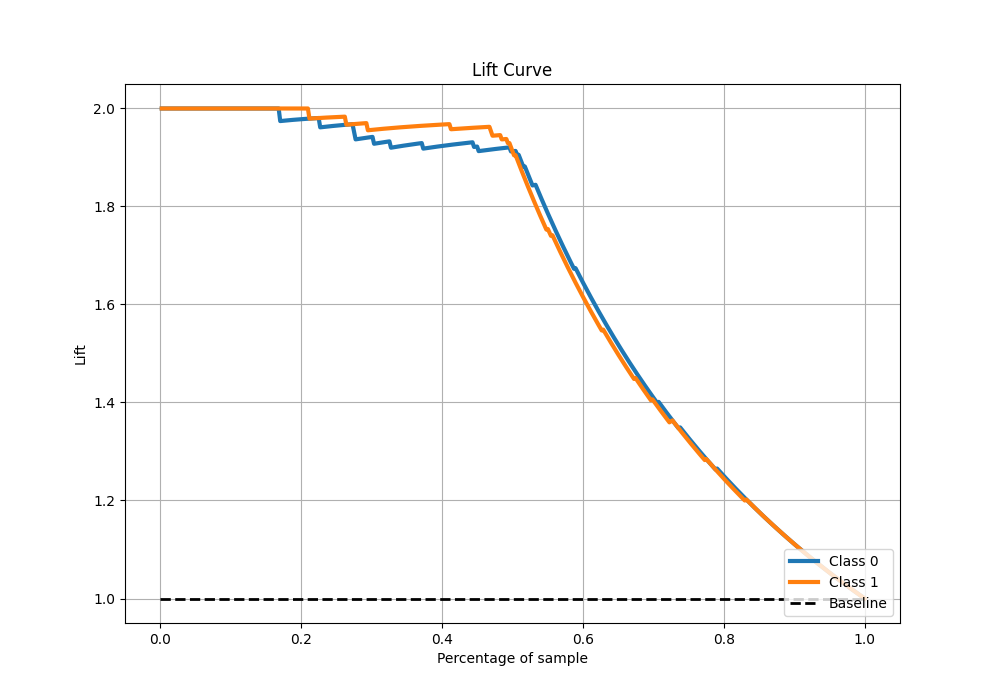

# Summary of 32_CatBoost

[<< Go back](../README.md)

## CatBoost
- **n_jobs**: -1
- **learning_rate**: 0.1
- **depth**: 7
- **rsm**: 1.0
- **loss_function**: Logloss
- **eval_metric**: AUC
- **explain_level**: 0

## Validation
 - **validation_type**: kfold
 - **shuffle**: True
 - **stratify**: True
 - **k_folds**: 5

## Optimized metric
auc

## Training time

8.1 seconds

## Metric details
|           |    score |     threshold |
|:----------|---------:|--------------:|
| logloss   | 0.235786 | nan           |
| auc       | 0.977537 | nan           |
| f1        | 0.960352 |   0.482843    |
| accuracy  | 0.960699 |   0.482843    |
| precision | 1        |   0.955013    |
| recall    | 1        |   0.000954883 |
| mcc       | 0.921538 |   0.482843    |

## Metric details with threshold from accuracy metric
|           |    score |   threshold |
|:----------|---------:|------------:|
| logloss   | 0.235786 |  nan        |
| auc       | 0.977537 |  nan        |
| f1        | 0.960352 |    0.482843 |
| accuracy  | 0.960699 |    0.482843 |
| precision | 0.968889 |    0.482843 |
| recall    | 0.951965 |    0.482843 |
| mcc       | 0.921538 |    0.482843 |

## Confusion matrix (at threshold=0.482843)
|              |   Predicted as 0 |   Predicted as 1 |
|:-------------|-----------------:|-----------------:|
| Labeled as 0 |              222 |                7 |
| Labeled as 1 |               11 |              218 |

## Learning curves

## Confusion Matrix

## Normalized Confusion Matrix

## ROC Curve

## Kolmogorov-Smirnov Statistic

## Precision-Recall Curve

## Calibration Curve

## Cumulative Gains Curve

## Lift Curve

[<< Go back](../README.md)
