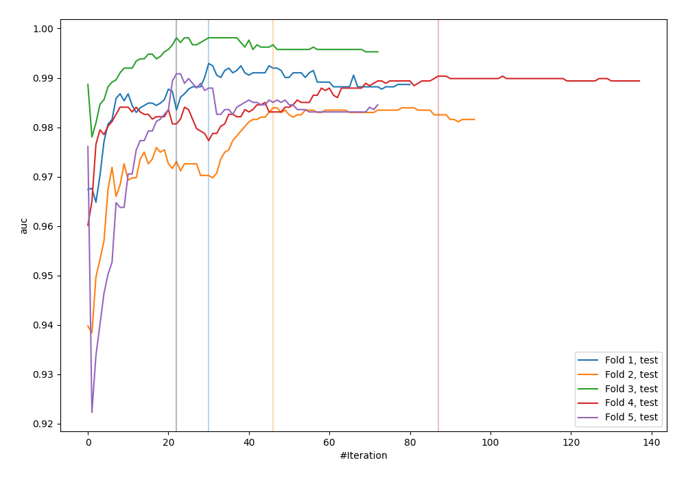
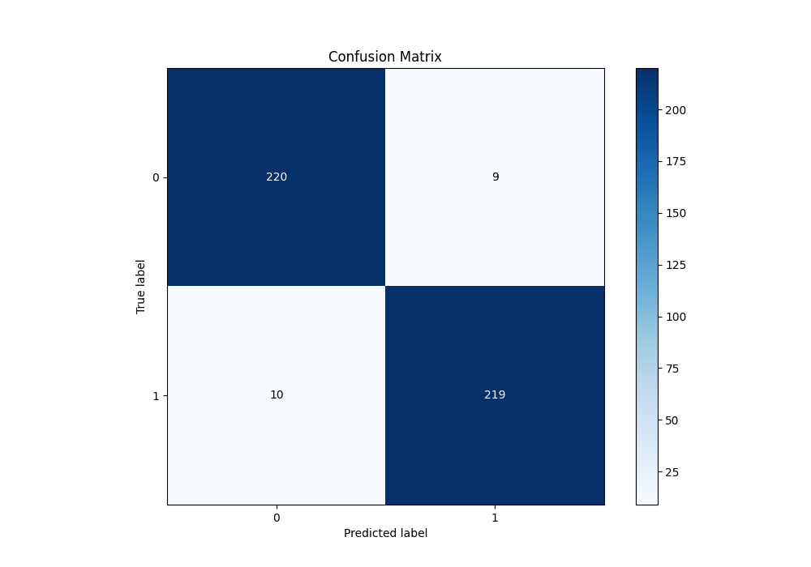
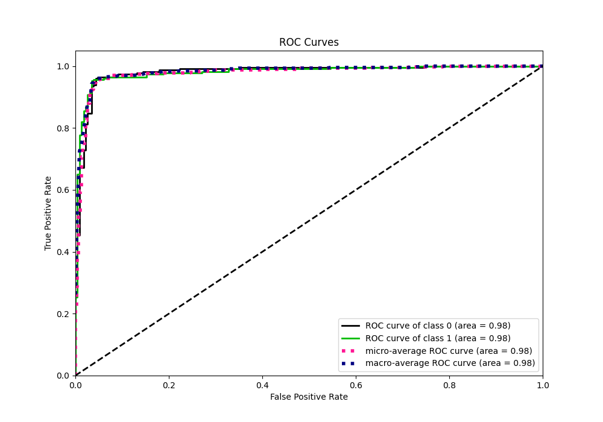
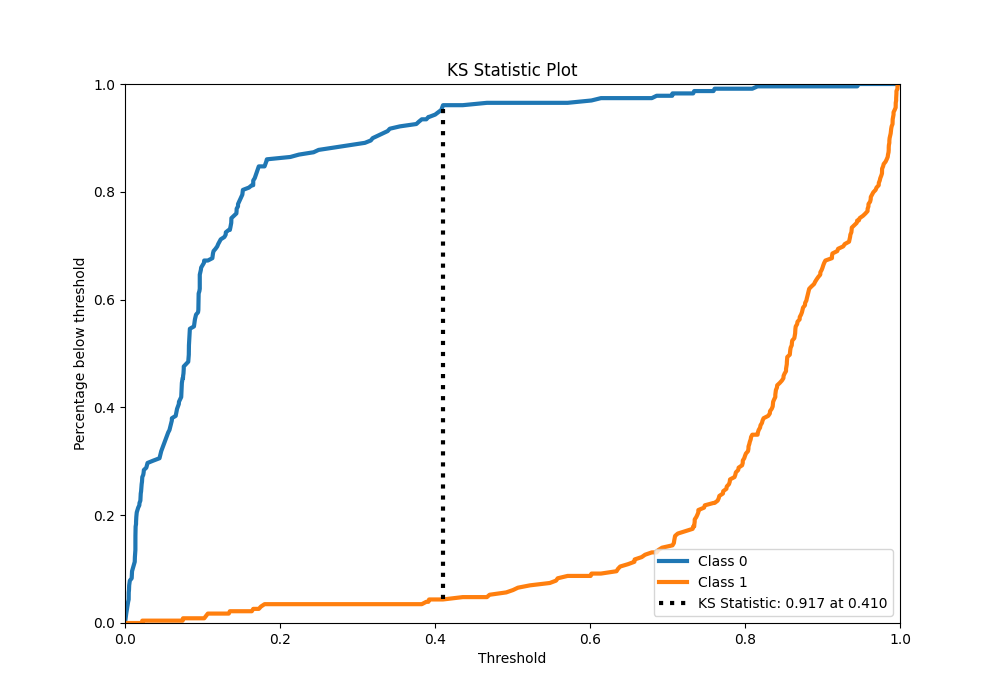
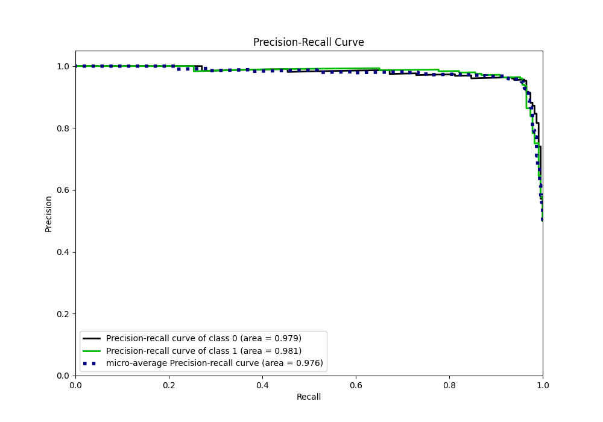
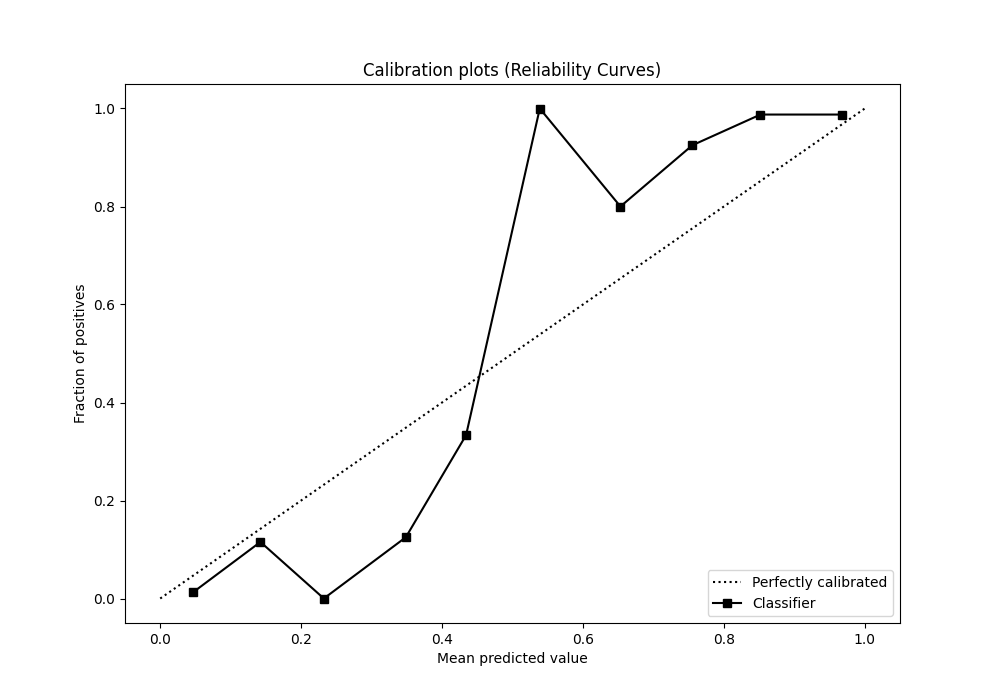
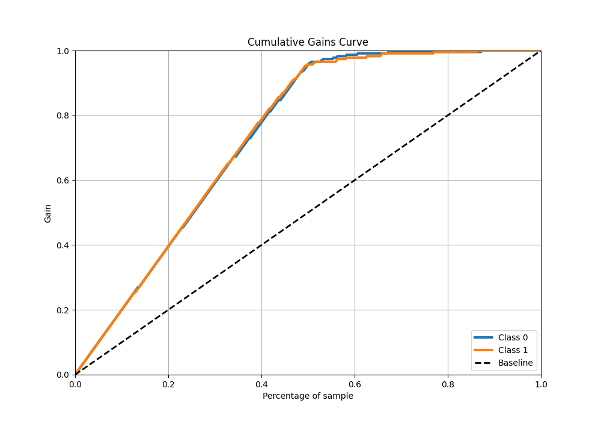
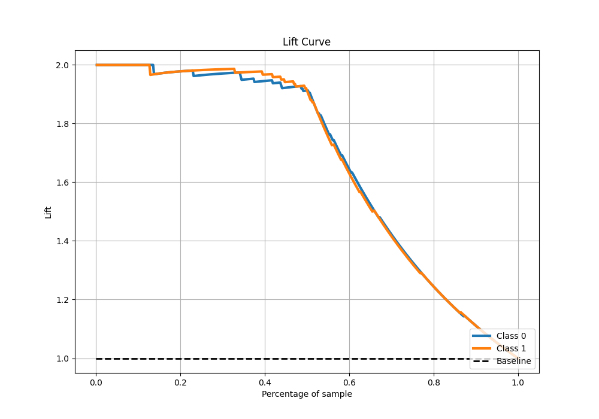

# Summary of 34_CatBoost

[<< Go back](../README.md)

## CatBoost
- **n_jobs**: -1
- **learning_rate**: 0.1
- **depth**: 6
- **rsm**: 0.7
- **loss_function**: Logloss
- **eval_metric**: AUC
- **explain_level**: 0

## Validation
 - **validation_type**: kfold
 - **shuffle**: True
 - **stratify**: True
 - **k_folds**: 5

## Optimized metric
auc

## Training time

8.6 seconds

## Metric details
|           |    score |    threshold |
|:----------|---------:|-------------:|
| logloss   | 0.206577 | nan          |
| auc       | 0.980664 | nan          |
| f1        | 0.958425 |   0.410358   |
| accuracy  | 0.958515 |   0.410358   |
| precision | 0.993289 |   0.817166   |
| recall    | 1        |   0.00142786 |
| mcc       | 0.917039 |   0.410358   |

## Metric details with threshold from accuracy metric
|           |    score |   threshold |
|:----------|---------:|------------:|
| logloss   | 0.206577 |  nan        |
| auc       | 0.980664 |  nan        |
| f1        | 0.958425 |    0.410358 |
| accuracy  | 0.958515 |    0.410358 |
| precision | 0.960526 |    0.410358 |
| recall    | 0.956332 |    0.410358 |
| mcc       | 0.917039 |    0.410358 |

## Confusion matrix (at threshold=0.410358)
|              |   Predicted as 0 |   Predicted as 1 |
|:-------------|-----------------:|-----------------:|
| Labeled as 0 |              220 |                9 |
| Labeled as 1 |               10 |              219 |

## Learning curves

## Confusion Matrix

## Normalized Confusion Matrix

## ROC Curve

## Kolmogorov-Smirnov Statistic

## Precision-Recall Curve

## Calibration Curve

## Cumulative Gains Curve

## Lift Curve

[<< Go back](../README.md)
