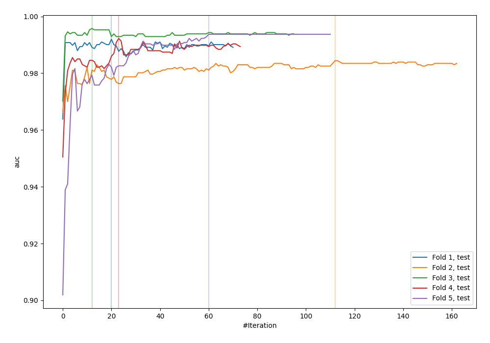
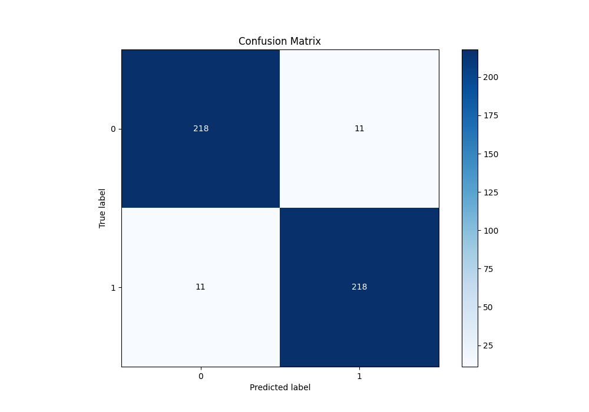
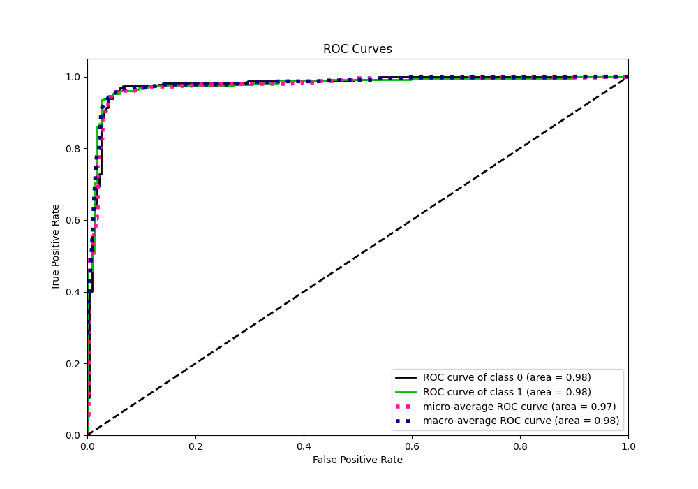
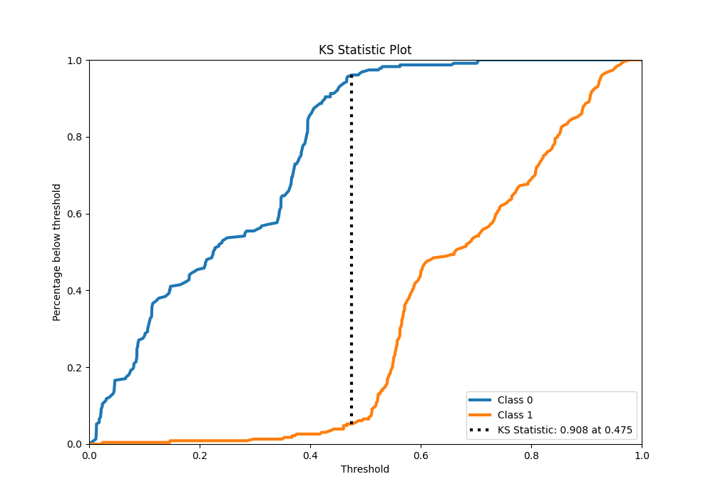
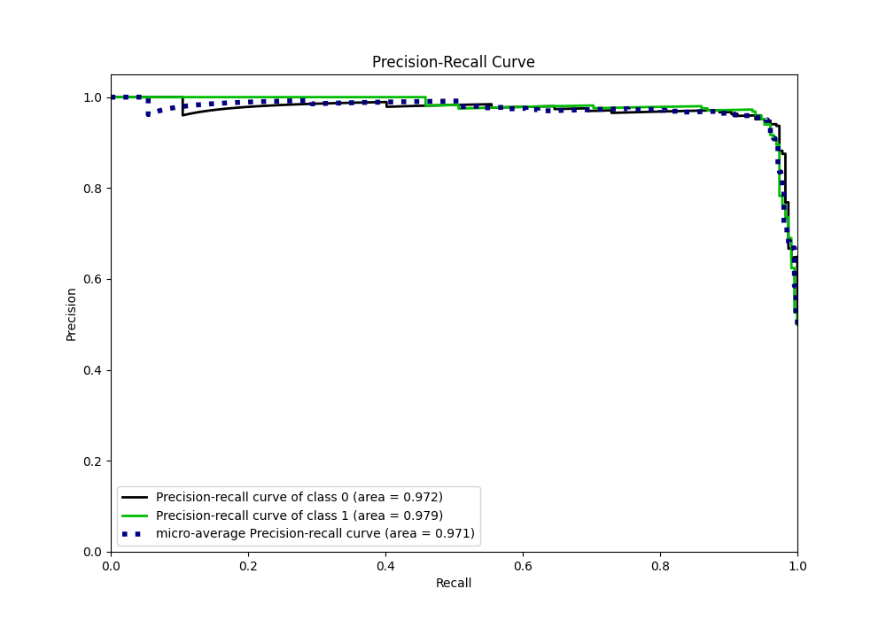
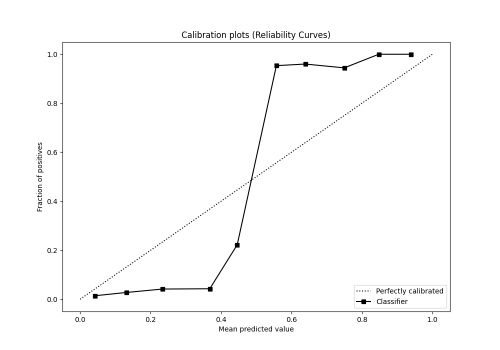
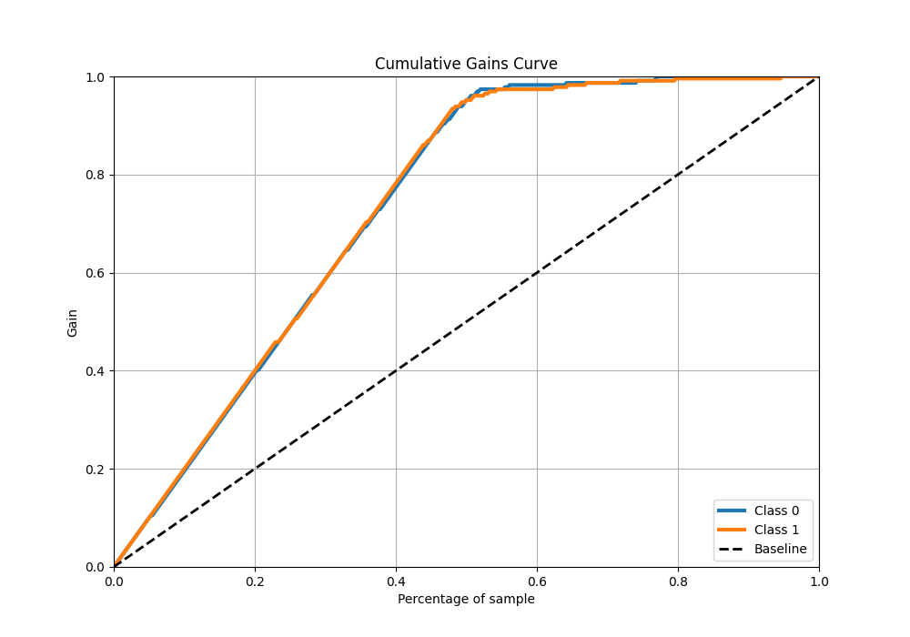
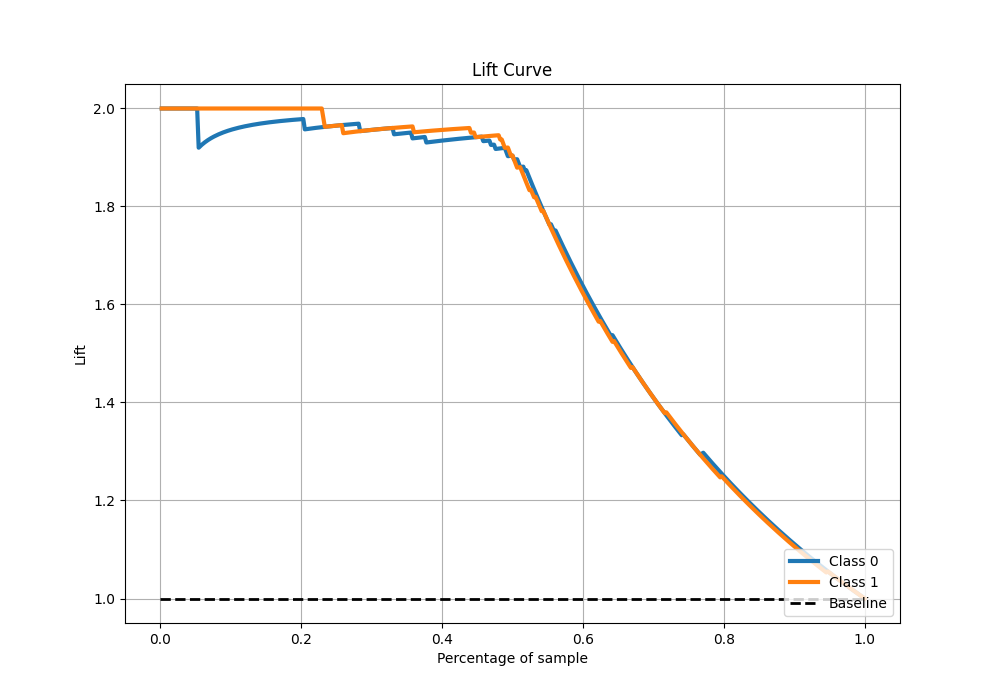

# Summary of 36_CatBoost

[<< Go back](../README.md)

## CatBoost
- **n_jobs**: -1
- **learning_rate**: 0.025
- **depth**: 8
- **rsm**: 1.0
- **loss_function**: Logloss
- **eval_metric**: AUC
- **explain_level**: 0

## Validation
 - **validation_type**: kfold
 - **shuffle**: True
 - **stratify**: True
 - **k_folds**: 5

## Optimized metric
auc

## Training time

11.0 seconds

## Metric details
|           |    score |   threshold |
|:----------|---------:|------------:|
| logloss   | 0.361873 | nan         |
| auc       | 0.977308 | nan         |
| f1        | 0.951965 |   0.466212  |
| accuracy  | 0.951965 |   0.466212  |
| precision | 1        |   0.705056  |
| recall    | 1        |   0.0109758 |
| mcc       | 0.904482 |   0.501145  |

## Metric details with threshold from accuracy metric
|           |    score |   threshold |
|:----------|---------:|------------:|
| logloss   | 0.361873 |  nan        |
| auc       | 0.977308 |  nan        |
| f1        | 0.951965 |    0.466212 |
| accuracy  | 0.951965 |    0.466212 |
| precision | 0.951965 |    0.466212 |
| recall    | 0.951965 |    0.466212 |
| mcc       | 0.90393  |    0.466212 |

## Confusion matrix (at threshold=0.466212)
|              |   Predicted as 0 |   Predicted as 1 |
|:-------------|-----------------:|-----------------:|
| Labeled as 0 |              218 |               11 |
| Labeled as 1 |               11 |              218 |

## Learning curves

## Confusion Matrix

## Normalized Confusion Matrix

## ROC Curve

## Kolmogorov-Smirnov Statistic

## Precision-Recall Curve

## Calibration Curve

## Cumulative Gains Curve

## Lift Curve

[<< Go back](../README.md)
