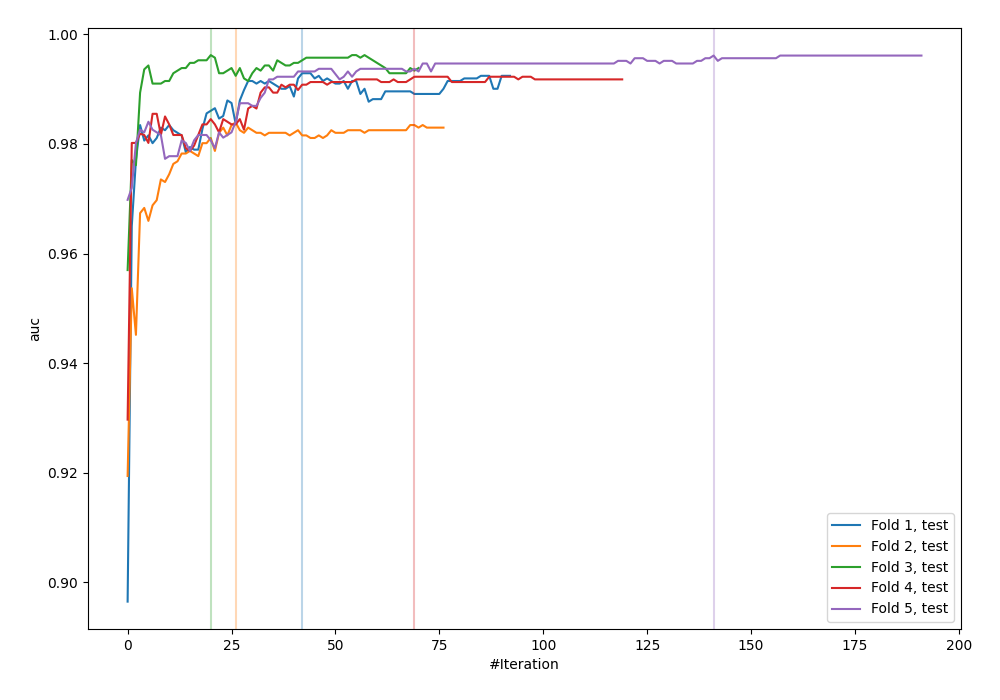
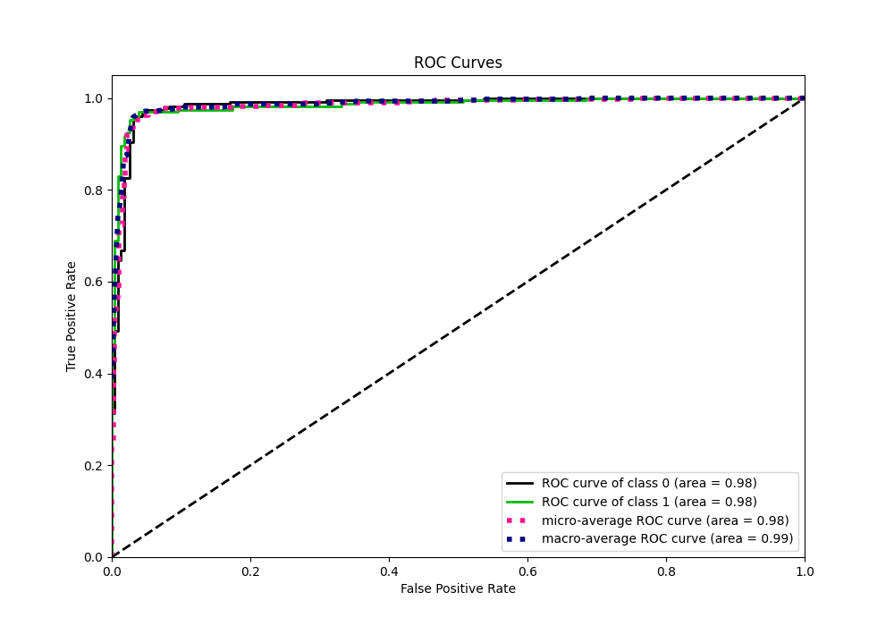
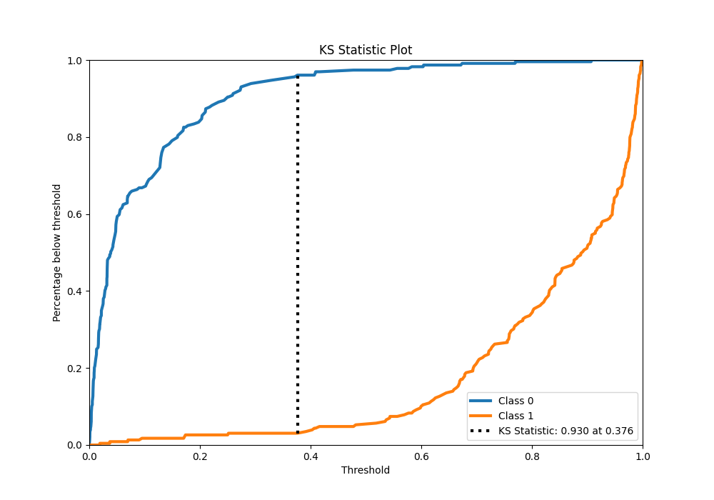
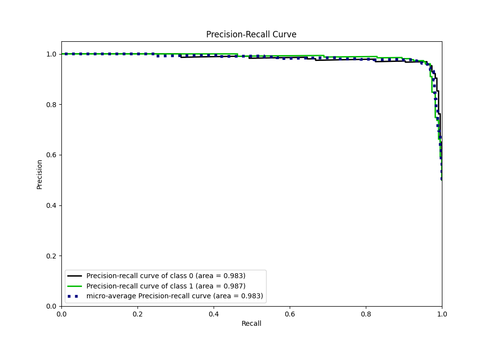
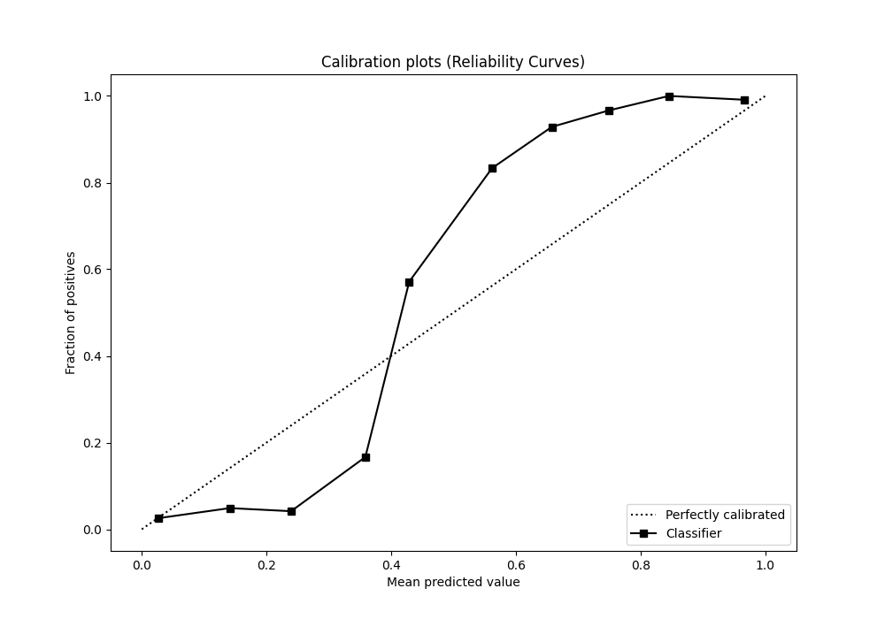
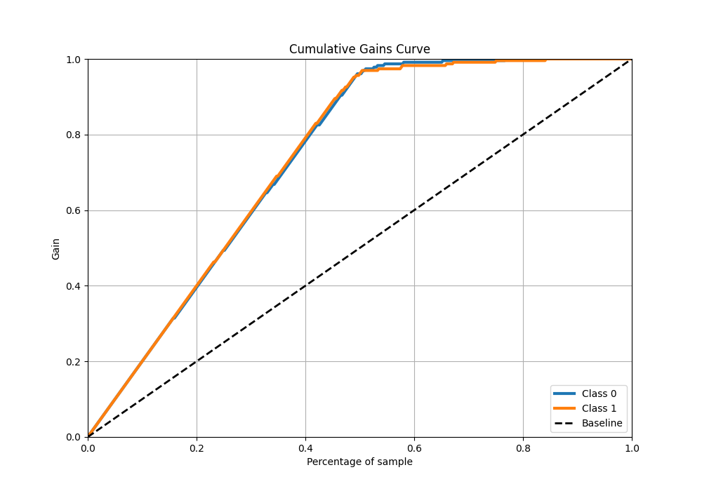
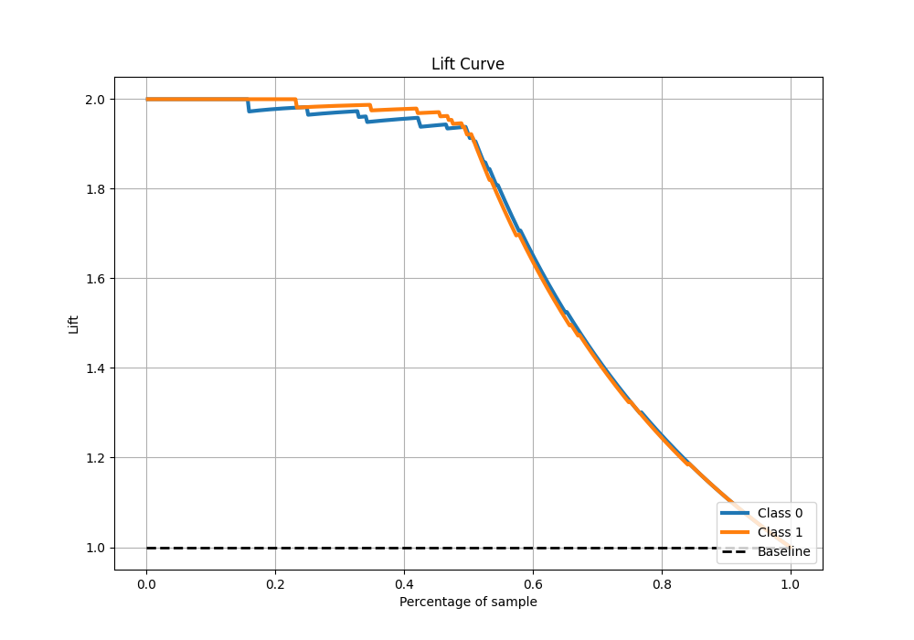

# Summary of 37_CatBoost

[<< Go back](../README.md)

## CatBoost
- **n_jobs**: -1
- **learning_rate**: 0.1
- **depth**: 7
- **rsm**: 0.8
- **loss_function**: Logloss
- **eval_metric**: AUC
- **explain_level**: 0

## Validation
 - **validation_type**: kfold
 - **shuffle**: True
 - **stratify**: True
 - **k_folds**: 5

## Optimized metric
auc

## Training time

11.1 seconds

## Metric details
|           |    score |     threshold |
|:----------|---------:|--------------:|
| logloss   | 0.185604 | nan           |
| auc       | 0.984878 | nan           |
| f1        | 0.963124 |   0.371311    |
| accuracy  | 0.962882 |   0.371311    |
| precision | 1        |   0.908201    |
| recall    | 1        |   0.000693998 |
| mcc       | 0.925844 |   0.371311    |

## Metric details with threshold from accuracy metric
|           |    score |   threshold |
|:----------|---------:|------------:|
| logloss   | 0.185604 |  nan        |
| auc       | 0.984878 |  nan        |
| f1        | 0.963124 |    0.371311 |
| accuracy  | 0.962882 |    0.371311 |
| precision | 0.956897 |    0.371311 |
| recall    | 0.969432 |    0.371311 |
| mcc       | 0.925844 |    0.371311 |

## Confusion matrix (at threshold=0.371311)
|              |   Predicted as 0 |   Predicted as 1 |
|:-------------|-----------------:|-----------------:|
| Labeled as 0 |              219 |               10 |
| Labeled as 1 |                7 |              222 |

## Learning curves

## Confusion Matrix

## Normalized Confusion Matrix

## ROC Curve

## Kolmogorov-Smirnov Statistic

## Precision-Recall Curve

## Calibration Curve

## Cumulative Gains Curve

## Lift Curve

[<< Go back](../README.md)
