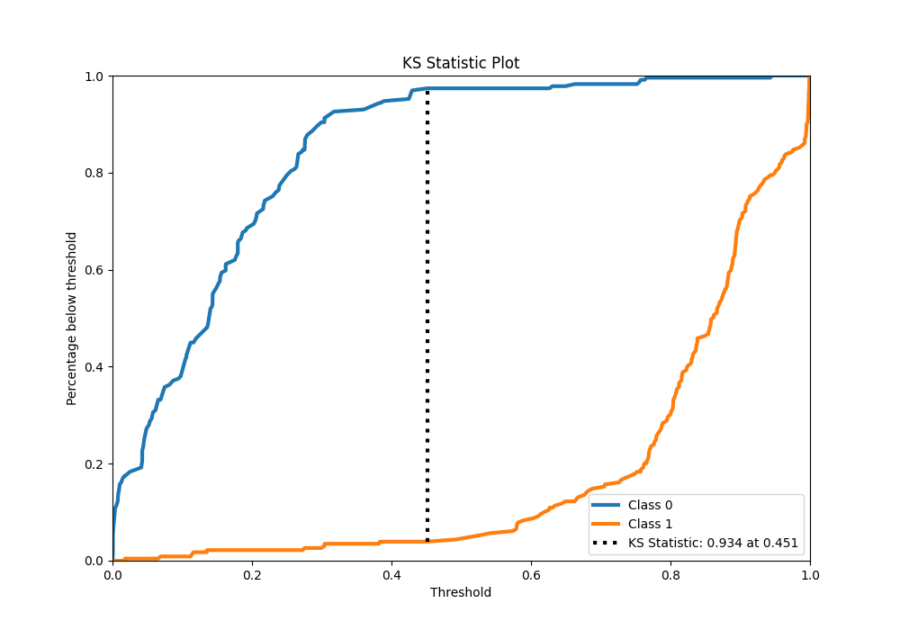

# Summary of 37_CatBoost_KMeansFeatures

[<< Go back](../README.md)

## CatBoost
- **n_jobs**: -1
- **learning_rate**: 0.1
- **depth**: 7
- **rsm**: 0.8
- **loss_function**: Logloss
- **eval_metric**: AUC
- **explain_level**: 0

## Validation
 - **validation_type**: kfold
 - **shuffle**: True
 - **stratify**: True
 - **k_folds**: 5

## Optimized metric
auc

## Training time

14.7 seconds

## Metric details
|           |    score |     threshold |
|:----------|---------:|--------------:|
| logloss   | 0.22153  | nan           |
| auc       | 0.978757 | nan           |
| f1        | 0.964912 |   0.42948     |
| accuracy  | 0.965066 |   0.42948     |
| precision | 0.994475 |   0.768624    |
| recall    | 1        |   0.000489783 |
| mcc       | 0.930273 |   0.500711    |

## Metric details with threshold from accuracy metric
|           |    score |   threshold |
|:----------|---------:|------------:|
| logloss   | 0.22153  |   nan       |
| auc       | 0.978757 |   nan       |
| f1        | 0.964912 |     0.42948 |
| accuracy  | 0.965066 |     0.42948 |
| precision | 0.969163 |     0.42948 |
| recall    | 0.960699 |     0.42948 |
| mcc       | 0.930166 |     0.42948 |

## Confusion matrix (at threshold=0.42948)
|              |   Predicted as 0 |   Predicted as 1 |
|:-------------|-----------------:|-----------------:|
| Labeled as 0 |              222 |                7 |
| Labeled as 1 |                9 |              220 |

## Learning curves

## Confusion Matrix

## Normalized Confusion Matrix

## ROC Curve

## Kolmogorov-Smirnov Statistic

## Precision-Recall Curve

## Calibration Curve

## Cumulative Gains Curve

## Lift Curve

[<< Go back](../README.md)
