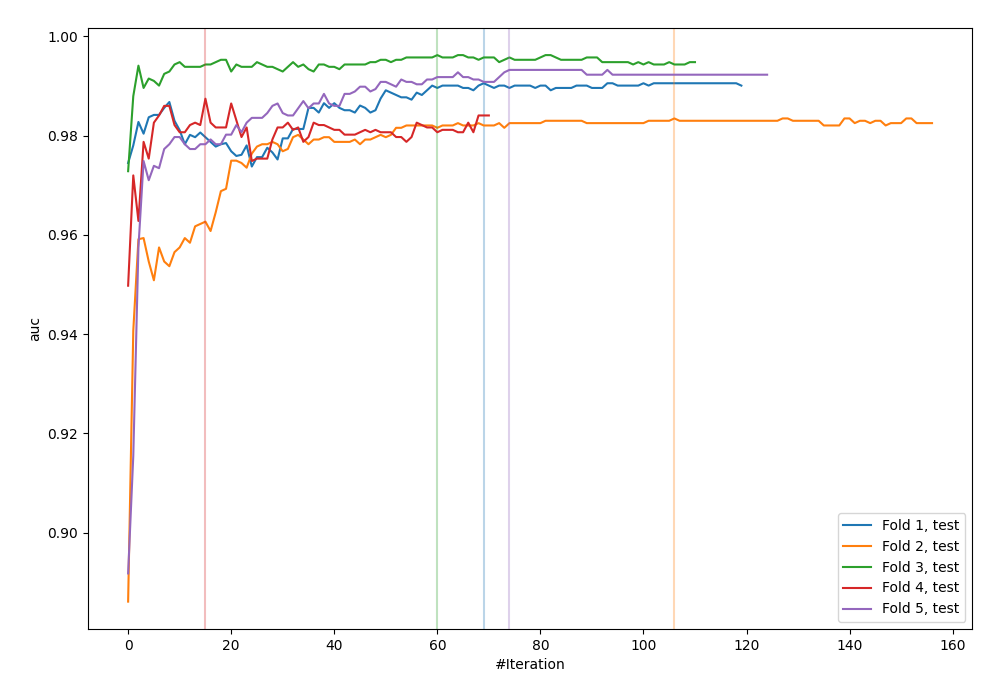
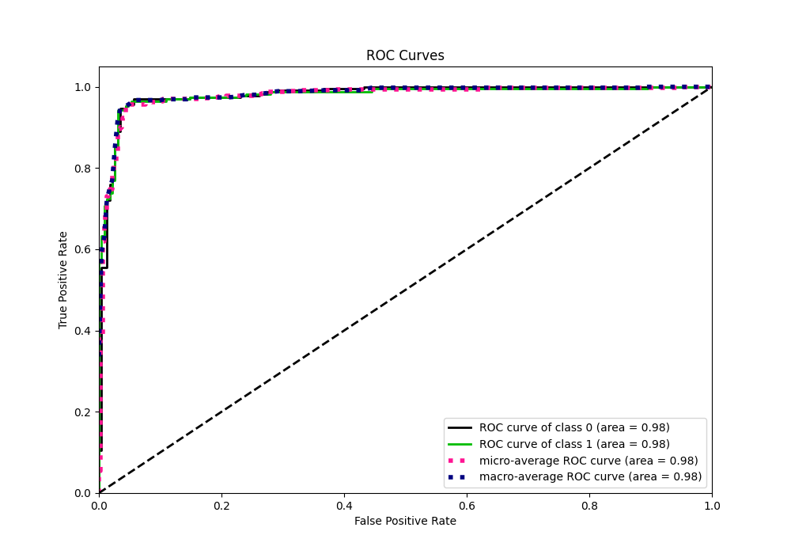
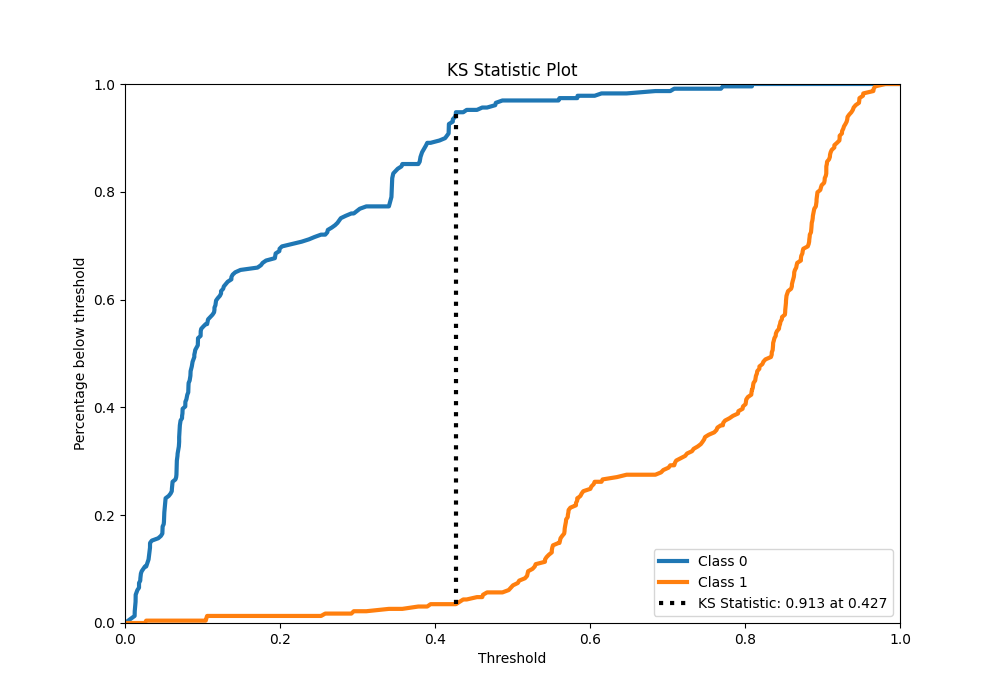
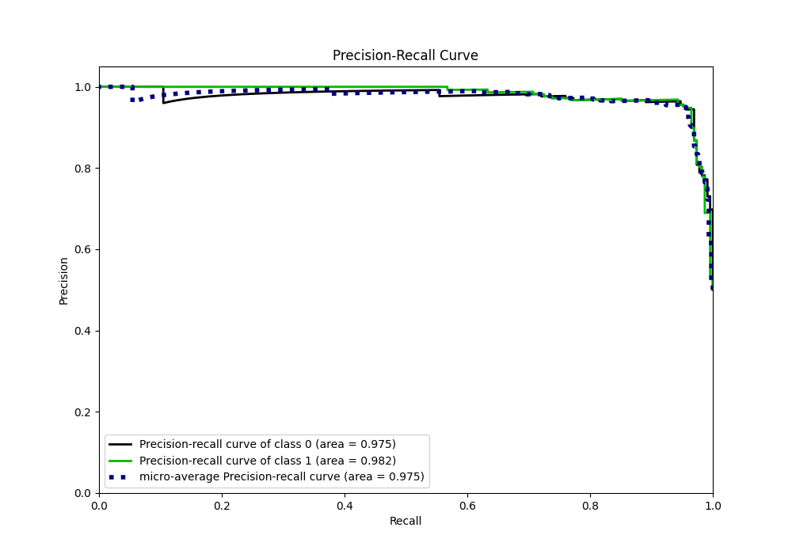
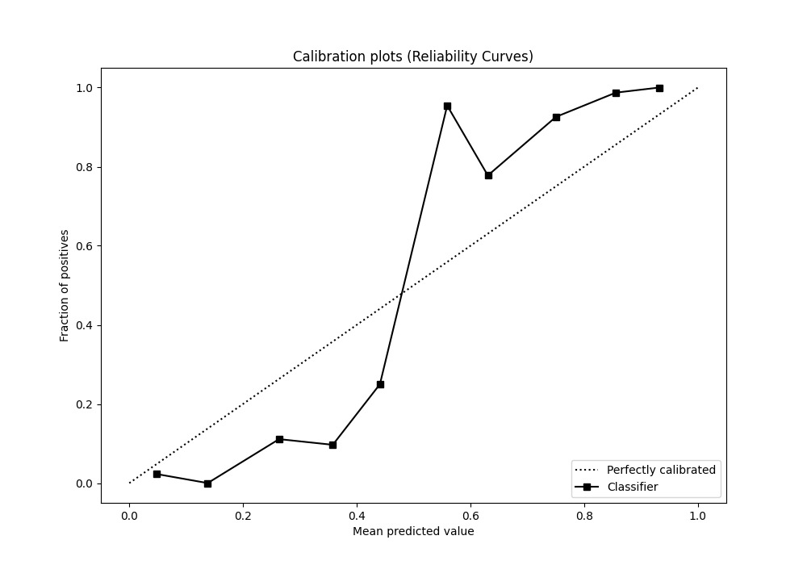
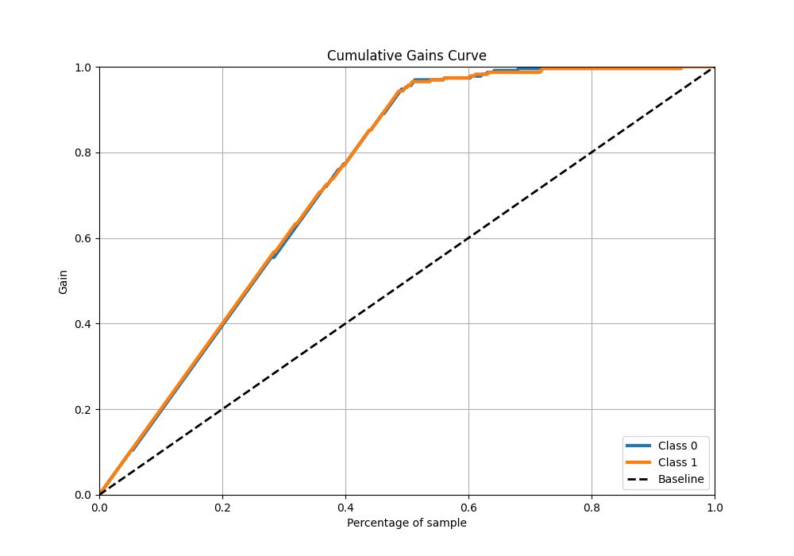
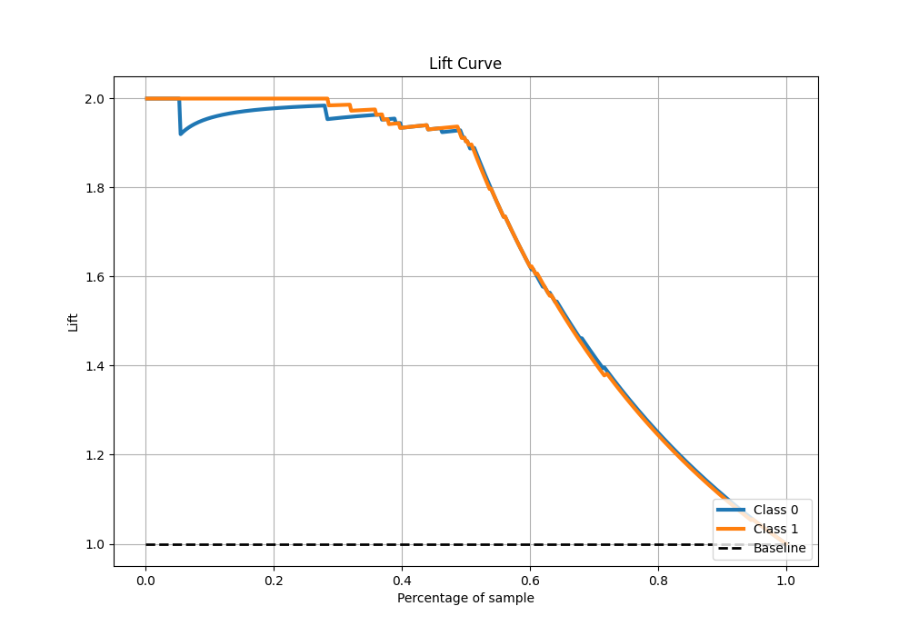

# Summary of 38_CatBoost

[<< Go back](../README.md)

## CatBoost
- **n_jobs**: -1
- **learning_rate**: 0.025
- **depth**: 7
- **rsm**: 0.7
- **loss_function**: Logloss
- **eval_metric**: AUC
- **explain_level**: 0

## Validation
 - **validation_type**: kfold
 - **shuffle**: True
 - **stratify**: True
 - **k_folds**: 5

## Optimized metric
auc

## Training time

12.2 seconds

## Metric details
|           |    score |   threshold |
|:----------|---------:|------------:|
| logloss   | 0.265953 | nan         |
| auc       | 0.97973  | nan         |
| f1        | 0.95671  |   0.431707  |
| accuracy  | 0.956332 |   0.431707  |
| precision | 1        |   0.81028   |
| recall    | 1        |   0.0111755 |
| mcc       | 0.912803 |   0.431707  |

## Metric details with threshold from accuracy metric
|           |    score |   threshold |
|:----------|---------:|------------:|
| logloss   | 0.265953 |  nan        |
| auc       | 0.97973  |  nan        |
| f1        | 0.95671  |    0.431707 |
| accuracy  | 0.956332 |    0.431707 |
| precision | 0.948498 |    0.431707 |
| recall    | 0.965066 |    0.431707 |
| mcc       | 0.912803 |    0.431707 |

## Confusion matrix (at threshold=0.431707)
|              |   Predicted as 0 |   Predicted as 1 |
|:-------------|-----------------:|-----------------:|
| Labeled as 0 |              217 |               12 |
| Labeled as 1 |                8 |              221 |

## Learning curves

## Confusion Matrix

## Normalized Confusion Matrix

## ROC Curve

## Kolmogorov-Smirnov Statistic

## Precision-Recall Curve

## Calibration Curve

## Cumulative Gains Curve

## Lift Curve

[<< Go back](../README.md)
