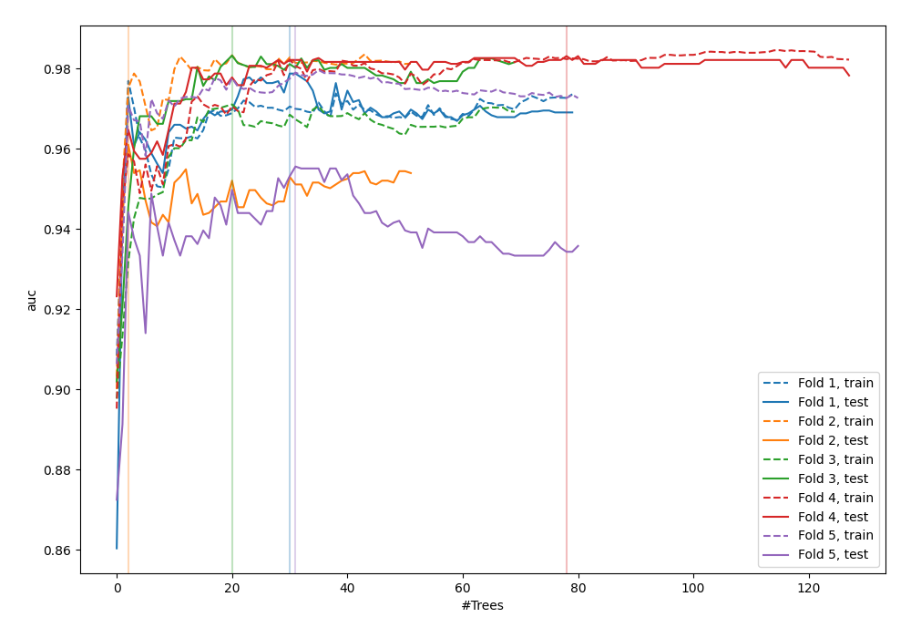
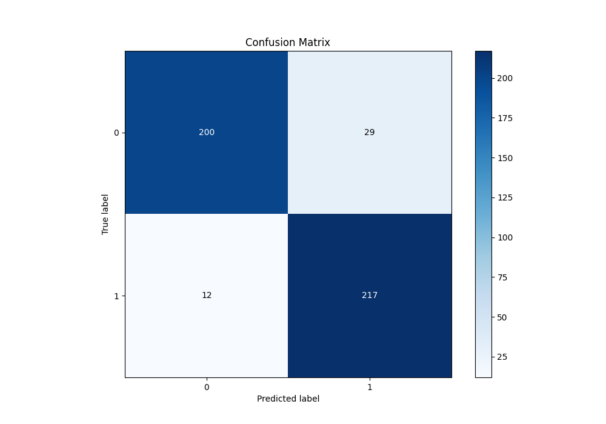
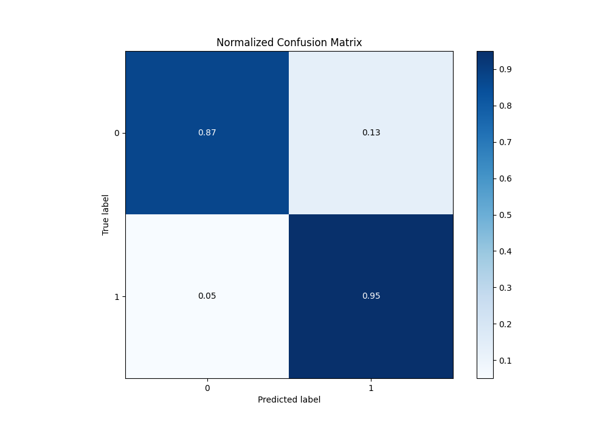
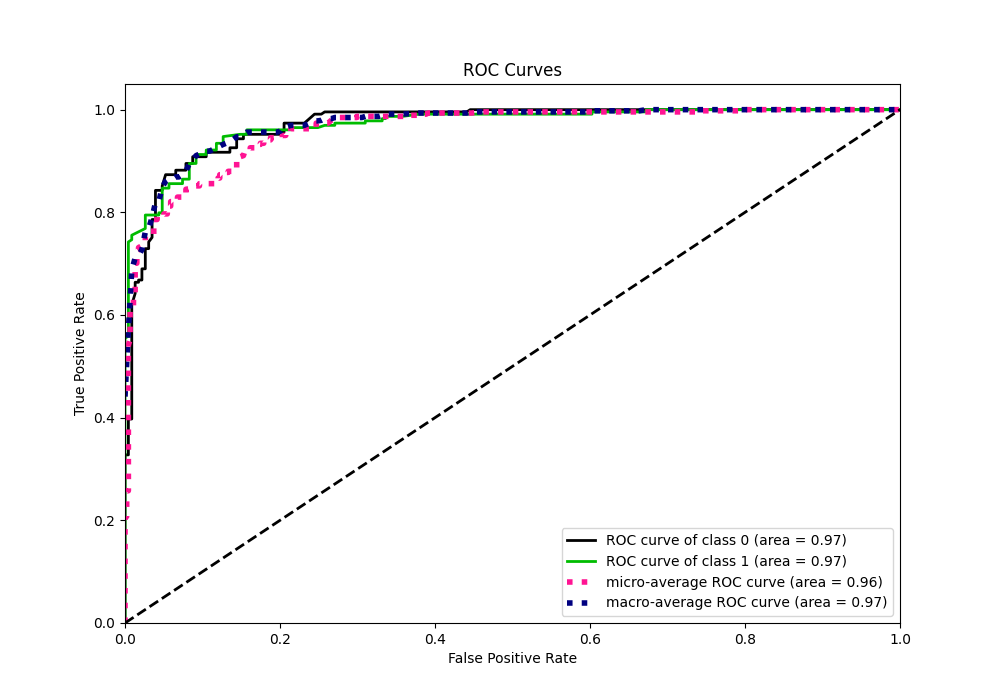
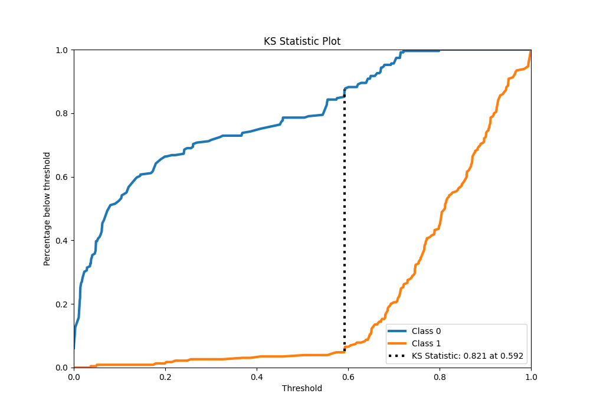
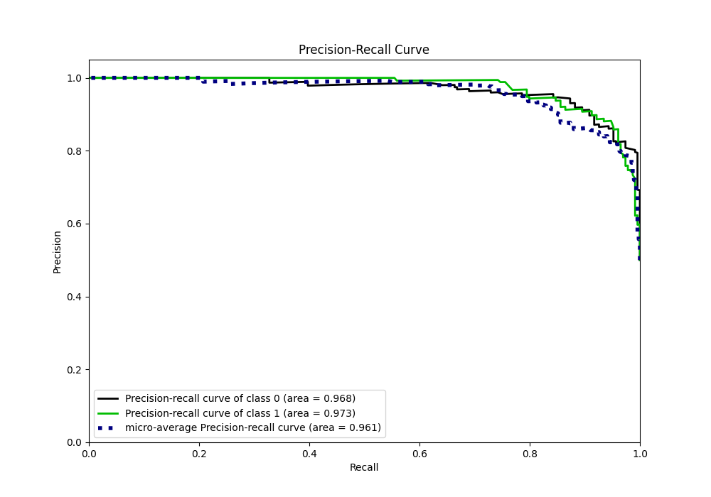
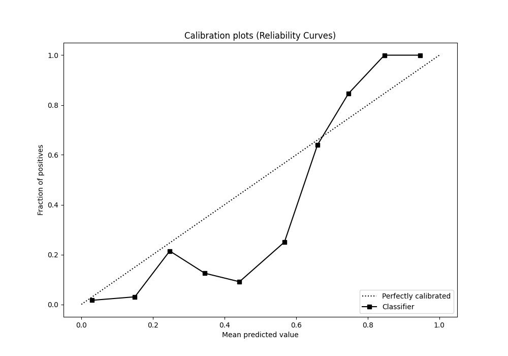
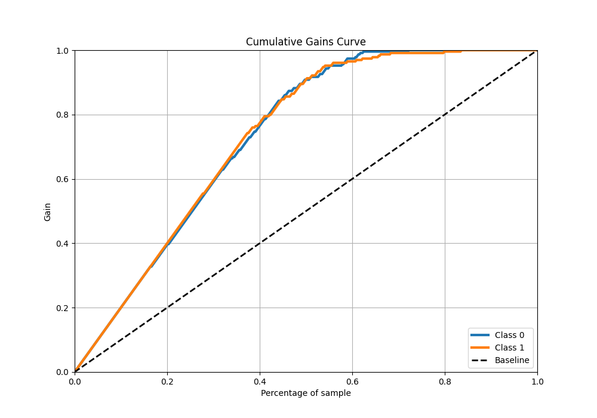
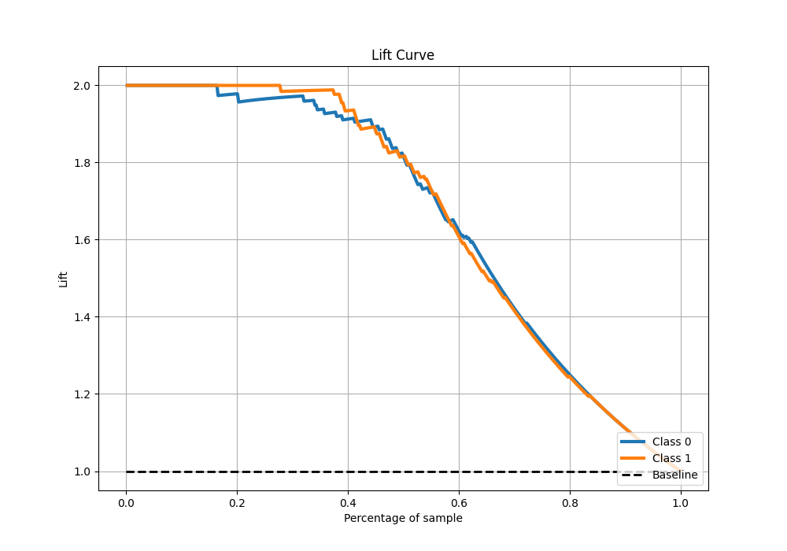

# Summary of 42_RandomForest

[<< Go back](../README.md)

## Random Forest
- **n_jobs**: -1
- **criterion**: entropy
- **max_features**: 0.6
- **min_samples_split**: 50
- **max_depth**: 6
- **eval_metric_name**: auc
- **explain_level**: 0

## Validation
 - **validation_type**: kfold
 - **shuffle**: True
 - **stratify**: True
 - **k_folds**: 5

## Optimized metric
auc

## Training time

9.5 seconds

## Metric details
|           |    score |   threshold |
|:----------|---------:|------------:|
| logloss   | 0.287379 |   nan       |
| auc       | 0.969623 |   nan       |
| f1        | 0.913684 |     0.59222 |
| accuracy  | 0.91048  |     0.59222 |
| precision | 1        |     0.80151 |
| recall    | 1        |     0       |
| mcc       | 0.823232 |     0.59222 |

## Metric details with threshold from accuracy metric
|           |    score |   threshold |
|:----------|---------:|------------:|
| logloss   | 0.287379 |   nan       |
| auc       | 0.969623 |   nan       |
| f1        | 0.913684 |     0.59222 |
| accuracy  | 0.91048  |     0.59222 |
| precision | 0.882114 |     0.59222 |
| recall    | 0.947598 |     0.59222 |
| mcc       | 0.823232 |     0.59222 |

## Confusion matrix (at threshold=0.59222)
|              |   Predicted as 0 |   Predicted as 1 |
|:-------------|-----------------:|-----------------:|
| Labeled as 0 |              200 |               29 |
| Labeled as 1 |               12 |              217 |

## Learning curves

## Confusion Matrix

## Normalized Confusion Matrix

## ROC Curve

## Kolmogorov-Smirnov Statistic

## Precision-Recall Curve

## Calibration Curve

## Cumulative Gains Curve

## Lift Curve

[<< Go back](../README.md)
