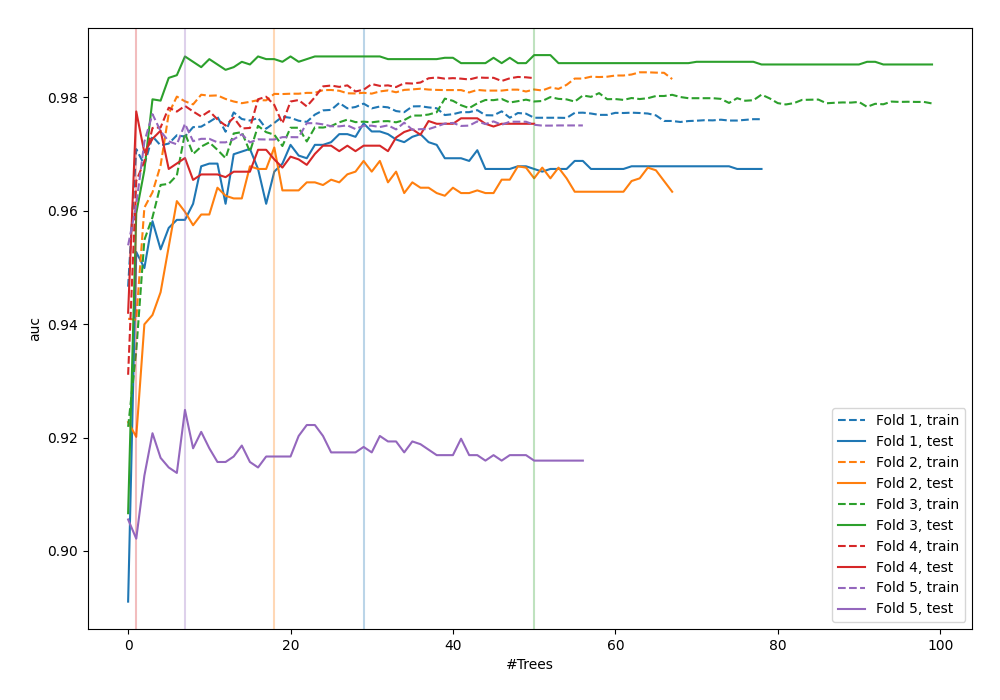
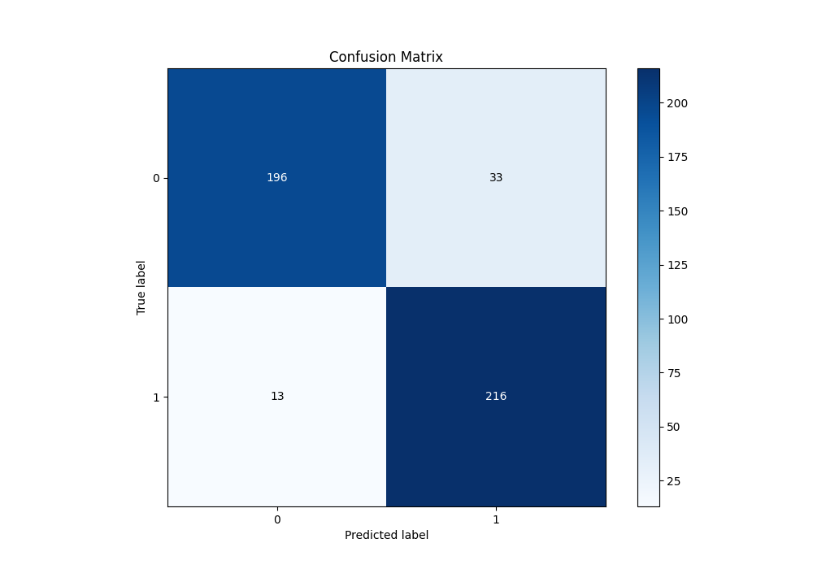
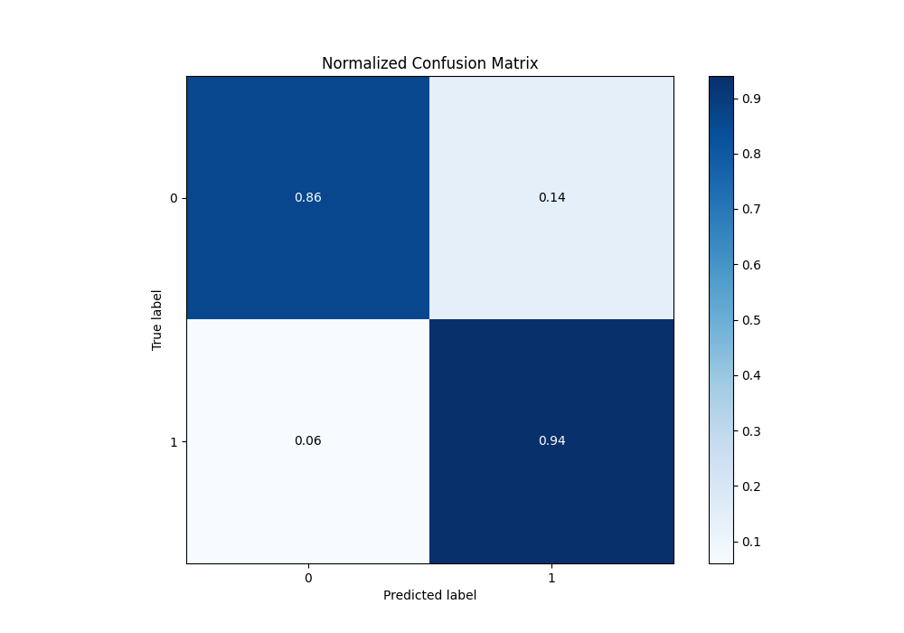
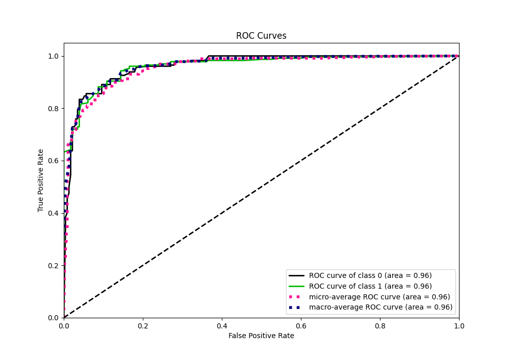
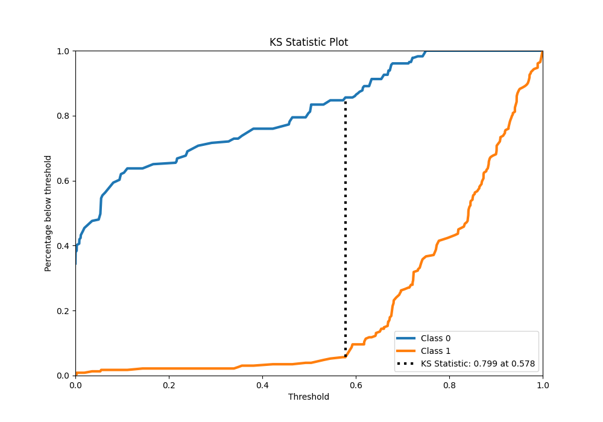
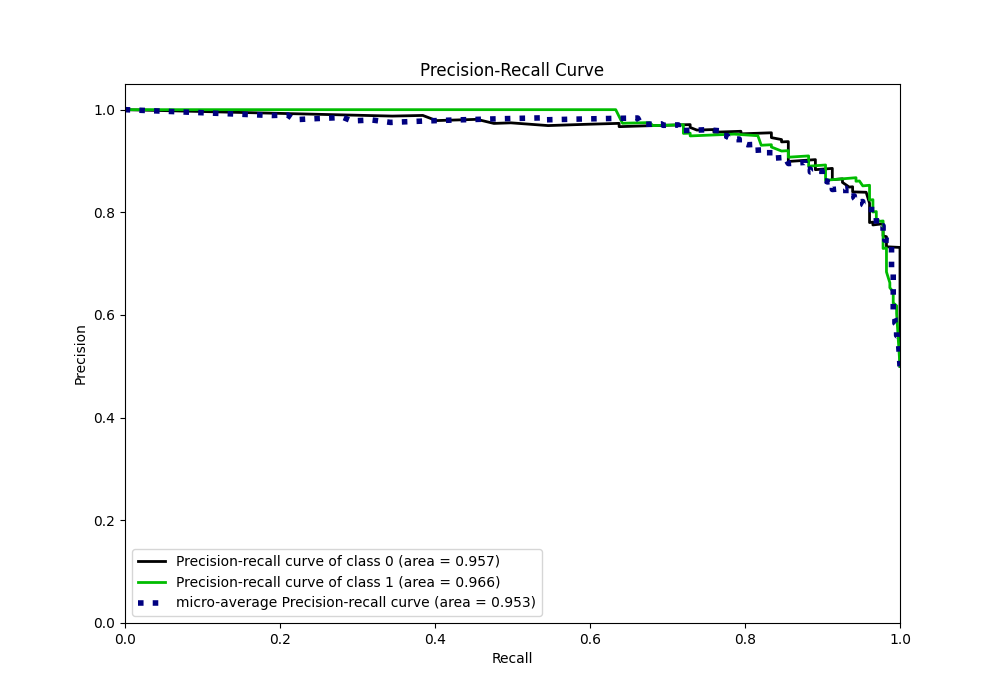
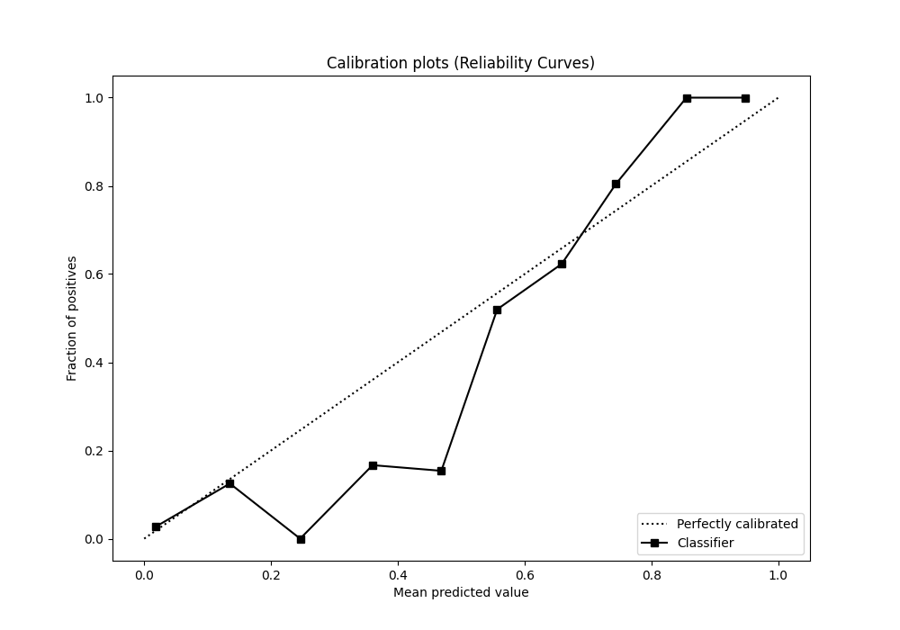
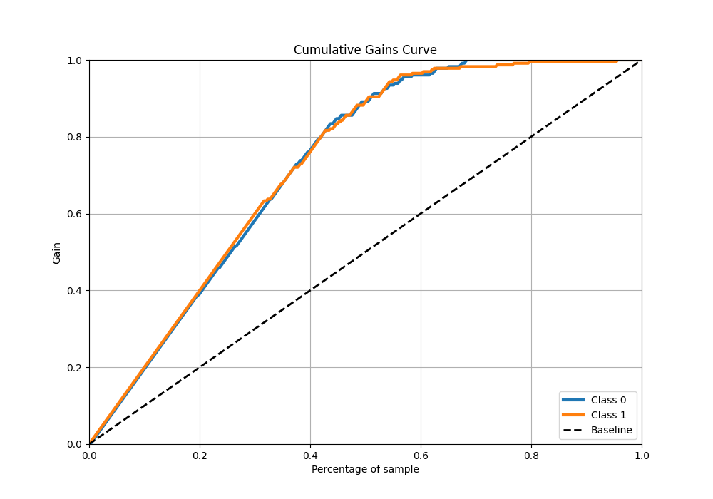
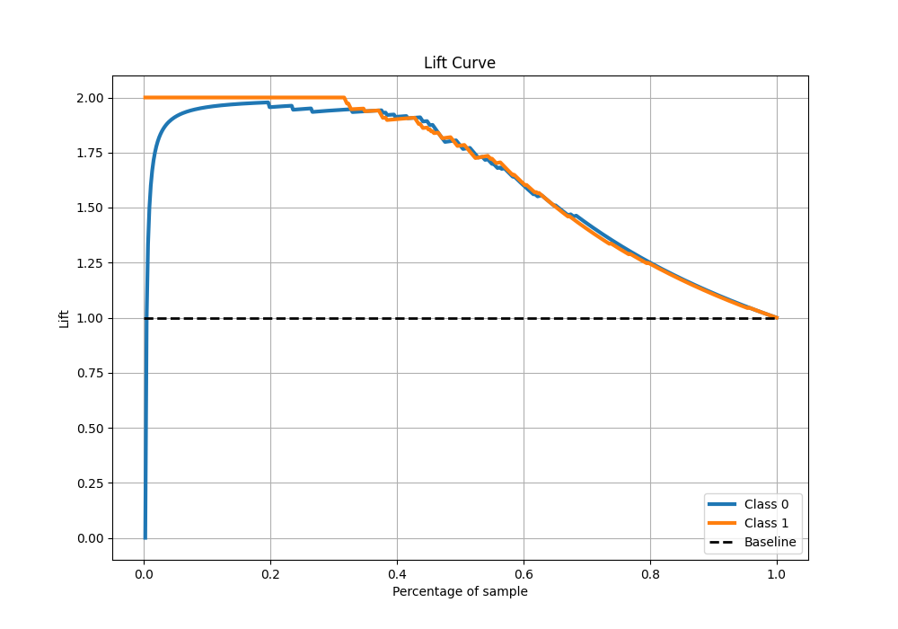

# Summary of 44_RandomForest

[<< Go back](../README.md)

## Random Forest
- **n_jobs**: -1
- **criterion**: gini
- **max_features**: 1.0
- **min_samples_split**: 40
- **max_depth**: 7
- **eval_metric_name**: auc
- **explain_level**: 0

## Validation
 - **validation_type**: kfold
 - **shuffle**: True
 - **stratify**: True
 - **k_folds**: 5

## Optimized metric
auc

## Training time

10.9 seconds

## Metric details
|           |    score |   threshold |
|:----------|---------:|------------:|
| logloss   | 0.315622 |  nan        |
| auc       | 0.962262 |  nan        |
| f1        | 0.903766 |    0.58448  |
| accuracy  | 0.899563 |    0.58448  |
| precision | 1        |    0.750187 |
| recall    | 0.995633 |    0        |
| mcc       | 0.802192 |    0.58448  |

## Metric details with threshold from accuracy metric
|           |    score |   threshold |
|:----------|---------:|------------:|
| logloss   | 0.315622 |   nan       |
| auc       | 0.962262 |   nan       |
| f1        | 0.903766 |     0.58448 |
| accuracy  | 0.899563 |     0.58448 |
| precision | 0.86747  |     0.58448 |
| recall    | 0.943231 |     0.58448 |
| mcc       | 0.802192 |     0.58448 |

## Confusion matrix (at threshold=0.58448)
|              |   Predicted as 0 |   Predicted as 1 |
|:-------------|-----------------:|-----------------:|
| Labeled as 0 |              196 |               33 |
| Labeled as 1 |               13 |              216 |

## Learning curves

## Confusion Matrix

## Normalized Confusion Matrix

## ROC Curve

## Kolmogorov-Smirnov Statistic

## Precision-Recall Curve

## Calibration Curve

## Cumulative Gains Curve

## Lift Curve

[<< Go back](../README.md)
