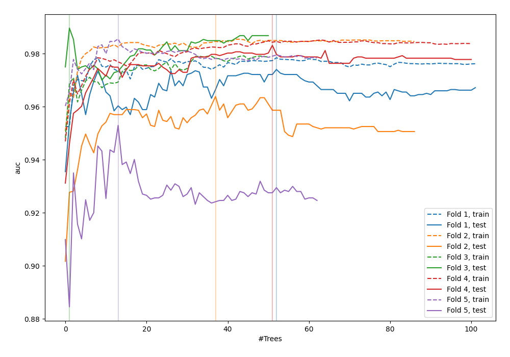
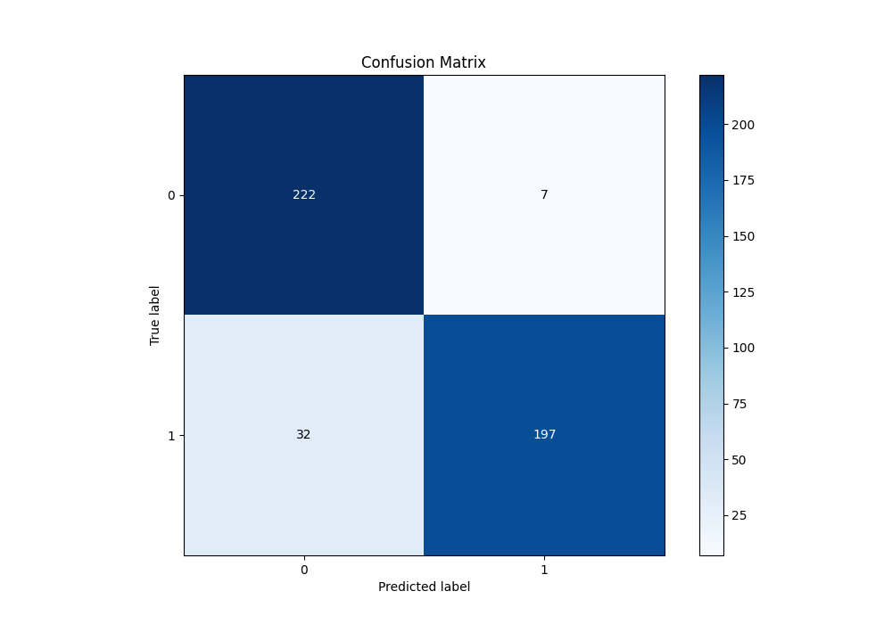
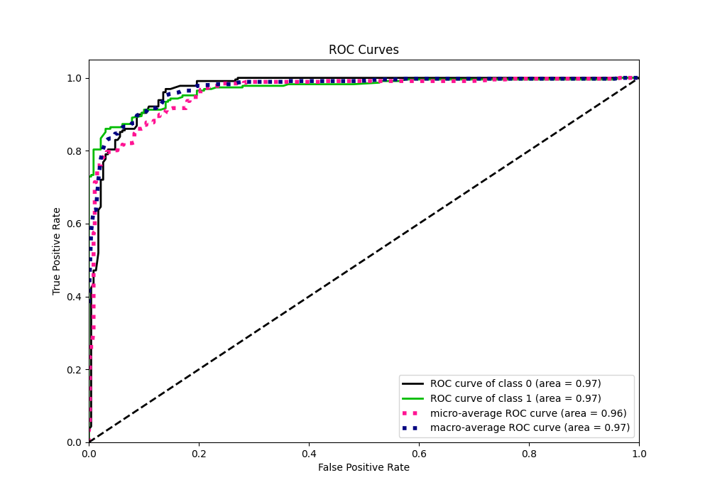
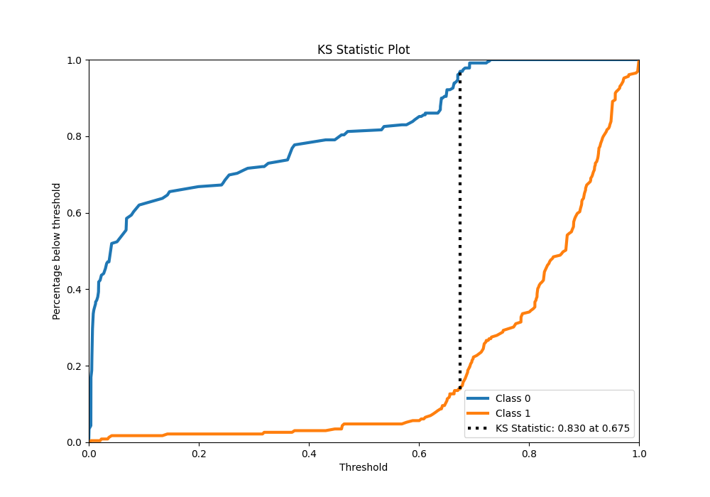
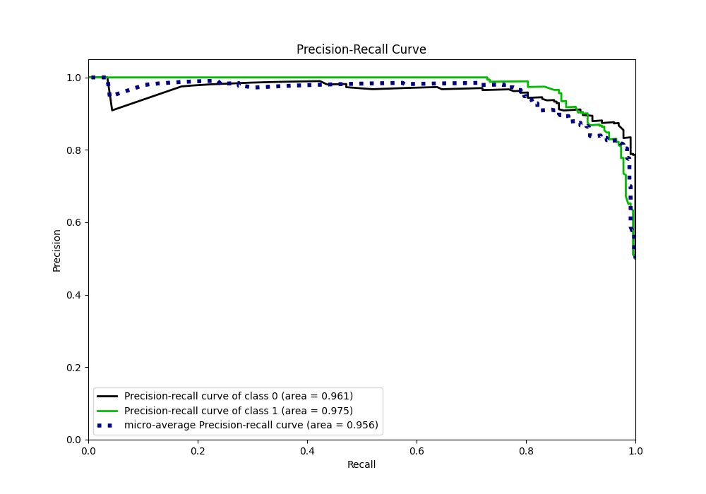
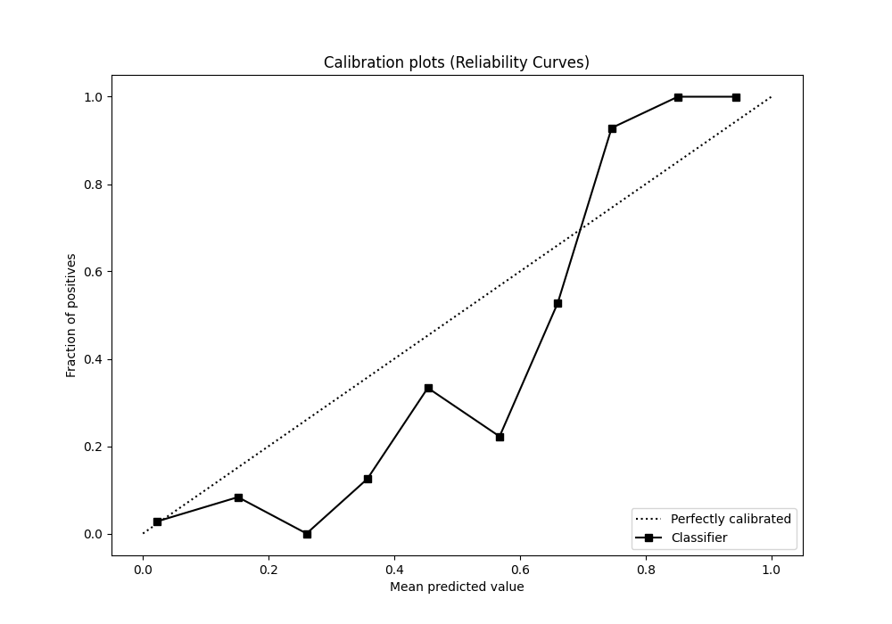
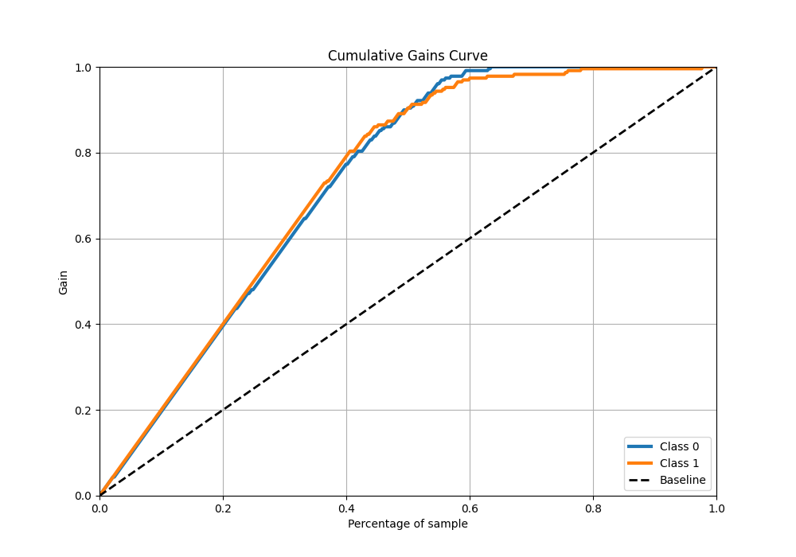
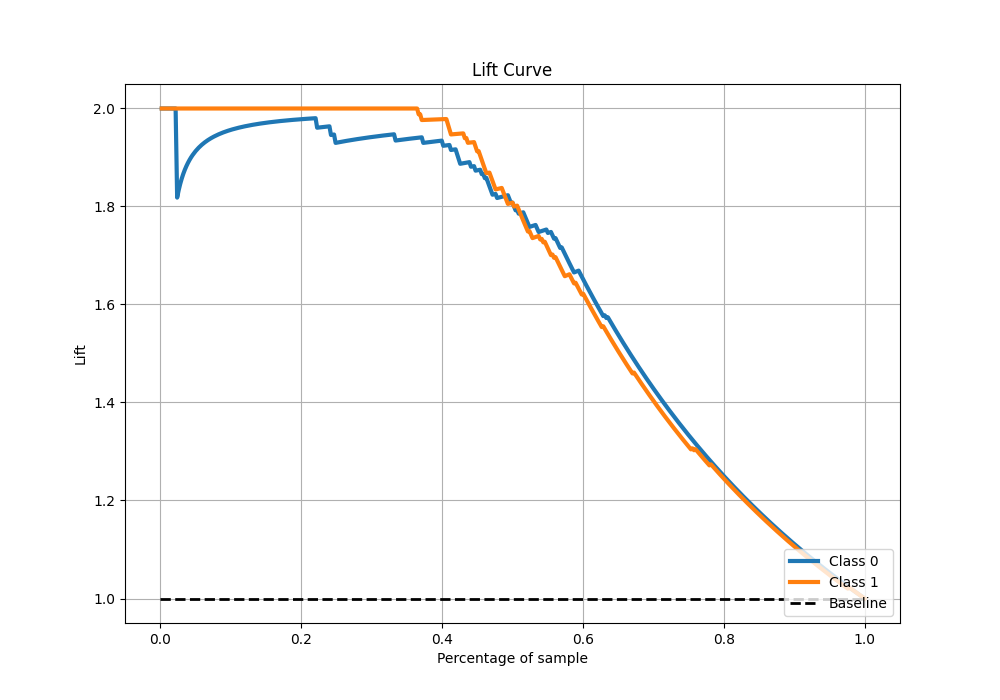

# Summary of 45_RandomForest

[<< Go back](../README.md)

## Random Forest
- **n_jobs**: -1
- **criterion**: gini
- **max_features**: 0.9
- **min_samples_split**: 40
- **max_depth**: 5
- **eval_metric_name**: auc
- **explain_level**: 0

## Validation
 - **validation_type**: kfold
 - **shuffle**: True
 - **stratify**: True
 - **k_folds**: 5

## Optimized metric
auc

## Training time

11.5 seconds

## Metric details
|           |    score |     threshold |
|:----------|---------:|--------------:|
| logloss   | 0.277606 | nan           |
| auc       | 0.969566 | nan           |
| f1        | 0.909931 |   0.675       |
| accuracy  | 0.914847 |   0.675       |
| precision | 1        |   0.747069    |
| recall    | 1        |   0.000522648 |
| mcc       | 0.834683 |   0.675       |

## Metric details with threshold from accuracy metric
|           |    score |   threshold |
|:----------|---------:|------------:|
| logloss   | 0.277606 |     nan     |
| auc       | 0.969566 |     nan     |
| f1        | 0.909931 |       0.675 |
| accuracy  | 0.914847 |       0.675 |
| precision | 0.965686 |       0.675 |
| recall    | 0.860262 |       0.675 |
| mcc       | 0.834683 |       0.675 |

## Confusion matrix (at threshold=0.675)
|              |   Predicted as 0 |   Predicted as 1 |
|:-------------|-----------------:|-----------------:|
| Labeled as 0 |              222 |                7 |
| Labeled as 1 |               32 |              197 |

## Learning curves

## Confusion Matrix

## Normalized Confusion Matrix

## ROC Curve

## Kolmogorov-Smirnov Statistic

## Precision-Recall Curve

## Calibration Curve

## Cumulative Gains Curve

## Lift Curve

[<< Go back](../README.md)
