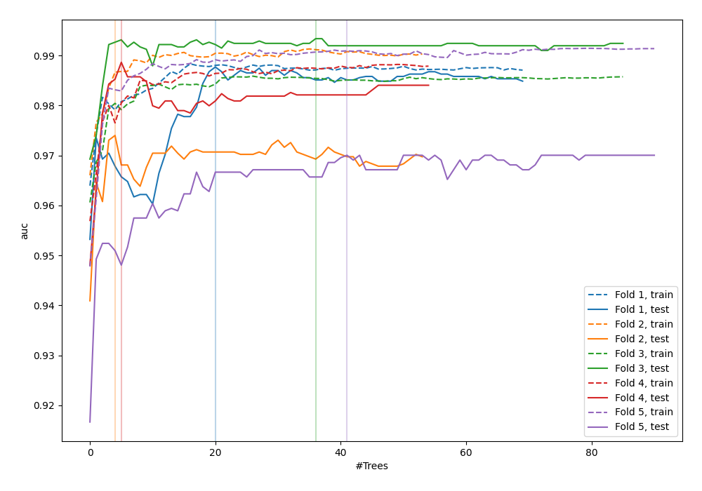
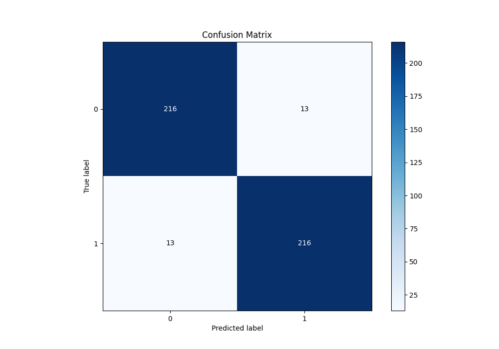
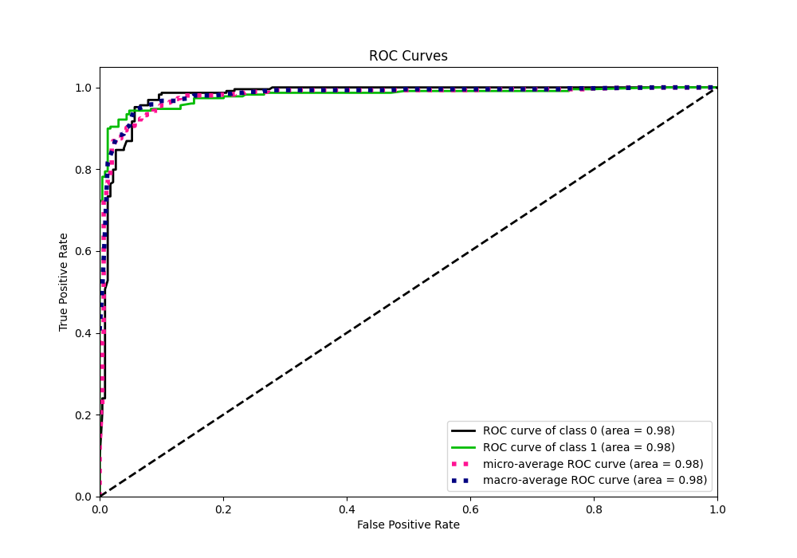
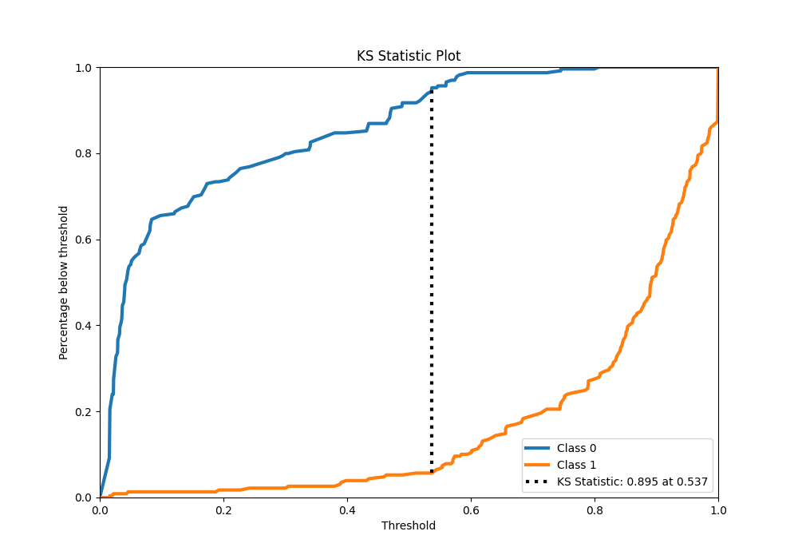
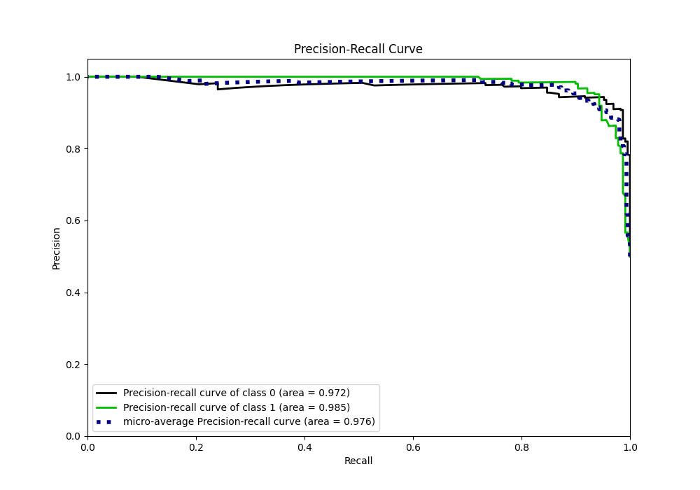
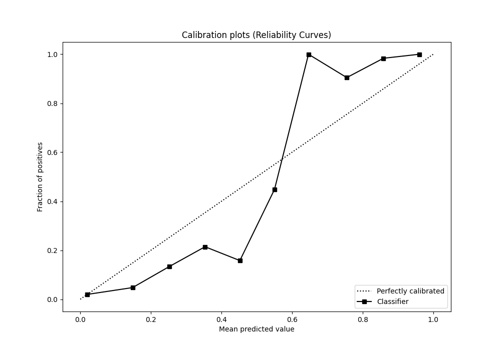
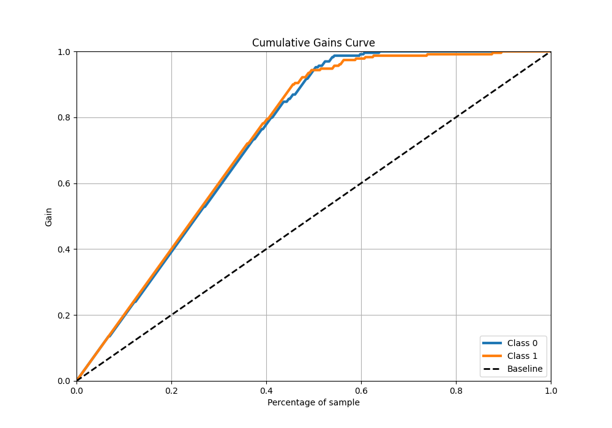
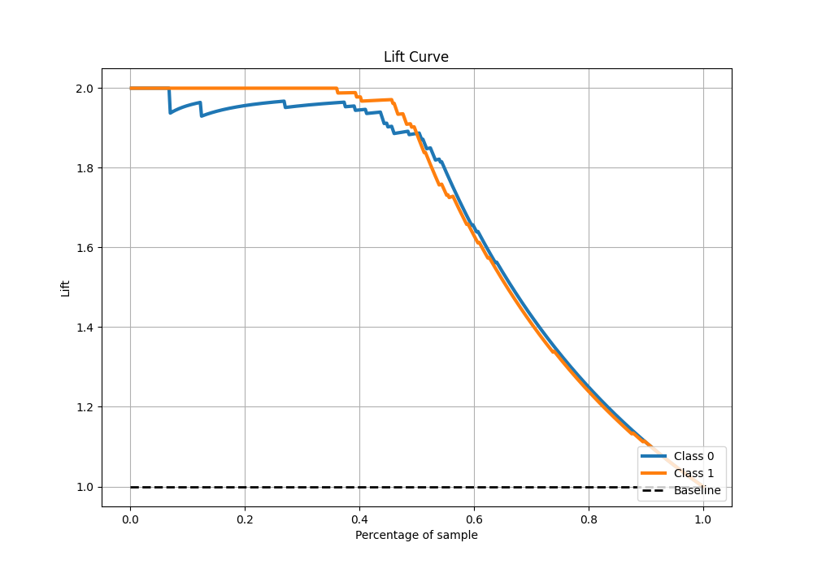

# Summary of 46_RandomForest

[<< Go back](../README.md)

## Random Forest
- **n_jobs**: -1
- **criterion**: gini
- **max_features**: 0.6
- **min_samples_split**: 20
- **max_depth**: 4
- **eval_metric_name**: auc
- **explain_level**: 0

## Validation
 - **validation_type**: kfold
 - **shuffle**: True
 - **stratify**: True
 - **k_folds**: 5

## Optimized metric
auc

## Training time

11.8 seconds

## Metric details
|           |    score |   threshold |
|:----------|---------:|------------:|
| logloss   | 0.216563 | nan         |
| auc       | 0.98033  | nan         |
| f1        | 0.943231 |   0.536545  |
| accuracy  | 0.943231 |   0.536545  |
| precision | 1        |   0.808012  |
| recall    | 1        |   0.0139412 |
| mcc       | 0.889863 |   0.597678  |

## Metric details with threshold from accuracy metric
|           |    score |   threshold |
|:----------|---------:|------------:|
| logloss   | 0.216563 |  nan        |
| auc       | 0.98033  |  nan        |
| f1        | 0.943231 |    0.536545 |
| accuracy  | 0.943231 |    0.536545 |
| precision | 0.943231 |    0.536545 |
| recall    | 0.943231 |    0.536545 |
| mcc       | 0.886463 |    0.536545 |

## Confusion matrix (at threshold=0.536545)
|              |   Predicted as 0 |   Predicted as 1 |
|:-------------|-----------------:|-----------------:|
| Labeled as 0 |              216 |               13 |
| Labeled as 1 |               13 |              216 |

## Learning curves

## Confusion Matrix

## Normalized Confusion Matrix

## ROC Curve

## Kolmogorov-Smirnov Statistic

## Precision-Recall Curve

## Calibration Curve

## Cumulative Gains Curve

## Lift Curve

[<< Go back](../README.md)
