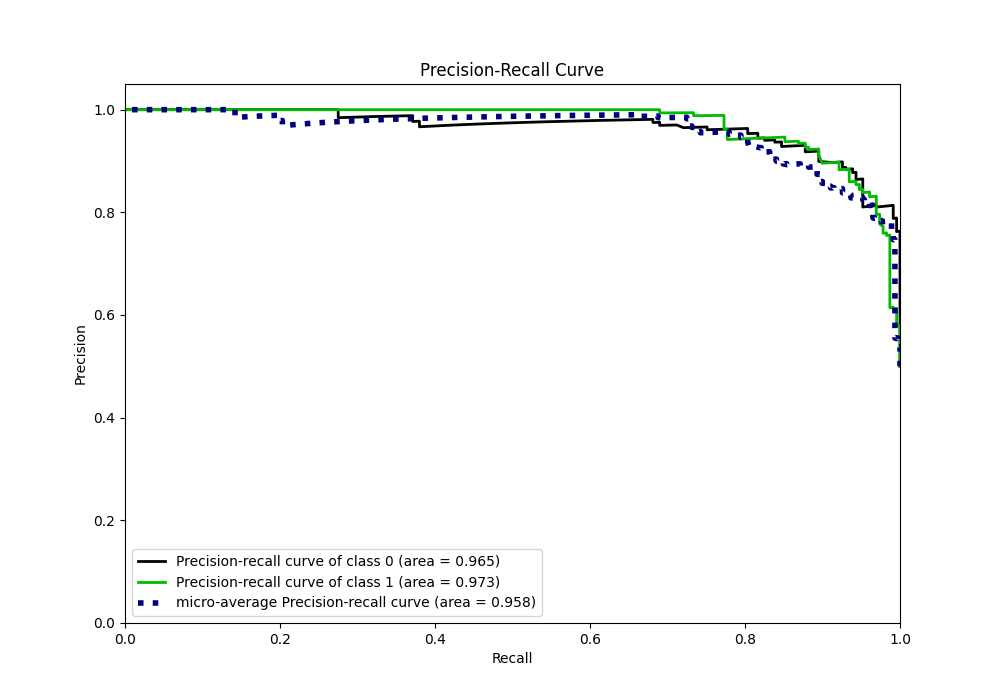

# Summary of 47_RandomForest

[<< Go back](../README.md)

## Random Forest
- **n_jobs**: -1
- **criterion**: gini
- **max_features**: 0.5
- **min_samples_split**: 50
- **max_depth**: 5
- **eval_metric_name**: auc
- **explain_level**: 0

## Validation
 - **validation_type**: kfold
 - **shuffle**: True
 - **stratify**: True
 - **k_folds**: 5

## Optimized metric
auc

## Training time

13.9 seconds

## Metric details
|           |    score |    threshold |
|:----------|---------:|-------------:|
| logloss   | 0.300751 | nan          |
| auc       | 0.968841 | nan          |
| f1        | 0.908705 |   0.622453   |
| accuracy  | 0.908297 |   0.652571   |
| precision | 1        |   0.746089   |
| recall    | 1        |   0.00438363 |
| mcc       | 0.817093 |   0.652571   |

## Metric details with threshold from accuracy metric
|           |    score |   threshold |
|:----------|---------:|------------:|
| logloss   | 0.300751 |  nan        |
| auc       | 0.968841 |  nan        |
| f1        | 0.906667 |    0.652571 |
| accuracy  | 0.908297 |    0.652571 |
| precision | 0.923077 |    0.652571 |
| recall    | 0.89083  |    0.652571 |
| mcc       | 0.817093 |    0.652571 |

## Confusion matrix (at threshold=0.652571)
|              |   Predicted as 0 |   Predicted as 1 |
|:-------------|-----------------:|-----------------:|
| Labeled as 0 |              212 |               17 |
| Labeled as 1 |               25 |              204 |

## Learning curves

## Confusion Matrix

## Normalized Confusion Matrix

## ROC Curve

## Kolmogorov-Smirnov Statistic

## Precision-Recall Curve

## Calibration Curve

## Cumulative Gains Curve

## Lift Curve

[<< Go back](../README.md)
