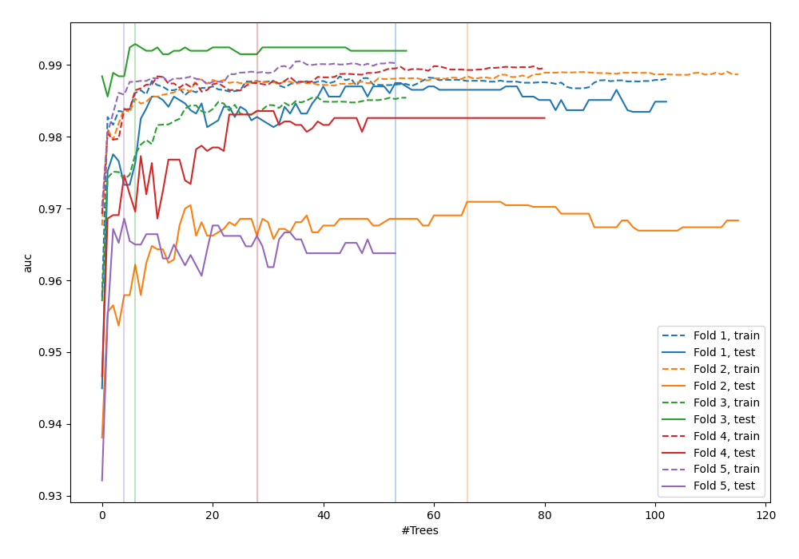
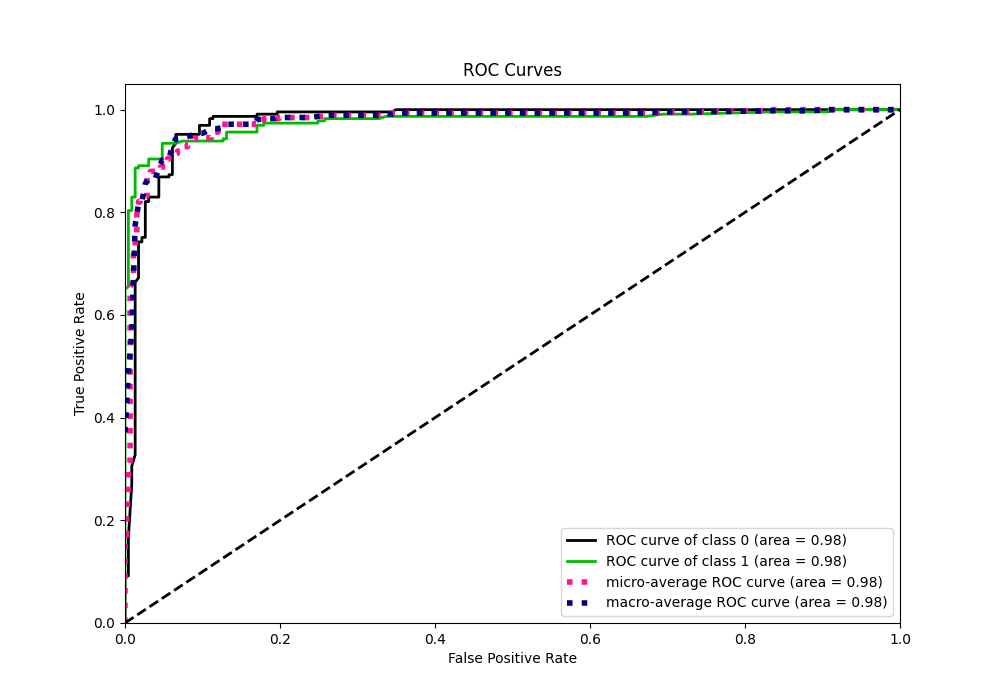
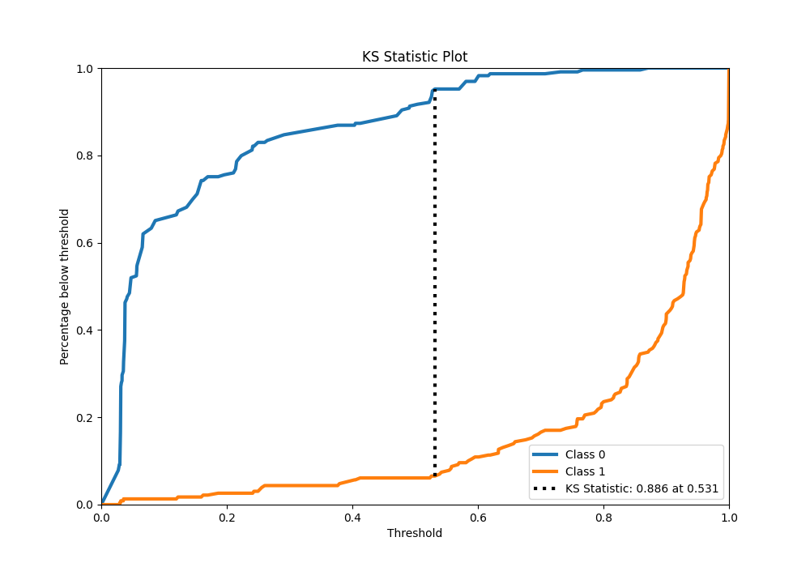
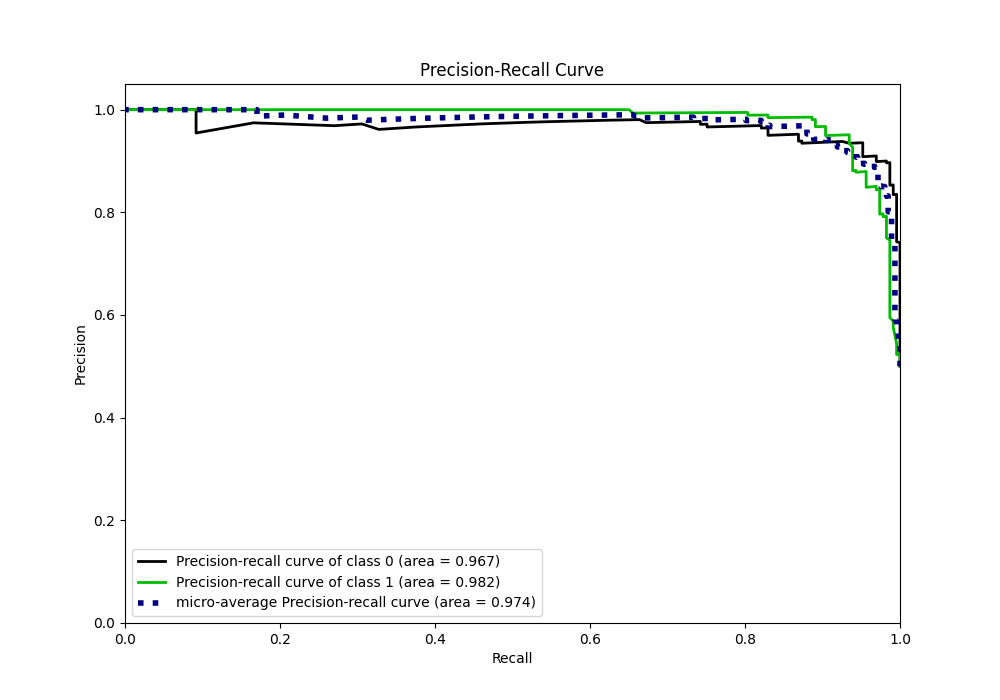
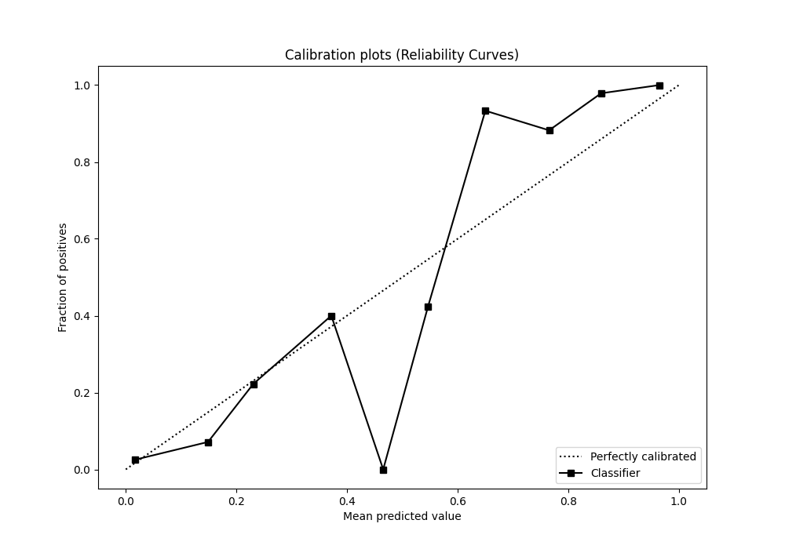
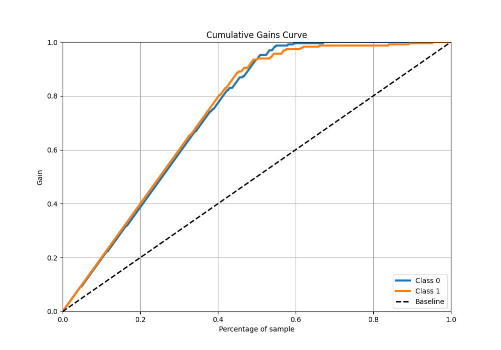
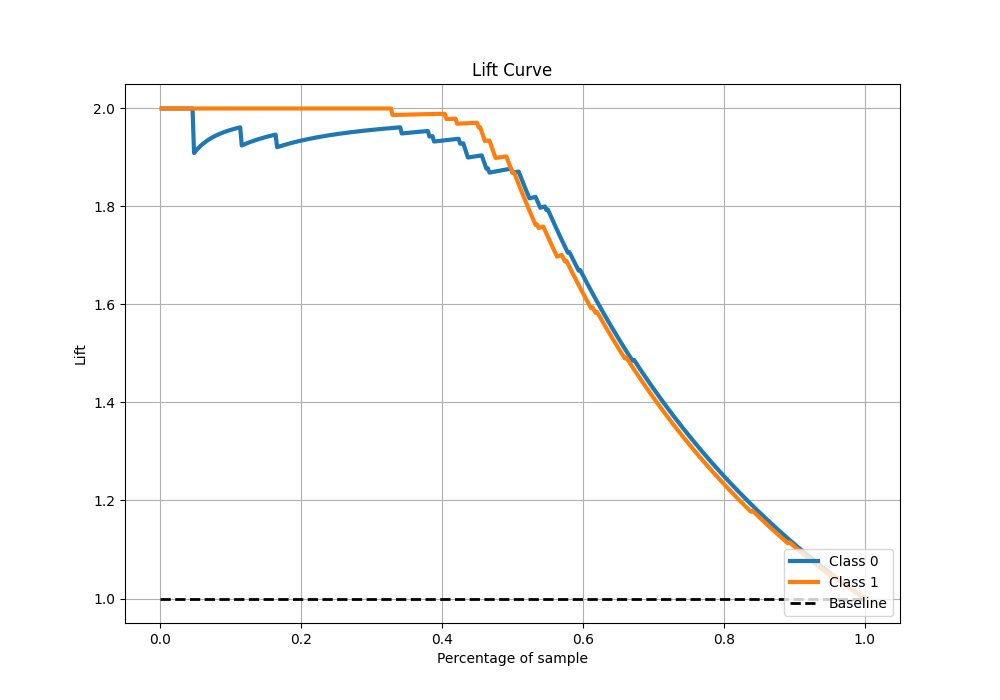

# Summary of 48_ExtraTrees

[<< Go back](../README.md)

## Extra Trees Classifier (Extra Trees)
- **n_jobs**: -1
- **criterion**: gini
- **max_features**: 0.5
- **min_samples_split**: 20
- **max_depth**: 4
- **eval_metric_name**: auc
- **explain_level**: 0

## Validation
 - **validation_type**: kfold
 - **shuffle**: True
 - **stratify**: True
 - **k_folds**: 5

## Optimized metric
auc

## Training time

7.3 seconds

## Metric details
|           |    score |   threshold |
|:----------|---------:|------------:|
| logloss   | 0.208861 | nan         |
| auc       | 0.976812 | nan         |
| f1        | 0.942731 |   0.53521   |
| accuracy  | 0.943231 |   0.53521   |
| precision | 1        |   0.872076  |
| recall    | 1        |   0.0244059 |
| mcc       | 0.886598 |   0.53521   |

## Metric details with threshold from accuracy metric
|           |    score |   threshold |
|:----------|---------:|------------:|
| logloss   | 0.208861 |   nan       |
| auc       | 0.976812 |   nan       |
| f1        | 0.942731 |     0.53521 |
| accuracy  | 0.943231 |     0.53521 |
| precision | 0.951111 |     0.53521 |
| recall    | 0.934498 |     0.53521 |
| mcc       | 0.886598 |     0.53521 |

## Confusion matrix (at threshold=0.53521)
|              |   Predicted as 0 |   Predicted as 1 |
|:-------------|-----------------:|-----------------:|
| Labeled as 0 |              218 |               11 |
| Labeled as 1 |               15 |              214 |

## Learning curves

## Confusion Matrix

## Normalized Confusion Matrix

## ROC Curve

## Kolmogorov-Smirnov Statistic

## Precision-Recall Curve

## Calibration Curve

## Cumulative Gains Curve

## Lift Curve

[<< Go back](../README.md)
