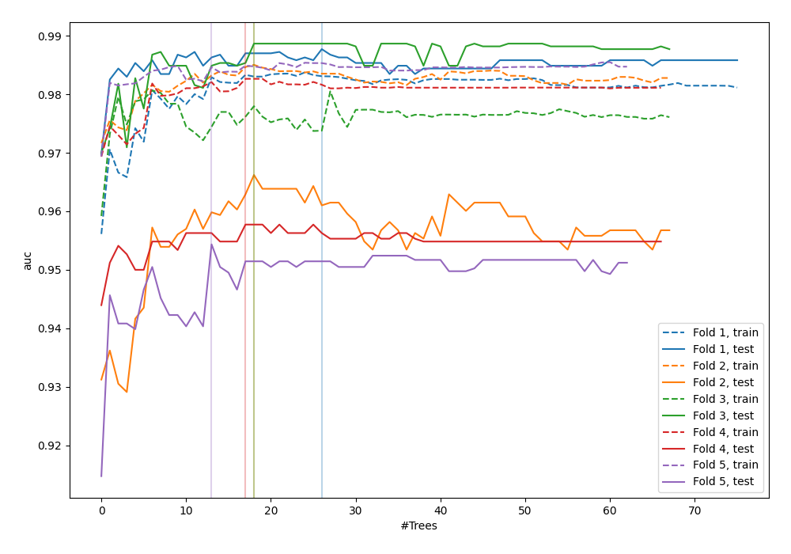
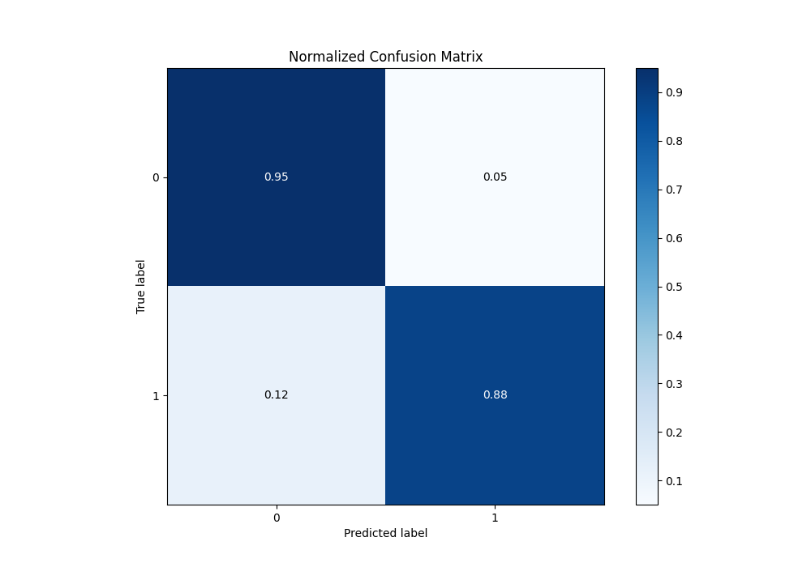
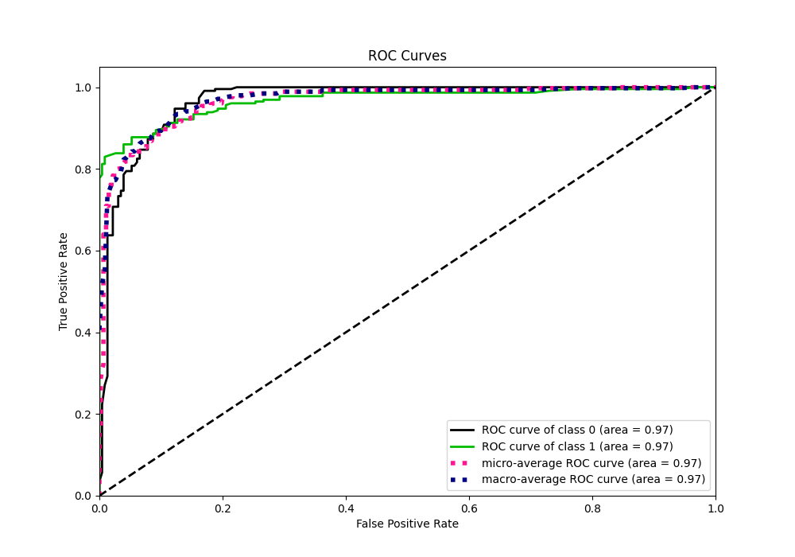
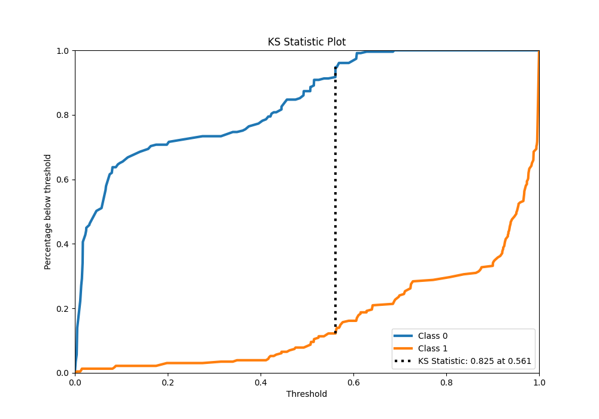
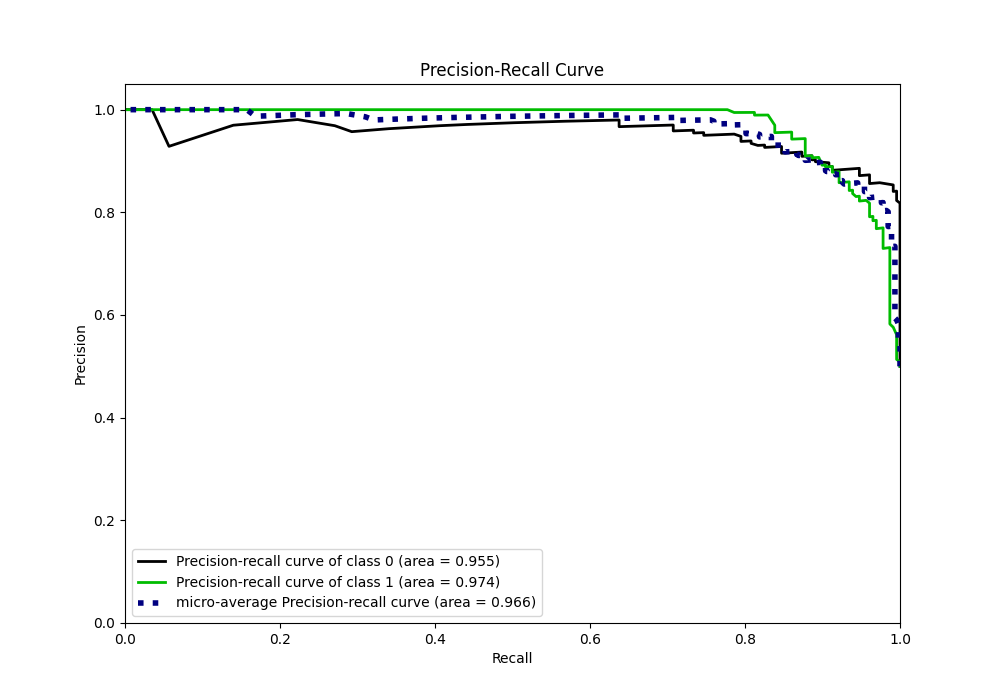
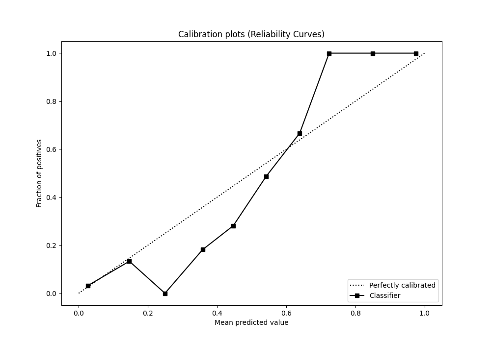
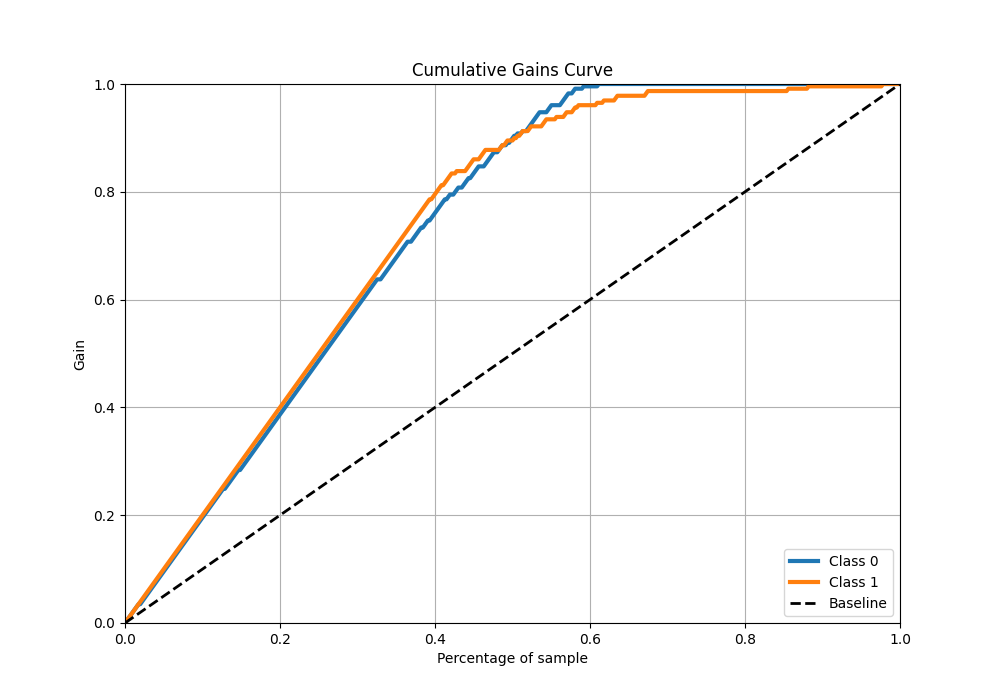
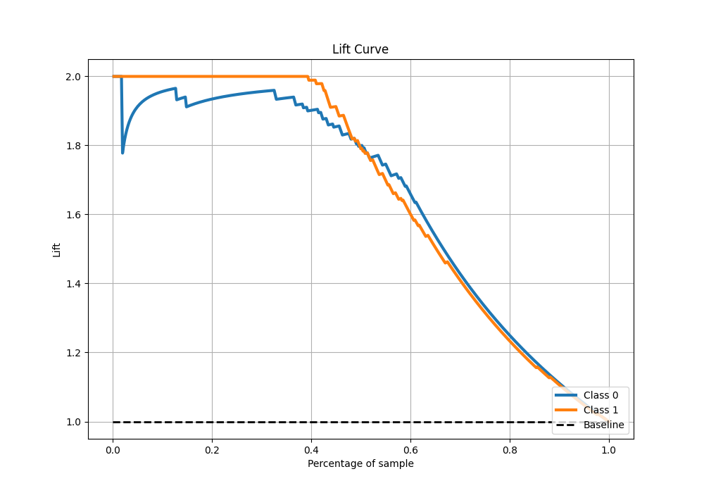

# Summary of 54_ExtraTrees

[<< Go back](../README.md)

## Extra Trees Classifier (Extra Trees)
- **n_jobs**: -1
- **criterion**: gini
- **max_features**: 0.9
- **min_samples_split**: 40
- **max_depth**: 5
- **eval_metric_name**: auc
- **explain_level**: 0

## Validation
 - **validation_type**: kfold
 - **shuffle**: True
 - **stratify**: True
 - **k_folds**: 5

## Optimized metric
auc

## Training time

11.2 seconds

## Metric details
|           |    score |    threshold |
|:----------|---------:|-------------:|
| logloss   | 0.24111  | nan          |
| auc       | 0.967497 | nan          |
| f1        | 0.909502 |   0.561392   |
| accuracy  | 0.912664 |   0.561392   |
| precision | 1        |   0.691766   |
| recall    | 1        |   0.00156926 |
| mcc       | 0.831891 |   0.607471   |

## Metric details with threshold from accuracy metric
|           |    score |   threshold |
|:----------|---------:|------------:|
| logloss   | 0.24111  |  nan        |
| auc       | 0.967497 |  nan        |
| f1        | 0.909502 |    0.561392 |
| accuracy  | 0.912664 |    0.561392 |
| precision | 0.943662 |    0.561392 |
| recall    | 0.877729 |    0.561392 |
| mcc       | 0.827349 |    0.561392 |

## Confusion matrix (at threshold=0.561392)
|              |   Predicted as 0 |   Predicted as 1 |
|:-------------|-----------------:|-----------------:|
| Labeled as 0 |              217 |               12 |
| Labeled as 1 |               28 |              201 |

## Learning curves

## Confusion Matrix

## Normalized Confusion Matrix

## ROC Curve

## Kolmogorov-Smirnov Statistic

## Precision-Recall Curve

## Calibration Curve

## Cumulative Gains Curve

## Lift Curve

[<< Go back](../README.md)
