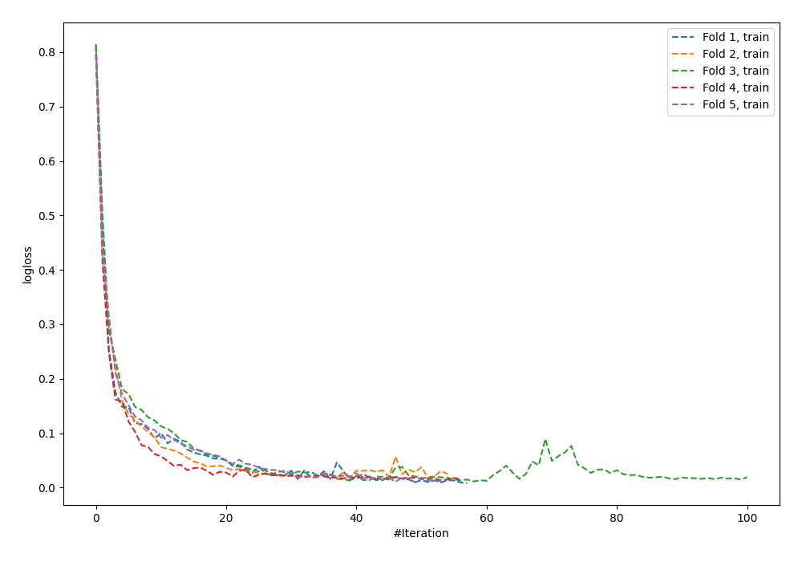
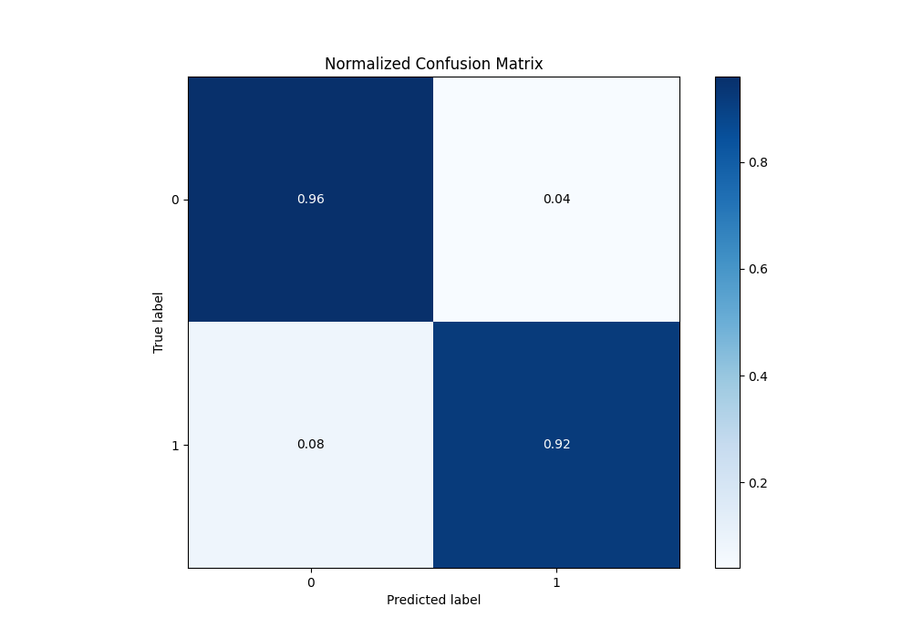
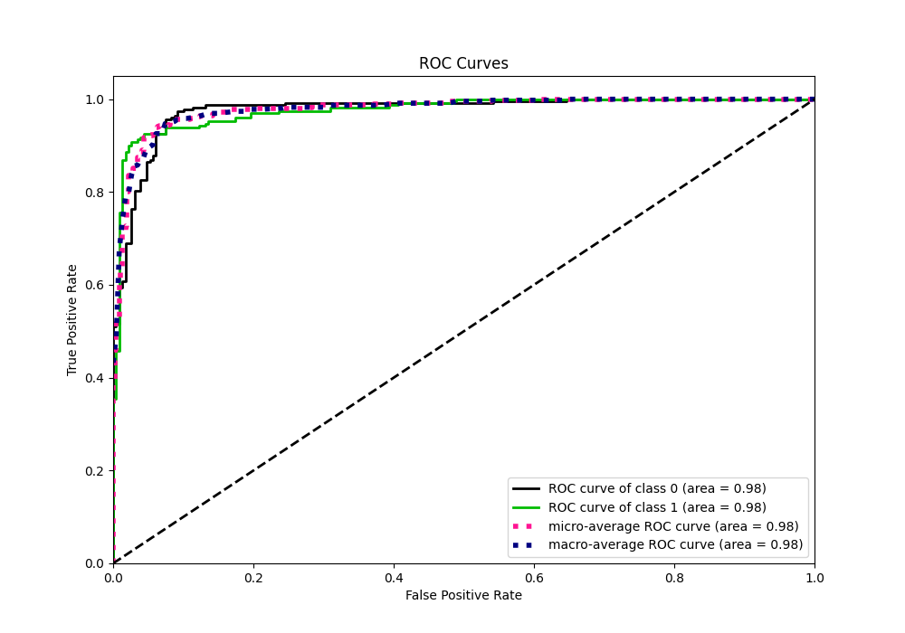
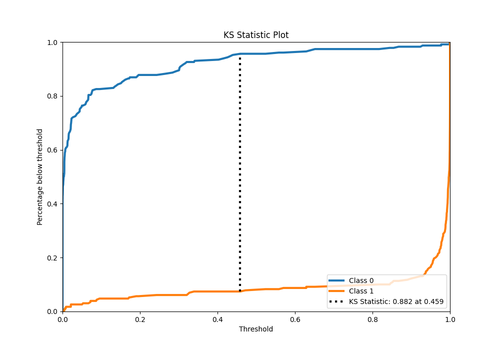
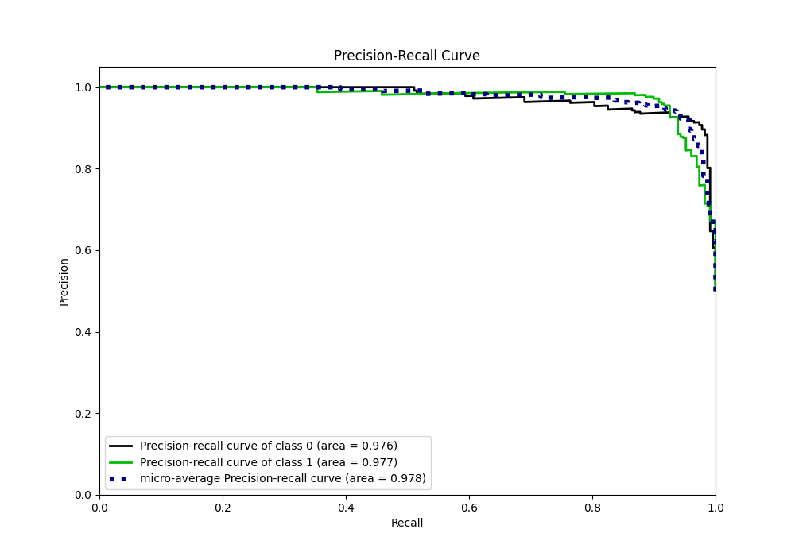
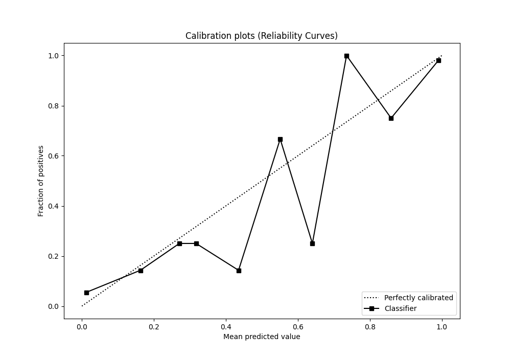
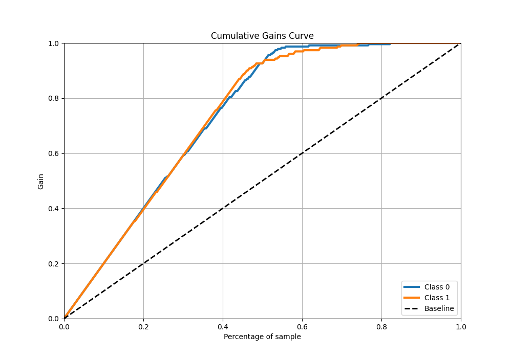
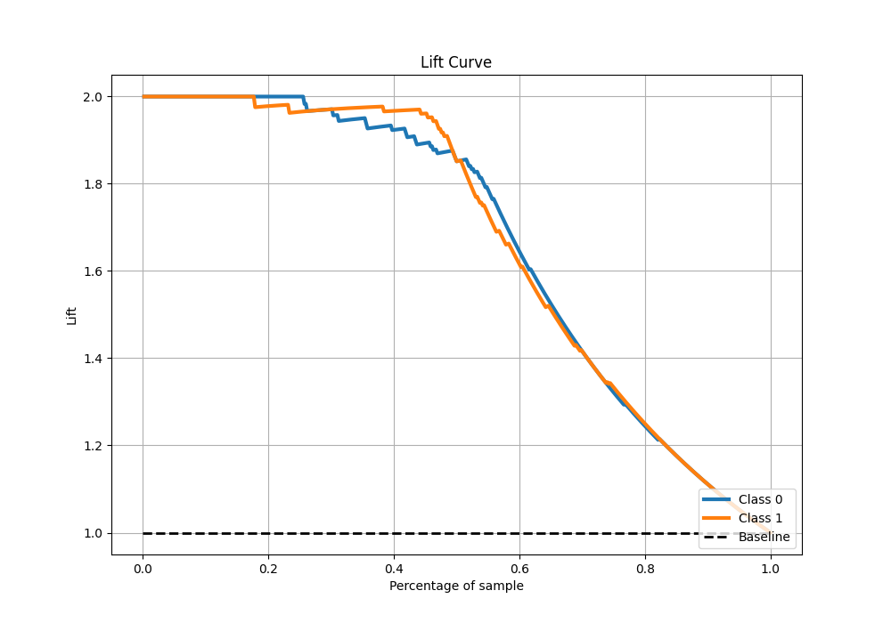

# Summary of 64_NeuralNetwork

[<< Go back](../README.md)

## Neural Network
- **n_jobs**: -1
- **dense_1_size**: 64
- **dense_2_size**: 8
- **learning_rate**: 0.1
- **explain_level**: 0

## Validation
 - **validation_type**: kfold
 - **shuffle**: True
 - **stratify**: True
 - **k_folds**: 5

## Optimized metric
auc

## Training time

11.3 seconds

## Metric details
|           |    score |     threshold |
|:----------|---------:|--------------:|
| logloss   | 0.208019 | nan           |
| auc       | 0.976545 | nan           |
| f1        | 0.937778 |   0.497977    |
| accuracy  | 0.938865 |   0.497977    |
| precision | 1        |   0.999519    |
| recall    | 1        |   9.37094e-14 |
| mcc       | 0.87988  |   0.776104    |

## Metric details with threshold from accuracy metric
|           |    score |   threshold |
|:----------|---------:|------------:|
| logloss   | 0.208019 |  nan        |
| auc       | 0.976545 |  nan        |
| f1        | 0.937778 |    0.497977 |
| accuracy  | 0.938865 |    0.497977 |
| precision | 0.954751 |    0.497977 |
| recall    | 0.921397 |    0.497977 |
| mcc       | 0.878265 |    0.497977 |

## Confusion matrix (at threshold=0.497977)
|              |   Predicted as 0 |   Predicted as 1 |
|:-------------|-----------------:|-----------------:|
| Labeled as 0 |              219 |               10 |
| Labeled as 1 |               18 |              211 |

## Learning curves

## Confusion Matrix

## Normalized Confusion Matrix

## ROC Curve

## Kolmogorov-Smirnov Statistic

## Precision-Recall Curve

## Calibration Curve

## Cumulative Gains Curve

## Lift Curve

[<< Go back](../README.md)
