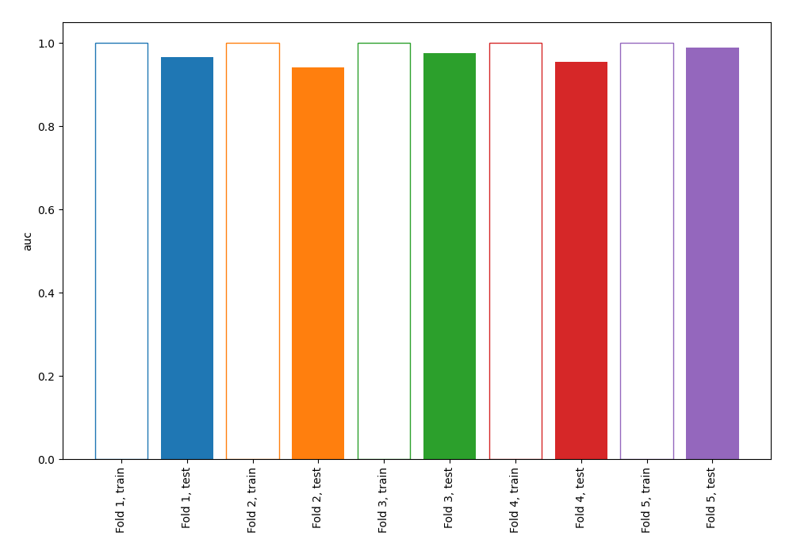
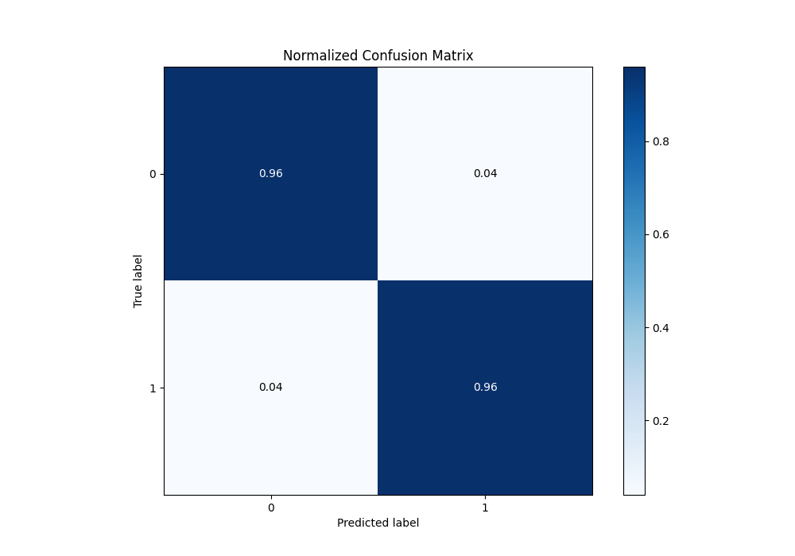
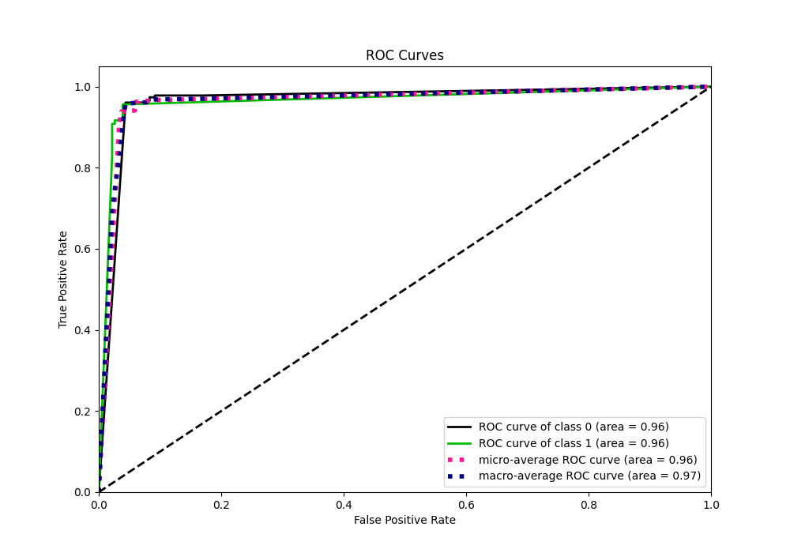
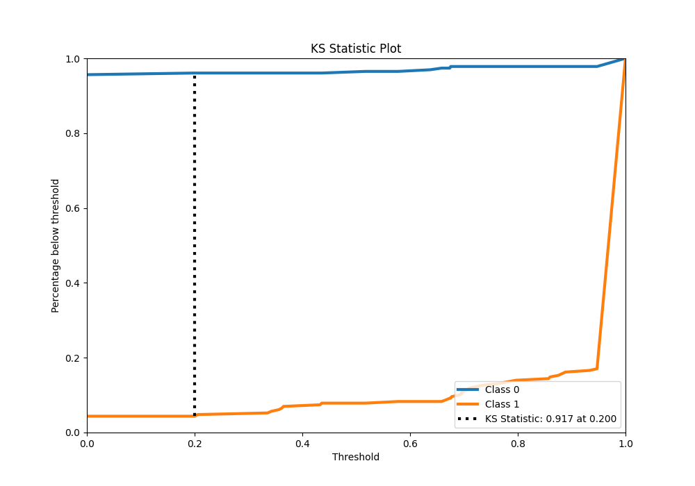
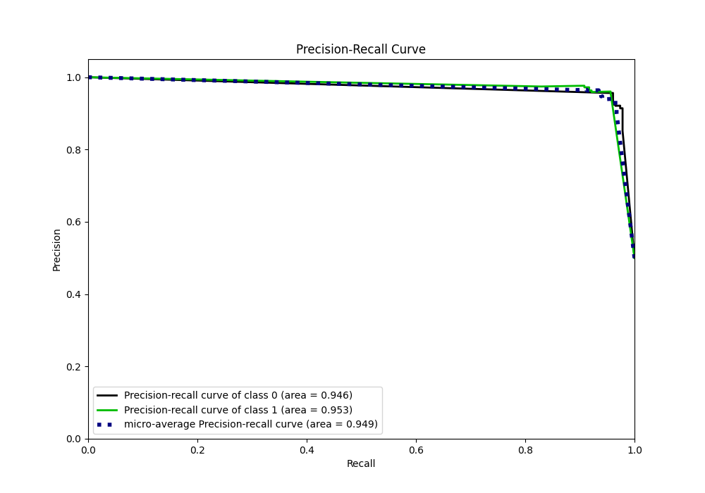
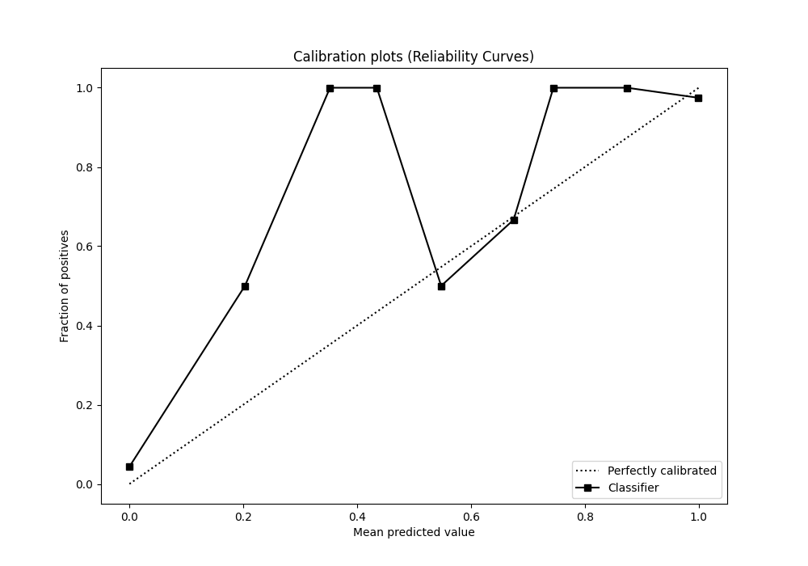
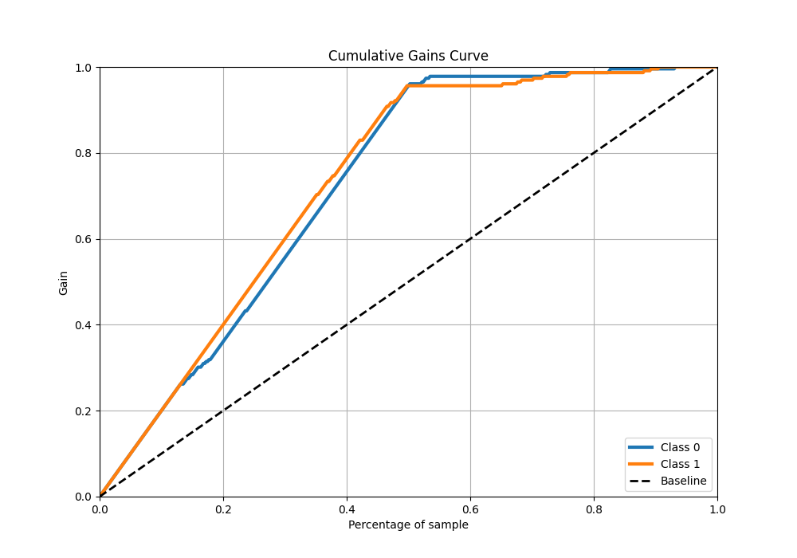
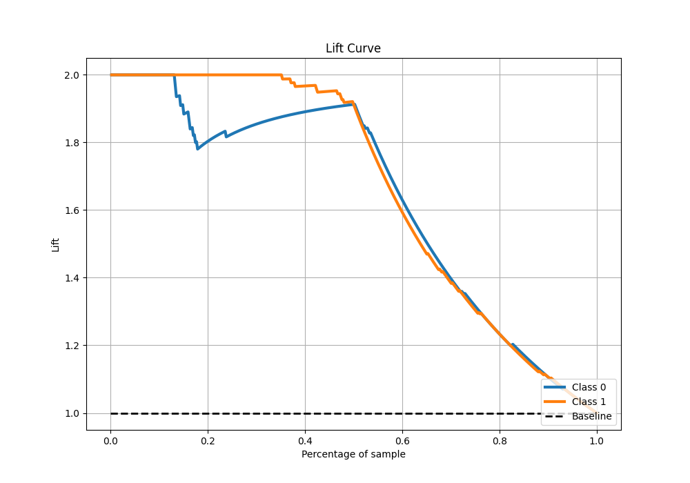

# Summary of 72_NearestNeighbors

[<< Go back](../README.md)

## k-Nearest Neighbors (Nearest Neighbors)
- **n_jobs**: -1
- **n_neighbors**: 3
- **weights**: distance
- **explain_level**: 0

## Validation
 - **validation_type**: kfold
 - **shuffle**: True
 - **stratify**: True
 - **k_folds**: 5

## Optimized metric
auc

## Training time

9.0 seconds

## Metric details
|           |    score |   threshold |
|:----------|---------:|------------:|
| logloss   | 0.562154 |  nan        |
| auc       | 0.964684 |  nan        |
| f1        | 0.956332 |    0        |
| accuracy  | 0.956332 |    0        |
| precision | 0.976526 |    0.676379 |
| recall    | 0.956332 |    0        |
| mcc       | 0.912664 |    0        |

## Metric details with threshold from accuracy metric
|           |    score |   threshold |
|:----------|---------:|------------:|
| logloss   | 0.562154 |         nan |
| auc       | 0.964684 |         nan |
| f1        | 0.956332 |           0 |
| accuracy  | 0.956332 |           0 |
| precision | 0.956332 |           0 |
| recall    | 0.956332 |           0 |
| mcc       | 0.912664 |           0 |

## Confusion matrix (at threshold=0.0)
|              |   Predicted as 0 |   Predicted as 1 |
|:-------------|-----------------:|-----------------:|
| Labeled as 0 |              219 |               10 |
| Labeled as 1 |               10 |              219 |

## Learning curves

## Confusion Matrix

## Normalized Confusion Matrix

## ROC Curve

## Kolmogorov-Smirnov Statistic

## Precision-Recall Curve

## Calibration Curve

## Cumulative Gains Curve

## Lift Curve

[<< Go back](../README.md)
