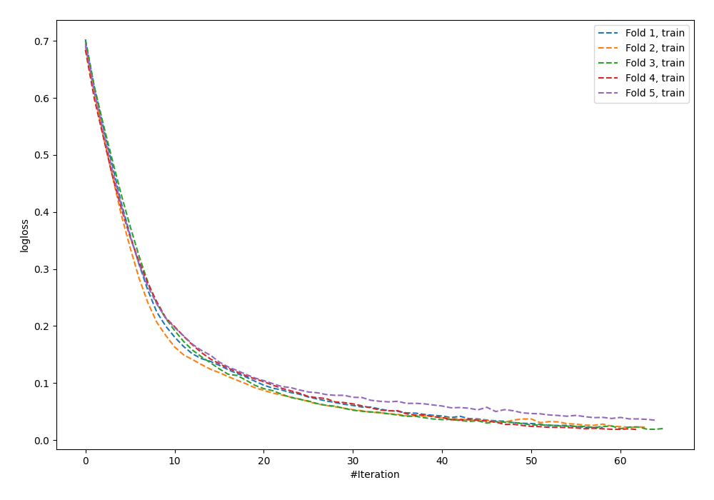
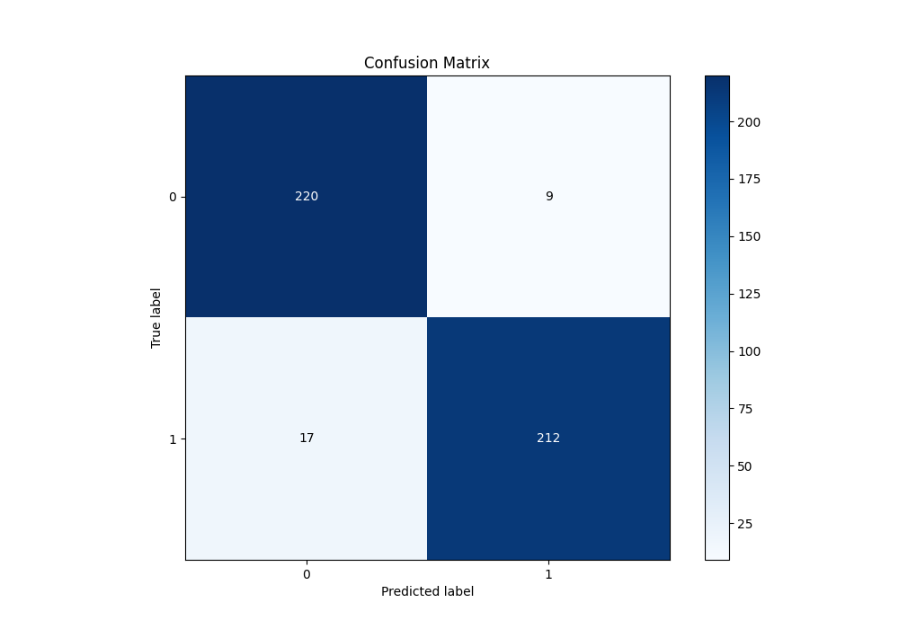
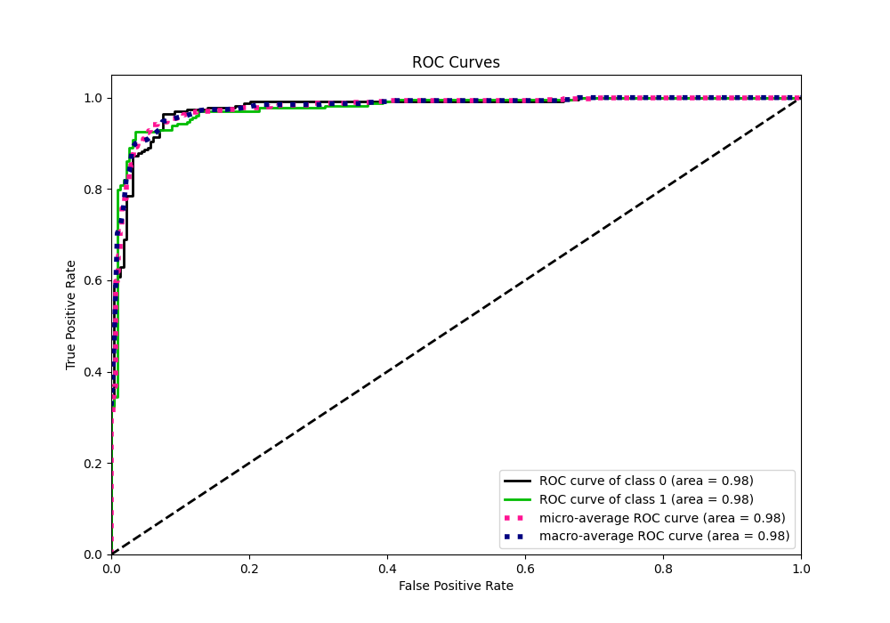
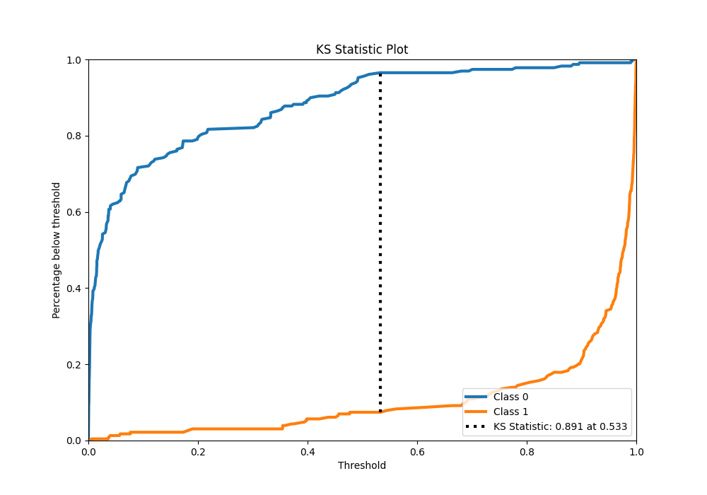
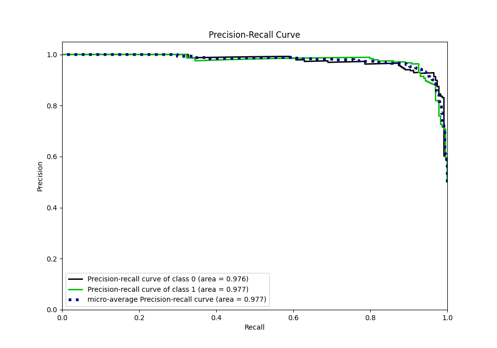
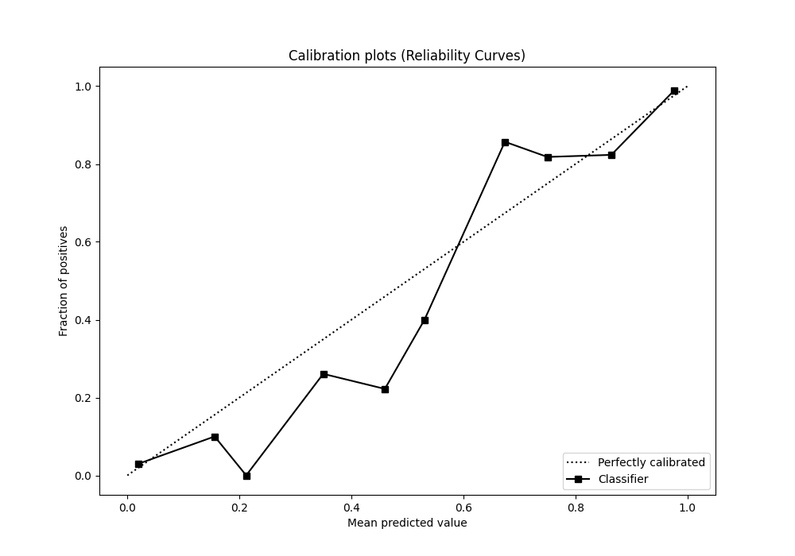
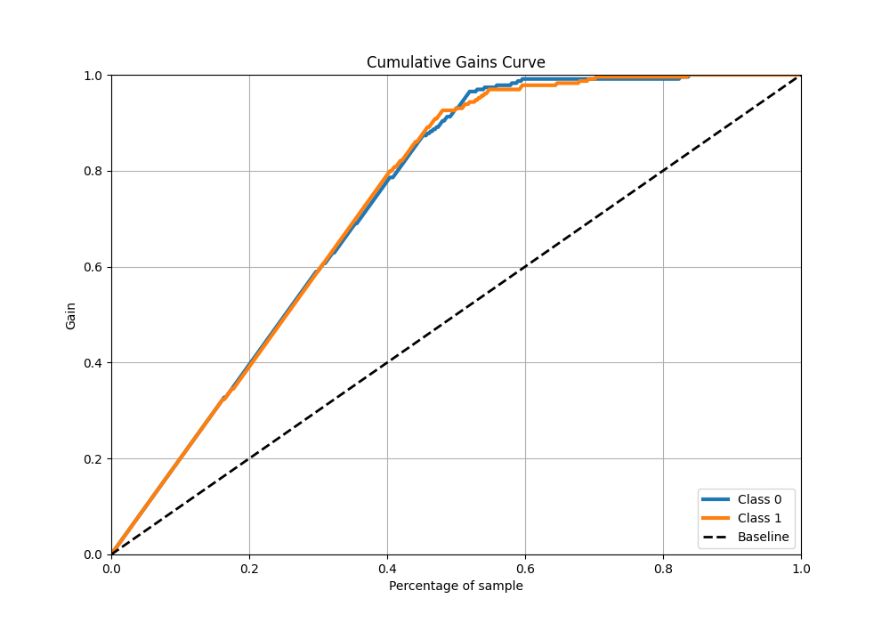
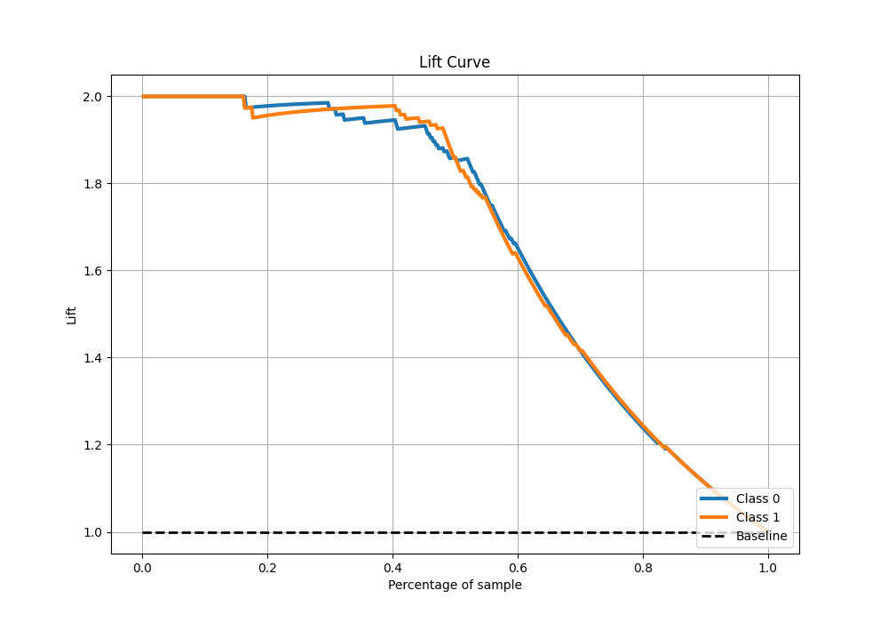

# Summary of 80_NeuralNetwork

[<< Go back](../README.md)

## Neural Network
- **n_jobs**: -1
- **dense_1_size**: 32
- **dense_2_size**: 16
- **learning_rate**: 0.01
- **explain_level**: 0

## Validation
 - **validation_type**: kfold
 - **shuffle**: True
 - **stratify**: True
 - **k_folds**: 5

## Optimized metric
auc

## Training time

12.5 seconds

## Metric details
|           |    score |     threshold |
|:----------|---------:|--------------:|
| logloss   | 0.190483 | nan           |
| auc       | 0.976888 | nan           |
| f1        | 0.942222 |   0.522249    |
| accuracy  | 0.943231 |   0.522249    |
| precision | 1        |   0.99281     |
| recall    | 1        |   0.000100382 |
| mcc       | 0.887004 |   0.522249    |

## Metric details with threshold from accuracy metric
|           |    score |   threshold |
|:----------|---------:|------------:|
| logloss   | 0.190483 |  nan        |
| auc       | 0.976888 |  nan        |
| f1        | 0.942222 |    0.522249 |
| accuracy  | 0.943231 |    0.522249 |
| precision | 0.959276 |    0.522249 |
| recall    | 0.925764 |    0.522249 |
| mcc       | 0.887004 |    0.522249 |

## Confusion matrix (at threshold=0.522249)
|              |   Predicted as 0 |   Predicted as 1 |
|:-------------|-----------------:|-----------------:|
| Labeled as 0 |              220 |                9 |
| Labeled as 1 |               17 |              212 |

## Learning curves

## Confusion Matrix

## Normalized Confusion Matrix

## ROC Curve

## Kolmogorov-Smirnov Statistic

## Precision-Recall Curve

## Calibration Curve

## Cumulative Gains Curve

## Lift Curve

[<< Go back](../README.md)
