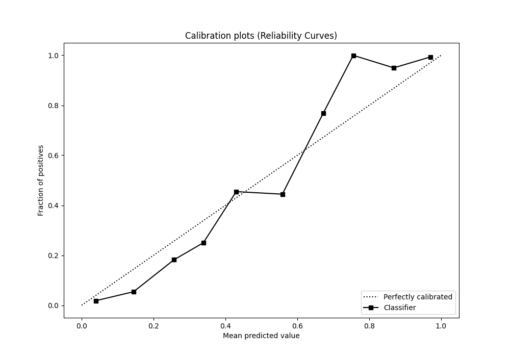

# Summary of 83_LightGBM

[<< Go back](../README.md)

## LightGBM
- **n_jobs**: -1
- **objective**: binary
- **num_leaves**: 63
- **learning_rate**: 0.2
- **feature_fraction**: 0.5
- **bagging_fraction**: 0.9
- **min_data_in_leaf**: 30
- **metric**: auc
- **custom_eval_metric_name**: None
- **explain_level**: 0

## Validation
 - **validation_type**: kfold
 - **shuffle**: True
 - **stratify**: True
 - **k_folds**: 5

## Optimized metric
auc

## Training time

13.1 seconds

## Metric details
|           |    score |     threshold |
|:----------|---------:|--------------:|
| logloss   | 0.1719   | nan           |
| auc       | 0.983009 | nan           |
| f1        | 0.954447 |   0.407416    |
| accuracy  | 0.954148 |   0.407416    |
| precision | 1        |   0.921069    |
| recall    | 1        |   0.000281163 |
| mcc       | 0.908375 |   0.407416    |

## Metric details with threshold from accuracy metric
|           |    score |   threshold |
|:----------|---------:|------------:|
| logloss   | 0.1719   |  nan        |
| auc       | 0.983009 |  nan        |
| f1        | 0.954447 |    0.407416 |
| accuracy  | 0.954148 |    0.407416 |
| precision | 0.948276 |    0.407416 |
| recall    | 0.960699 |    0.407416 |
| mcc       | 0.908375 |    0.407416 |

## Confusion matrix (at threshold=0.407416)
|              |   Predicted as 0 |   Predicted as 1 |
|:-------------|-----------------:|-----------------:|
| Labeled as 0 |              217 |               12 |
| Labeled as 1 |                9 |              220 |

## Learning curves

## Confusion Matrix

## Normalized Confusion Matrix

## ROC Curve

## Kolmogorov-Smirnov Statistic

## Precision-Recall Curve

## Calibration Curve

## Cumulative Gains Curve

## Lift Curve

[<< Go back](../README.md)
