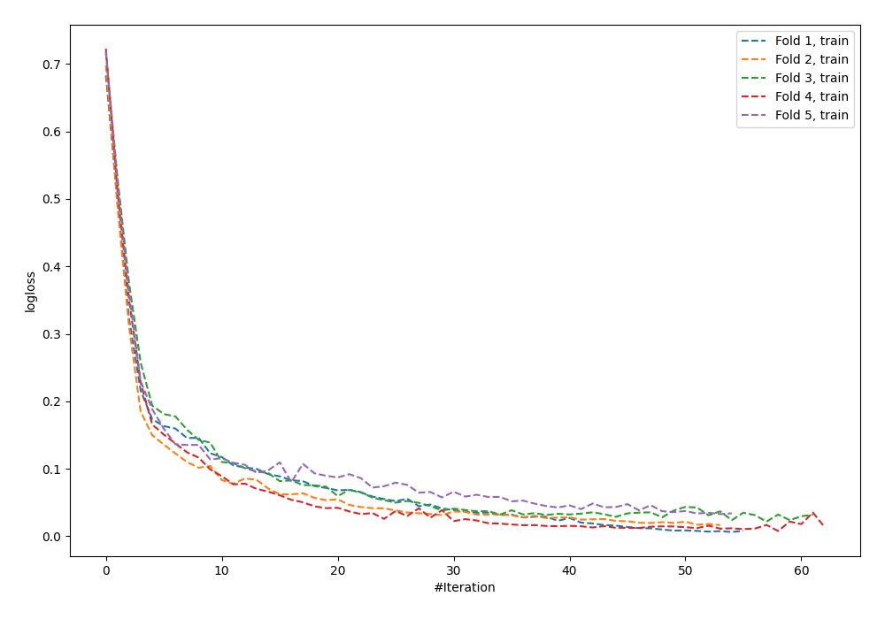
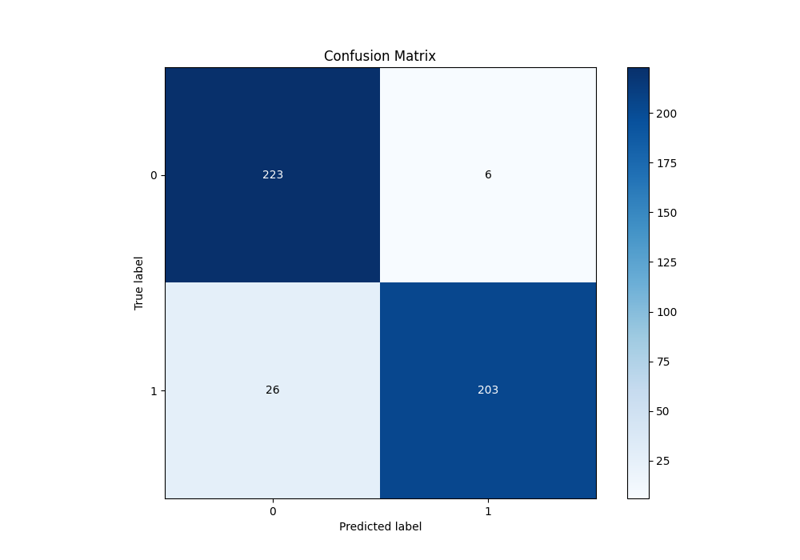
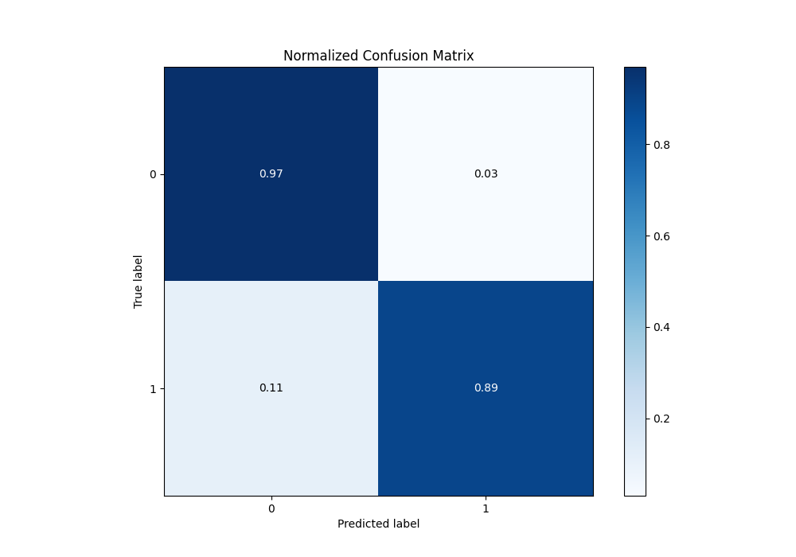
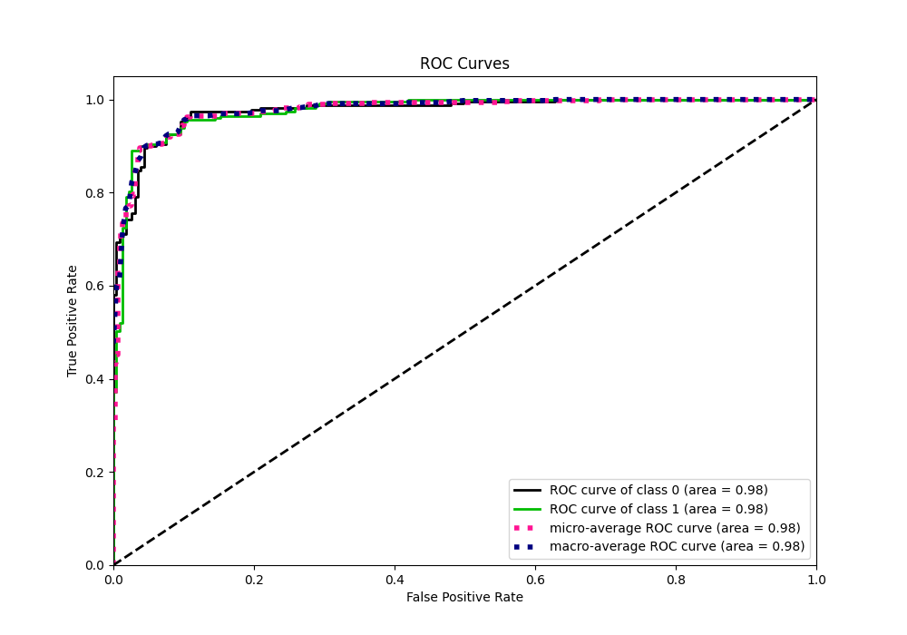
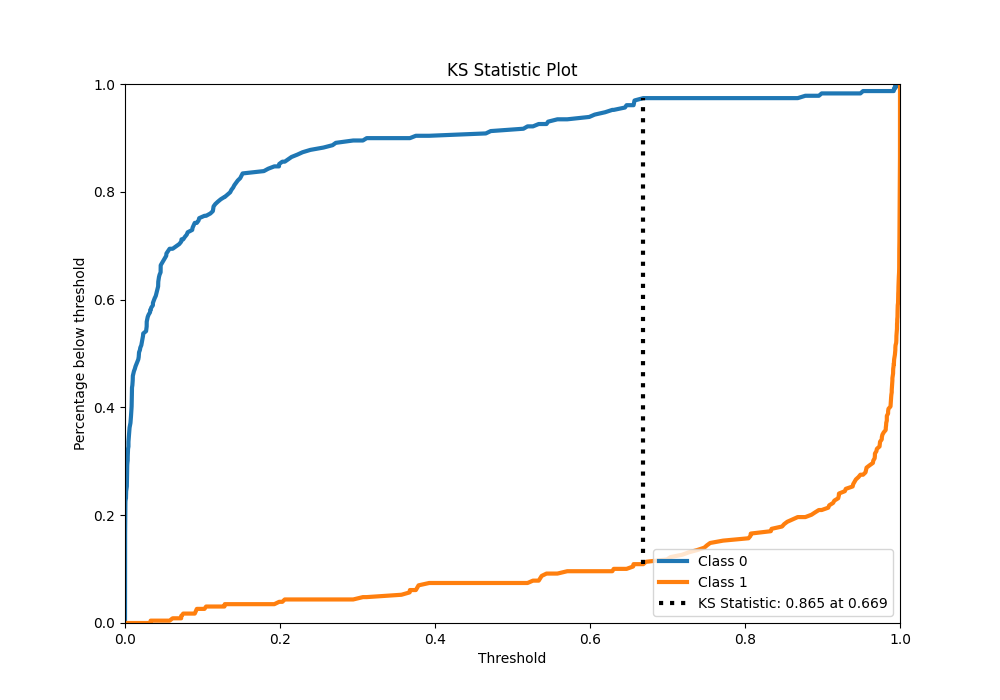
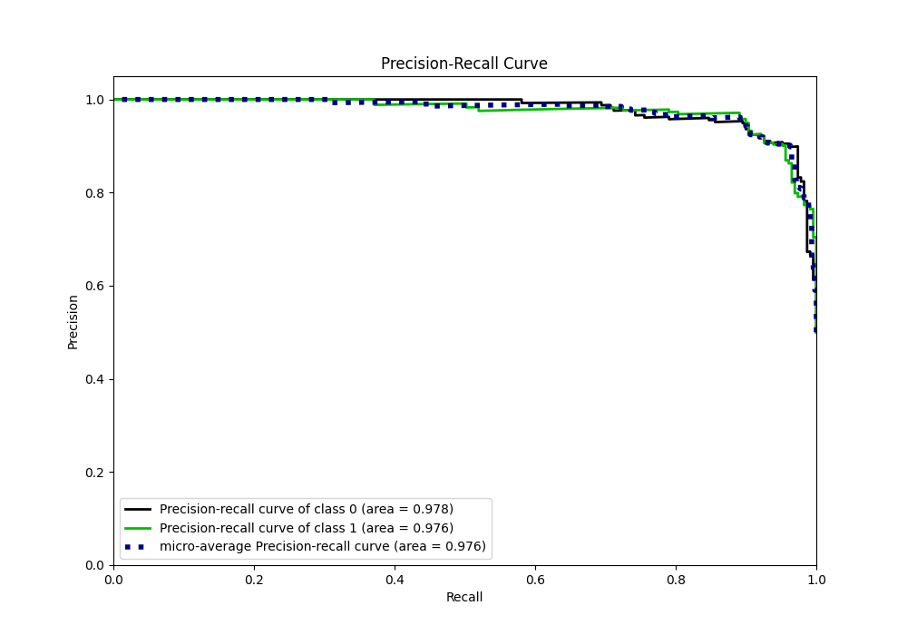
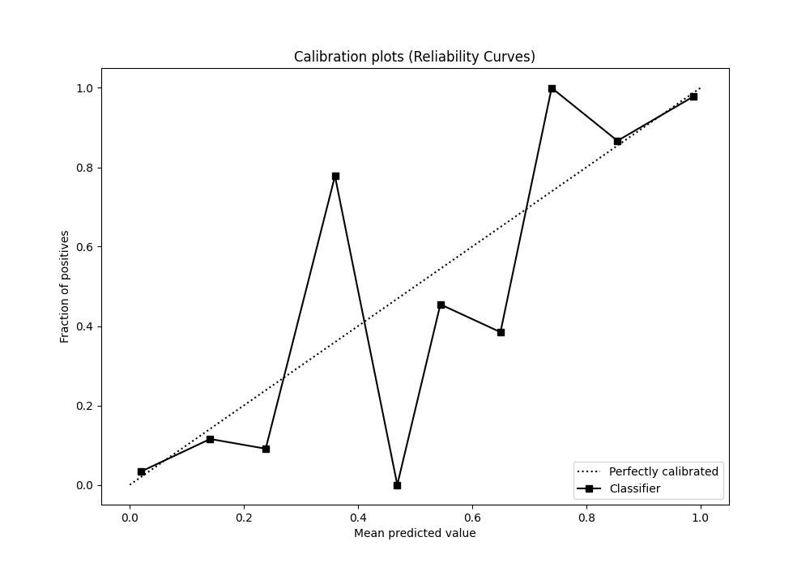
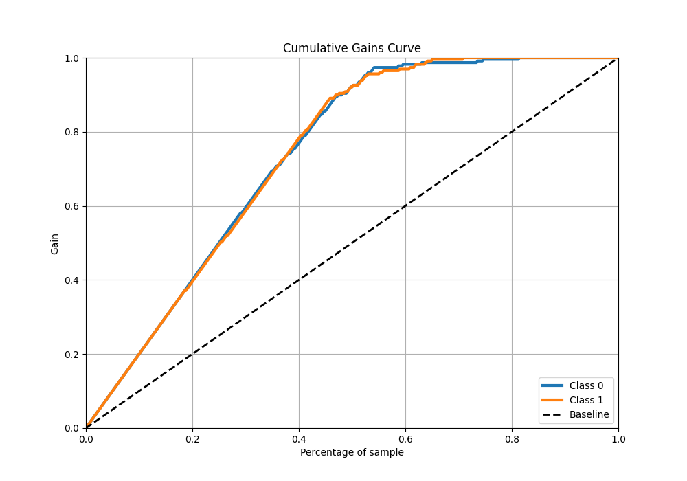
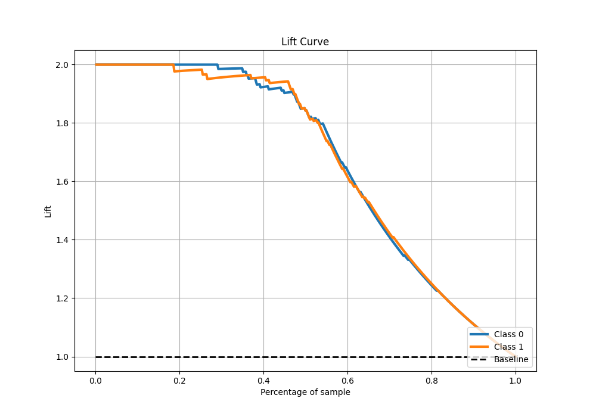

# Summary of 85_NeuralNetwork

[<< Go back](../README.md)

## Neural Network
- **n_jobs**: -1
- **dense_1_size**: 16
- **dense_2_size**: 16
- **learning_rate**: 0.05
- **explain_level**: 0

## Validation
 - **validation_type**: kfold
 - **shuffle**: True
 - **stratify**: True
 - **k_folds**: 5

## Optimized metric
auc

## Training time

13.3 seconds

## Metric details
|           |    score |     threshold |
|:----------|---------:|--------------:|
| logloss   | 0.198288 | nan           |
| auc       | 0.97645  | nan           |
| f1        | 0.92766  |   0.334302    |
| accuracy  | 0.930131 |   0.685735    |
| precision | 1        |   0.998165    |
| recall    | 1        |   2.94314e-07 |
| mcc       | 0.863562 |   0.685735    |

## Metric details with threshold from accuracy metric
|           |    score |   threshold |
|:----------|---------:|------------:|
| logloss   | 0.198288 |  nan        |
| auc       | 0.97645  |  nan        |
| f1        | 0.926941 |    0.685735 |
| accuracy  | 0.930131 |    0.685735 |
| precision | 0.971292 |    0.685735 |
| recall    | 0.886463 |    0.685735 |
| mcc       | 0.863562 |    0.685735 |

## Confusion matrix (at threshold=0.685735)
|              |   Predicted as 0 |   Predicted as 1 |
|:-------------|-----------------:|-----------------:|
| Labeled as 0 |              223 |                6 |
| Labeled as 1 |               26 |              203 |

## Learning curves

## Confusion Matrix

## Normalized Confusion Matrix

## ROC Curve

## Kolmogorov-Smirnov Statistic

## Precision-Recall Curve

## Calibration Curve

## Cumulative Gains Curve

## Lift Curve

[<< Go back](../README.md)
