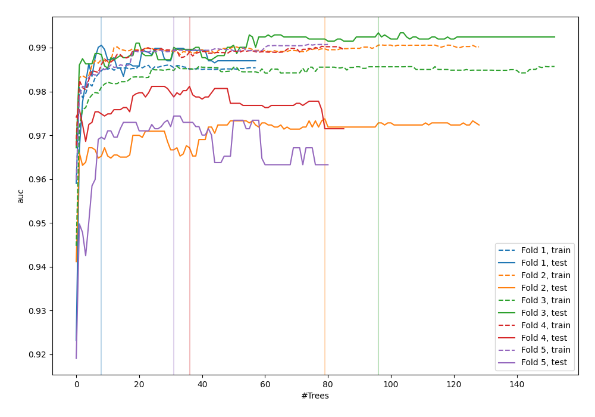
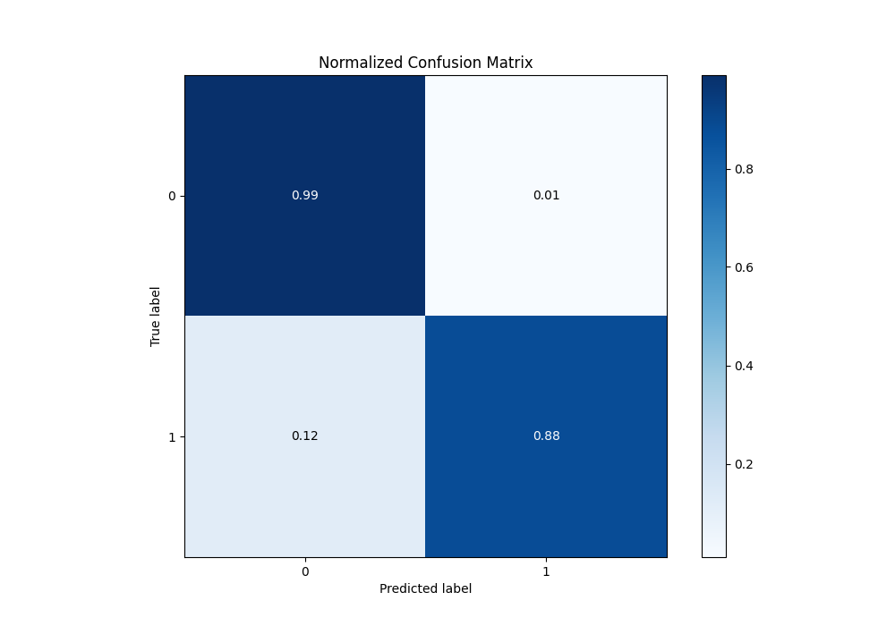
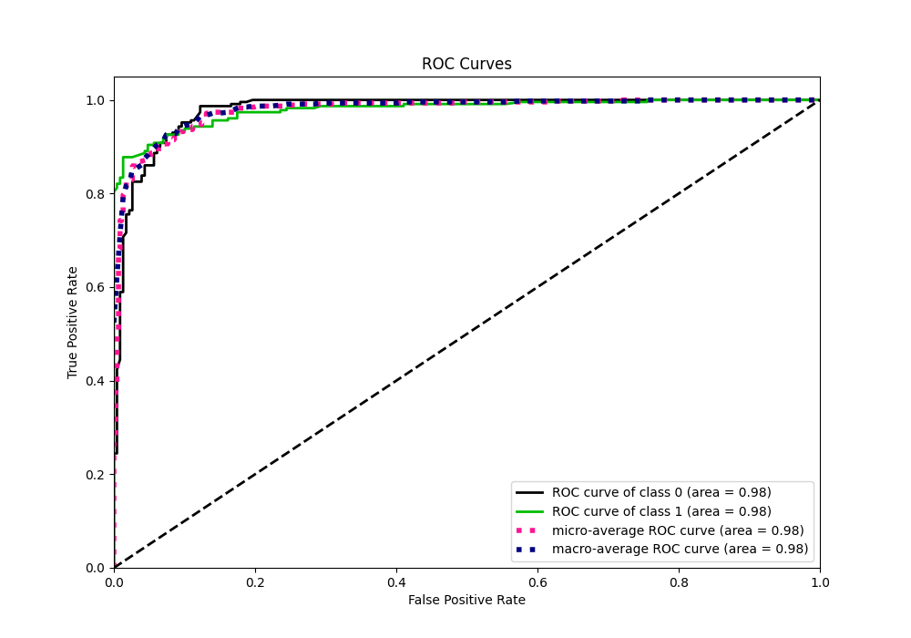
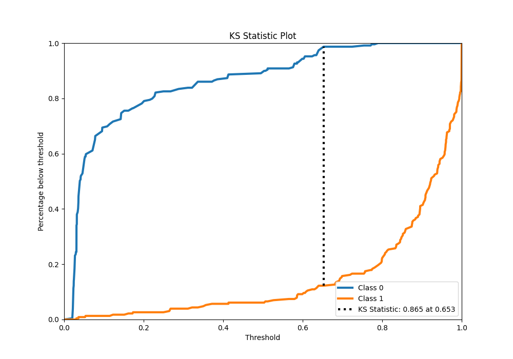
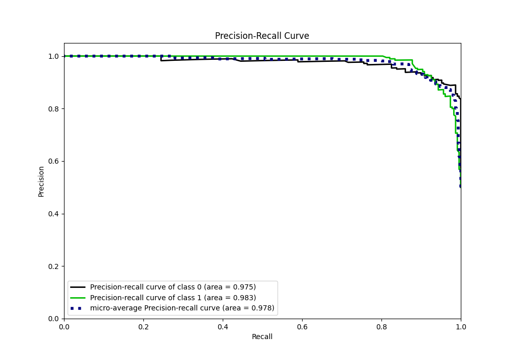
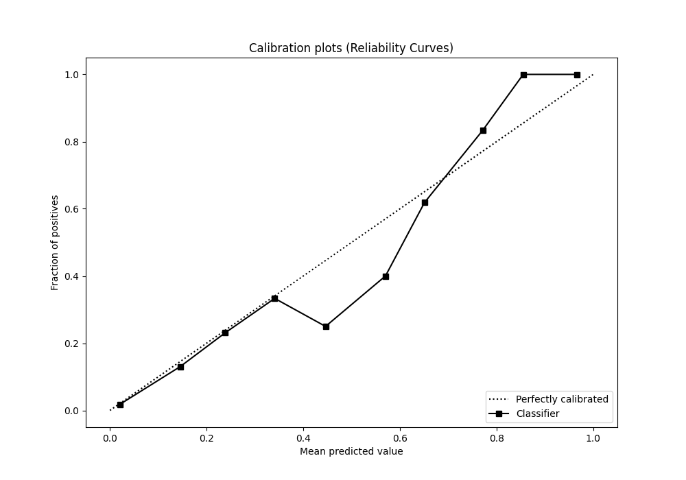
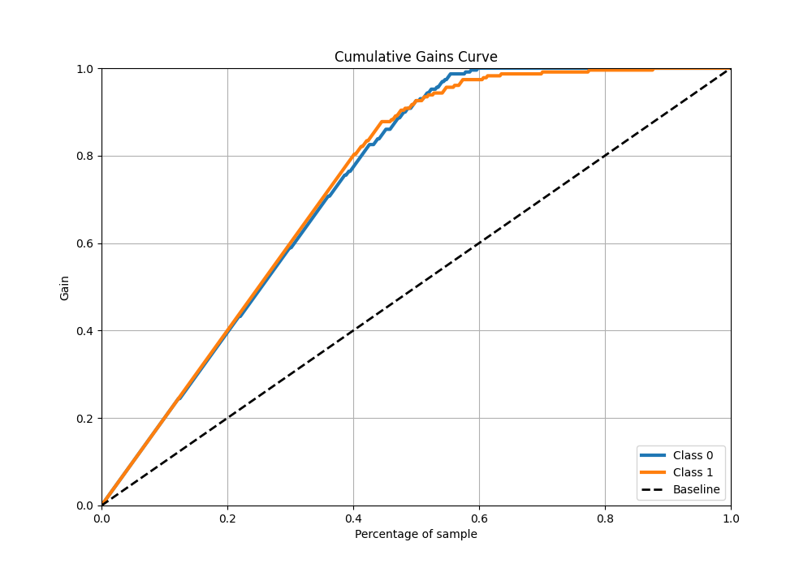
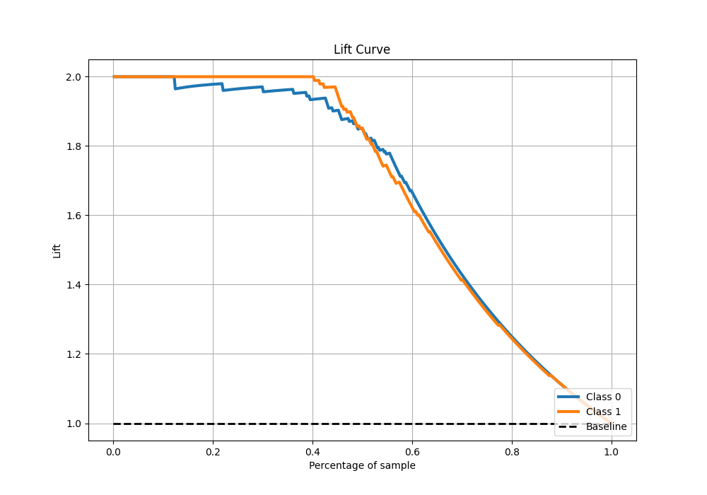

# Summary of 93_ExtraTrees

[<< Go back](../README.md)

## Extra Trees Classifier (Extra Trees)
- **n_jobs**: -1
- **criterion**: entropy
- **max_features**: 0.6
- **min_samples_split**: 20
- **max_depth**: 4
- **eval_metric_name**: auc
- **explain_level**: 0

## Validation
 - **validation_type**: kfold
 - **shuffle**: True
 - **stratify**: True
 - **k_folds**: 5

## Optimized metric
auc

## Training time

16.7 seconds

## Metric details
|           |    score |   threshold |
|:----------|---------:|------------:|
| logloss   | 0.203751 | nan         |
| auc       | 0.979148 | nan         |
| f1        | 0.928406 |   0.652586  |
| accuracy  | 0.932314 |   0.652586  |
| precision | 1        |   0.789474  |
| recall    | 1        |   0.0185205 |
| mcc       | 0.869828 |   0.652586  |

## Metric details with threshold from accuracy metric
|           |    score |   threshold |
|:----------|---------:|------------:|
| logloss   | 0.203751 |  nan        |
| auc       | 0.979148 |  nan        |
| f1        | 0.928406 |    0.652586 |
| accuracy  | 0.932314 |    0.652586 |
| precision | 0.985294 |    0.652586 |
| recall    | 0.877729 |    0.652586 |
| mcc       | 0.869828 |    0.652586 |

## Confusion matrix (at threshold=0.652586)
|              |   Predicted as 0 |   Predicted as 1 |
|:-------------|-----------------:|-----------------:|
| Labeled as 0 |              226 |                3 |
| Labeled as 1 |               28 |              201 |

## Learning curves

## Confusion Matrix

## Normalized Confusion Matrix

## ROC Curve

## Kolmogorov-Smirnov Statistic

## Precision-Recall Curve

## Calibration Curve

## Cumulative Gains Curve

## Lift Curve

[<< Go back](../README.md)
