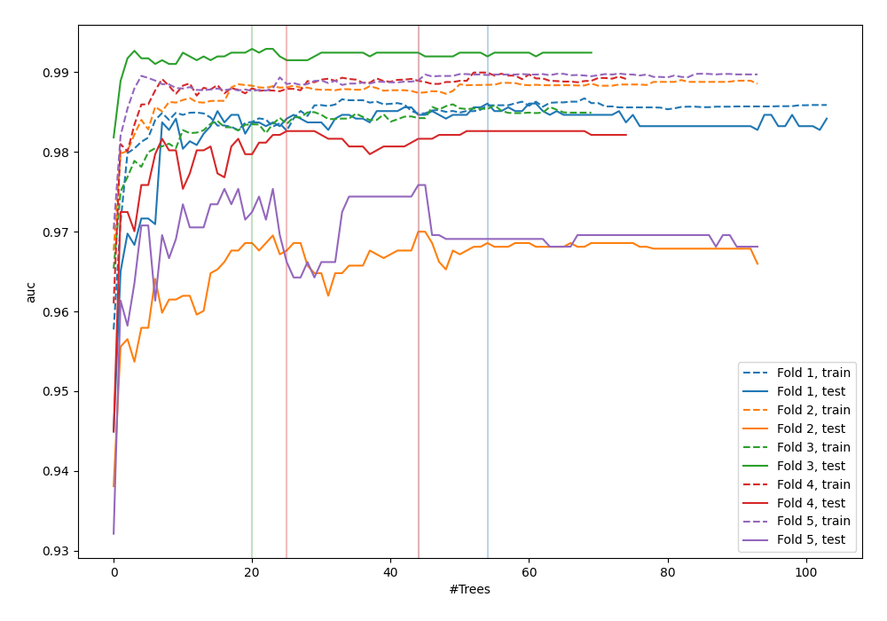
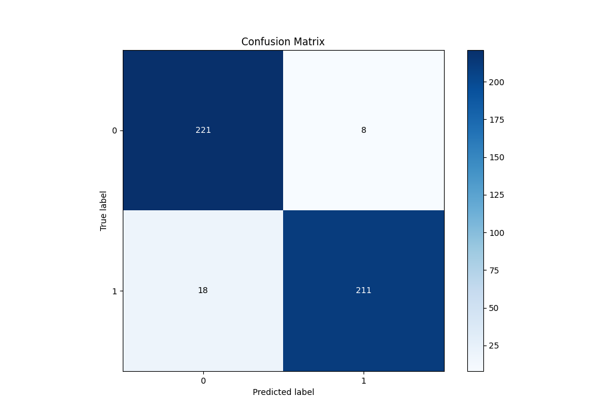
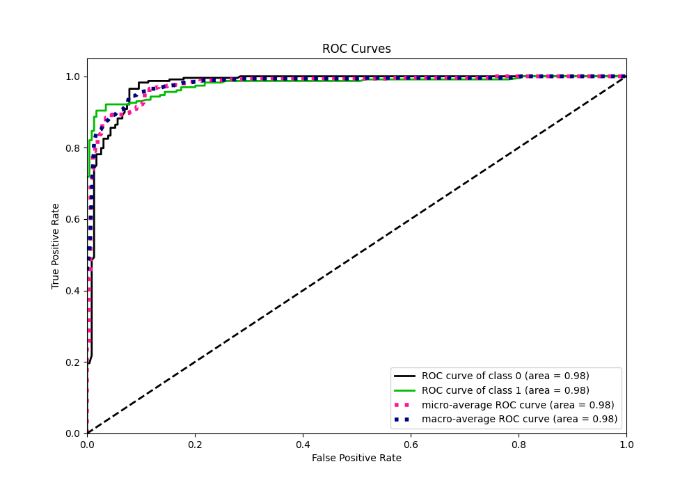
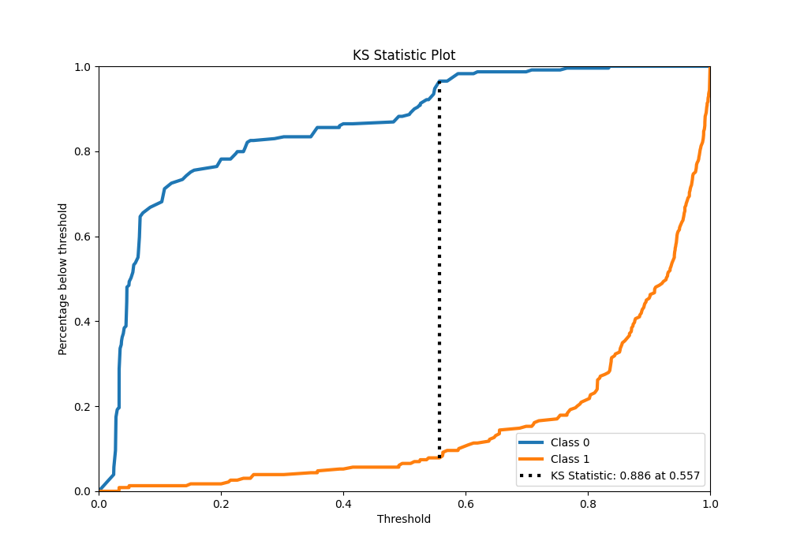
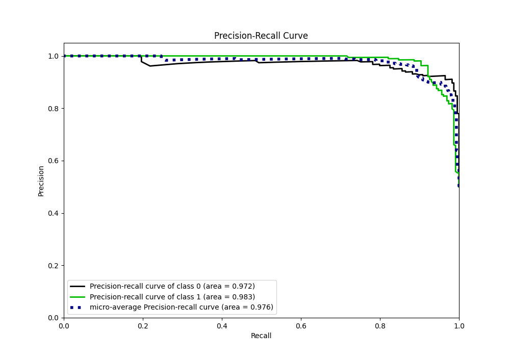
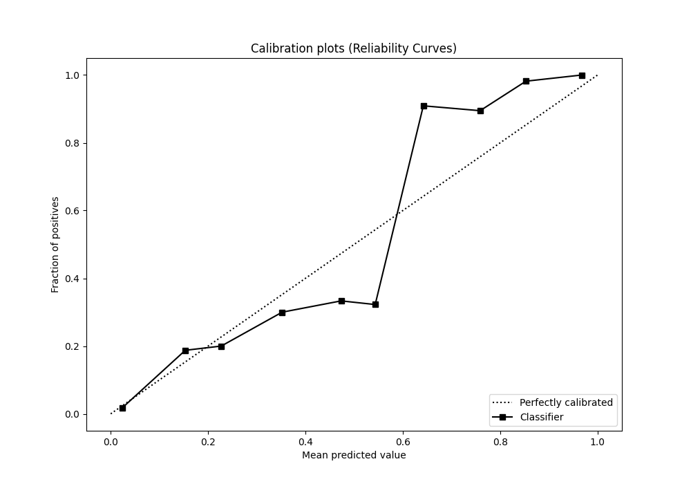
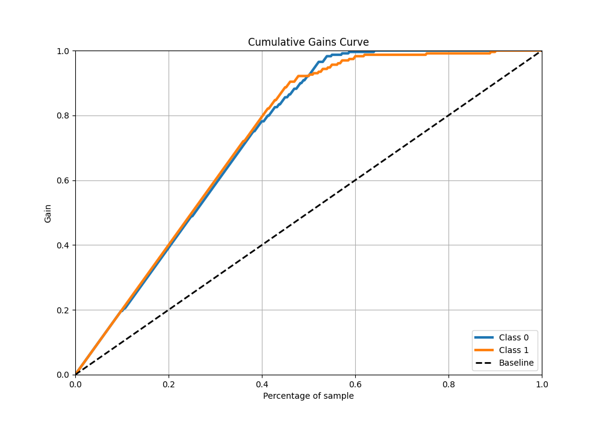
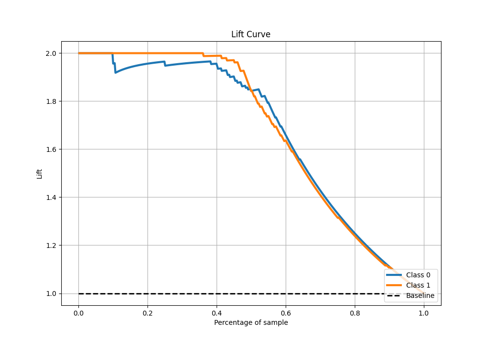

# Summary of 95_ExtraTrees

[<< Go back](../README.md)

## Extra Trees Classifier (Extra Trees)
- **n_jobs**: -1
- **criterion**: entropy
- **max_features**: 0.5
- **min_samples_split**: 20
- **max_depth**: 4
- **eval_metric_name**: auc
- **explain_level**: 0

## Validation
 - **validation_type**: kfold
 - **shuffle**: True
 - **stratify**: True
 - **k_folds**: 5

## Optimized metric
auc

## Training time

15.9 seconds

## Metric details
|           |    score |   threshold |
|:----------|---------:|------------:|
| logloss   | 0.206884 |  nan        |
| auc       | 0.978471 |  nan        |
| f1        | 0.941964 |    0.557395 |
| accuracy  | 0.943231 |    0.557395 |
| precision | 1        |    0.835877 |
| recall    | 1        |    0.022154 |
| mcc       | 0.889214 |    0.587661 |

## Metric details with threshold from accuracy metric
|           |    score |   threshold |
|:----------|---------:|------------:|
| logloss   | 0.206884 |  nan        |
| auc       | 0.978471 |  nan        |
| f1        | 0.941964 |    0.557395 |
| accuracy  | 0.943231 |    0.557395 |
| precision | 0.96347  |    0.557395 |
| recall    | 0.921397 |    0.557395 |
| mcc       | 0.887309 |    0.557395 |

## Confusion matrix (at threshold=0.557395)
|              |   Predicted as 0 |   Predicted as 1 |
|:-------------|-----------------:|-----------------:|
| Labeled as 0 |              221 |                8 |
| Labeled as 1 |               18 |              211 |

## Learning curves

## Confusion Matrix

## Normalized Confusion Matrix

## ROC Curve

## Kolmogorov-Smirnov Statistic

## Precision-Recall Curve

## Calibration Curve

## Cumulative Gains Curve

## Lift Curve

[<< Go back](../README.md)
