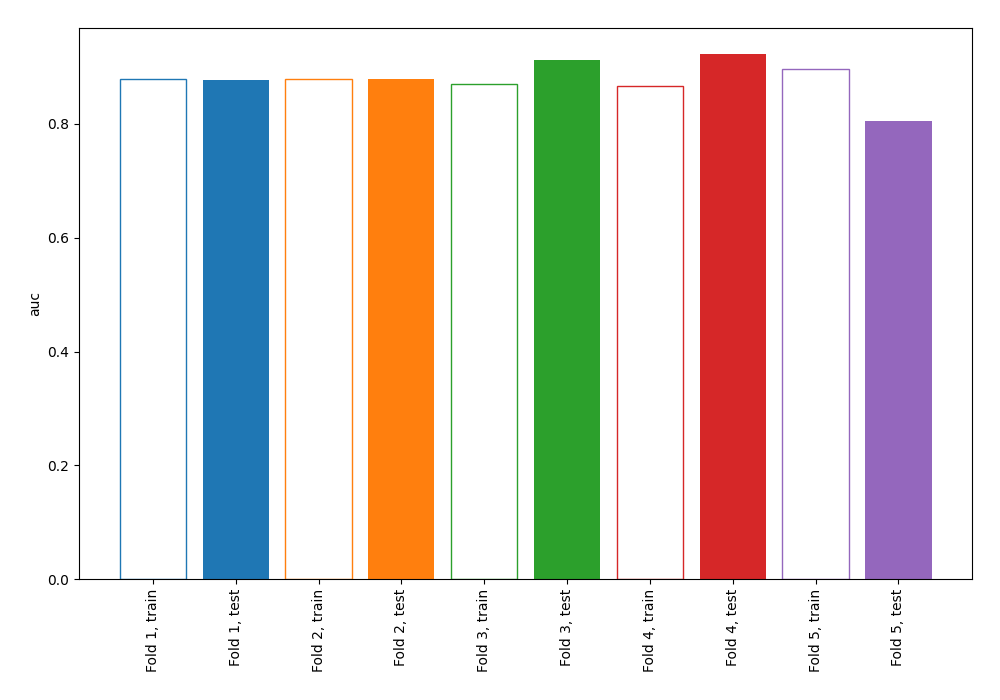
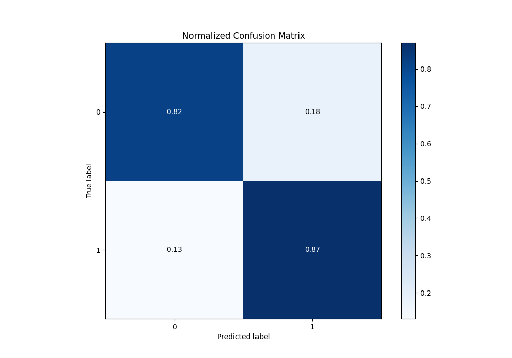
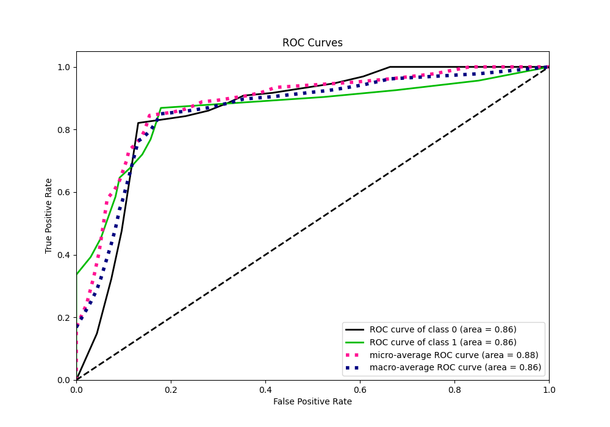
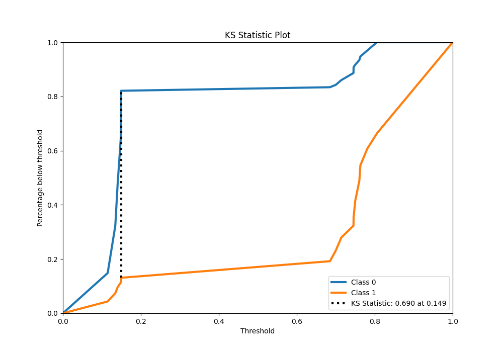
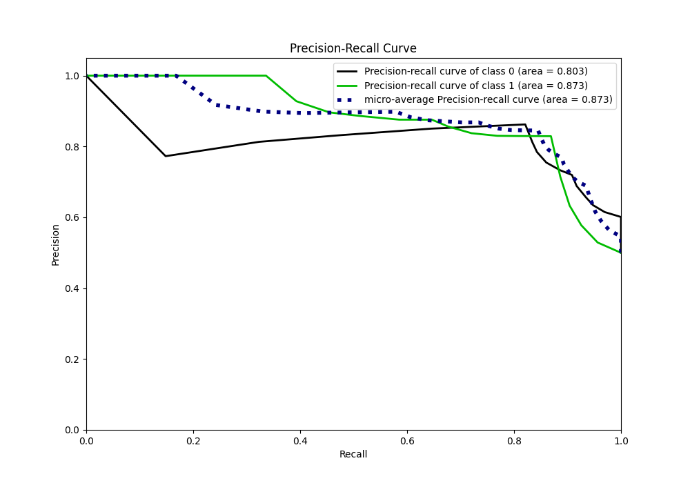
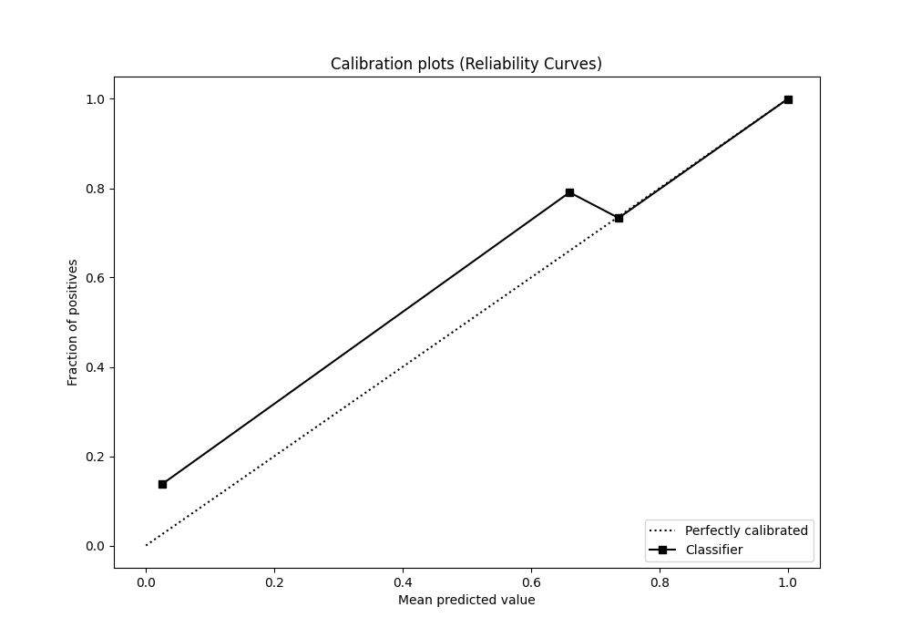
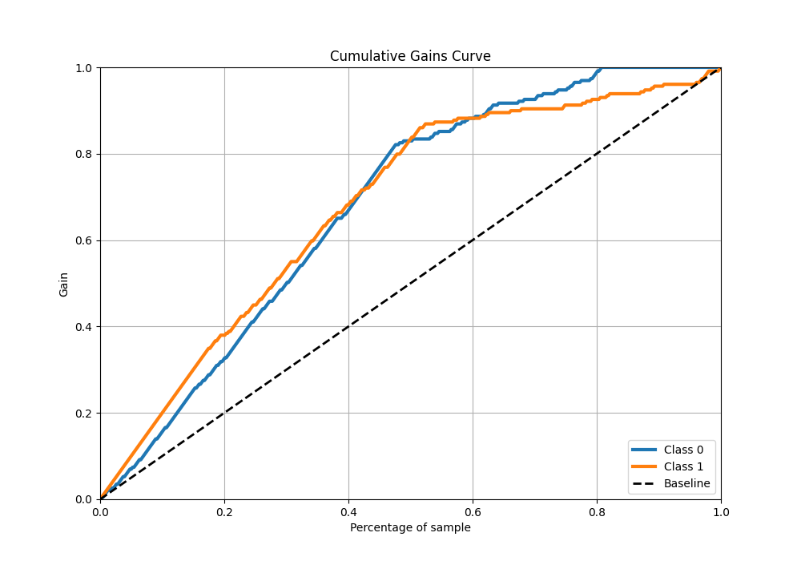
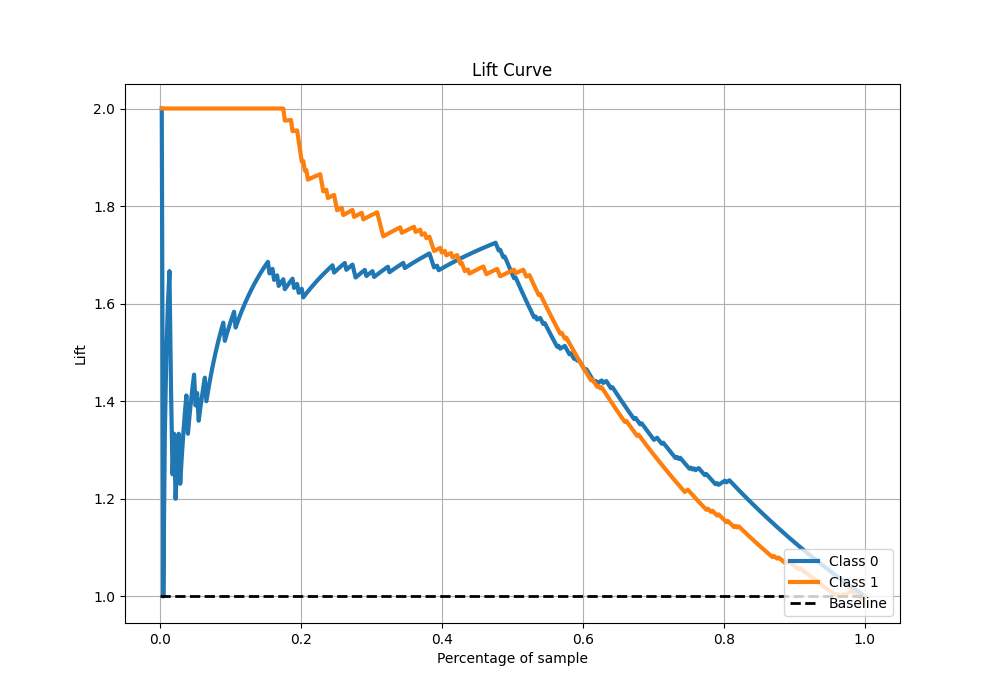

# Summary of 99_DecisionTree

[<< Go back](../README.md)

## Decision Tree
- **n_jobs**: -1
- **criterion**: gini
- **max_depth**: 2
- **explain_level**: 0

## Validation
 - **validation_type**: kfold
 - **shuffle**: True
 - **stratify**: True
 - **k_folds**: 5

## Optimized metric
auc

## Training time

16.2 seconds

## Metric details
|           |    score |   threshold |
|:----------|---------:|------------:|
| logloss   | 0.397743 |  nan        |
| auc       | 0.860491 |  nan        |
| f1        | 0.848614 |    0.149425 |
| accuracy  | 0.844978 |    0.149425 |
| precision | 1        |    0.805556 |
| recall    | 1        |    0.103448 |
| mcc       | 0.690754 |    0.149425 |

## Metric details with threshold from accuracy metric
|           |    score |   threshold |
|:----------|---------:|------------:|
| logloss   | 0.397743 |  nan        |
| auc       | 0.860491 |  nan        |
| f1        | 0.848614 |    0.149425 |
| accuracy  | 0.844978 |    0.149425 |
| precision | 0.829167 |    0.149425 |
| recall    | 0.868996 |    0.149425 |
| mcc       | 0.690754 |    0.149425 |

## Confusion matrix (at threshold=0.149425)
|              |   Predicted as 0 |   Predicted as 1 |
|:-------------|-----------------:|-----------------:|
| Labeled as 0 |              188 |               41 |
| Labeled as 1 |               30 |              199 |

## Learning curves

## Confusion Matrix

## Normalized Confusion Matrix

## ROC Curve

## Kolmogorov-Smirnov Statistic

## Precision-Recall Curve

## Calibration Curve

## Cumulative Gains Curve

## Lift Curve

[<< Go back](../README.md)
