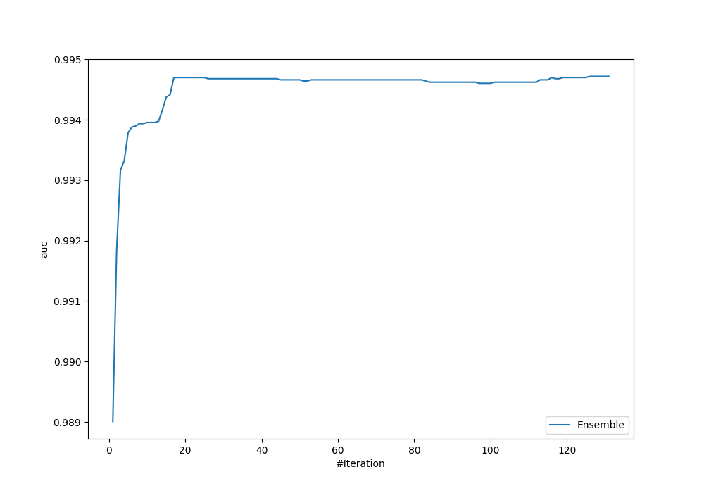
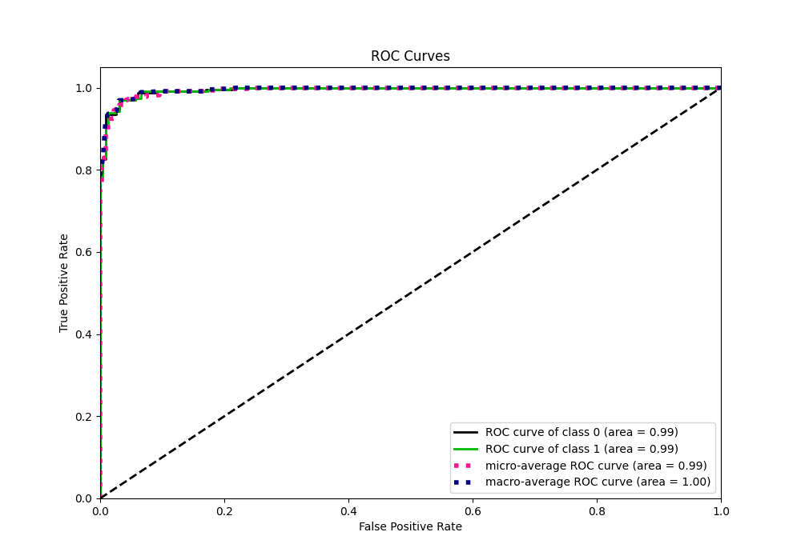
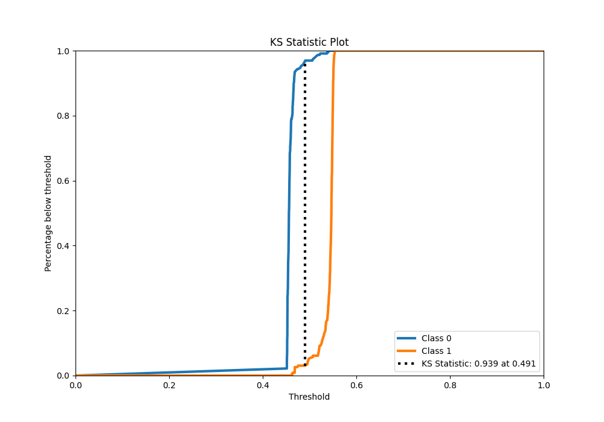
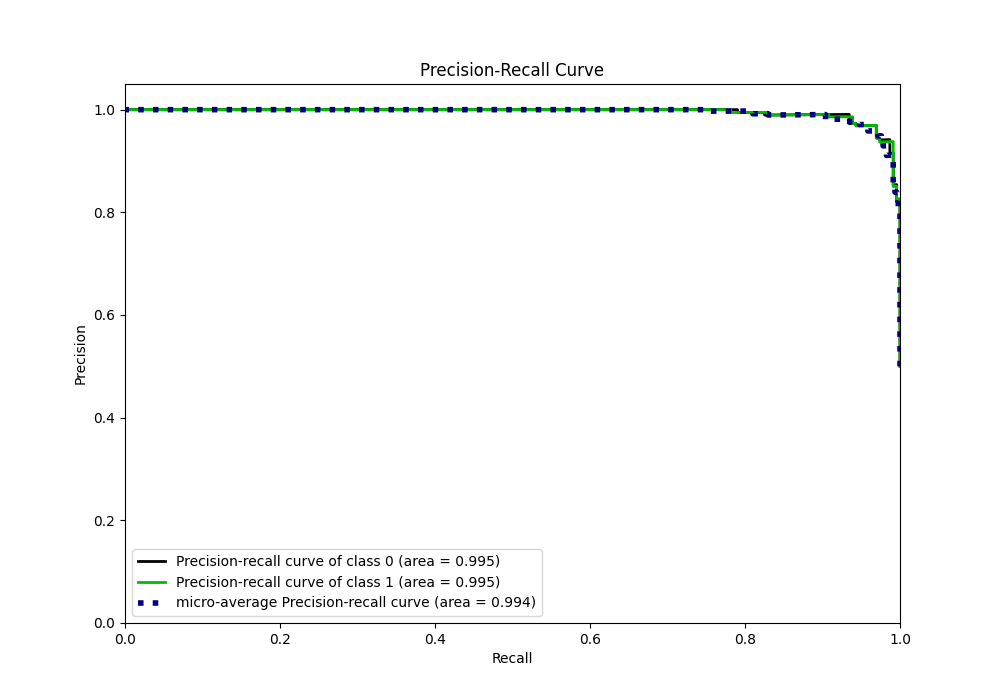
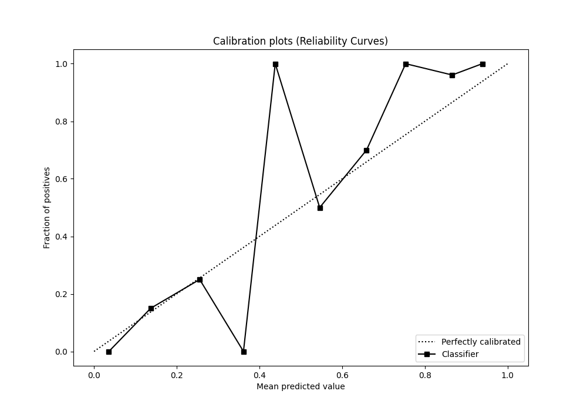
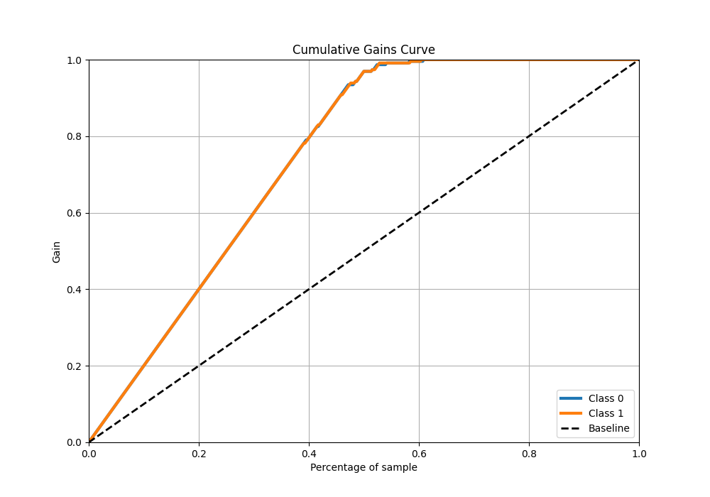
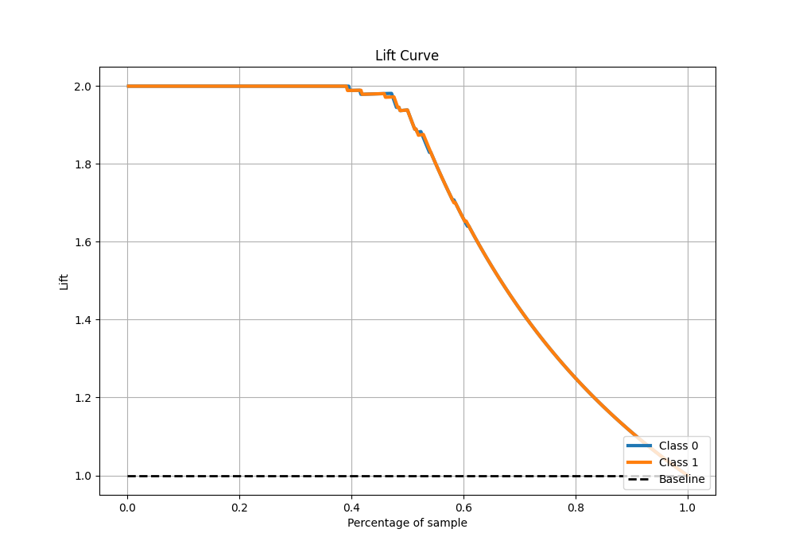

# Summary of Ensemble

[<< Go back](../README.md)

## Ensemble structure
| Model                      |   Weight |
|:---------------------------|---------:|
| 101_CatBoost               |        1 |
| 101_CatBoost_BoostOnErrors |        1 |
| 104_CatBoost               |        1 |
| 15_Xgboost                 |       72 |
| 16_Xgboost                 |       18 |
| 19_Xgboost                 |       22 |
| 24_LightGBM                |        1 |
| 32_CatBoost                |        1 |
| 33_CatBoost_GoldenFeatures |        1 |
| 72_NearestNeighbors        |        2 |
| 74_CatBoost                |        1 |
| 76_CatBoost                |        3 |
| 91_NeuralNetwork           |        2 |

## Metric details
|           |    score |   threshold |
|:----------|---------:|------------:|
| logloss   | 0.615328 |  nan        |
| auc       | 0.994718 |  nan        |
| f1        | 0.969432 |    0.492953 |
| accuracy  | 0.969432 |    0.492953 |
| precision | 1        |    0.540729 |
| recall    | 1        |    0.406367 |
| mcc       | 0.938865 |    0.492953 |

## Metric details with threshold from accuracy metric
|           |    score |   threshold |
|:----------|---------:|------------:|
| logloss   | 0.615328 |  nan        |
| auc       | 0.994718 |  nan        |
| f1        | 0.969432 |    0.492953 |
| accuracy  | 0.969432 |    0.492953 |
| precision | 0.969432 |    0.492953 |
| recall    | 0.969432 |    0.492953 |
| mcc       | 0.938865 |    0.492953 |

## Confusion matrix (at threshold=0.492953)
|              |   Predicted as 0 |   Predicted as 1 |
|:-------------|-----------------:|-----------------:|
| Labeled as 0 |              222 |                7 |
| Labeled as 1 |                7 |              222 |

## Learning curves

## Confusion Matrix

## Normalized Confusion Matrix

## ROC Curve

## Kolmogorov-Smirnov Statistic

## Precision-Recall Curve

## Calibration Curve

## Cumulative Gains Curve

## Lift Curve

[<< Go back](../README.md)
