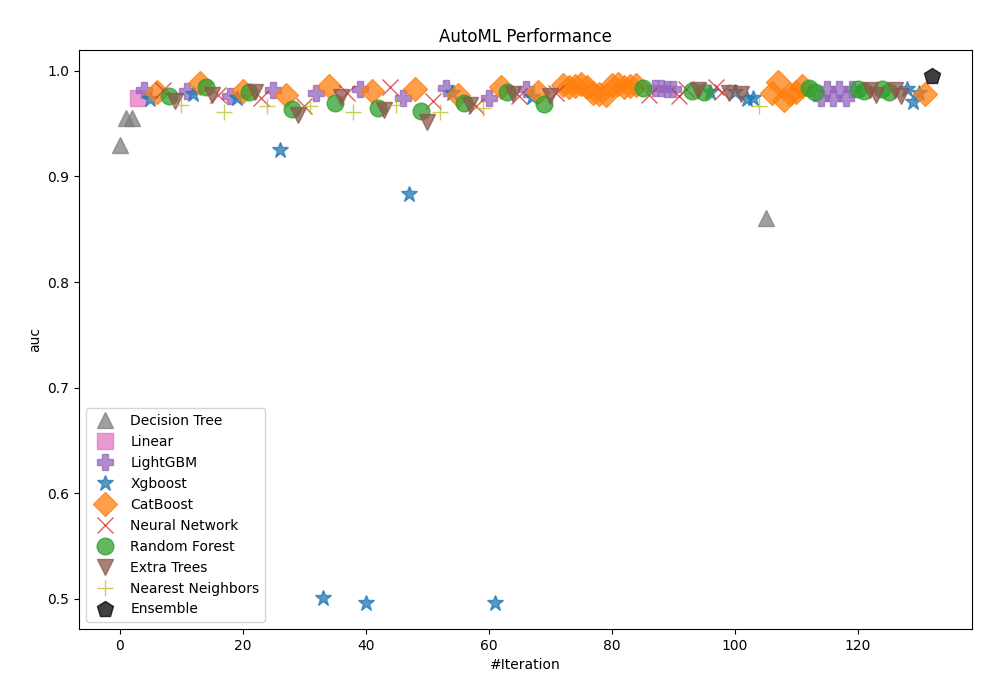
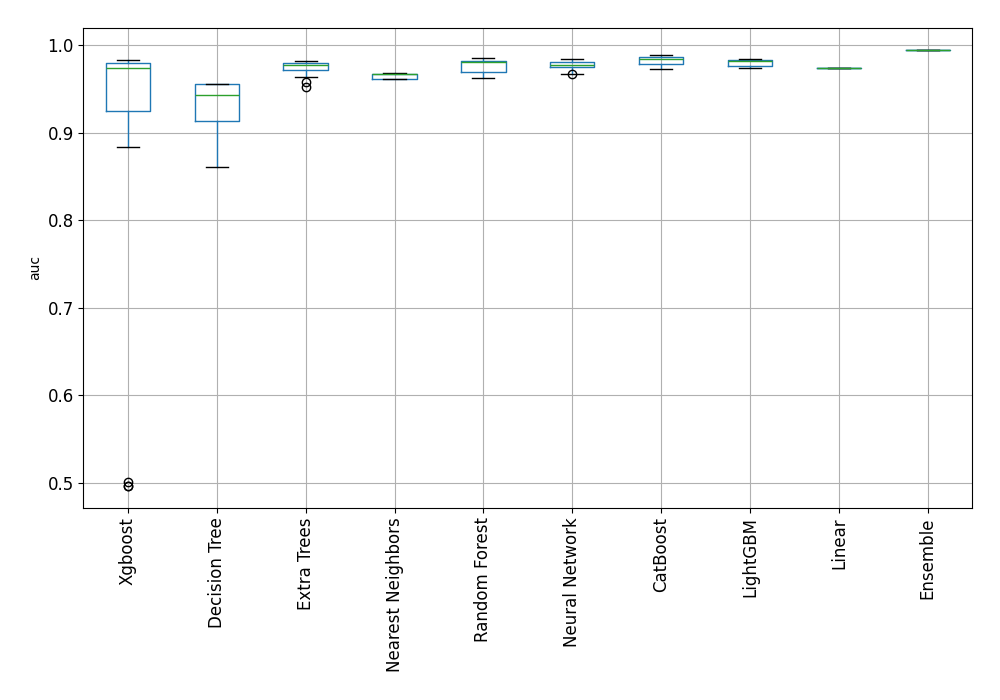
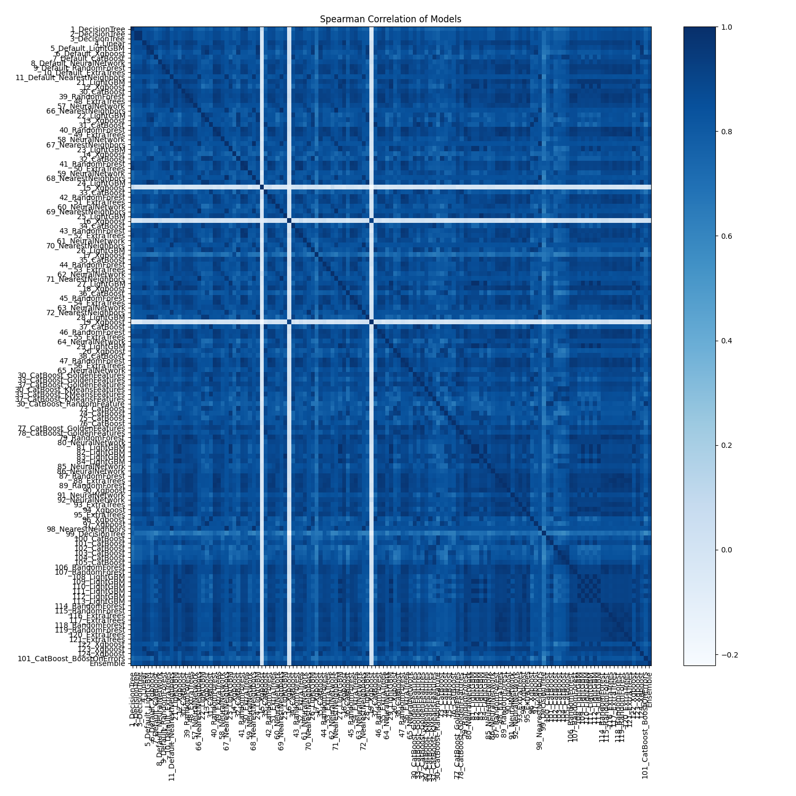

# AutoML Leaderboard

| Best model   | name                                                                 | model_type        | metric_type   |   metric_value |   train_time |
|:-------------|:---------------------------------------------------------------------|:------------------|:--------------|---------------:|-------------:|
|              | [1_DecisionTree](1_DecisionTree/README.md)                           | Decision Tree     | auc           |       0.930207 |         3.88 |
|              | [2_DecisionTree](2_DecisionTree/README.md)                           | Decision Tree     | auc           |       0.955111 |         3.44 |
|              | [3_DecisionTree](3_DecisionTree/README.md)                           | Decision Tree     | auc           |       0.955111 |         3.54 |
|              | [4_Linear](4_Linear/README.md)                                       | Linear            | auc           |       0.974028 |         9.03 |
|              | [5_Default_LightGBM](5_Default_LightGBM/README.md)                   | LightGBM          | auc           |       0.981589 |         5.65 |
|              | [6_Default_Xgboost](6_Default_Xgboost/README.md)                     | Xgboost           | auc           |       0.973694 |         4.55 |
|              | [7_Default_CatBoost](7_Default_CatBoost/README.md)                   | CatBoost          | auc           |       0.980378 |         5.8  |
|              | [8_Default_NeuralNetwork](8_Default_NeuralNetwork/README.md)         | Neural Network    | auc           |       0.982304 |         5.03 |
|              | [9_Default_RandomForest](9_Default_RandomForest/README.md)           | Random Forest     | auc           |       0.976097 |         6.77 |
|              | [10_Default_ExtraTrees](10_Default_ExtraTrees/README.md)             | Extra Trees       | auc           |       0.971015 |         6.44 |
|              | [11_Default_NearestNeighbors](11_Default_NearestNeighbors/README.md) | Nearest Neighbors | auc           |       0.967802 |         4.75 |
|              | [21_LightGBM](21_LightGBM/README.md)                                 | LightGBM          | auc           |       0.980817 |         5.04 |
|              | [12_Xgboost](12_Xgboost/README.md)                                   | Xgboost           | auc           |       0.977909 |         5.57 |
|              | [30_CatBoost](30_CatBoost/README.md)                                 | CatBoost          | auc           |       0.988635 |         7.02 |
|              | [39_RandomForest](39_RandomForest/README.md)                         | Random Forest     | auc           |       0.984726 |         8.73 |
|              | [48_ExtraTrees](48_ExtraTrees/README.md)                             | Extra Trees       | auc           |       0.976812 |         7.9  |
|              | [57_NeuralNetwork](57_NeuralNetwork/README.md)                       | Neural Network    | auc           |       0.976917 |         5.97 |
|              | [66_NearestNeighbors](66_NearestNeighbors/README.md)                 | Nearest Neighbors | auc           |       0.961061 |         5.65 |
|              | [22_LightGBM](22_LightGBM/README.md)                                 | LightGBM          | auc           |       0.97603  |         6.86 |
|              | [13_Xgboost](13_Xgboost/README.md)                                   | Xgboost           | auc           |       0.974095 |         6.41 |
|              | [31_CatBoost](31_CatBoost/README.md)                                 | CatBoost          | auc           |       0.981064 |         7.65 |
|              | [40_RandomForest](40_RandomForest/README.md)                         | Random Forest     | auc           |       0.980073 |         8.61 |
|              | [49_ExtraTrees](49_ExtraTrees/README.md)                             | Extra Trees       | auc           |       0.980178 |         8.45 |
|              | [58_NeuralNetwork](58_NeuralNetwork/README.md)                       | Neural Network    | auc           |       0.974066 |         7    |
|              | [67_NearestNeighbors](67_NearestNeighbors/README.md)                 | Nearest Neighbors | auc           |       0.966581 |         6.52 |
|              | [23_LightGBM](23_LightGBM/README.md)                                 | LightGBM          | auc           |       0.981694 |         7.12 |
|              | [14_Xgboost](14_Xgboost/README.md)                                   | Xgboost           | auc           |       0.92502  |         6.72 |
|              | [32_CatBoost](32_CatBoost/README.md)                                 | CatBoost          | auc           |       0.977537 |         8.66 |
|              | [41_RandomForest](41_RandomForest/README.md)                         | Random Forest     | auc           |       0.963807 |        10.17 |
|              | [50_ExtraTrees](50_ExtraTrees/README.md)                             | Extra Trees       | auc           |       0.957791 |         9.22 |
|              | [59_NeuralNetwork](59_NeuralNetwork/README.md)                       | Neural Network    | auc           |       0.966877 |         7.82 |
|              | [68_NearestNeighbors](68_NearestNeighbors/README.md)                 | Nearest Neighbors | auc           |       0.966581 |         7.17 |
|              | [24_LightGBM](24_LightGBM/README.md)                                 | LightGBM          | auc           |       0.978757 |         8.81 |
|              | [15_Xgboost](15_Xgboost/README.md)                                   | Xgboost           | auc           |       0.500868 |         7.29 |
|              | [33_CatBoost](33_CatBoost/README.md)                                 | CatBoost          | auc           |       0.985651 |         9.04 |
|              | [42_RandomForest](42_RandomForest/README.md)                         | Random Forest     | auc           |       0.969623 |        10.04 |
|              | [51_ExtraTrees](51_ExtraTrees/README.md)                             | Extra Trees       | auc           |       0.975601 |         9.73 |
|              | [60_NeuralNetwork](60_NeuralNetwork/README.md)                       | Neural Network    | auc           |       0.979119 |         8.32 |
|              | [69_NearestNeighbors](69_NearestNeighbors/README.md)                 | Nearest Neighbors | auc           |       0.961061 |         7.93 |
|              | [25_LightGBM](25_LightGBM/README.md)                                 | LightGBM          | auc           |       0.983009 |         8.35 |
|              | [16_Xgboost](16_Xgboost/README.md)                                   | Xgboost           | auc           |       0.496501 |         7.95 |
|              | [34_CatBoost](34_CatBoost/README.md)                                 | CatBoost          | auc           |       0.980664 |         9.19 |
|              | [43_RandomForest](43_RandomForest/README.md)                         | Random Forest     | auc           |       0.964579 |        10.57 |
|              | [52_ExtraTrees](52_ExtraTrees/README.md)                             | Extra Trees       | auc           |       0.963359 |        11.57 |
|              | [61_NeuralNetwork](61_NeuralNetwork/README.md)                       | Neural Network    | auc           |       0.984325 |         9.37 |
|              | [70_NearestNeighbors](70_NearestNeighbors/README.md)                 | Nearest Neighbors | auc           |       0.967678 |         8.34 |
|              | [26_LightGBM](26_LightGBM/README.md)                                 | LightGBM          | auc           |       0.974714 |         9.11 |
|              | [17_Xgboost](17_Xgboost/README.md)                                   | Xgboost           | auc           |       0.883316 |         8.56 |
|              | [35_CatBoost](35_CatBoost/README.md)                                 | CatBoost          | auc           |       0.982466 |         9.74 |
|              | [44_RandomForest](44_RandomForest/README.md)                         | Random Forest     | auc           |       0.962262 |        11.51 |
|              | [53_ExtraTrees](53_ExtraTrees/README.md)                             | Extra Trees       | auc           |       0.951526 |        10.56 |
|              | [62_NeuralNetwork](62_NeuralNetwork/README.md)                       | Neural Network    | auc           |       0.971015 |         9.78 |
|              | [71_NearestNeighbors](71_NearestNeighbors/README.md)                 | Nearest Neighbors | auc           |       0.961061 |         9.07 |
|              | [27_LightGBM](27_LightGBM/README.md)                                 | LightGBM          | auc           |       0.983829 |         9.81 |
|              | [18_Xgboost](18_Xgboost/README.md)                                   | Xgboost           | auc           |       0.979396 |         9.86 |
|              | [36_CatBoost](36_CatBoost/README.md)                                 | CatBoost          | auc           |       0.977308 |        11.54 |
|              | [45_RandomForest](45_RandomForest/README.md)                         | Random Forest     | auc           |       0.969566 |        12.02 |
|              | [54_ExtraTrees](54_ExtraTrees/README.md)                             | Extra Trees       | auc           |       0.967497 |        11.74 |
|              | [63_NeuralNetwork](63_NeuralNetwork/README.md)                       | Neural Network    | auc           |       0.966419 |        10.25 |
|              | [72_NearestNeighbors](72_NearestNeighbors/README.md)                 | Nearest Neighbors | auc           |       0.964684 |         9.5  |
|              | [28_LightGBM](28_LightGBM/README.md)                                 | LightGBM          | auc           |       0.973847 |        10.98 |
|              | [19_Xgboost](19_Xgboost/README.md)                                   | Xgboost           | auc           |       0.496501 |        10.05 |
|              | [37_CatBoost](37_CatBoost/README.md)                                 | CatBoost          | auc           |       0.984878 |        11.67 |
|              | [46_RandomForest](46_RandomForest/README.md)                         | Random Forest     | auc           |       0.98033  |        12.37 |
|              | [55_ExtraTrees](55_ExtraTrees/README.md)                             | Extra Trees       | auc           |       0.978242 |        26.13 |
|              | [64_NeuralNetwork](64_NeuralNetwork/README.md)                       | Neural Network    | auc           |       0.976545 |        11.78 |
|              | [29_LightGBM](29_LightGBM/README.md)                                 | LightGBM          | auc           |       0.982437 |        11.5  |
|              | [20_Xgboost](20_Xgboost/README.md)                                   | Xgboost           | auc           |       0.975277 |        11.55 |
|              | [38_CatBoost](38_CatBoost/README.md)                                 | CatBoost          | auc           |       0.97973  |        12.8  |
|              | [47_RandomForest](47_RandomForest/README.md)                         | Random Forest     | auc           |       0.968841 |        14.39 |
|              | [56_ExtraTrees](56_ExtraTrees/README.md)                             | Extra Trees       | auc           |       0.976545 |        13.84 |
|              | [65_NeuralNetwork](65_NeuralNetwork/README.md)                       | Neural Network    | auc           |       0.978795 |        11.84 |
|              | [30_CatBoost_GoldenFeatures](30_CatBoost_GoldenFeatures/README.md)   | CatBoost          | auc           |       0.986785 |        19.42 |
|              | [33_CatBoost_GoldenFeatures](33_CatBoost_GoldenFeatures/README.md)   | CatBoost          | auc           |       0.985174 |        13.57 |
|              | [37_CatBoost_GoldenFeatures](37_CatBoost_GoldenFeatures/README.md)   | CatBoost          | auc           |       0.985412 |        12.88 |
|              | [30_CatBoost_KMeansFeatures](30_CatBoost_KMeansFeatures/README.md)   | CatBoost          | auc           |       0.987224 |        17.84 |
|              | [33_CatBoost_KMeansFeatures](33_CatBoost_KMeansFeatures/README.md)   | CatBoost          | auc           |       0.984497 |        15.94 |
|              | [37_CatBoost_KMeansFeatures](37_CatBoost_KMeansFeatures/README.md)   | CatBoost          | auc           |       0.978757 |        15.25 |
|              | [30_CatBoost_RandomFeature](30_CatBoost_RandomFeature/README.md)     | CatBoost          | auc           |       0.978395 |        14.42 |
|              | [73_CatBoost](73_CatBoost/README.md)                                 | CatBoost          | auc           |       0.977537 |        14.61 |
|              | [74_CatBoost](74_CatBoost/README.md)                                 | CatBoost          | auc           |       0.986251 |        14.29 |
|              | [75_CatBoost](75_CatBoost/README.md)                                 | CatBoost          | auc           |       0.987395 |        19.01 |
|              | [76_CatBoost](76_CatBoost/README.md)                                 | CatBoost          | auc           |       0.984897 |        17.6  |
|              | [77_CatBoost_GoldenFeatures](77_CatBoost_GoldenFeatures/README.md)   | CatBoost          | auc           |       0.985774 |        15.65 |
|              | [78_CatBoost_GoldenFeatures](78_CatBoost_GoldenFeatures/README.md)   | CatBoost          | auc           |       0.986518 |        14.99 |
|              | [79_RandomForest](79_RandomForest/README.md)                         | Random Forest     | auc           |       0.983372 |        15.73 |
|              | [80_NeuralNetwork](80_NeuralNetwork/README.md)                       | Neural Network    | auc           |       0.976888 |        13.1  |
|              | [81_LightGBM](81_LightGBM/README.md)                                 | LightGBM          | auc           |       0.983829 |        13.84 |
|              | [82_LightGBM](82_LightGBM/README.md)                                 | LightGBM          | auc           |       0.983829 |        13.78 |
|              | [83_LightGBM](83_LightGBM/README.md)                                 | LightGBM          | auc           |       0.983009 |        13.73 |
|              | [84_LightGBM](84_LightGBM/README.md)                                 | LightGBM          | auc           |       0.982437 |        13.71 |
|              | [85_NeuralNetwork](85_NeuralNetwork/README.md)                       | Neural Network    | auc           |       0.97645  |        13.86 |
|              | [86_NeuralNetwork](86_NeuralNetwork/README.md)                       | Neural Network    | auc           |       0.983257 |        13.9  |
|              | [87_RandomForest](87_RandomForest/README.md)                         | Random Forest     | auc           |       0.981293 |        16.43 |
|              | [88_ExtraTrees](88_ExtraTrees/README.md)                             | Extra Trees       | auc           |       0.981865 |        15.73 |
|              | [89_RandomForest](89_RandomForest/README.md)                         | Random Forest     | auc           |       0.97972  |        16.68 |
|              | [90_Xgboost](90_Xgboost/README.md)                                   | Xgboost           | auc           |       0.979768 |        14.03 |
|              | [91_NeuralNetwork](91_NeuralNetwork/README.md)                       | Neural Network    | auc           |       0.984325 |        14.72 |
|              | [92_NeuralNetwork](92_NeuralNetwork/README.md)                       | Neural Network    | auc           |       0.979634 |        15.31 |
|              | [93_ExtraTrees](93_ExtraTrees/README.md)                             | Extra Trees       | auc           |       0.979148 |        17.42 |
|              | [94_Xgboost](94_Xgboost/README.md)                                   | Xgboost           | auc           |       0.979644 |        14.49 |
|              | [95_ExtraTrees](95_ExtraTrees/README.md)                             | Extra Trees       | auc           |       0.978471 |        16.46 |
|              | [96_Xgboost](96_Xgboost/README.md)                                   | Xgboost           | auc           |       0.973351 |        23.2  |
|              | [97_Xgboost](97_Xgboost/README.md)                                   | Xgboost           | auc           |       0.974657 |        23.67 |
|              | [98_NearestNeighbors](98_NearestNeighbors/README.md)                 | Nearest Neighbors | auc           |       0.966286 |        22.08 |
|              | [99_DecisionTree](99_DecisionTree/README.md)                         | Decision Tree     | auc           |       0.860491 |        17.19 |
|              | [100_CatBoost](100_CatBoost/README.md)                               | CatBoost          | auc           |       0.978795 |        20.13 |
|              | [101_CatBoost](101_CatBoost/README.md)                               | CatBoost          | auc           |       0.989007 |        20.61 |
|              | [102_CatBoost](102_CatBoost/README.md)                               | CatBoost          | auc           |       0.972159 |        33.7  |
|              | [103_CatBoost](103_CatBoost/README.md)                               | CatBoost          | auc           |       0.977918 |        33.79 |
|              | [104_CatBoost](104_CatBoost/README.md)                               | CatBoost          | auc           |       0.979653 |        33.99 |
|              | [105_CatBoost](105_CatBoost/README.md)                               | CatBoost          | auc           |       0.985241 |        34.44 |
|              | [106_RandomForest](106_RandomForest/README.md)                       | Random Forest     | auc           |       0.983591 |        33.28 |
|              | [107_RandomForest](107_RandomForest/README.md)                       | Random Forest     | auc           |       0.98014  |        32.01 |
|              | [108_LightGBM](108_LightGBM/README.md)                               | LightGBM          | auc           |       0.974562 |        24.48 |
|              | [109_LightGBM](109_LightGBM/README.md)                               | LightGBM          | auc           |       0.982437 |        24.97 |
|              | [110_LightGBM](110_LightGBM/README.md)                               | LightGBM          | auc           |       0.974562 |        26.05 |
|              | [111_LightGBM](111_LightGBM/README.md)                               | LightGBM          | auc           |       0.982437 |        27.05 |
|              | [112_LightGBM](112_LightGBM/README.md)                               | LightGBM          | auc           |       0.974562 |        27.64 |
|              | [113_LightGBM](113_LightGBM/README.md)                               | LightGBM          | auc           |       0.982437 |        26.47 |
|              | [114_RandomForest](114_RandomForest/README.md)                       | Random Forest     | auc           |       0.982847 |        31.12 |
|              | [115_RandomForest](115_RandomForest/README.md)                       | Random Forest     | auc           |       0.980731 |        33.11 |
|              | [116_ExtraTrees](116_ExtraTrees/README.md)                           | Extra Trees       | auc           |       0.981474 |        29.11 |
|              | [117_ExtraTrees](117_ExtraTrees/README.md)                           | Extra Trees       | auc           |       0.977365 |        22.84 |
|              | [118_RandomForest](118_RandomForest/README.md)                       | Random Forest     | auc           |       0.983038 |        23.32 |
|              | [119_RandomForest](119_RandomForest/README.md)                       | Random Forest     | auc           |       0.980016 |        24.26 |
|              | [120_ExtraTrees](120_ExtraTrees/README.md)                           | Extra Trees       | auc           |       0.981389 |        23.83 |
|              | [121_ExtraTrees](121_ExtraTrees/README.md)                           | Extra Trees       | auc           |       0.976211 |        24    |
|              | [122_Xgboost](122_Xgboost/README.md)                                 | Xgboost           | auc           |       0.982838 |        21.34 |
|              | [123_Xgboost](123_Xgboost/README.md)                                 | Xgboost           | auc           |       0.970882 |        22.1  |
|              | [124_Xgboost](124_Xgboost/README.md)                                 | Xgboost           | auc           |       0.978852 |        20.66 |
|              | [101_CatBoost_BoostOnErrors](101_CatBoost_BoostOnErrors/README.md)   | CatBoost          | auc           |       0.97767  |        22.41 |
| **the best** | [Ensemble](Ensemble/README.md)                                       | Ensemble          | auc           |       0.994718 |        75.07 |

### AutoML Performance

### AutoML Performance Boxplot

### Spearman Correlation of Models

