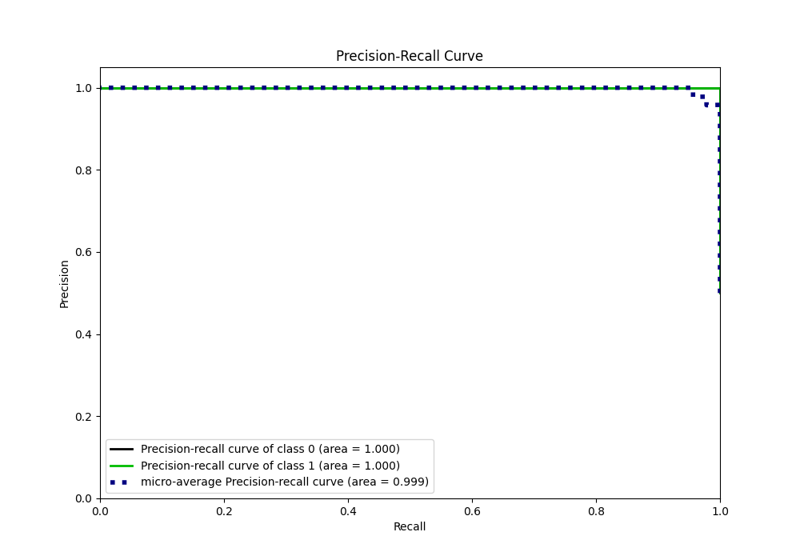

# Summary of 25_LightGBM

[<< Go back](../README.md)

## LightGBM
- **n_jobs**: -1
- **objective**: binary
- **num_leaves**: 63
- **learning_rate**: 0.2
- **feature_fraction**: 0.5
- **bagging_fraction**: 1.0
- **min_data_in_leaf**: 30
- **metric**: custom
- **custom_eval_metric_name**: average_precision
- **explain_level**: 0

## Validation
 - **validation_type**: split
 - **train_ratio**: 0.9
 - **shuffle**: True
 - **stratify**: True

## Optimized metric
average_precision

## Training time

4.2 seconds

## Metric details
|           |    score |   threshold |
|:----------|---------:|------------:|
| logloss   | 0.138165 | nan         |
| auc       | 1        | nan         |
| f1        | 1        |   0.369412  |
| accuracy  | 1        |   0.369412  |
| precision | 1        |   0.369412  |
| recall    | 1        |   0.0213362 |
| mcc       | 1        |   0.369412  |

## Metric details with threshold from accuracy metric
|           |    score |   threshold |
|:----------|---------:|------------:|
| logloss   | 0.138165 |  nan        |
| auc       | 1        |  nan        |
| f1        | 1        |    0.369412 |
| accuracy  | 1        |    0.369412 |
| precision | 1        |    0.369412 |
| recall    | 1        |    0.369412 |
| mcc       | 1        |    0.369412 |

## Confusion matrix (at threshold=0.369412)
|              |   Predicted as 0 |   Predicted as 1 |
|:-------------|-----------------:|-----------------:|
| Labeled as 0 |               23 |                0 |
| Labeled as 1 |                0 |               23 |

## Learning curves

## Confusion Matrix

## Normalized Confusion Matrix

## ROC Curve

## Kolmogorov-Smirnov Statistic

## Precision-Recall Curve

## Calibration Curve

## Cumulative Gains Curve

## Lift Curve

[<< Go back](../README.md)
