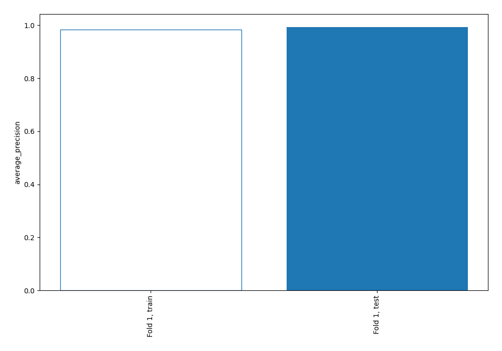
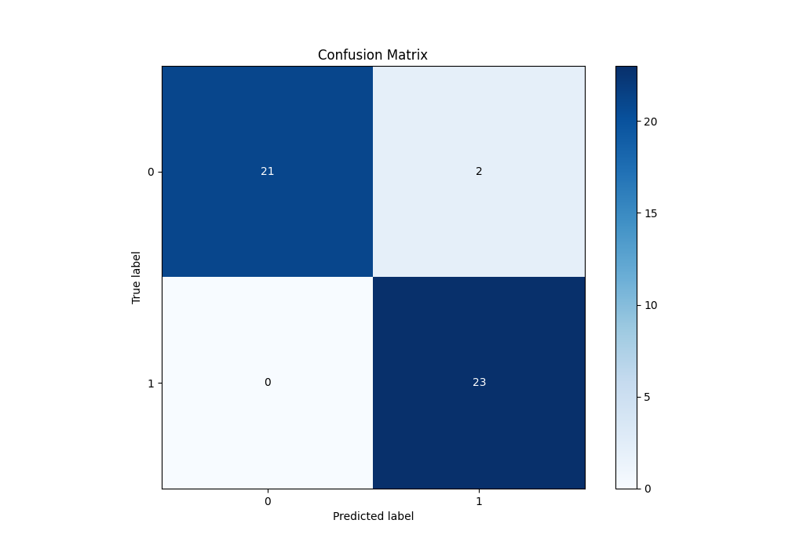
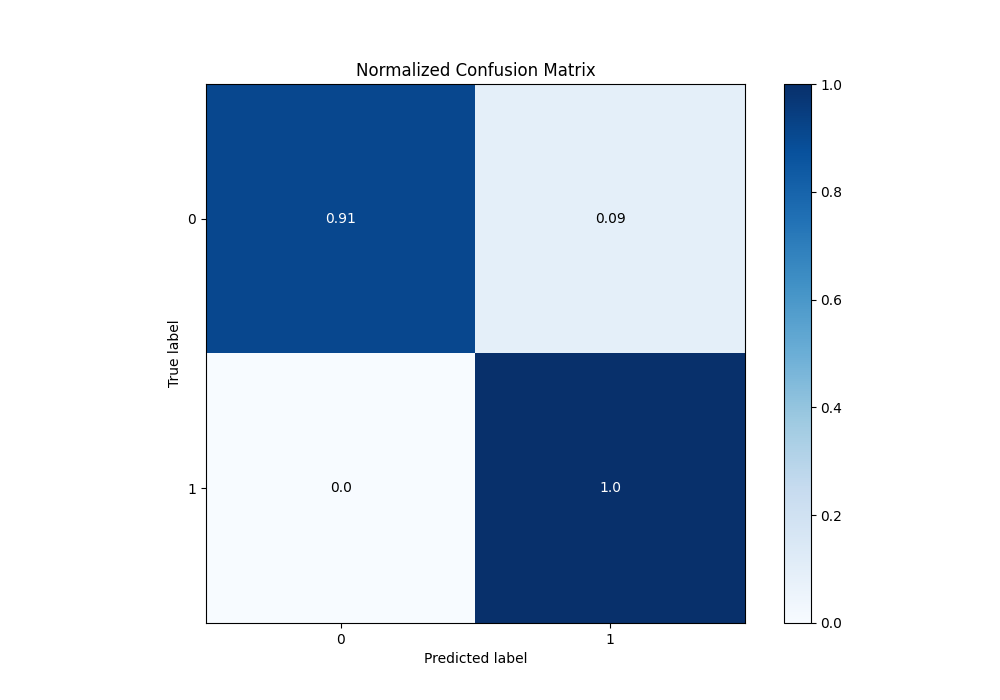
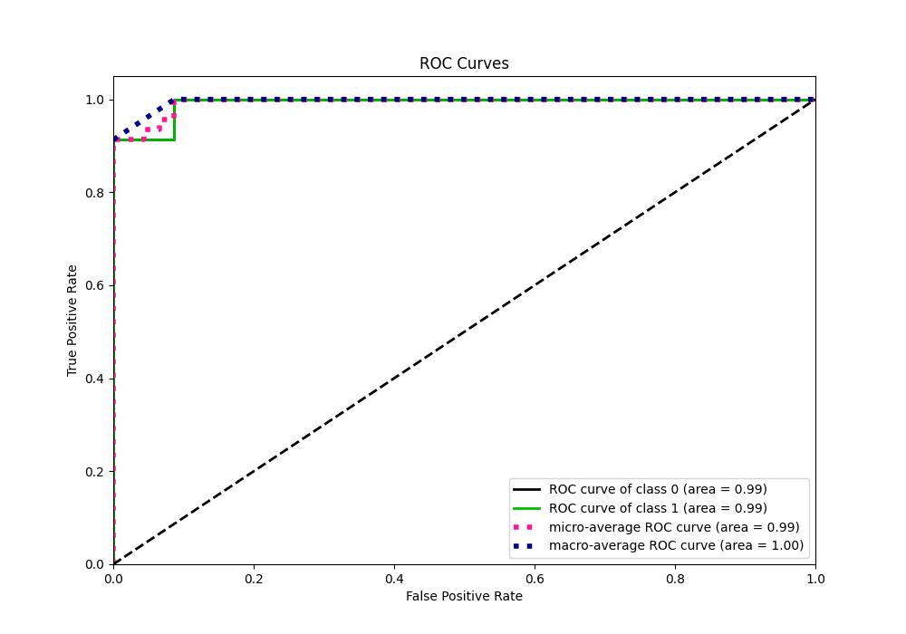
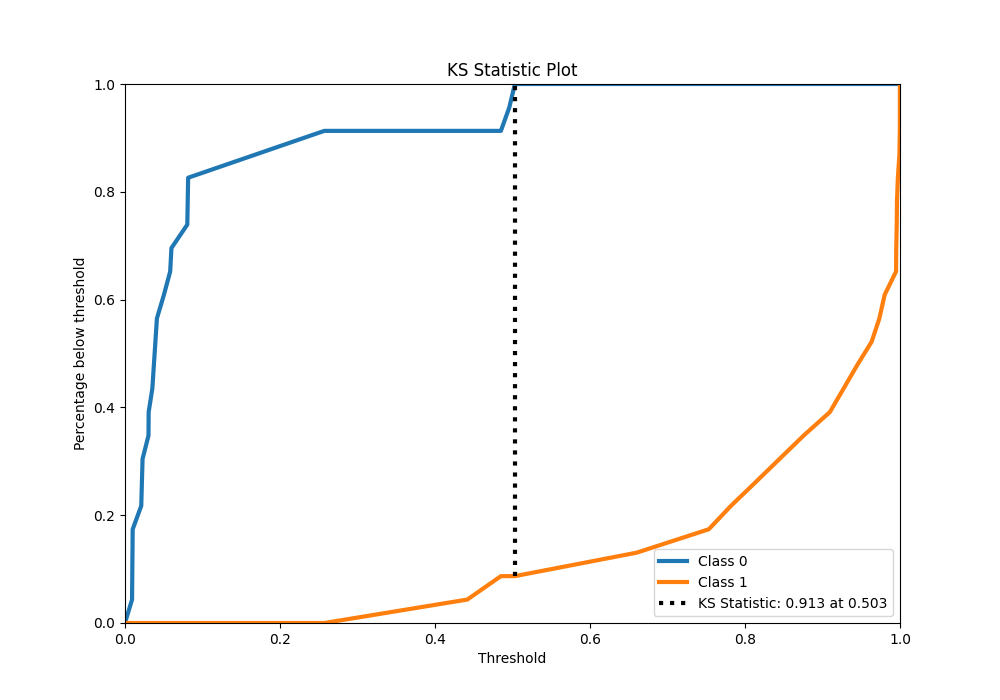
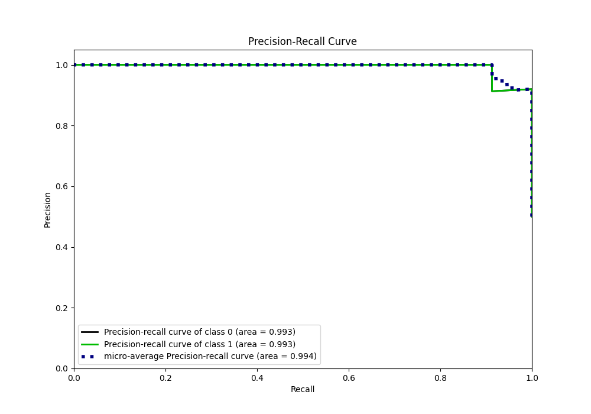
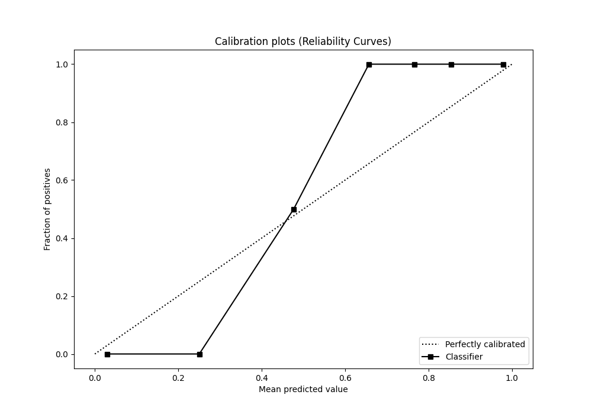
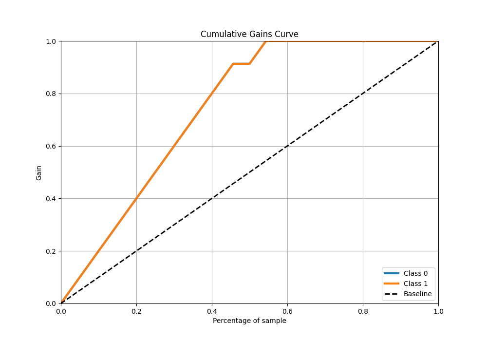
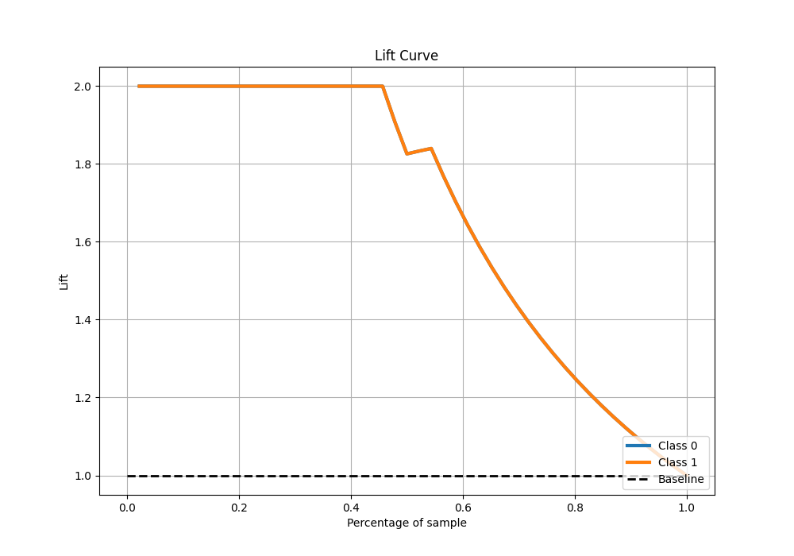

# Summary of 4_Linear

[<< Go back](../README.md)

## Logistic Regression (Linear)
- **n_jobs**: -1
- **explain_level**: 0

## Validation
 - **validation_type**: split
 - **train_ratio**: 0.9
 - **shuffle**: True
 - **stratify**: True

## Optimized metric
average_precision

## Training time

4.4 seconds

## Metric details
|           |    score |    threshold |
|:----------|---------:|-------------:|
| logloss   | 0.131022 | nan          |
| auc       | 0.992439 | nan          |
| f1        | 0.958333 |   0.257162   |
| accuracy  | 0.956522 |   0.257162   |
| precision | 1        |   0.581592   |
| recall    | 1        |   0.00818461 |
| mcc       | 0.916515 |   0.257162   |

## Metric details with threshold from accuracy metric
|           |    score |   threshold |
|:----------|---------:|------------:|
| logloss   | 0.131022 |  nan        |
| auc       | 0.992439 |  nan        |
| f1        | 0.958333 |    0.257162 |
| accuracy  | 0.956522 |    0.257162 |
| precision | 0.92     |    0.257162 |
| recall    | 1        |    0.257162 |
| mcc       | 0.916515 |    0.257162 |

## Confusion matrix (at threshold=0.257162)
|              |   Predicted as 0 |   Predicted as 1 |
|:-------------|-----------------:|-----------------:|
| Labeled as 0 |               21 |                2 |
| Labeled as 1 |                0 |               23 |

## Learning curves

## Confusion Matrix

## Normalized Confusion Matrix

## ROC Curve

## Kolmogorov-Smirnov Statistic

## Precision-Recall Curve

## Calibration Curve

## Cumulative Gains Curve

## Lift Curve

[<< Go back](../README.md)
