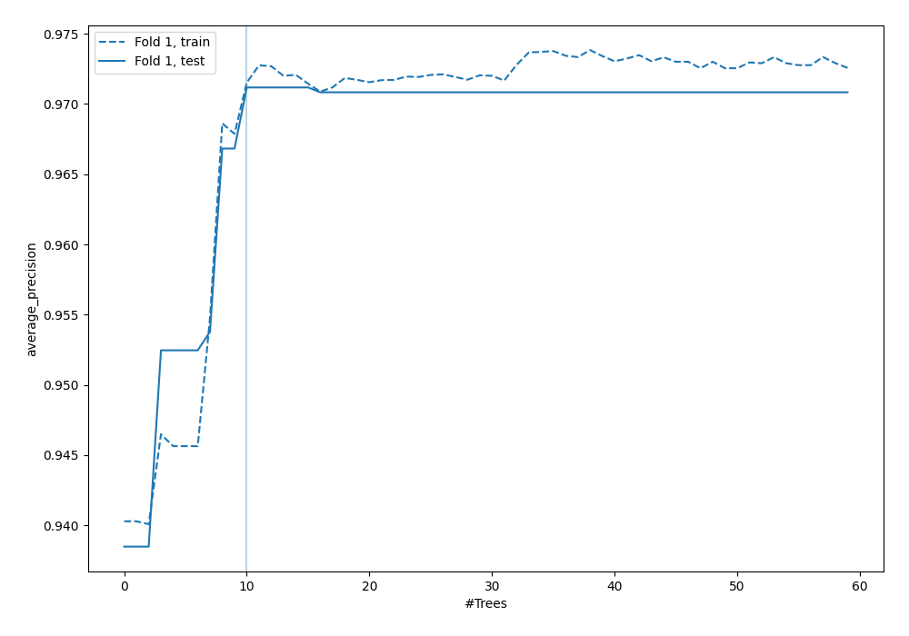
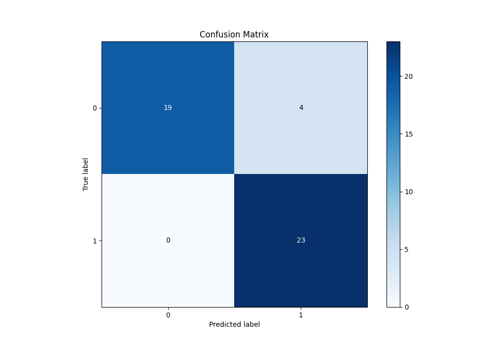
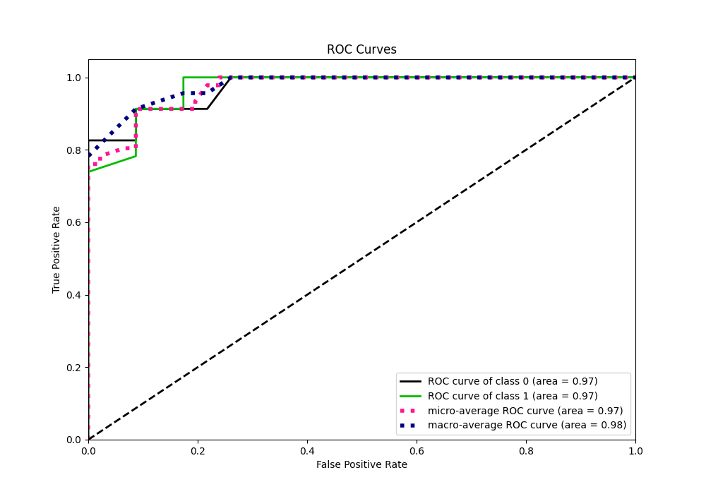
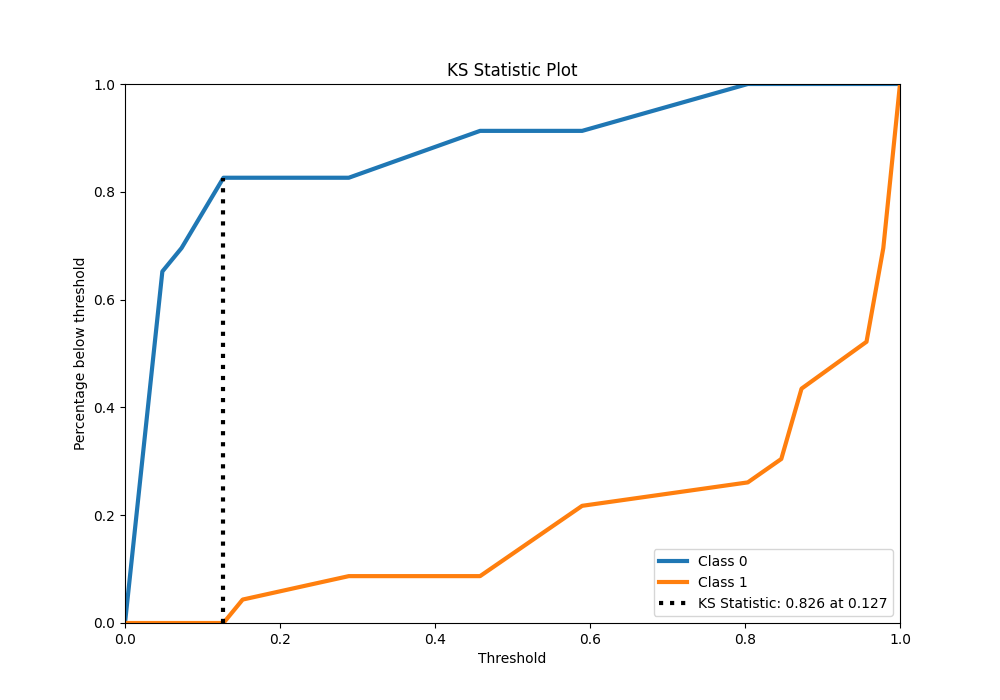
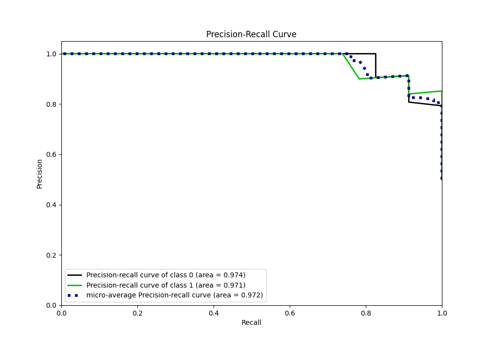
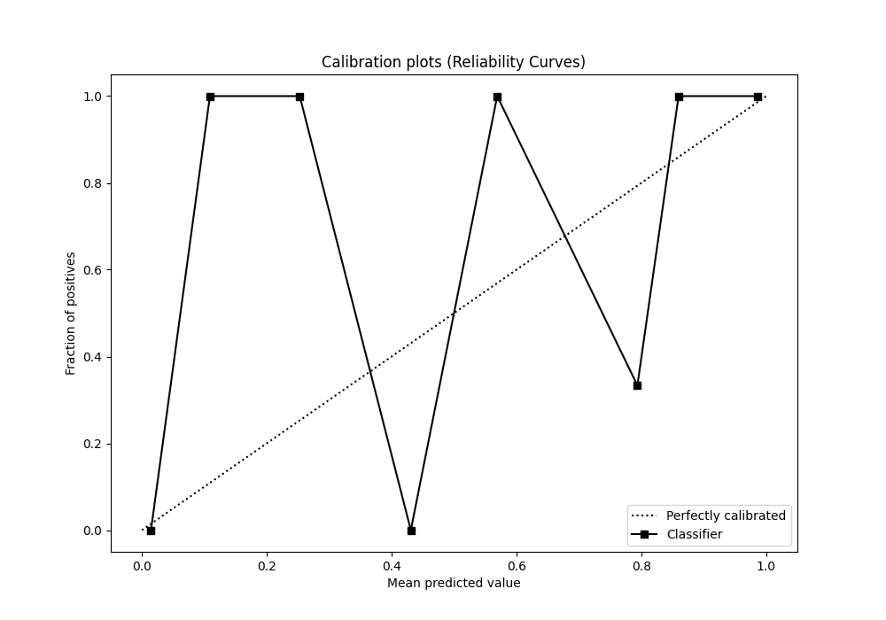
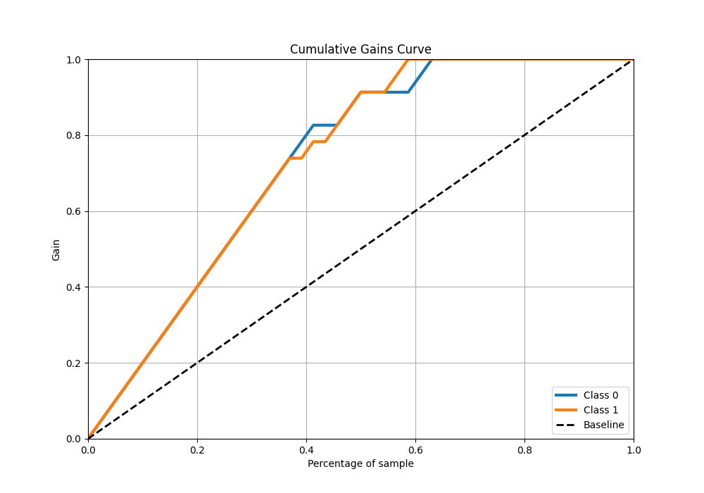
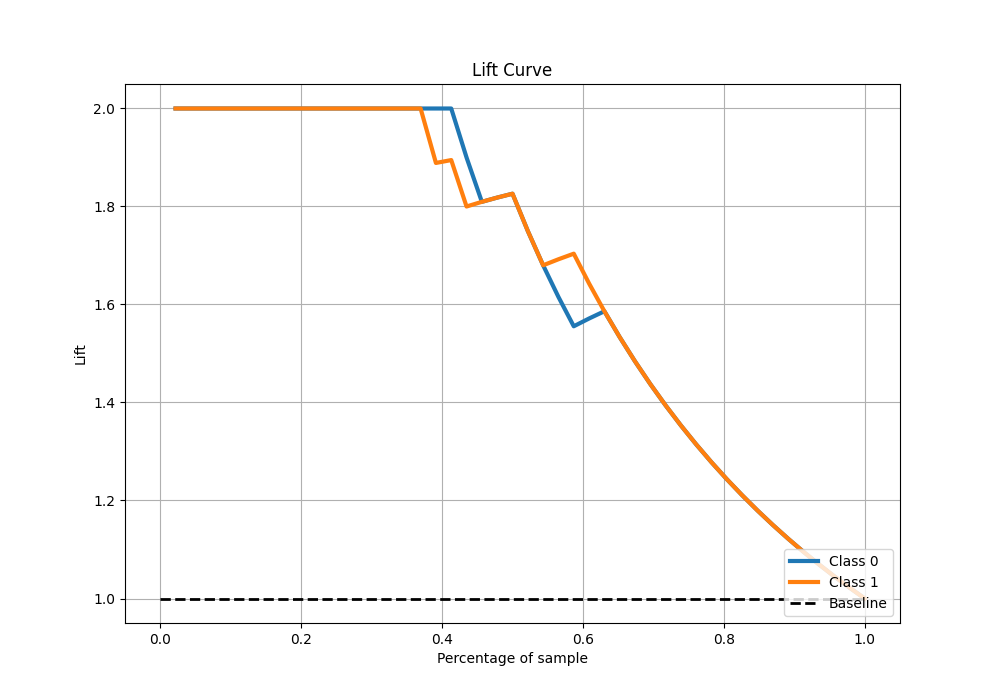

# Summary of 50_ExtraTrees

[<< Go back](../README.md)

## Extra Trees Classifier (Extra Trees)
- **n_jobs**: -1
- **criterion**: gini
- **max_features**: 0.8
- **min_samples_split**: 40
- **max_depth**: 3
- **eval_metric_name**: average_precision
- **explain_level**: 0

## Validation
 - **validation_type**: split
 - **train_ratio**: 0.9
 - **shuffle**: True
 - **stratify**: True

## Optimized metric
average_precision

## Training time

4.0 seconds

## Metric details
|           |    score |   threshold |
|:----------|---------:|------------:|
| logloss   | 0.247482 | nan         |
| auc       | 0.971645 | nan         |
| f1        | 0.92     |   0.127047  |
| accuracy  | 0.913043 |   0.127047  |
| precision | 1        |   0.803619  |
| recall    | 1        |   0.0433831 |
| mcc       | 0.83887  |   0.127047  |

## Metric details with threshold from accuracy metric
|           |    score |   threshold |
|:----------|---------:|------------:|
| logloss   | 0.247482 |  nan        |
| auc       | 0.971645 |  nan        |
| f1        | 0.92     |    0.127047 |
| accuracy  | 0.913043 |    0.127047 |
| precision | 0.851852 |    0.127047 |
| recall    | 1        |    0.127047 |
| mcc       | 0.83887  |    0.127047 |

## Confusion matrix (at threshold=0.127047)
|              |   Predicted as 0 |   Predicted as 1 |
|:-------------|-----------------:|-----------------:|
| Labeled as 0 |               19 |                4 |
| Labeled as 1 |                0 |               23 |

## Learning curves

## Confusion Matrix

## Normalized Confusion Matrix

## ROC Curve

## Kolmogorov-Smirnov Statistic

## Precision-Recall Curve

## Calibration Curve

## Cumulative Gains Curve

## Lift Curve

[<< Go back](../README.md)
