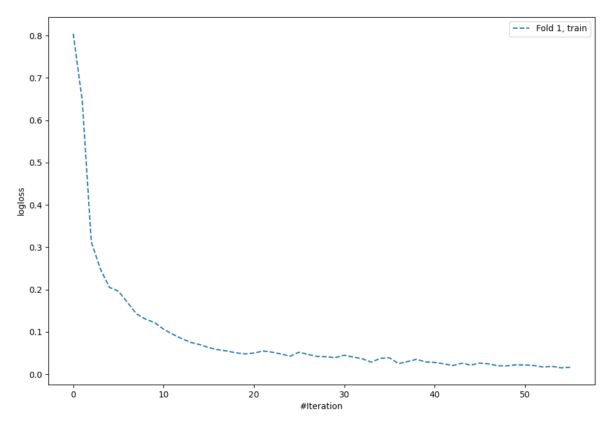
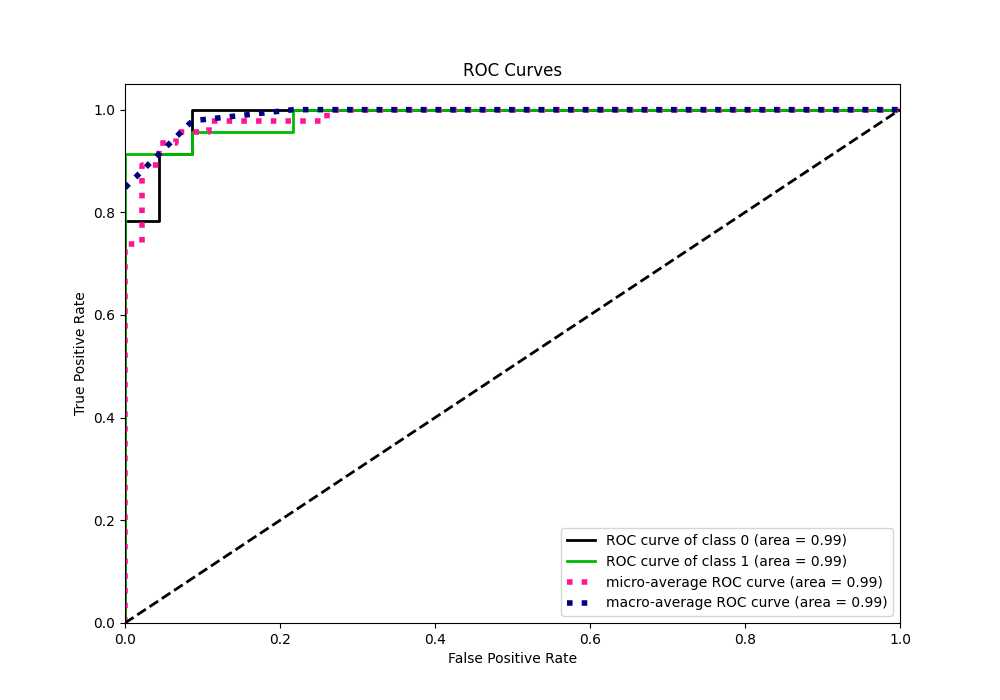
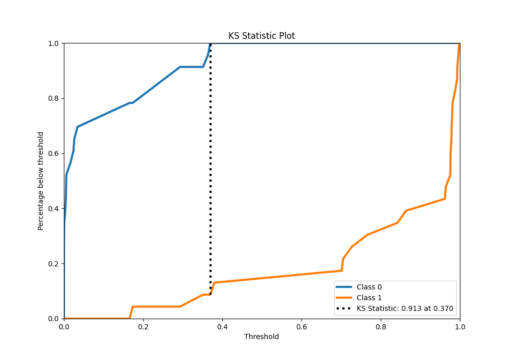
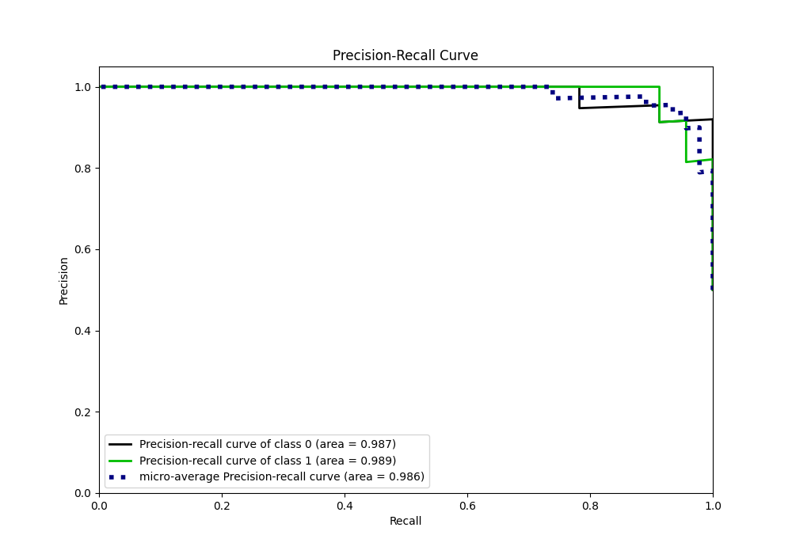
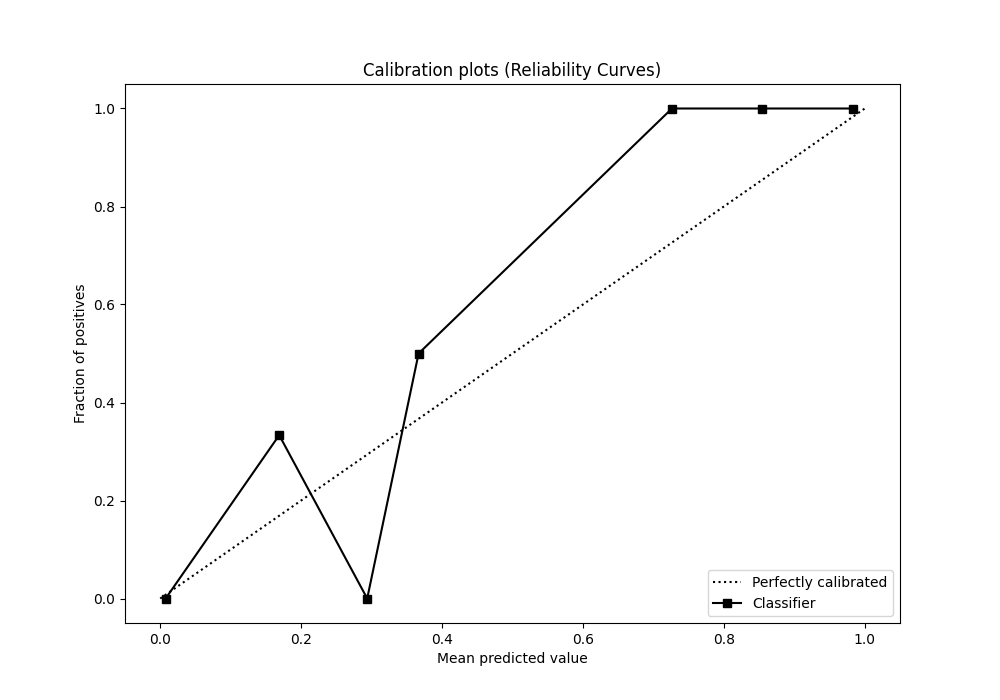
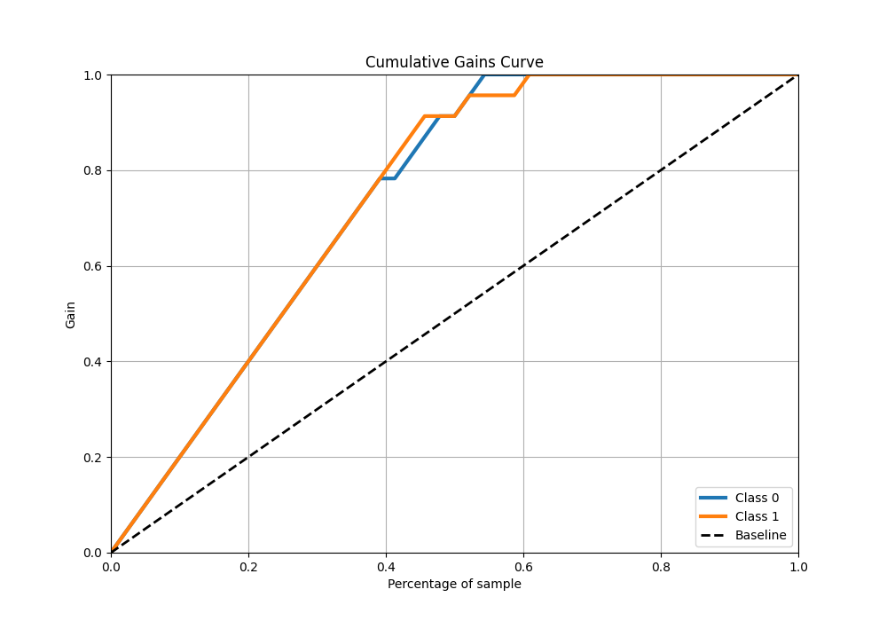
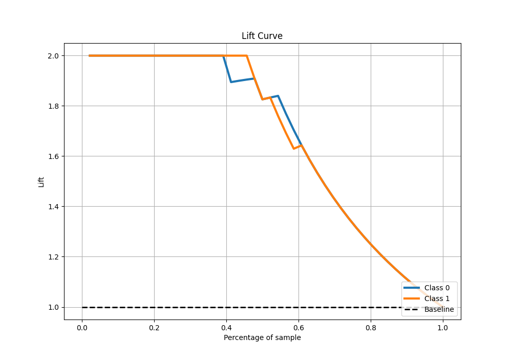

# Summary of 59_NeuralNetwork

[<< Go back](../README.md)

## Neural Network
- **n_jobs**: -1
- **dense_1_size**: 64
- **dense_2_size**: 32
- **learning_rate**: 0.08
- **explain_level**: 0

## Validation
 - **validation_type**: split
 - **train_ratio**: 0.9
 - **shuffle**: True
 - **stratify**: True

## Optimized metric
average_precision

## Training time

4.1 seconds

## Metric details
|           |    score |     threshold |
|:----------|---------:|--------------:|
| logloss   | 0.175501 | nan           |
| auc       | 0.986767 | nan           |
| f1        | 0.954545 |   0.374759    |
| accuracy  | 0.956522 |   0.374759    |
| precision | 1        |   0.374759    |
| recall    | 1        |   0.000104947 |
| mcc       | 0.916515 |   0.374759    |

## Metric details with threshold from accuracy metric
|           |    score |   threshold |
|:----------|---------:|------------:|
| logloss   | 0.175501 |  nan        |
| auc       | 0.986767 |  nan        |
| f1        | 0.954545 |    0.374759 |
| accuracy  | 0.956522 |    0.374759 |
| precision | 1        |    0.374759 |
| recall    | 0.913043 |    0.374759 |
| mcc       | 0.916515 |    0.374759 |

## Confusion matrix (at threshold=0.374759)
|              |   Predicted as 0 |   Predicted as 1 |
|:-------------|-----------------:|-----------------:|
| Labeled as 0 |               23 |                0 |
| Labeled as 1 |                2 |               21 |

## Learning curves

## Confusion Matrix

## Normalized Confusion Matrix

## ROC Curve

## Kolmogorov-Smirnov Statistic

## Precision-Recall Curve

## Calibration Curve

## Cumulative Gains Curve

## Lift Curve

[<< Go back](../README.md)
