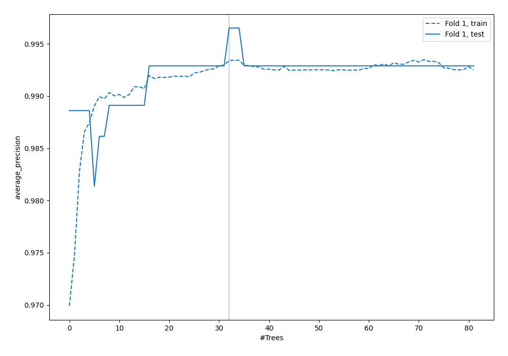
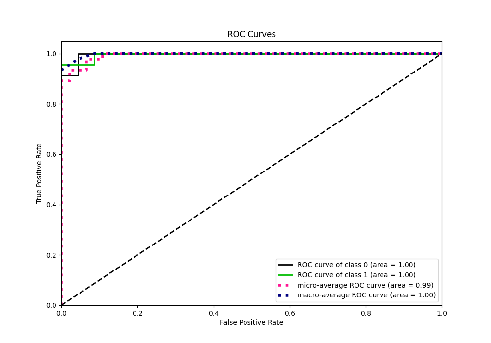
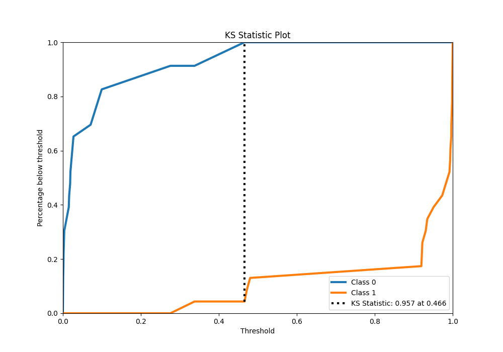
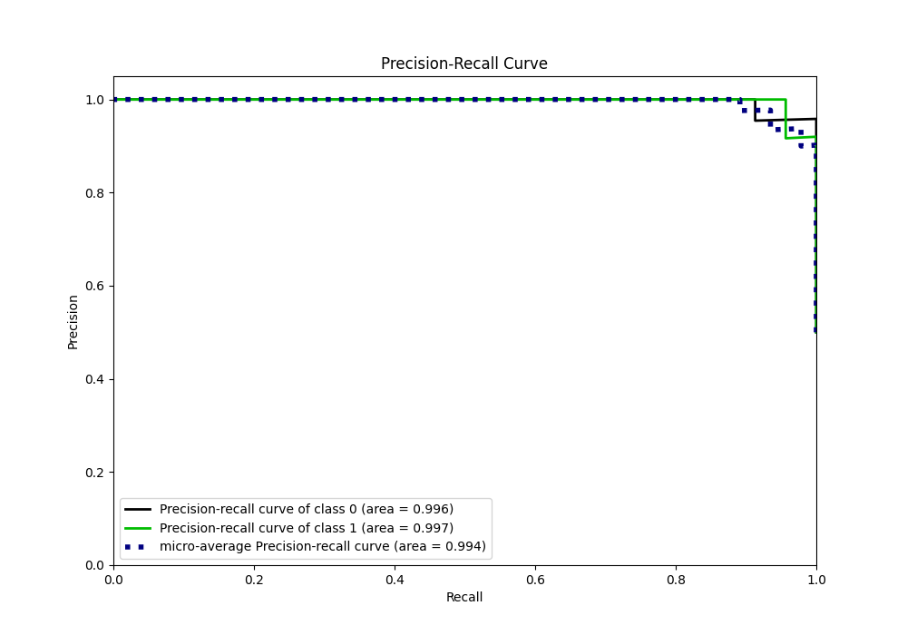
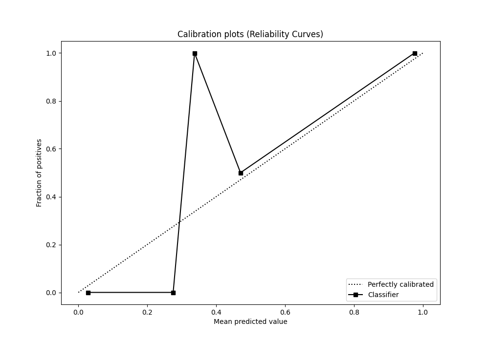
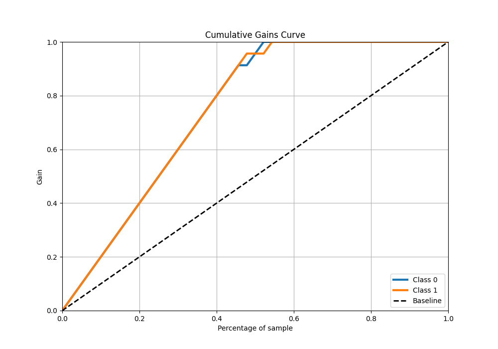
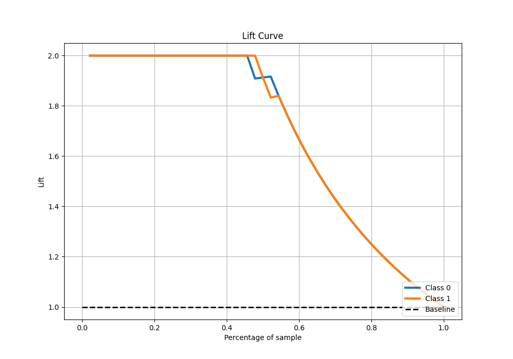

# Summary of 89_ExtraTrees

[<< Go back](../README.md)

## Extra Trees Classifier (Extra Trees)
- **n_jobs**: -1
- **criterion**: entropy
- **max_features**: 0.7
- **min_samples_split**: 30
- **max_depth**: 7
- **eval_metric_name**: average_precision
- **explain_level**: 0

## Validation
 - **validation_type**: split
 - **train_ratio**: 0.9
 - **shuffle**: True
 - **stratify**: True

## Optimized metric
average_precision

## Training time

6.0 seconds

## Metric details
|           |    score |     threshold |
|:----------|---------:|--------------:|
| logloss   | 0.120507 | nan           |
| auc       | 0.996219 | nan           |
| f1        | 0.977778 |   0.465939    |
| accuracy  | 0.978261 |   0.465939    |
| precision | 1        |   0.465939    |
| recall    | 1        |   0.000733215 |
| mcc       | 0.957427 |   0.465939    |

## Metric details with threshold from accuracy metric
|           |    score |   threshold |
|:----------|---------:|------------:|
| logloss   | 0.120507 |  nan        |
| auc       | 0.996219 |  nan        |
| f1        | 0.977778 |    0.465939 |
| accuracy  | 0.978261 |    0.465939 |
| precision | 1        |    0.465939 |
| recall    | 0.956522 |    0.465939 |
| mcc       | 0.957427 |    0.465939 |

## Confusion matrix (at threshold=0.465939)
|              |   Predicted as 0 |   Predicted as 1 |
|:-------------|-----------------:|-----------------:|
| Labeled as 0 |               23 |                0 |
| Labeled as 1 |                1 |               22 |

## Learning curves

## Confusion Matrix

## Normalized Confusion Matrix

## ROC Curve

## Kolmogorov-Smirnov Statistic

## Precision-Recall Curve

## Calibration Curve

## Cumulative Gains Curve

## Lift Curve

[<< Go back](../README.md)
